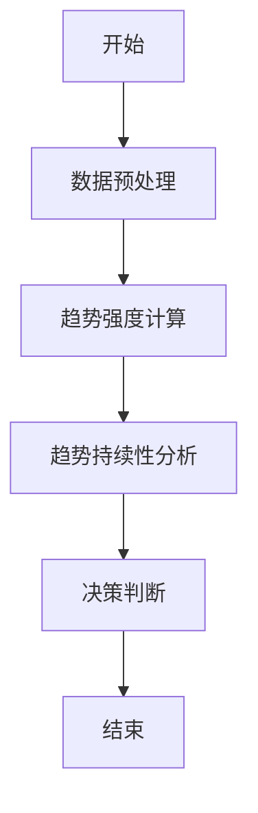
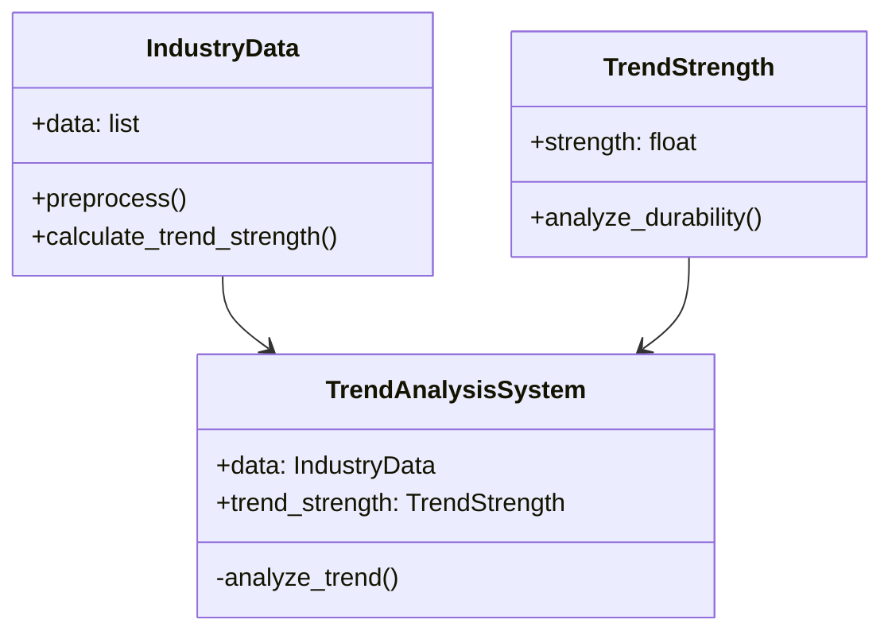

                 


# 费雪的行业趋势分析：未来增长的关键

> 关键词：行业趋势分析，费雪分析法，投资策略，趋势预测，增长动力，行业动态

> 摘要：本文深入探讨费雪的行业趋势分析方法，从理论基础到系统实现，再到实践应用，全面解析如何通过行业趋势分析预测未来增长的关键因素。文章结合实际案例和代码实现，帮助读者掌握费雪分析法的核心算法和应用技巧，为投资决策提供科学依据。

---

## 第一部分：费雪的行业趋势分析基础

### 第1章：行业趋势分析的定义与背景

#### 1.1 行业趋势分析的定义

行业趋势分析是通过对行业数据的分析，识别行业内的主要趋势及其演变规律，从而预测未来行业发展的方向和潜在机会。费雪的行业趋势分析方法强调长期视角，关注行业的结构性变化和增长动力。

**核心概念：**

- **行业趋势**：行业内的长期变化趋势，包括市场规模、增长率、竞争格局、技术进步等。
- **趋势分析**：通过数据分析和逻辑推理，识别行业趋势的强度、持续性和潜在影响。

**问题背景：**

在快速变化的市场环境中，企业需要准确把握行业趋势，以制定有效的战略。费雪分析法通过长期关注行业趋势，帮助投资者和企业发现潜在的增长机会。

**边界与外延：**

- 行业趋势分析的边界在于短期波动，而外延则扩展到宏观环境、政策变化和技术进步等因素。

#### 1.2 费雪分析法的核心要素

费雪分析法的四要素模型包括：

1. **需求趋势**：分析市场需求的变化，包括市场规模、消费者偏好等。
2. **供给趋势**：分析行业供给能力的变化，包括生产能力、成本结构等。
3. **竞争趋势**：分析行业内竞争格局的变化，包括市场份额、竞争策略等。
4. **技术趋势**：分析技术进步对行业的影响，包括技术创新、技术扩散等。

### 第2章：费雪行业趋势分析的理论基础

#### 2.1 费雪分析法的哲学基础

费雪的长期投资理念强调：

1. **长期视角**：关注行业的长期发展趋势，而非短期波动。
2. **结构性变化**：识别行业结构的变化，抓住结构性增长机会。
3. **竞争优势**：分析企业的竞争优势，包括成本优势、技术优势等。

#### 2.2 费雪分析法的数学基础

费雪分析法的数学模型包括：

- **趋势强度**：通过移动平均线（MA）和相对强弱指数（RSI）等指标量化趋势强度。
- **趋势持续性**：通过时间序列分析预测趋势的持续性。

### 第3章：费雪行业趋势分析的核心算法

#### 3.1 算法流程图（mermaid）



#### 3.2 Python实现代码

```python
def fisher_trend_analysis(data):
    # 数据预处理
    processed_data = data preprocessing
    # 趋势强度计算
    trend_strength = calculate_strength(processed_data)
    # 趋势持续性分析
    trend_durability = analyze_durability(trend_strength)
    return trend_durability
```

### 第4章：数学模型与公式

#### 4.1 趋势强度计算公式

$$
\text{趋势强度} = \frac{\sum_{i=1}^{n} |p_i - p_{i-1}|}{n}
$$

其中，$p_i$ 表示第 $i$ 个数据点，$n$ 为数据点总数。

#### 4.2 趋势持续性分析公式

$$
\text{趋势持续性} = \frac{\sum_{i=1}^{m} w_i \cdot t_i}{\sum_{i=1}^{m} w_i}
$$

其中，$w_i$ 为第 $i$ 个时间点的权重，$t_i$ 为趋势强度。

---

## 第二部分：行业趋势分析的系统实现

### 第5章：系统架构设计

#### 5.1 系统功能设计（mermaid类图）



#### 5.2 系统架构设计（mermaid架构图）

```mermaid
container 费雪行业趋势分析系统 {
    component 数据预处理模块 {
        preprocess_data()
    }
    component 趋势强度计算模块 {
        calculate_strength()
    }
    component 趋势持续性分析模块 {
        analyze_durability()
    }
    component 决策模块 {
        make_decision()
    }
}
```

### 第6章：数据预处理与算法实现

#### 6.1 数据预处理步骤

1. **数据清洗**：去除缺失值和异常值。
2. **数据标准化**：将数据归一化，便于后续分析。
3. **数据分割**：将数据分为训练集和测试集。

#### 6.2 算法实现细节

- **趋势强度计算**：使用移动平均线和相对强弱指数。
- **趋势持续性分析**：通过时间序列分析预测趋势的持续性。

### 第7章：结果分析与可视化

#### 7.1 结果分析

- 趋势强度分析结果：显示趋势的强弱。
- 趋势持续性分析结果：预测趋势的持续时间。

#### 7.2 可视化展示

- **趋势强度图**：使用折线图展示趋势强度的变化。
- **趋势持续性图**：使用柱状图展示趋势持续性。

---

## 第三部分：行业趋势分析的实践应用

### 第8章：项目实战

#### 8.1 案例分析

以科技行业为例，分析行业趋势：

1. **数据收集**：收集过去5年的科技行业数据。
2. **数据预处理**：清洗和标准化数据。
3. **趋势分析**：计算趋势强度和持续性。
4. **结果解读**：预测未来科技行业的趋势。

#### 8.2 代码实现

```python
import pandas as pd
import numpy as np

def preprocess_data(data):
    # 去除缺失值
    data = data.dropna()
    # 数据标准化
    data = (data - data.mean()) / data.std()
    return data

def calculate_strength(data):
    # 计算趋势强度
    strength = []
    for i in range(1, len(data)):
        diff = abs(data.iloc[i] - data.iloc[i-1])
        strength.append(diff)
    return np.mean(strength)

data = pd.read_csv('industry_data.csv')
processed_data = preprocess_data(data)
trend_strength = calculate_strength(processed_data)
```

#### 8.3 结果解读

- **趋势强度**：科技行业的趋势强度较高，说明行业处于快速发展阶段。
- **趋势持续性**：趋势持续性较强，预测未来科技行业将继续保持增长。

### 第9章：行业应用与总结

#### 9.1 行业应用

- **投资决策**：通过行业趋势分析，投资者可以发现潜在的投资机会。
- **企业战略**：企业可以根据行业趋势调整发展战略。

#### 9.2 实践总结

费雪行业趋势分析方法是一种有效的工具，可以帮助投资者和企业把握行业趋势，制定科学的决策。通过系统的分析和实践应用，可以进一步提升分析的准确性和实用性。

---

## 结语

费雪的行业趋势分析方法是一种基于长期视角的分析工具，通过识别和分析行业趋势，预测未来增长的关键因素。本文从理论基础到系统实现，再到实践应用，全面解析了费雪分析法的核心算法和应用技巧。希望读者能够通过本文掌握费雪分析法的核心思想，并在实际中灵活运用。

