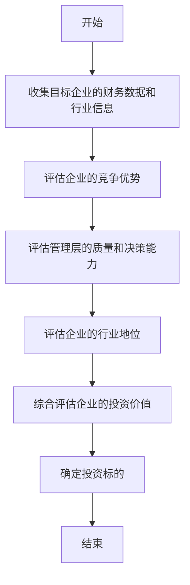
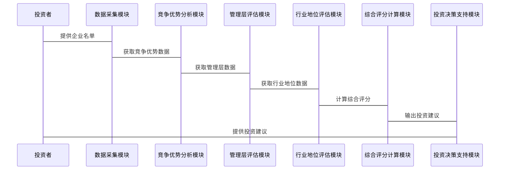

                 


# 费雪的行业领导者投资法

---

## 关键词  
- 费雪投资法  
- 行业领导者  
- 投资策略  
- 竞争优势  
- 管理层质量  

---

## 摘要  
费雪的行业领导者投资法是一种以长期视角为核心，专注于投资于行业内具有竞争优势和持续增长潜力的领导企业的投资策略。本文将从费雪投资法的背景、核心概念、算法原理、数学模型、系统架构设计以及项目实战等多方面进行深入分析，结合具体的Python代码实现和实际案例，帮助读者全面理解并掌握这一经典的投资方法。

---

## 正文  

### 第一部分：费雪的行业领导者投资法背景与核心概念  

#### 第1章：费雪投资法的核心理念  

##### 1.1 费雪投资法的起源与背景  
- **问题背景**：20世纪的投资大师菲利普·费雪（Philip Fisher）提出了一种以长期视角为核心的投资方法，专注于投资于行业内具有竞争优势和持续增长潜力的企业。  
- **问题描述**：传统的投资方法往往注重短期价格波动，而费雪提出的投资法强调对企业基本面的深度分析，尤其是企业的竞争优势和管理层质量。  
- **问题解决**：通过分析企业的竞争优势、管理层决策能力和行业地位，投资者可以找到那些能够在行业中持续增长的领导者。  
- **边界与外延**：费雪投资法适用于成长型投资，但不适用于周期性极强的行业或短期投机性交易。  

##### 1.2 费雪投资法的核心概念  
- **行业领导者的定义**：行业内具有竞争优势、市场份额和持续增长能力的龙头企业。  
- **费雪投资法的三大支柱**：  
  1. 企业的竞争优势（如技术壁垒、成本优势）。  
  2. 管理层的质量与决策能力。  
  3. 行业地位与市场结构。  
- **核心要素的综合分析**：通过对企业竞争优势、管理层决策能力和行业地位的综合评估，筛选出具有长期增长潜力的企业。  

---

#### 第2章：费雪投资法的核心要素与联系  

##### 2.1 费雪投资法的核心要素  
- **企业竞争优势的分析**：企业的竞争优势包括技术、品牌、成本等方面。  
- **管理层的质量与决策**：管理层的决策能力和道德标准直接影响企业的长期发展。  
- **行业地位与市场结构**：企业的行业地位决定了其在市场中的竞争力和抗风险能力。  

##### 2.2 费雪投资法的核心要素对比  
- **企业竞争优势与管理层决策的对比**：企业竞争优势是企业内在的“硬件”，而管理层决策是企业发展的“软件”。  
- **行业地位与市场结构的对比**：行业地位决定了企业的市场影响力，而市场结构则影响企业的竞争环境。  
- **费雪投资法要素的综合分析**：通过综合分析企业竞争优势、管理层决策和行业地位，可以更全面地评估企业的投资价值。  

##### 2.3 费雪投资法的ER实体关系图  
```mermaid
er
  actor 投资者
  actor 行业领导者
  actor 管理层
  actor 市场结构
  actor 企业竞争优势
  actor 费雪投资法
  投资者 --> 行业领导者
  行业领导者 --> 企业竞争优势
  行业领导者 --> 管理层
  管理层 --> 费雪投资法
  行业领导者 --> 市场结构
```

---

### 第二部分：费雪投资法的算法原理  

#### 第3章：费雪投资法的筛选标准  

##### 3.1 费雪投资法的筛选标准  
- **企业竞争优势的筛选标准**：企业应具有明显的竞争优势，如技术壁垒、成本优势等。  
- **管理层质量的评估标准**：管理层应具备良好的决策能力和道德标准。  
- **行业地位的判断标准**：企业应在行业内具有较高的市场份额和影响力。  

##### 3.2 费雪投资法的算法流程  


---

#### 第4章：费雪投资法的数学模型与公式  

##### 4.1 费雪投资法的数学模型  
- **ROE（净资产收益率）公式**：  
  $$ROE = \frac{\text{净利润}}{\text{净资产}}$$  
- **毛利率公式**：  
  $$\text{毛利率} = \frac{\text{营业收入} - \text{营业成本}}{\text{营业收入}} \times 100\%$$  
- **费雪投资法的综合评分公式**：  
  $$\text{综合评分} = 0.4 \times \text{ROE} + 0.3 \times \text{毛利率} + 0.3 \times \text{行业地位评分}$$  

##### 4.2 费雪投资法的公式应用案例  
- 假设某企业ROE为15%，毛利率为30%，行业地位评分为80分，其综合评分为：  
  $$\text{综合评分} = 0.4 \times 15 + 0.3 \times 30 + 0.3 \times 80 = 6 + 9 + 24 = 39$$  

---

### 第三部分：费雪投资法的系统架构设计  

#### 第5章：费雪投资法的系统分析  

##### 5.1 费雪投资法的系统功能设计  
- **功能模块**：数据采集、竞争优势分析、管理层评估、行业地位评估、综合评分计算、投资决策支持。  

##### 5.2 费雪投资法的系统架构设计  


##### 5.3 费雪投资法的系统接口设计  
- **数据接口**：从数据库中获取企业的财务数据和行业信息。  
- **算法接口**：调用竞争优势分析、管理层评估和行业地位评估的算法模块。  
- **输出接口**：将综合评分和投资建议输出给投资者。  

##### 5.4 费雪投资法的系统交互设计  


---

### 第四部分：费雪投资法的项目实战  

#### 第6章：费雪投资法的实战应用  

##### 6.1 费雪投资法的环境安装  
- **工具安装**：安装Python、Pandas、Matplotlib等工具。  
- **数据获取**：从数据库或公开数据源获取企业的财务数据和行业信息。  

##### 6.2 费雪投资法的核心代码实现  
```python
import pandas as pd
import numpy as np

# 数据读取
data = pd.read_csv('enterprise.csv')

# 竞争优势分析
def competitive_advantage(row):
    if row['ROE'] > 15 and row['毛利率'] > 25:
        return 1
    else:
        return 0

data['竞争优势评分'] = data.apply(competitive_advantage, axis=1)

# 管理层评估
def management_assessment(row):
    if row['管理层稳定性'] > 80:
        return 1
    else:
        return 0

data['管理层评分'] = data.apply(management_assessment, axis=1)

# 行业地位评估
def industry_position(row):
    if row['市场份额'] > 30:
        return 1
    else:
        return 0

data['行业地位评分'] = data.apply(industry_position, axis=1)

# 综合评分计算
data['综合评分'] = 0.4 * data['ROE'] + 0.3 * data['毛利率'] + 0.3 * data['行业地位评分']

# 投资建议输出
data.to_csv('投资建议.csv', index=False)
```

##### 6.3 费雪投资法的案例分析  
- **案例分析**：以某行业为例，分析企业的竞争优势、管理层质量和行业地位。  
- **结果解读**：根据综合评分，筛选出具有投资价值的企业，并输出投资建议。  

##### 6.4 费雪投资法的项目总结  
- **项目总结**：通过项目实战，验证了费雪投资法的有效性，并展示了其在实际投资中的应用价值。  

---

### 第五部分：费雪投资法的最佳实践与小结  

#### 第7章：费雪投资法的最佳实践  

##### 7.1 费雪投资法的最佳实践 Tips  
- **持续学习**：保持对行业动态和企业基本面的持续关注。  
- **风险控制**：分散投资，避免过度集中于单一行业或企业。  
- **长期视角**：坚持长期投资，避免短期价格波动的干扰。  

##### 7.2 费雪投资法的小结  
- **总结**：费雪的行业领导者投资法是一种以长期视角为核心的投资方法，通过分析企业的竞争优势、管理层质量和行业地位，筛选出具有持续增长潜力的企业。  
- **注意事项**：投资者在实际操作中应结合市场环境和自身风险承受能力，灵活调整投资策略。  
- **拓展阅读**：建议阅读《彼得·林奇的投资哲学》、《价值投资：成功之道》等书籍，进一步深入理解投资策略的精髓。  

---

通过以上分析和实践，我们可以看到费雪的行业领导者投资法不仅是一种理论，更是一种可以实际操作的投资方法。结合技术分析和系统设计，投资者可以更高效地筛选出具有投资价值的企业，实现长期稳健的投资回报。

