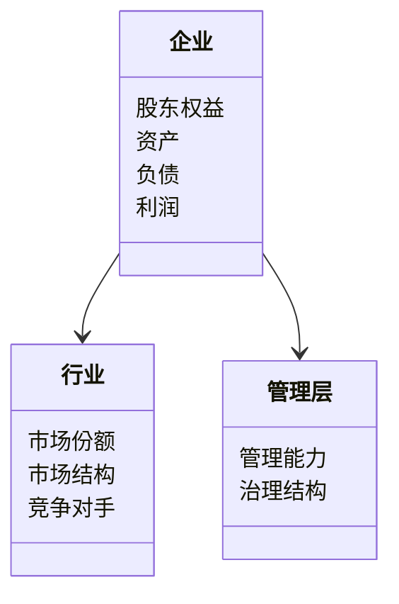
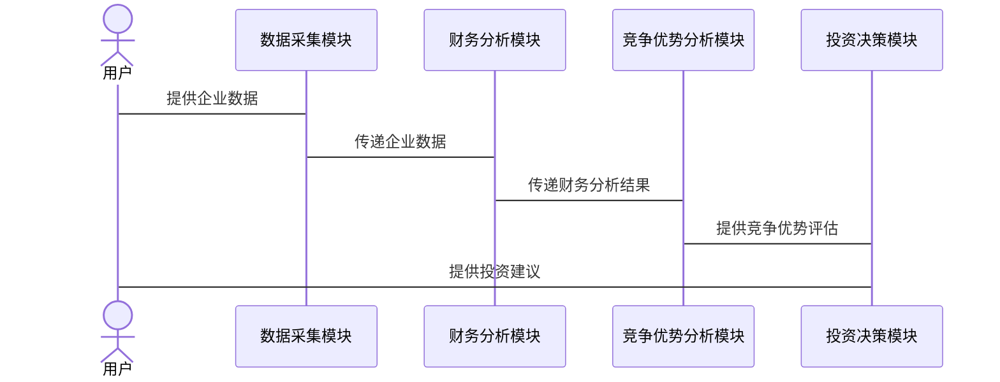
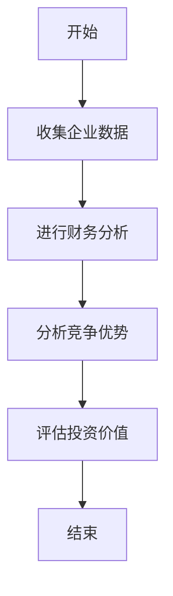

                 


# 费雪的行业领导者投资策略

> 关键词：费雪投资策略，行业领导者，投资分析，财务健康状况，竞争优势

> 摘要：本文深入分析了费雪的行业领导者投资策略，探讨了其核心理念、理论基础、系统架构设计以及实际案例分析。通过系统化的分析，帮助读者理解如何识别行业领导者，并构建高效的投资策略。

---

## 第一部分: 费雪投资策略的背景与基础

### 第1章: 费雪投资策略概述

#### 1.1 费雪投资策略的核心理念
##### 1.1.1 投资的长期视角
费雪的投资策略强调长期价值，认为投资的核心目标是寻找能够持续创造价值的企业。他主张通过深入研究企业的基本面，识别出那些能够在行业中长期占据领导地位的企业。

##### 1.1.2 费雪的投资哲学与方法论
费雪的投资哲学可以概括为“价值投资”，他强调通过分析企业的财务状况、管理层能力和市场地位，找到那些具有强大竞争优势的企业。他的方法论包括以下几个方面：
1. 从长期角度分析企业的盈利能力。
2. 通过财务数据和市场表现评估企业的健康状况。
3. 识别企业的竞争优势和市场地位。

##### 1.1.3 费雪策略在现代投资中的地位
费雪的投资策略在现代投资领域中占据重要地位，尤其在机构投资和个人投资者中广泛应用。他的方法不仅适用于股票投资，还可以扩展到其他资产类别。

#### 1.2 费雪投资策略的核心概念
##### 1.2.1 行业领导者的定义与特征
行业领导者是指在特定行业中具有显著竞争优势、市场份额和盈利能力的企业。其特征包括：
1. 领先的市场份额。
2. 强大的品牌影响力。
3. 高效的管理团队。
4. 优秀的财务表现。

##### 1.2.2 费雪策略的三大支柱
1. 企业竞争优势分析。
2. 财务健康状况评估。
3. 管理层能力评估。

##### 1.2.3 费雪策略与其他投资策略的对比
与价值投资、成长投资等策略相比，费雪策略更注重企业的长期竞争优势和市场地位，强调在行业中找到领导者。

---

### 第2章: 费雪投资策略的理论基础

#### 2.1 费雪投资策略的经济学基础
##### 2.1.1 边际效用理论
边际效用理论是费雪策略的经济学基础之一，认为企业在市场中的竞争优势来源于其产品或服务的独特价值。

##### 2.1.2 市场结构与竞争分析
费雪策略强调分析市场结构，识别行业中的领导者。他提出，行业领导者通常具备以下特征：
1. 领先的市场份额。
2. 强大的品牌影响力。
3. 高效的运营能力。

##### 2.1.3 费雪策略的微观经济学视角
从微观经济学的角度，费雪策略关注企业的成本结构、定价策略和市场进入壁垒。

#### 2.2 费雪投资策略的财务学基础
##### 2.2.1 财务报表分析基础
费雪策略要求对企业的财务报表进行深入分析，包括利润表、资产负债表和现金流量表。

##### 2.2.2 股东权益与企业价值
费雪策略强调企业价值的评估，认为企业的内在价值是其未来现金流的现值。

##### 2.2.3 费雪策略的财务模型
费雪策略的财务模型包括对企业未来现金流的预测和贴现率的估算。

---

### 第3章: 费雪投资策略的核心要素

#### 3.1 行业领导者的识别标准
##### 3.1.1 市场地位与竞争优势
市场地位是行业领导者的重要特征，包括市场份额和品牌影响力。

##### 3.1.2 财务健康状况
财务健康状况是行业领导者的重要指标，包括盈利能力、资产负债率和现金流情况。

##### 3.1.3 管理层能力与企业治理
管理层能力和企业治理是行业领导者的重要因素，包括管理团队的经验和治理结构的完善性。

#### 3.2 费雪策略的选股标准
##### 3.2.1 股票的内在价值评估
费雪策略要求对股票的内在价值进行评估，包括对企业未来现金流的预测和贴现率的估算。

##### 3.2.2 股票的市场价格波动
费雪策略关注股票的市场价格波动，认为市场波动为投资者提供了买入机会。

##### 3.2.3 股票的风险与收益平衡
费雪策略强调风险与收益的平衡，认为投资者需要在风险可控的前提下追求收益最大化。

---

## 第二部分: 费雪投资策略的系统分析与架构设计

### 第4章: 费雪策略的系统分析

#### 4.1 投资系统功能设计
##### 4.1.1 系统目标与范围
费雪策略的投资系统目标是帮助投资者识别行业领导者，评估其投资价值。

##### 4.1.2 系统功能模块划分
系统功能模块包括：
1. 数据收集与处理模块。
2. 财务分析模块。
3. 竞争优势分析模块。
4. 投资决策模块。

##### 4.1.3 系统输入输出设计
系统输入包括企业的财务数据、市场数据和管理层信息；系统输出包括企业的投资价值评估和投资建议。

#### 4.2 费雪策略的领域模型
##### 4.2.1 领域模型类图


##### 4.2.2 领域模型关系图


---

### 第5章: 费雪策略的架构设计

#### 5.1 系统架构设计
##### 5.1.1 分层架构设计
系统架构分为数据层、业务逻辑层和用户界面层。

##### 5.1.2 组件化设计
系统组件包括数据采集组件、财务分析组件、竞争优势分析组件和投资决策组件。

##### 5.1.3 模块化设计
系统模块包括数据预处理模块、财务分析模块、竞争优势分析模块和投资决策模块。

#### 5.2 系统接口设计
##### 5.2.1 核心接口定义
系统核心接口包括数据输入接口、财务分析接口、竞争优势分析接口和投资决策接口。

##### 5.2.2 接口交互流程


---

### 第6章: 费雪策略的算法实现

#### 6.1 费雪策略的核心算法
##### 6.1.1 算法原理
费雪策略的核心算法基于财务分析和竞争优势分析，通过综合评估企业的内在价值和市场地位，得出投资建议。

##### 6.1.2 算法流程图


##### 6.1.3 算法实现代码
```python
def fisher_investment_strategy(company_data):
    # 数据预处理
    processed_data = preprocess(company_data)
    # 财务分析
    financial_analysis = analyze_financials(processed_data)
    # 竞争优势分析
    competitive_edge = analyze_competitive_edge(processed_data)
    # 投资评估
    investment_assessment = assess_investment(financial_analysis, competitive_edge)
    return investment_assessment
```

#### 6.2 算法优化与改进
##### 6.2.1 算法优化方法
通过引入机器学习算法，提高数据分析的准确性和效率。

##### 6.2.2 算法性能提升
优化数据处理流程，减少计算时间。

##### 6.2.3 算法适用性扩展
将费雪策略扩展到更多资产类别，如债券和房地产。

---

## 第三部分: 费雪投资策略的实战与案例分析

### 第7章: 费雪策略的经典案例分析

#### 7.1 费雪策略在经典案例中的应用
##### 7.1.1 微软的案例分析
微软作为行业领导者，具有强大的市场地位和竞争优势。

##### 7.1.2 可口可乐的案例分析
可口可乐的案例展示了企业竞争优势和财务健康状况的重要性。

##### 7.1.3 其他经典案例分析
其他案例包括苹果和谷歌，这些企业都符合费雪策略的选股标准。

#### 7.2 案例分析的总结与启示
##### 7.2.1 案例分析的共性特征
行业领导者通常具有强大的市场份额和竞争优势。

##### 7.2.2 案例分析的启示与借鉴
投资者应注重企业的长期价值和竞争优势，而非短期市场波动。

##### 7.2.3 案例分析的未来展望
费雪策略在未来的投资中将继续发挥重要作用，尤其是在科技和消费领域。

---

### 第8章: 费雪策略的系统实现与应用

#### 8.1 系统实现的环境配置
##### 8.1.1 开发环境搭建
安装Python和相关库，如Pandas和NumPy。

##### 8.1.2 数据库配置
选择适合的数据存储解决方案，如MySQL或MongoDB。

##### 8.1.3 依赖库安装
安装必要的依赖库，如Scikit-learn和Plotly。

#### 8.2 系统核心代码实现
##### 8.2.1 核心算法实现
```python
def preprocess(data):
    # 数据清洗和预处理
    return processed_data

def analyze_financials(processed_data):
    # 财务数据分析
    return financial_analysis

def analyze_competitive_edge(processed_data):
    # 竞争优势分析
    return competitive_edge

def assess_investment(financial_analysis, competitive_edge):
    # 投资评估
    return investment_assessment
```

---

## 总结

费雪的行业领导者投资策略是一种系统化的方法，通过深入分析企业的基本面，识别出具有长期竞争优势的行业领导者。本文从理论基础、系统设计到实际案例，全面探讨了费雪策略的核心要素和应用。通过系统化的分析和实践，投资者可以更好地应用费雪策略，实现长期稳健的投资收益。

