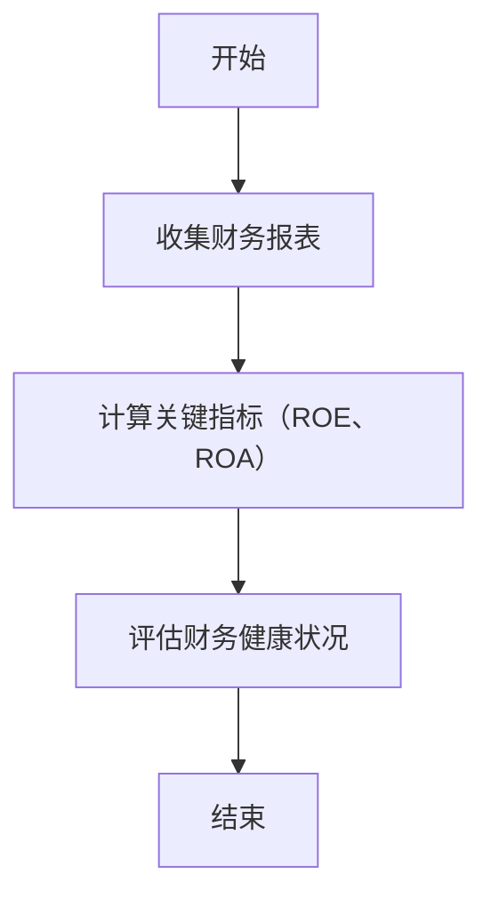
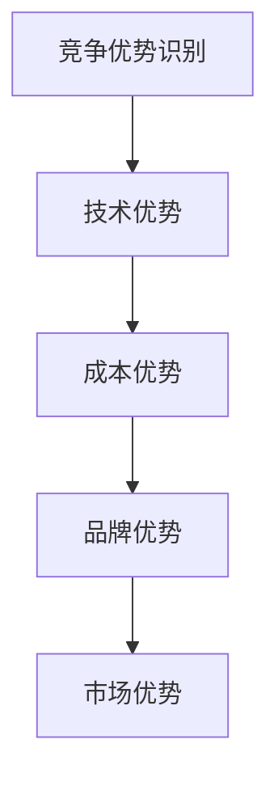
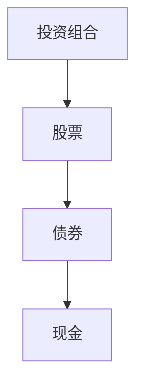
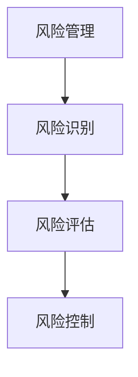
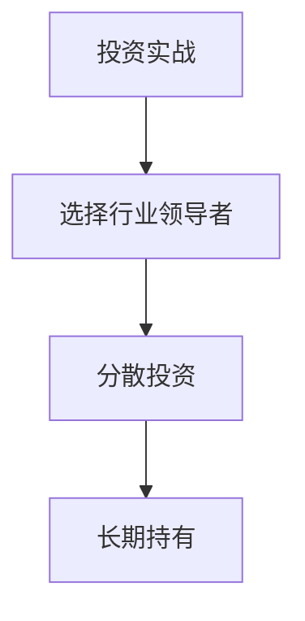

                 


# 费雪的行业领导者理论：寻找市场冠军

**关键词**：费雪行业领导者理论、市场冠军、投资策略、财务分析、竞争优势

**摘要**：本文详细探讨了费雪的行业领导者理论，分析了如何识别和投资于能够在市场中长期占据领导地位的公司。文章从理论背景、分析方法、投资策略到实际案例，层层深入，帮助读者理解并应用这一理论。

---

# 第一部分：费雪的行业领导者理论概述

## 第1章：费雪行业领导者理论的背景与核心概念

### 1.1 费雪理论的起源

- **投资理论的演变**：从早期的“价值投资”到现代的“成长投资”，费雪理论的独特之处在于其对行业领导者的关注。
- **费雪理论的核心思想**：强调投资于具有强大竞争优势、能够持续增长的企业。
- **理论的现实意义**：在当前竞争激烈的市场环境中，费雪理论为企业投资者提供了重要的指导。

### 1.2 行业领导者的定义与特征

- **定义**：行业领导者是指在特定行业中占据主导地位，具有显著竞争优势的企业。
- **特征对比表**：
  | 特征      | 领导者特征 | 普通企业特征 |
  |-----------|------------|--------------|
  | 市场份额  | 高          | 低            |
  | 盈利能力  | 强          | 弱            |
  | 竞争优势  | 独特       | 无或有限      |
- **与普通企业的区别**：领导者通常在技术、品牌、成本等方面具有显著优势。

### 1.3 费雪理论的核心要素

- **核心概念原理**：企业只有在具备持续竞争优势的情况下，才能实现长期增长。
- **ER实体关系图**：
  ```mermaid
  entity IndustryLeaders {
    id
    name
    marketShare
    competitiveAdvantages
    profitMargin
  }
  ```
- **流程图**：
  ```mermaid
  graph TD
    A[企业] --> B[竞争优势]
    B --> C[市场份额]
    C --> D[盈利能力]
  ```

## 1.4 本章小结

本章介绍了费雪行业领导者理论的背景、核心概念以及行业领导者的特征，为后续分析奠定了基础。

---

# 第二部分：行业领导者识别与分析方法

## 第2章：行业领导者的财务分析

### 2.1 财务指标分析方法

- **净利润与ROE分析**：
  - 净利润公式：`净利润 = 收入 - 成本 - 税费`
  - ROE公式：`ROE = 净利润 / 净资产`
  - 示例：若某企业净利润为1000万元，净资产为5000万元，则ROE为20%。
- **营业收入与成本分析**：关注收入增长是否快于成本。
- **财务健康状况评估**：通过资产负债表、利润表和现金流量表综合分析。

### 2.2 财务分析的Mermaid流程图



## 2.3 本章小结

本章通过财务指标分析，帮助投资者识别具有盈利能力和发展潜力的行业领导者。

---

## 第3章：行业领导者的竞争优势分析

### 3.1 竞争优势的定义与分类

- **定义**：企业相对于竞争对手的独特优势，包括技术、成本、品牌等。
- **分类对比表**：
  | 类型      | 描述                     |
  |-----------|--------------------------|
  | 技术优势  | 拥有独特的技术或专利     |
  | 成本优势  | 生产成本低于竞争对手     |
  | 品牌优势  | 强大的品牌认知度         |
  | 市场优势  | 占据主要市场份额         |

### 3.2 竞争优势的Mermaid流程图



## 3.3 本章小结

本章通过分析竞争优势，帮助投资者识别行业领导者的核心竞争力。

---

# 第三部分：行业领导者投资策略

## 第4章：行业领导者的投资组合构建

### 4.1 投资组合的基本原则

- **定义**：将资金分配到不同资产或股票中，以分散风险。
- **风险与收益**：通过分散投资降低风险，同时追求超额收益。

### 4.2 投资组合的Mermaid架构图



## 4.3 本章小结

本章介绍了如何通过构建投资组合来分散风险并捕捉行业领导者的增长机会。

---

## 第5章：长期投资与风险管理

### 5.1 长期投资的基本原则

- **长期投资的定义**：持有优质资产超过一年的投资策略。
- **风险与收益**：长期投资更关注企业的长期增长，而非短期波动。

### 5.2 风险管理的Mermaid流程图



## 5.3 本章小结

本章强调了长期投资的重要性，并提供了风险管理的策略。

---

# 第四部分：案例分析与实战技巧

## 第6章：行业领导者的经典案例分析

### 6.1 美国运通的案例分析

- **公司背景**：全球最大的支付公司之一，拥有广泛的市场份额和强大的品牌优势。
- **财务表现**：高ROE和稳定的收入增长。
- **投资策略**：长期持有，享受其市场份额的持续增长。

### 6.2 苹果公司的案例分析

- **公司背景**：全球科技行业的领导者，拥有强大的技术和品牌优势。
- **财务表现**：高利润 margins 和稳定的收入增长。
- **投资策略**：长期持有，捕捉其技术创新带来的增长机会。

## 6.3 本章小结

本章通过具体案例分析，展示了如何应用费雪理论识别和投资行业领导者。

---

## 第7章：行业领导者的投资实战技巧

### 7.1 投资实战的基本原则

- **本金安全**：优先考虑资金安全。
- **长期持有**：耐心持有优质资产。
- **分散投资**：避免过度集中风险。

### 7.2 投资实战的Mermaid流程图



## 7.3 本章小结

本章提供了实用的投资实战技巧，帮助读者在实际操作中应用费雪理论。

---

# 第五部分：进阶内容与注意事项

## 第8章：进阶内容

### 8.1 投资组合管理

- **定义**：对投资组合进行定期调整和优化。
- **优化方法**：根据市场变化和个人风险承受能力进行调整。

### 8.2 技术分析

- **定义**：通过技术指标预测股票价格走势。
- **常用指标**：移动平均线、相对强弱指数（RSI）等。

## 8.3 小结

进阶内容为读者提供了更深入的投资策略和工具。

## 第9章：注意事项与最佳实践

### 9.1 注意事项

- **市场风险**：行业领导者也可能面临市场波动。
- **行业变化**：技术进步或政策变化可能影响竞争优势。
- **个人能力**：投资者需具备一定的分析能力和市场理解。

### 9.2 最佳实践

- **持续学习**：保持对市场和理论的了解。
- **定期评估**：定期检查投资组合的表现。
- **耐心与纪律**：坚持长期投资，避免短期波动的干扰。

## 9.3 小结

本章提供了投资者在应用费雪理论时的注意事项和最佳实践建议。

---

# 总结

费雪的行业领导者理论为投资者提供了一种系统的方法来识别和投资于能够在市场中长期占据领导地位的企业。通过本文的详细分析和案例研究，读者可以更好地理解并应用这一理论，从而在投资中取得更好的成绩。

