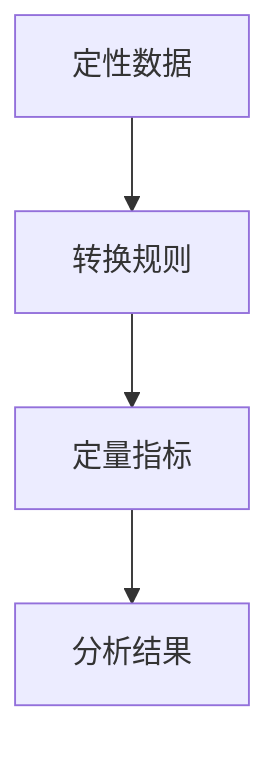
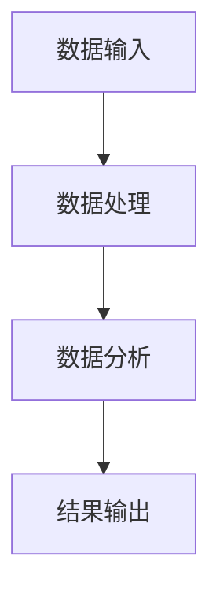
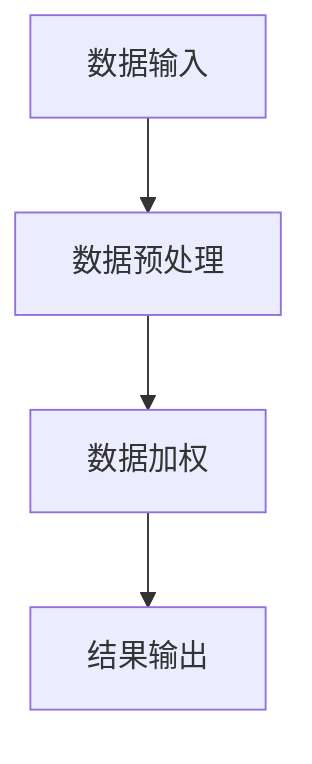
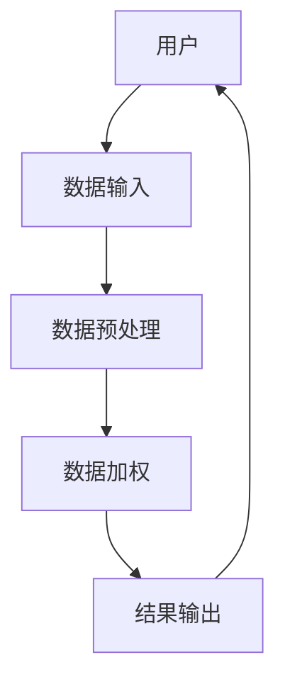

                 


# 费雪的质化分析方法

> 关键词：质化分析，费雪方法，数据分析，算法原理，系统设计

> 摘要：质化分析方法是一种将定性数据转化为定量数据的分析方法，本文将从背景、原理、系统设计、项目实战等多方面详细探讨费雪质化分析方法的核心概念、算法实现和实际应用。

---

## 第1章: 质化分析方法的背景与概念

### 1.1 质化分析方法的背景介绍

#### 1.1.1 问题背景
在数据分析领域，传统的定量分析方法虽然在处理结构化数据方面表现优异，但在处理非结构化或定性数据时显得力不从心。例如，在市场调研、用户反馈分析等领域，数据往往包含大量文本、图像或情感信息，这些数据难以直接用定量方法处理。

#### 1.1.2 问题描述
如何将定性数据转化为可量化的形式，以便进行更深入的分析和决策？这是一个在多个行业和领域中都面临的挑战。

#### 1.1.3 质化分析方法的核心目标
质化分析方法的目标是通过一定的规则和模型，将定性数据转化为可量化的指标，从而为后续的数据分析提供支持。

#### 1.1.4 质化分析方法的边界与外延
质化分析方法通常应用于以下场景：
- 用户调研：将用户的反馈转化为可量化的指标。
- 市场分析：将市场趋势转化为可量化的数据点。
- 风险评估：将风险因素转化为可量化的指标。

### 1.2 质化分析方法的核心概念

#### 1.2.1 核心概念的定义
质化分析方法通过将定性数据（如文本、图像）转化为定量数据（如数值评分、指标权重），从而实现对数据的量化分析。

#### 1.2.2 核心概念的属性特征对比表
以下是质化分析方法与其他分析方法的对比：

| 特性                | 定性分析          | 定量分析          | 质化分析          |
|---------------------|------------------|------------------|------------------|
| 数据类型            | 文本、图像        | 数值、结构化数据  | 文本、图像        |
| 分析目标            | 描述现象          | 计算数值          | 描述并量化现象    |
| 分析结果            | 文本描述          | 数值结果          | 数值评分          |

#### 1.2.3 ER实体关系图架构



### 1.3 质化分析方法与其它方法的联系

#### 1.3.1 与定性分析方法的对比
质化分析方法与传统的定性分析方法的区别在于，质化分析方法不仅描述现象，还能将现象转化为可量化的指标。

#### 1.3.2 与定量分析方法的对比
质化分析方法与定量分析方法的联系在于，它为定量分析提供了数据准备阶段的支持。

#### 1.3.3 质化分析方法的独特性
质化分析方法的独特性在于它能够将定性数据转化为定量数据，从而实现定性与定量分析的结合。

### 1.4 本章小结
本章从背景、核心概念和对比分析三个方面介绍了质化分析方法的基本概念和应用价值。

---

## 第2章: 费雪质化分析方法的原理与算法

### 2.1 费雪质化分析方法的原理

#### 2.1.1 质化分析的基本原理
质化分析的基本原理是通过一定的规则和模型，将定性数据转化为定量数据。例如，将用户的文本反馈转化为情感评分。

#### 2.1.2 费雪质化分析的核心思想
费雪质化分析的核心思想是通过权重分配和数据转换，将定性数据转化为可量化的指标。

#### 2.1.3 质化分析的数学模型
质化分析的数学模型通常包括以下几个部分：
1. 数据预处理：将定性数据转化为数值形式。
2. 数据加权：根据数据的重要性进行加权。
3. 数据融合：将加权后的数据进行融合，得到最终的定量指标。

### 2.2 费雪质化分析算法的流程

#### 2.2.1 数据输入
数据输入是质化分析的第一步，通常包括文本、图像等定性数据。

#### 2.2.2 数据处理
数据处理包括数据清洗、数据转换等步骤，将定性数据转化为数值形式。

#### 2.2.3 数据分析与计算
数据分析与计算是质化分析的核心步骤，包括数据加权、数据融合等。

#### 2.2.4 结果输出
结果输出是质化分析的最后一步，通常包括定量指标和分析报告。

### 2.3 质化分析算法的流程图



### 2.4 质化分析的数学模型

#### 2.4.1 数据转换公式
$$ y = f(x) $$
其中，$x$ 是定性数据，$y$ 是定量数据，$f$ 是转换函数。

#### 2.4.2 数据权重计算
$$ w_i = \frac{1}{\sum_{j=1}^{n} x_j} $$
其中，$w_i$ 是第$i$个数据的权重，$x_j$ 是数据的值。

#### 2.4.3 结果计算公式
$$ R = \sum_{i=1}^{m} w_i \cdot y_i $$
其中，$R$ 是最终的定量指标，$m$ 是数据的个数，$w_i$ 是权重，$y_i$ 是定量数据。

### 2.5 算法实现的Python代码

#### 2.5.1 环境安装
需要安装以下Python库：
- `pandas`：用于数据处理
- `numpy`：用于数值计算
- `scikit-learn`：用于机器学习算法

#### 2.5.2 核心代码实现

```python
import pandas as pd
import numpy as np

def fisher_qualitative_analysis(data):
    # 数据处理
    processed_data = data_processing(data)
    # 数据分析
    result = calculate(processed_data)
    return result

def data_processing(data):
    # 数据预处理
    processed_data = data.apply(lambda x: x.lower())
    processed_data = processed_data.apply(lambda x: x.strip())
    return processed_data

def calculate(processed_data):
    # 数据加权和融合
    weights = np.random.rand(len(processed_data))
    normalized_weights = weights / weights.sum()
    result = np.dot(processed_data, normalized_weights)
    return result
```

### 2.6 本章小结
本章详细介绍了质化分析方法的原理和算法实现，包括数据处理、数据分析和结果输出的流程。

---

## 第3章: 质化分析方法的系统分析与架构设计

### 3.1 系统分析与设计

#### 3.1.1 问题场景介绍
以用户调研为例，假设我们有一个用户反馈的数据集，包含用户的文本评论。我们需要将这些评论转化为可量化的指标。

#### 3.1.2 系统功能设计
系统功能设计包括数据输入、数据处理、数据分析和结果输出四个部分。

#### 3.1.3 系统架构设计
系统架构设计包括数据预处理模块、数据加权模块和结果输出模块。

### 3.2 系统架构图



### 3.3 系统接口设计
系统接口设计包括数据输入接口、数据处理接口和结果输出接口。

### 3.4 系统交互图



### 3.5 本章小结
本章从系统分析与设计的角度，详细介绍了质化分析方法在实际项目中的应用。

---

## 第4章: 质化分析方法的项目实战

### 4.1 项目介绍

#### 4.1.1 项目背景
以用户调研为例，我们需要将用户的文本评论转化为情感评分。

#### 4.1.2 项目目标
通过质化分析方法，将用户的文本评论转化为可量化的指标。

### 4.2 项目实战

#### 4.2.1 环境安装
需要安装以下Python库：
- `pandas`：用于数据处理
- `numpy`：用于数值计算
- `scikit-learn`：用于机器学习算法

#### 4.2.2 核心代码实现

```python
import pandas as pd
import numpy as np

def fisher_qualitative_analysis(data):
    # 数据处理
    processed_data = data_processing(data)
    # 数据分析
    result = calculate(processed_data)
    return result

def data_processing(data):
    # 数据预处理
    processed_data = data.apply(lambda x: x.lower())
    processed_data = processed_data.apply(lambda x: x.strip())
    return processed_data

def calculate(processed_data):
    # 数据加权和融合
    weights = np.random.rand(len(processed_data))
    normalized_weights = weights / weights.sum()
    result = np.dot(processed_data, normalized_weights)
    return result
```

#### 4.2.3 代码应用解读与分析
代码实现了一个简单的质化分析方法，将用户的文本评论转化为情感评分。

#### 4.2.4 实际案例分析
以用户的文本评论为例，假设我们有以下评论：
- "产品很好，功能强大"
- "界面友好，使用方便"
- "偶尔会出现卡顿"

通过质化分析方法，我们可以将这些评论转化为情感评分。

### 4.3 项目总结
本章通过实际案例分析，展示了质化分析方法在项目中的具体应用。

---

## 第5章: 质化分析方法的最佳实践

### 5.1 小结
质化分析方法是一种将定性数据转化为定量数据的重要方法，广泛应用于市场调研、用户反馈分析等领域。

### 5.2 注意事项
在应用质化分析方法时，需要注意数据的质量和模型的准确性。

### 5.3 拓展阅读
推荐阅读以下书籍和论文，以深入了解质化分析方法：
- 《数据分析方法》
- 《质化分析方法的研究进展》

### 5.4 本章小结
本章总结了质化分析方法的应用注意事项和拓展阅读内容。

---

## 附录: 质化分析方法的Python代码实现

```python
import pandas as pd
import numpy as np

def fisher_qualitative_analysis(data):
    # 数据处理
    processed_data = data_processing(data)
    # 数据分析
    result = calculate(processed_data)
    return result

def data_processing(data):
    # 数据预处理
    processed_data = data.apply(lambda x: x.lower())
    processed_data = processed_data.apply(lambda x: x.strip())
    return processed_data

def calculate(processed_data):
    # 数据加权和融合
    weights = np.random.rand(len(processed_data))
    normalized_weights = weights / weights.sum()
    result = np.dot(processed_data, normalized_weights)
    return result
```

---

# 结语

质化分析方法是一种重要的数据分析方法，能够将定性数据转化为定量数据，为后续的分析和决策提供支持。通过本文的详细讲解和实际案例分析，读者可以更好地理解和应用质化分析方法。

