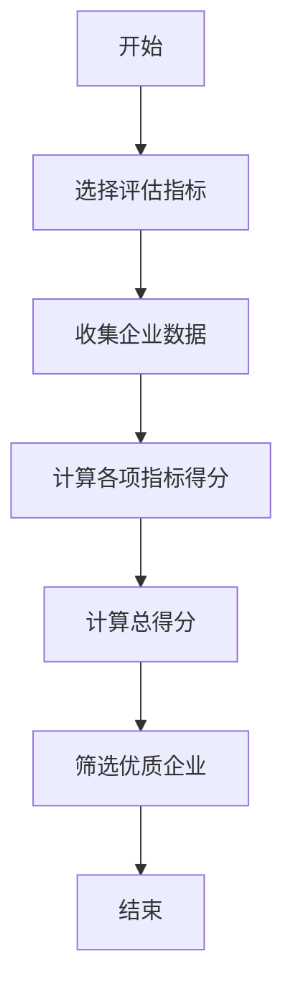
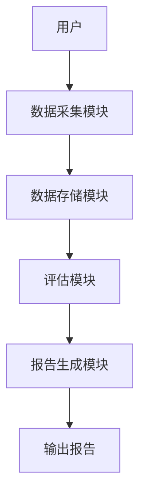

                 


# 费雪的质量增长策略：在高科技时代的重新诠释

## 关键词：费雪投资策略，质量增长，高科技企业，投资策略，企业评估

## 摘要：  
本文详细探讨了菲利普·费雪的质量增长策略在高科技时代的应用与演变。通过分析质量增长策略的核心概念、评估体系、算法原理以及系统架构，本文重新诠释了这一经典投资策略在现代科技环境下的适应性。结合实际案例和系统设计，文章为投资者提供了在高科技时代运用质量增长策略的实践指南。

---

## 第一部分: 费雪的质量增长策略概述

### 第1章: 费雪质量增长策略的背景与核心概念

#### 1.1 费雪投资理论的提出背景  
菲利普·费雪（Philip Fisher）是20世纪著名的投资理论家，他提出了“质量增长”策略，强调投资于具有强大竞争优势和持续增长潜力的企业。费雪认为，企业的质量体现在其市场地位、管理团队和创新能力等方面。  

#### 1.2 质量增长策略的核心目标  
费雪的质量增长策略旨在通过投资于那些能够持续提升市场份额、产品创新能力和社会影响力的公司，实现长期稳定的收益增长。这种策略的核心在于选择那些能够在竞争中保持优势地位的企业。

#### 1.3 质量增长策略与高科技时代的结合  
在高科技时代，企业的技术壁垒、创新能力和市场扩张速度成为评估质量增长的重要指标。本文将重新诠释费雪的质量增长策略，探讨其在科技领域的适用性和优化方向。

---

## 第二部分: 质量增长策略的核心要素与评估体系

### 第2章: 质量增长策略的核心要素分析

#### 2.1 核心要素的定义与分类  
质量增长策略的核心要素包括：  
1. **企业竞争优势**：包括技术优势、成本优势和商业模式优势。  
2. **市场地位**：企业的市场份额、品牌影响力和客户忠诚度。  
3. **财务健康状况**：企业的盈利能力、现金流和资产负债率。  

#### 2.2 核心要素之间的关系  
质量增长策略强调这些要素的动态平衡。例如，技术创新（竞争优势）能够提升企业的市场地位，而健康的财务状况则为企业的持续增长提供资金支持。

#### 2.3 高科技时代的核心要素扩展  
在高科技领域，企业创新能力成为核心竞争力。此外，数据驱动的决策能力和数字化转型能力也是评估企业质量增长的重要维度。

### 第3章: 质量增长策略的评估体系

#### 3.1 评估指标的分类  
- **财务指标**：ROE（净资产收益率）、净利润增长率、研发投入占比。  
- **市场指标**：市场份额、客户增长率、品牌影响力。  
- **技术指标**：专利数量、技术壁垒、创新周期。  

#### 3.2 评估体系的优化  
在高科技时代，传统的财务指标需要结合技术指标进行评估。例如，对于一家科技公司，研发投入占比和专利数量是衡量其创新能力的关键指标。

---

## 第三部分: 高科技时代质量增长策略的算法与系统架构

### 第4章: 质量增长策略的算法原理

#### 4.1 算法原理概述  
质量增长策略的算法基于对企业核心要素的量化评估，通过加权评分的方式筛选出具有持续增长潜力的企业。

#### 4.2 算法流程图  
以下是质量增长策略的算法流程图：  


#### 4.3 算法实现代码  
以下是Python代码示例：  
```python
def calculate_score(firm_data):
    score = 0
    # 财务指标权重
    finance_weight = 0.4
    # 技术指标权重
    tech_weight = 0.3
    # 市场指标权重
    market_weight = 0.3
    
    score += firm_data['ROE'] * finance_weight
    score += firm_data['patents'] * tech_weight
    score += firm_data['market_share'] * market_weight
    
    return score
```

---

### 第5章: 系统架构设计

#### 5.1 系统功能设计  
- **数据采集模块**：收集企业的财务数据、技术数据和市场数据。  
- **评估模块**：基于算法计算企业的质量增长得分。  
- **报告生成模块**：生成投资建议报告。  

#### 5.2 系统架构图  
以下是系统架构图：  


#### 5.3 接口设计  
- **输入接口**：企业数据接口（API）。  
- **输出接口**：投资报告接口（API）。  

---

## 第四部分: 高科技时代质量增长策略的实践

### 第6章: 项目实战

#### 6.1 环境安装  
- 安装Python和相关库（pandas、numpy、scikit-learn）。  

#### 6.2 核心代码实现  
```python
import pandas as pd
import numpy as np

# 数据预处理
data = pd.read_csv('firm_data.csv')
data['score'] = data.apply(lambda x: calculate_score(x), axis=1)
data.to_csv('result.csv', index=False)
```

#### 6.3 案例分析  
以某高科技企业为例，分析其质量增长潜力。通过计算得分，筛选出具有投资价值的企业。

---

## 第五部分: 最佳实践与总结

### 第7章: 最佳实践与总结

#### 7.1 小结  
质量增长策略在高科技时代依然具有重要的指导意义。通过优化评估体系和算法设计，可以更好地筛选出具有持续增长潜力的企业。

#### 7.2 注意事项  
- 数据的准确性和完整性是评估的基础。  
- 需要定期更新评估指标，以适应科技环境的变化。  

#### 7.3 拓展阅读  
建议读者阅读《投资最重要的ことは何か？》和《The Innovator's Solution》等书籍，深入了解质量增长策略和其他投资理论的结合应用。

---

## 结语  
本文通过重新诠释费雪的质量增长策略，为投资者在高科技时代的投资决策提供了理论依据和实践指导。通过系统的分析和优化，质量增长策略在现代科技环境下依然能够发挥其独特的优势。

