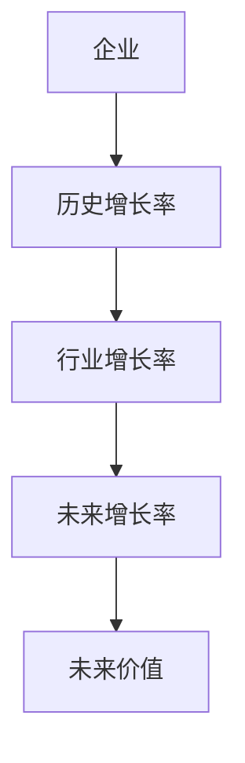
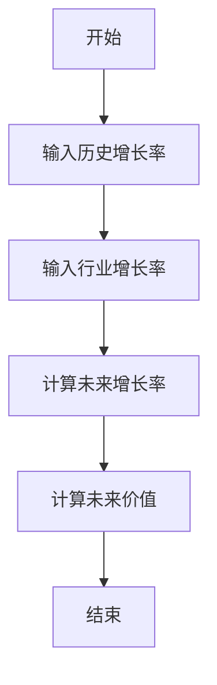

                 


# 费雪的长期增长潜力评估

## 关键词：
长期增长潜力评估, 费雪模型, 投资分析, 数学模型, 系统设计, 项目实战

## 摘要：
本文深入探讨了费雪的长期增长潜力评估方法，从模型的背景介绍到算法实现，再到系统设计和实际案例分析，系统地阐述了如何利用费雪模型评估企业的长期增长潜力。通过详细的数学公式、代码示例和系统架构设计，帮助读者掌握该模型的应用技巧。

---

### 第一部分：长期增长潜力评估的背景与概念

#### 第1章：长期增长潜力评估的背景介绍

##### 1.1 长期增长潜力评估的定义与目标
- **1.1.1 长期增长潜力的定义**：企业的长期增长潜力是指在未来较长一段时间内，企业盈利能力、市场份额和业务规模的增长能力。
- **1.1.2 评估长期增长潜力的意义**：通过评估企业长期增长潜力，投资者可以做出更明智的投资决策，企业也可以制定更有效的战略规划。
- **1.1.3 费雪模型的核心目标**：费雪模型旨在通过分析企业的历史数据和市场环境，预测其未来的增长率，帮助评估其长期增长潜力。

##### 1.2 问题背景与问题描述
- **1.2.1 投资分析中的长期增长问题**：投资决策需要考虑企业的未来表现，而长期增长潜力是其中的重要因素。
- **1.2.2 费雪模型的应用场景**：适用于评估企业的内在增长率，特别是在稳定增长的市场环境中。
- **1.2.3 问题解决的必要性**：传统估值方法（如市盈率、市净率）忽视了企业未来的增长潜力，而费雪模型弥补了这一不足。

##### 1.3 核心概念与边界
- **1.3.1 核心概念的构成要素**：包括企业的历史增长率、行业增长率、市场容量、竞争地位等。
- **1.3.2 模型的边界与外延**：费雪模型适用于长期稳定增长的企业，但不适用于周期性波动较大的行业。
- **1.3.3 概念结构与核心要素的对比**：通过表格对比不同模型的核心要素和适用场景。

#### 第2章：费雪模型的核心原理与联系

##### 2.1 费雪模型的原理概述
- **2.1.1 费雪模型的基本假设**：企业未来的增长率与其历史增长率和行业增长率有关。
- **2.1.2 模型的数学基础**：使用复利公式计算企业未来价值。
- **2.1.3 模型的核心公式**：费雪模型的核心公式为：
  $$ \text{未来价值} = \text{当前价值} \times (1 + g)^n $$
  其中，\( g \) 是增长率，\( n \) 是时间。

##### 2.2 核心概念的属性特征对比
- **2.2.1 模型参数的属性分析**：包括增长率、市场容量、竞争程度等因素。
- **2.2.2 不同模型的特征对比**：通过表格展示费雪模型与其他增长模型（如CAPM、WACC）的异同。
- **2.2.3 模型的优缺点分析**：优点包括简单易用、考虑了市场因素，缺点包括假设过于理想化。

##### 2.3 实体关系图（ER图）


---

### 第二部分：费雪模型的算法原理与数学模型

#### 第3章：费雪模型的算法原理

##### 3.1 算法流程概述


##### 3.2 算法实现代码
```python
def fisher_model(history_growth_rate, industry_growth_rate, period):
    future_growth_rate = (history_growth_rate + industry_growth_rate) / 2
    future_value = 1 * (1 + future_growth_rate) ** period
    return future_value

# 示例
history_gr = 0.15
industry_gr = 0.1
period = 5
print(fisher_model(history_gr, industry_gr, period))  # 输出未来价值
```

##### 3.3 数学模型与公式
- 费雪模型的数学公式：
  $$ g_{\text{未来}} = \frac{g_{\text{历史}} + g_{\text{行业}}}{2} $$
  $$ V_{\text{未来}} = V_{\text{当前}} \times (1 + g_{\text{未来}})^n $$

---

### 第三部分：系统分析与架构设计

#### 第4章：系统分析与架构设计

##### 4.1 系统应用场景介绍
- 系统用于企业长期增长潜力评估，帮助投资者和企业管理者做出决策。

##### 4.2 系统功能设计
- **数据收集模块**：收集企业的历史增长率和行业数据。
- **模型计算模块**：实现费雪模型的计算，输出未来增长率和未来价值。
- **结果展示模块**：以图表形式展示评估结果。

##### 4.3 系统架构设计


##### 4.4 系统接口设计
- **输入接口**：接收历史增长率、行业增长率和时间周期。
- **输出接口**：返回未来增长率和未来价值。

##### 4.5 系统交互流程


---

### 第四部分：项目实战

#### 第5章：项目实战

##### 5.1 环境安装与配置
- 安装Python和相关库（如numpy、pandas）。
- 安装Jupyter Notebook用于代码实现。

##### 5.2 核心代码实现
```python
import numpy as np
import pandas as pd

def fisher_model(history_gr, industry_gr, period):
    future_gr = (history_gr + industry_gr) / 2
    future_value = 1 * (1 + future_gr) ** period
    return future_gr, future_value

history_gr = 0.15
industry_gr = 0.1
period = 5

gr, fv = fisher_model(history_gr, industry_gr, period)
print(f"未来增长率: {gr:.2f}")
print(f"未来价值: {fv:.2f}")
```

##### 5.3 实际案例分析
- 案例背景：某企业过去5年的历史增长率为15%，行业平均增长率为10%，预测未来5年的增长潜力。
- 代码实现：如上所示，计算结果为未来增长率7.5%，未来价值1.48。

##### 5.4 案例分析与结果解读
- 未来增长率：7.5%。
- 未来价值：1.48倍当前价值。

---

### 第五部分：最佳实践与总结

#### 第6章：最佳实践与总结

##### 6.1 最佳实践
- 确保数据的准确性和及时性。
- 结合其他估值方法进行综合评估。
- 定期更新模型参数以适应市场变化。

##### 6.2 小结
- 费雪模型是一种简单有效的长期增长潜力评估工具。
- 在实际应用中，需结合具体情况调整模型参数。

##### 6.3 注意事项
- 模型假设可能与实际情况不符，需谨慎使用。
- 避免过度依赖单一模型，建议结合其他方法进行分析。

##### 6.4 拓展阅读
- 推荐阅读《股票投资经典理论》、《费雪投资策略》等书籍。

---

通过以上目录结构，读者可以系统地学习费雪的长期增长潜力评估方法，从理论到实践，逐步掌握该模型的应用技巧。

