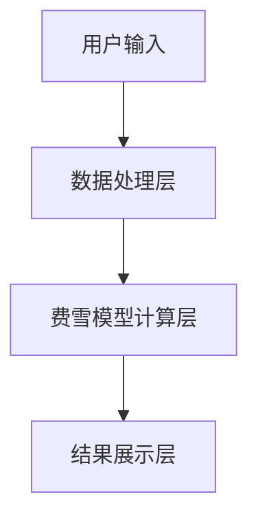
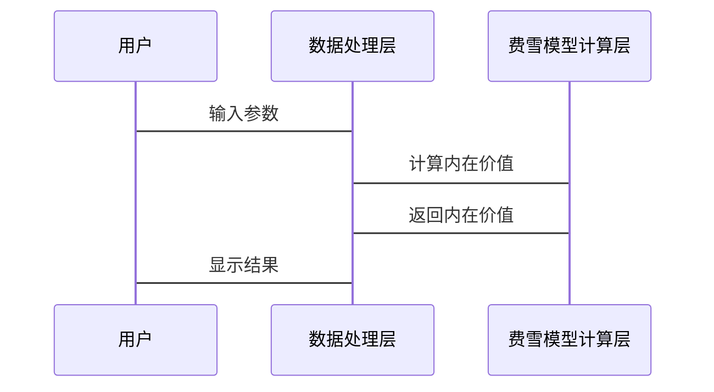

                 


# 费雪的长期增长潜力评估

## 关键词：
费雪模型, 长期增长潜力, 投资评估, 股票估值, 财务分析

## 摘要：
费雪的长期增长潜力评估是一种用于衡量企业未来增长能力的财务模型，它通过分析企业的财务指标和市场环境，预测其股票的内在价值。本文将详细探讨费雪模型的核心概念、数学原理、算法实现、系统架构以及实际应用案例，帮助读者全面理解如何利用该模型进行投资决策。

---

## 第一部分：费雪的长期增长潜力评估概述

### 第1章：长期增长潜力评估的重要性

#### 1.1 问题背景与定义
##### 1.1.1 长期增长潜力评估的背景
在现代投资学中，评估企业的长期增长潜力是投资者做出明智决策的关键。传统的估值方法 often fail to account for the dynamic nature of growth, especially in industries where innovation and market expansion play a crucial role.

##### 1.1.2 费雪模型的基本概念
费雪模型（Fisher's Model）是一种基于企业未来收益增长的估值方法，它假设企业的收益将以一个稳定的增长率增长，并且这个增长率是可持续的。模型的核心在于将企业的未来现金流折现到现值，从而确定其内在价值。

##### 1.1.3 评估长期增长潜力的意义
通过评估企业的长期增长潜力，投资者可以更好地识别那些具有持续竞争优势和增长能力的企业，从而做出更明智的投资决策。

#### 1.2 费雪模型与其他增长模型的对比
##### 1.2.1 常见增长模型概述
- **复利增长模型**：假设收益以固定速率增长，适用于短期估值。
- **线性增长模型**：假设收益以固定增量增长，适用于周期性行业。
- **对数增长模型**：假设收益增长速度逐渐减缓，适用于成熟行业。

##### 1.2.2 费雪模型的独特性
- **动态性**：考虑了企业收益的持续增长，而非静态评估。
- **预测准确性**：通过引入增长率和折现率，提高了估值的准确性。
- **适用性**：适用于处于成长期的企业，尤其是那些具有强大竞争优势的企业。

#### 1.3 费雪模型在企业中的应用
##### 1.3.1 企业增长潜力的评估维度
- **财务指标分析**：如净利润增长率、ROE等。
- **市场潜力评估**：如市场规模、市场增长率等。
- **竞争优势分析**：如品牌优势、技术壁垒等。

##### 1.3.2 费雪模型在企业估值中的应用
- **模型的输入参数**：当前收益、预期增长率、折现率。
- **模型的输出结果**：企业股票的内在价值。
- **模型的实际案例分析**：通过具体案例展示模型的应用过程。

---

## 第二部分：费雪模型的核心算法与数学原理

### 第2章：费雪模型的数学推导

#### 2.1 模型的基本假设
- **收益增长率（g）**：假设企业收益将以固定速率增长。
- **折现率（k）**：用于将未来现金流折现到现值的利率。
- **当前收益（E1）**：企业在当前时期的收益。

#### 2.2 模型的数学公式
##### 2.2.1 费雪模型的基本公式
$$ P = \frac{E_1}{k - g} $$
其中，\( P \) 是股票的内在价值，\( E_1 \) 是当前收益，\( k \) 是折现率，\( g \) 是收益增长率。

##### 2.2.2 模型的扩展公式
$$ P = \frac{E_1}{k - g} + \frac{E_2}{(k - g)(1 + g)} + \cdots $$
其中，\( E_2 \) 是未来收益。

#### 2.3 模型的参数解释
- **k**：代表市场的预期回报率，通常基于无风险利率和市场风险溢价。
- **g**：代表企业收益的预期增长率，通常基于历史增长率和行业前景。
- **E**：代表企业的当前收益，通常基于最近的财务报表。

### 第3章：费雪模型的算法实现

#### 3.1 模型的输入参数
##### 3.1.1 当前收益
- 企业最近一个财年的净利润。
##### 3.1.2 预期增长率
- 基于历史增长率和行业前景预测的未来增长率。
##### 3.1.3 折现率
- 无风险利率加市场风险溢价。

#### 3.2 模型的实现步骤
##### 3.2.1 计算内在价值
- 使用费雪模型的基本公式计算股票的内在价值。
##### 3.2.2 计算每股价值
- 将内在价值除以总股本，得到每股价值。
##### 3.2.3 比较市场价与内在价值
- 如果市场价格低于内在价值，企业可能被低估。

#### 3.3 模型的代码实现
##### 3.3.1 Python代码实现
```python
def fisher_model(current_earnings, growth_rate, discount_rate):
    # 计算内在价值
    intrinsic_value = current_earnings / (discount_rate - growth_rate)
    return intrinsic_value

# 示例计算
current_earnings = 100  # 当前收益
growth_rate = 0.05       # 收益增长率
discount_rate = 0.10     # 折现率

intrinsic_value = fisher_model(current_earnings, growth_rate, discount_rate)
print(f"股票的内在价值为：{intrinsic_value}")
```

---

## 第三部分：费雪模型的系统架构与设计

### 第4章：系统架构设计

#### 4.1 系统功能设计
##### 4.1.1 领域模型


##### 4.1.2 系统架构


#### 4.2 系统接口设计
##### 4.2.1 输入接口
- 用户输入当前收益、收益增长率和折现率。
##### 4.2.2 输出接口
- 展示股票的内在价值和市场价格比较结果。

#### 4.3 系统交互设计


---

## 第四部分：项目实战

### 第5章：项目实战与案例分析

#### 5.1 环境安装
- **Python环境**：安装Python 3.x。
- **库的安装**：安装必要的库，如pandas、numpy、matplotlib。

#### 5.2 核心代码实现
##### 5.2.1 数据处理
```python
import pandas as pd

# 示例数据
data = {
    '股票名称': ['A', 'B', 'C'],
    '当前收益': [100, 150, 200],
    '收益增长率': [0.05, 0.07, 0.03],
    '折现率': [0.10, 0.12, 0.08]
}

df = pd.DataFrame(data)
```

##### 5.2.2 模型实现
```python
def calculate_intrinsic_value(row):
    current_earnings = row['当前收益']
    growth_rate = row['收益增长率']
    discount_rate = row['折现率']
    return current_earnings / (discount_rate - growth_rate)

# 应用模型
df['内在价值'] = df.apply(calculate_intrinsic_value, axis=1)
print(df)
```

##### 5.2.3 结果分析
- 对比市场价格与内在价值，识别被低估的股票。

#### 5.3 案例分析
##### 5.3.1 案例背景
选择一个具体企业，如科技公司，分析其长期增长潜力。
##### 5.3.2 数据分析
基于企业财务数据和市场数据，计算其内在价值。
##### 5.3.3 结果展示
通过图表展示计算结果，帮助投资者做出决策。

---

## 第五部分：总结与展望

### 第6章：总结与展望

#### 6.1 最佳实践 tips
- **数据质量**：确保输入数据的准确性和完整性。
- **模型假设**：在实际应用中，需要对模型的假设进行验证和调整。
- **动态调整**：定期更新模型参数，以反映市场变化。

#### 6.2 小结
费雪的长期增长潜力评估是一种强大的工具，能够帮助投资者识别具有长期增长潜力的企业。通过本文的详细讲解，读者可以掌握该模型的核心原理和实际应用方法。

#### 6.3 注意事项
- 模型的假设可能与实际情况不符，需结合其他因素进行综合分析。
- 长期增长潜力评估应与其他估值方法结合使用，以提高准确性。

#### 6.4 拓展阅读
- **《投资学基础》**：深入理解财务分析的基本原理。
- **《费雪投资哲学》**：学习费雪的投资理念和方法。

---

通过以上目录结构，读者可以系统地学习和应用费雪的长期增长潜力评估模型，从而在投资决策中做出更明智的选择。

