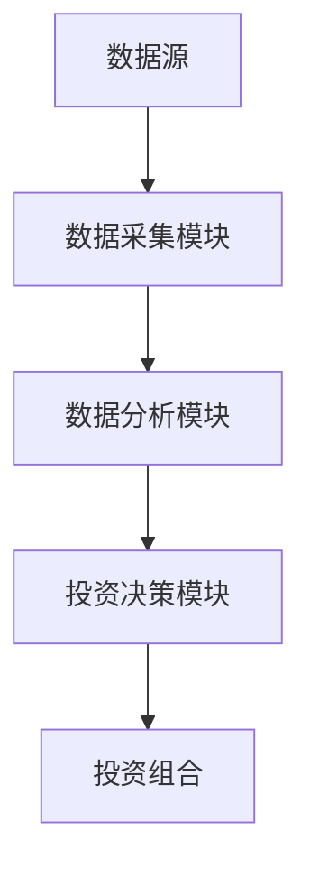

                 


# 费雪的长期持股策略

## 关键词：费雪, 长期持股, 投资策略, 股票分析, 价值投资

## 摘要：费雪的长期持股策略是一种以价值投资为核心的投资方法，强调长期持有优质股票，注重公司基本面分析。本文将从策略背景、核心概念、数学模型、系统架构、项目实战以及最佳实践等方面，详细分析这一策略的原理和应用。

---

## 第一部分: 长期持股策略的背景与核心概念

### 第1章: 长期持股策略的起源与发展

#### 1.1 长期持股策略的起源
- **1.1.1 投资学派的演变**  
  投资学说从早期的“随机漫步理论”逐渐发展出“价值投资”、“技术分析”等流派，而费雪的长期持股策略正是价值投资的重要组成部分。

- **1.1.2 费雪投资理念的形成**  
  费雪在20世纪初提出，真正的投资回报来自企业的成长，而非市场的波动。他主张投资者应选择那些具有持续盈利能力的公司。

- **1.1.3 长期投资的核心思想**  
  长期持股策略强调买入并持有优质股票，通过公司成长获得收益，而非通过频繁交易获利。

#### 1.2 费雪的投资理念
- **1.2.1 长期投资原则**  
  费雪提出，投资者应关注企业的内在价值，而非市场的短期波动。

- **1.2.2 优质公司的定义**  
  优质公司具有持续的盈利能力、健康的财务状况和优秀的管理层。

- **1.2.3 费雪与巴菲特的对比**  
  费雪与巴菲特都倡导价值投资，但费雪更注重企业的成长性，而巴菲特则更关注企业的安全边际。

#### 1.3 长期投资的优缺点
- **优点**：风险较低、复利效应显著、交易成本减少。
- **缺点**：需要较强的风险承受能力、市场波动可能影响短期表现。

---

### 第2章: 长期持股策略的核心概念

#### 2.1 长期投资的定义与特征
- **定义**：长期投资是指投资者买入股票后持有数年，通过企业的成长获得收益。
- **特征**：注重基本面分析、低交易频率、高持股集中度。

#### 2.2 长期投资的关键要素
- **公司质量评估**：包括盈利能力、成长性、财务健康状况等。
- **财务健康状况**：关注资产负债表、利润表和现金流量表。
- **管理层能力**：优秀的管理层能够带领企业持续增长。

#### 2.3 长期投资的决策流程
- **目标设定**：明确投资目标和风险承受能力。
- **股票筛选**：根据基本面指标筛选出优质股票。
- **投资组合构建**：分散投资以降低风险。

---

## 第二部分: 长期持股策略的数学模型与算法

### 第3章: 长期投资的数学模型

#### 3.1 股票价值评估公式
股票的内在价值可以用以下公式计算：
$$ V = \text{市盈率} \times \text{每股收益} $$

#### 3.2 投资回报率计算
投资回报率（ROI）公式：
$$ ROI = \frac{\text{净利润}}{\text{初始投资}} \times 100\% $$

#### 3.3 风险评估模型
使用夏普比率衡量投资风险：
$$ \text{夏普比率} = \frac{R_p - R_f}{\sigma_p} $$

### 第4章: 长期投资算法的实现

#### 4.1 股票筛选算法
```python
def fisher_stock_screening(stocks):
    selected_stocks = []
    for stock in stocks:
        if stock.roe > 0.1 and stock.debt_ratio < 0.5:
            selected_stocks.append(stock)
    return selected_stocks
```

#### 4.2 投资组合优化算法
```python
def optimize_portfolio(stocks):
    from scipy.optimize import minimize
    import numpy as np

    returns = np.array([stock.return for stock in stocks])
    n = len(returns)
    constraints = [{'type': 'eq', 'fun': lambda x: np.sum(x) - 1}]
    result = minimize(lambda x: -np.sum(returns * x), np.ones(n)/n, constraints)
    return result.x
```

---

## 第三部分: 长期持股策略的系统架构设计

### 第5章: 系统架构设计

#### 5.1 数据采集模块
- 从金融数据源获取股票信息。
- 数据清洗与预处理。

#### 5.2 数据分析模块
- 计算基本面指标（如ROE、债务率）。
- 应用算法筛选优质股票。

#### 5.3 投资决策模块
- 根据筛选结果生成投资组合。
- 定期复盘与调整。

#### 5.4 系统架构图


---

## 第四部分: 长期持股策略的项目实战

### 第6章: 项目实战

#### 6.1 环境搭建
- 安装Python、Pandas、NumPy等工具。
- 获取金融数据源（如Yahoo Finance）。

#### 6.2 核心代码实现
```python
import pandas as pd
import numpy as np

def fisher_screening(df):
    df = df[df['ROE'] > 0.1]
    df = df[df['Debt Ratio'] < 0.5]
    return df

# 示例数据
data = {
    'Stock': ['A', 'B', 'C', 'D'],
    'ROE': [0.12, 0.08, 0.15, 0.09],
    'Debt Ratio': [0.4, 0.6, 0.3, 0.5]
}
df = pd.DataFrame(data)
selected = fisher_screening(df)
print(selected)
```

#### 6.3 实际案例分析
- 选择优质股票，构建投资组合。
- 定期跟踪股票表现，调整投资策略。

---

## 第五部分: 长期持股策略的最佳实践与注意事项

### 第7章: 最佳实践

#### 7.1 投资注意事项
- 定期复盘，评估投资组合表现。
- 保持分散投资，降低风险。

#### 7.2 小结
费雪的长期持股策略是一种有效的投资方法，但需要结合市场环境和个人情况灵活运用。

#### 7.3 拓展阅读
- 《股市长盛不衰》——菲利普·费雪
- 《投资的艺术》——本杰明·格雷厄姆

---

通过以上内容，我们详细探讨了费雪的长期持股策略，从理论到实践，为投资者提供了全面的指导。希望读者能够通过本文，更好地理解和应用这一策略，实现长期稳健的投资回报。

