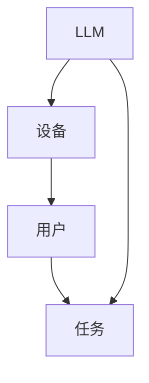
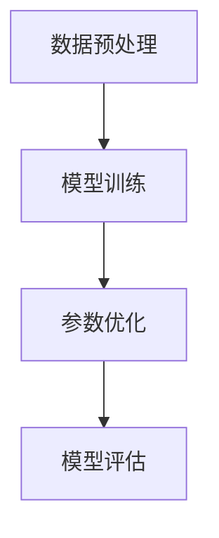
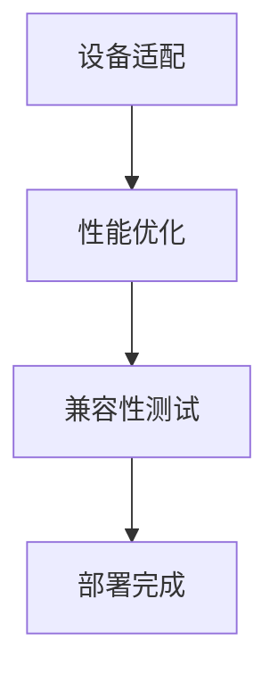
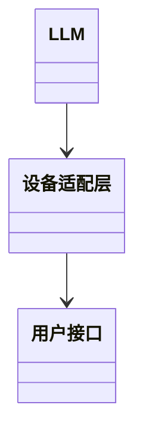
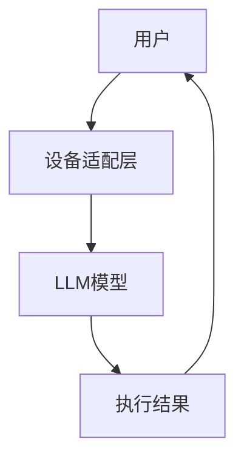
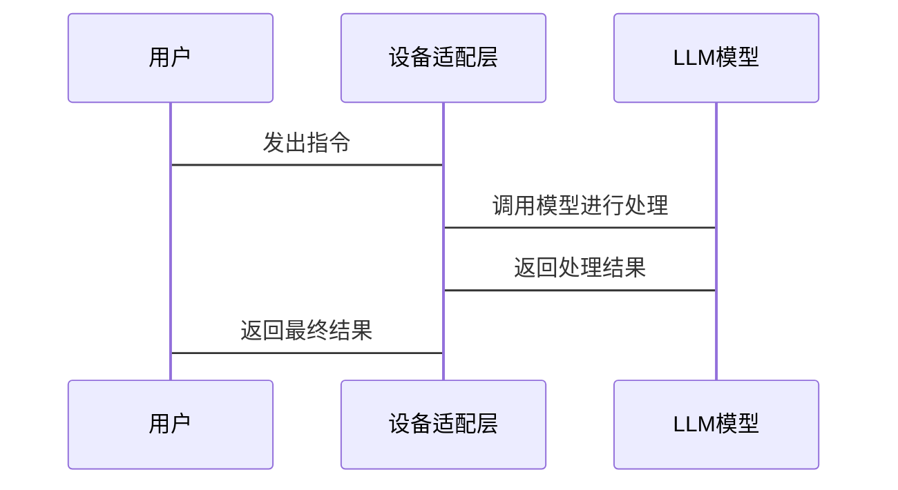

                 


# 跨平台 AI Agent：LLM 在多种终端设备上的部署

## 关键词
- 跨平台 AI Agent
- LLM 部署
- 多终端设备
- 跨平台技术
- AI 代理系统
- 机器学习模型

## 摘要
本文探讨了在多种终端设备上部署大型语言模型（LLM）以实现跨平台AI代理的挑战和解决方案。通过详细分析LLM的工作原理、跨平台部署的技术难点以及系统架构设计，本文为读者提供了从理论到实践的全面指导，帮助他们在不同设备上高效部署和优化LLM，以实现智能化的AI代理服务。

---

# 第一部分: 跨平台 AI Agent 背景与核心概念

## 第1章: 跨平台 AI Agent 问题背景

### 1.1 问题背景
#### 1.1.1 AI Agent 的定义与特点
AI Agent（人工智能代理）是一种能够感知环境、执行任务并提供智能服务的软件实体。它具有以下特点：
- **自主性**：能够在没有外部干预的情况下独立运作。
- **反应性**：能够实时感知环境并做出响应。
- **目标导向**：通过设定目标来指导行为和决策。
- **可扩展性**：能够适应不同的任务和环境。

#### 1.1.2 跨平台部署的必要性
随着智能设备的多样化，用户希望AI Agent能够在手机、平板、电脑、智能家居等多种设备上无缝运行。跨平台部署能够满足用户在不同场景下的需求，提升用户体验。

#### 1.1.3 当前技术现状与挑战
尽管LLM技术取得了显著进展，但其在不同终端设备上的部署面临以下挑战：
- **计算资源限制**：移动设备等低性能设备难以支持复杂的LLM推理。
- **兼容性问题**：不同设备的操作系统和硬件架构差异较大，导致LLM的适配难度增加。
- **网络依赖**：部分设备可能无法连接互联网，需要本地部署和运行。

### 1.2 问题描述
#### 1.2.1 LLM 在不同终端设备上的适配问题
LLM的模型大小和计算需求差异较大，导致其在不同设备上的表现不一致。例如，手机端可能需要轻量级模型，而云端则可以支持更大模型。

#### 1.2.2 跨平台部署的技术难点
跨平台部署需要解决以下问题：
- **模型适配**：不同设备的硬件和软件环境差异，需要对模型进行调整和优化。
- **性能优化**：在低性能设备上实现高效的推理。
- **兼容性测试**：确保LLM在各种设备上都能稳定运行。

#### 1.2.3 用户需求与应用场景分析
用户对跨平台AI Agent的需求主要体现在以下几个方面：
- **多设备协同**：用户希望在不同设备间无缝切换，享受一致的智能服务。
- **本地化服务**：部分场景下，用户需要在无网络环境下使用AI代理。
- **个性化体验**：用户希望AI代理能够根据设备特点提供定制化服务。

### 1.3 问题解决
#### 1.3.1 跨平台技术的解决方案
- **多平台支持框架**：使用跨平台开发框架（如React Native、Flutter）来实现AI Agent的多端部署。
- **模型适配策略**：针对不同设备选择合适的模型版本，例如在手机端使用轻量级模型，云端使用大模型。

#### 1.3.2 LLM 部署的优化策略
- **模型压缩与量化**：通过模型压缩和量化技术减少模型体积，提升推理效率。
- **并行计算优化**：利用多核处理器和GPU加速推理过程。

#### 1.3.3 标准化与兼容性问题的应对
- **制定统一接口标准**：确保不同设备和平台之间的兼容性。
- **建立测试规范**：制定统一的测试标准，确保跨平台部署的稳定性。

### 1.4 边界与外延
#### 1.4.1 跨平台 AI Agent 的边界
- **设备类型**：支持的设备类型，如手机、电脑、智能家居等。
- **功能范围**：AI Agent能够执行的任务类型，如自然语言处理、图像识别等。
- **性能限制**：设备的硬件和软件性能对AI Agent功能的影响。

#### 1.4.2 相关技术的外延
- **边缘计算**：将AI模型部署在靠近数据源的边缘设备上，减少对云端的依赖。
- **联邦学习**：在多设备间进行模型训练，保护数据隐私。

#### 1.4.3 未来发展趋势
- **AI Agent 的智能化提升**：通过强化学习等技术提高AI Agent的自主决策能力。
- **多模态融合**：结合文本、图像、语音等多种模态信息，提升AI Agent的感知能力。

### 1.5 核心概念结构
#### 1.5.1 核心要素组成
- **LLM模型**：实现自然语言理解的核心组件。
- **设备适配层**：确保模型在不同设备上正常运行的适配层。
- **用户接口**：用户与AI Agent交互的界面。

#### 1.5.2 与其他技术的对比
| 技术 | 特点 | 适用场景 |
|------|------|----------|
| LLM  | 高精度自然语言处理 | 文本生成、问答系统 |
| 跨平台技术 | 支持多种设备 | 多设备协同 |
| AI Agent | 自主决策 | 智能助手、自动化任务 |

#### 1.5.3 案例分析
**案例1**：智能音箱中的AI Agent。通过语音交互实现音乐播放、天气查询等功能。
**案例2**：手机端的智能助手。通过自然语言处理实现日程管理、信息检索等功能。

## 第2章: 跨平台 AI Agent 核心概念与联系

### 2.1 核心概念原理
#### 2.1.1 LLM 的基本原理
LLM（Large Language Model）通过大量的文本数据训练，学习语言的语法、语义和上下文关系。其核心是基于概率的生成模型，能够根据输入生成相关文本。

#### 2.1.2 跨平台技术的核心机制
跨平台技术通过统一的接口和框架，将AI Agent部署到不同设备上。设备适配层负责处理不同设备的硬件和软件差异，确保LLM在各设备上都能正常运行。

#### 2.1.3 AI Agent 的工作流程
AI Agent的工作流程包括以下几个步骤：
1. **感知环境**：通过传感器或用户输入获取环境信息。
2. **分析理解**：利用LLM对获取的信息进行理解和分析。
3. **决策制定**：基于分析结果制定行动方案。
4. **执行操作**：通过设备接口执行相应的操作。

### 2.2 核心概念属性特征对比
| 特性 | LLM | 跨平台技术 | AI Agent |
|------|-----|------------|----------|
| 输入 | 文本 | 设备类型   | 用户指令 |
| 输出 | 文本 | 设备响应   | 任务完成 |
| 适应性 | 高度依赖模型训练 | 支持多种设备 | 自主决策 |
| 独特优势 | 高精度自然语言处理 | 多设备支持 | 自主性、目标导向 |

### 2.3 ER 实体关系图


---

## 第三部分: 跨平台 AI Agent 的算法原理

## 第3章: 跨平台 AI Agent 的算法原理

### 3.1 算法原理讲解
#### 3.1.1 LLM 的训练流程


#### 3.1.2 跨平台部署的优化算法


### 3.2 数学模型与公式
#### 3.2.1 概率分布
$$ P(\text{output} | \text{input}) $$

#### 3.2.2 损失函数
$$ \text{Loss} = -\sum_{i=1}^{n} \log P(y_i | x_i) $$

#### 3.2.3 优化算法
$$ \theta_{t+1} = \theta_t - \eta \cdot \nabla_{\theta} \text{Loss} $$`

### 3.3 实际案例分析
#### 3.3.1 案例一：手机端部署
- **环境**：使用手机端的轻量级模型，如GPT-2小模型。
- **优化**：通过模型量化和剪枝减少模型体积，提升推理速度。

#### 3.3.2 案例二：物联网设备部署
- **环境**：在智能家居设备（如智能音箱）上部署AI Agent。
- **优化**：利用边缘计算技术，将模型部署在本地设备上，减少对云端的依赖。

---

## 第四部分: 跨平台 AI Agent 的系统架构设计

## 第4章: 跨平台 AI Agent 的系统架构设计

### 4.1 系统分析
#### 4.1.1 问题场景介绍
系统需要支持多种设备类型，包括手机、平板、电脑和智能家居设备，并能够通过统一的接口与用户交互。

#### 4.1.2 项目介绍
项目目标是实现一个支持多设备的AI Agent系统，能够根据设备类型选择合适的LLM模型，并在设备上高效运行。

### 4.2 系统功能设计
#### 4.2.1 领域模型


#### 4.2.2 系统架构图


#### 4.2.3 系统接口设计
- **输入接口**：接收用户的指令或设备传感器数据。
- **输出接口**：将AI Agent的处理结果返回给用户或设备。

#### 4.2.4 系统交互


### 4.3 系统架构设计
#### 4.3.1 设备适配层
- **功能**：处理不同设备的硬件和软件差异，确保LLM模型在各设备上正常运行。
- **实现**：通过动态加载和配置，适配不同设备的API和资源限制。

#### 4.3.2 LLM模型管理
- **功能**：管理不同版本的LLM模型，根据设备性能选择合适的模型。
- **实现**：使用模型切换机制，动态加载轻量级或高性能模型。

#### 4.3.3 用户接口
- **功能**：提供统一的用户交互界面，支持多种设备的输入输出方式。
- **实现**：设计跨平台的UI框架，适配不同设备的屏幕尺寸和交互习惯。

---

## 第五部分: 跨平台 AI Agent 的项目实战

## 第5章: 跨平台 AI Agent 的项目实战

### 5.1 环境安装
#### 5.1.1 安装依赖
- **Python**：3.8+
- **框架**：TensorFlow、PyTorch
- **其他工具**：Flask（Web框架）、FastAPI（API框架）

### 5.2 系统核心实现源代码
#### 5.2.1 设备适配层实现
```python
def adaptToDevice(device_type):
    if device_type == 'mobile':
        return load_light_model()
    elif device_type == 'desktop':
        return load_full_model()
    else:
        return None
```

#### 5.2.2 LLM模型管理
```python
class ModelManager:
    def __init__(self):
        self.models = {}

    def register_model(self, model_name, model_func):
        self.models[model_name] = model_func

    def get_model(self, model_name):
        return self.models.get(model_name, None)
```

#### 5.2.3 用户接口实现
```python
from flask import Flask, request, jsonify

app = Flask(__name__)

@app.route('/api/infer', methods=['POST'])
def infer():
    data = request.json
    device_type = data['device_type']
    model = ModelManager().get_model(device_type)
    result = model.infer(data['input'])
    return jsonify({'result': result})
```

### 5.3 代码应用解读与分析
- **设备适配层**：根据设备类型加载相应的模型，确保在不同设备上能够正常运行。
- **模型管理**：通过注册和获取模型的方式，实现模型的动态加载和管理。
- **用户接口**：提供统一的API接口，支持不同设备的请求，返回处理结果。

### 5.4 实际案例分析
#### 5.4.1 案例一：手机端部署
- **环境**：安装手机端的轻量级模型，如GPT-2小模型。
- **实现**：通过动态加载机制，确保手机端能够高效运行。

#### 5.4.2 案例二：物联网设备部署
- **环境**：在智能家居设备上部署AI Agent，利用边缘计算技术减少对云端的依赖。
- **实现**：通过设备适配层，确保模型在本地设备上能够顺利运行。

### 5.5 项目小结
通过以上步骤，我们成功实现了跨平台AI Agent的部署，能够在不同设备上无缝运行，并根据设备性能选择合适的模型，提升了系统的整体性能和用户体验。

---

## 第六部分: 跨平台 AI Agent 的最佳实践

## 第6章: 跨平台 AI Agent 的最佳实践

### 6.1 性能优化技巧
- **模型压缩与量化**：通过模型压缩和量化技术减少模型体积，提升推理速度。
- **并行计算**：利用多核处理器和GPU加速推理过程。
- **内存优化**：合理分配内存资源，避免内存泄漏和溢出。

### 6.2 兼容性测试
- **设备覆盖测试**：确保系统在各种设备上都能正常运行。
- **版本兼容性测试**：测试不同版本的设备和系统对AI Agent的支持情况。
- **异常处理**：设计完善的错误处理机制，确保系统在异常情况下能够稳定运行。

### 6.3 安全性考虑
- **数据隐私保护**：确保用户数据的安全性，防止数据泄露。
- **权限管理**：合理分配设备权限，避免越权操作。
- **安全审计**：定期进行安全审计，发现并修复潜在的安全漏洞。

### 6.4 小结
通过以上的最佳实践，可以显著提升跨平台AI Agent的性能、兼容性和安全性，为用户提供更加稳定和安全的智能服务。

---

## 结语

通过本文的详细讲解，我们了解了跨平台AI Agent的部署过程，包括技术背景、核心概念、算法原理、系统架构设计和项目实战等各个方面。希望这些内容能够帮助读者在实际项目中更好地应用这些技术，实现高效、稳定的跨平台AI代理系统。

---

## 扩展阅读

- 《深度学习入门：基于Python的理论与实践》
- 《跨平台开发：从零开始构建高效的应用程序》
- 《自然语言处理实战：基于深度学习的技术与应用》

