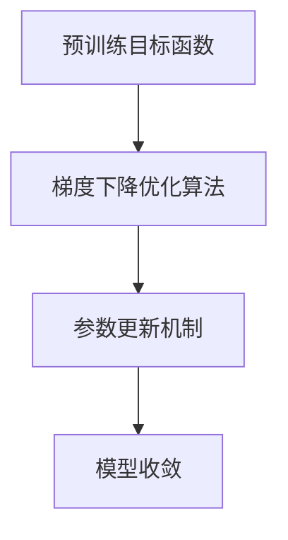
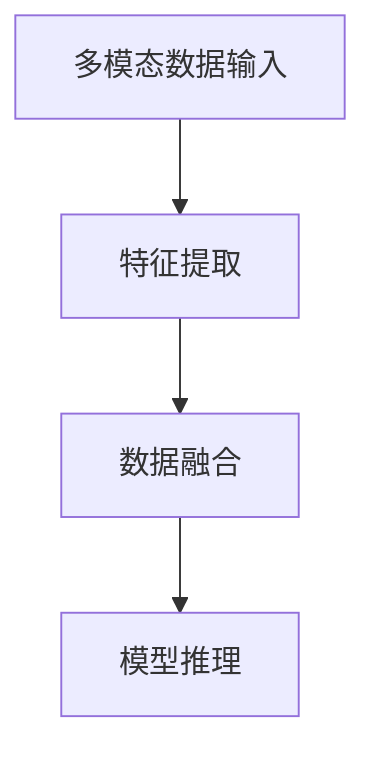
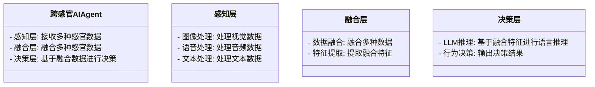
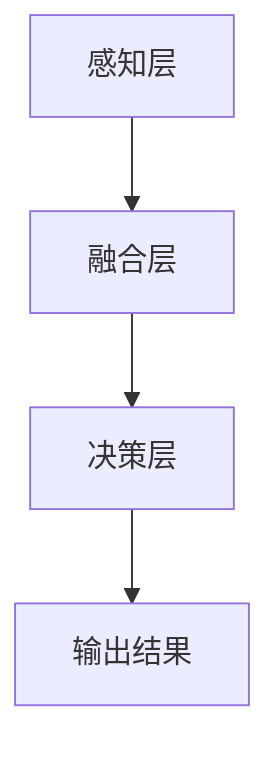
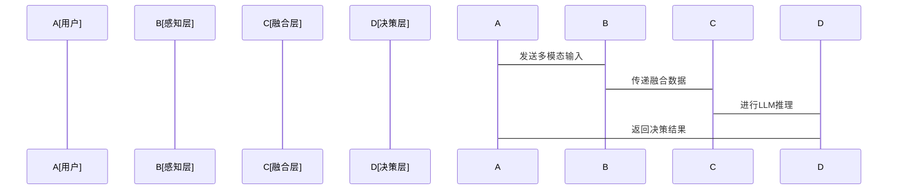

                 


# 跨感官AI Agent：融合LLM与多模态感知输入

## 关键词：跨感官AI Agent，LLM，多模态感知，AI系统架构，感知输入融合，多模态数据处理

## 摘要：  
本文探讨了跨感官AI Agent的融合LLM与多模态感知输入的技术原理与实现。通过背景介绍、核心概念、算法原理、数学模型、系统架构、项目实战和最佳实践等部分，深入分析了跨感官AI Agent的设计与实现过程，展示了如何通过融合LLM与多模态感知输入，构建更智能、更高效的AI系统。

---

## 第一部分：跨感官AI Agent的背景与概念

### 第1章：跨感官AI Agent概述

#### 1.1 问题背景与挑战

- **传统AI的局限性**：传统AI系统通常依赖单一感官输入（如文本或图像），难以处理复杂的跨感官场景。
- **跨感官感知的需求**：现实世界中的任务往往需要结合多种感官信息（如视觉、听觉、触觉等）来完成，单一感官输入的AI系统难以满足需求。
- **LLM与多模态感知的结合**：通过融合大语言模型（LLM）与多模态感知输入，跨感官AI Agent能够更好地理解和处理复杂场景。

#### 1.2 跨感官AI Agent的定义与特点

- **核心概念**：跨感官AI Agent是一种能够同时处理多种感官输入（如文本、图像、语音等）并结合大语言模型进行决策的智能体。
- **多模态感知输入**：支持多种感官数据的输入和融合，能够更全面地感知环境。
- **应用场景**：广泛应用于智能助手、机器人控制、增强现实、自动驾驶等领域。

#### 1.3 跨感官AI Agent的边界与外延

- **边界**：仅关注多种感官输入的融合与处理，不涉及具体的应用场景实现。
- **与传统AI Agent的区别**：传统AI Agent通常依赖单一感官输入，而跨感官AI Agent能够处理多种感官输入。
- **未来发展**：随着多模态感知技术的发展，跨感官AI Agent将更加智能化和多样化。

#### 1.4 本章小结

---

## 第二部分：跨感官AI Agent的核心概念与联系

### 第2章：LLM与多模态感知的融合原理

#### 2.1 LLM的核心原理

- **大语言模型的定义**：LLM是一种基于大规模数据训练的深度学习模型，能够理解和生成人类语言。
- **LLM的训练机制**：通过预训练目标函数和梯度下降优化算法进行模型训练。
- **LLM的推理过程**：通过生成式模型生成文本输出。

#### 2.2 多模态感知输入的原理

- **多模态感知的定义**：支持多种感官数据输入（如图像、语音、文本等）的感知方式。
- **感官输入的处理方式**：通过特征提取和数据融合技术，将多种感官数据转化为可处理的形式。
- **多模态数据融合的挑战**：不同感官数据的异构性和复杂性使得数据融合具有挑战性。

#### 2.3 跨感官AI Agent的核心要素

- **LLM与多模态感知的结合方式**：通过将多模态感知数据输入到LLM中，实现跨感官的决策和输出。
- **跨感官数据流的处理流程**：数据采集、特征提取、数据融合、模型推理。
- **跨感官AI Agent的系统架构**：包括感知层、融合层和决策层。

#### 2.4 核心概念对比表格

| 概念               | LLM特征                   | 多模态感知特征               |
|--------------------|--------------------------|-----------------------------|
| 输入形式           | 文本数据                 | 图像、语音、文本等多种形式    |
| 输出形式           | 文本生成                 | 多模态数据输出               |
| 处理方式           | 语言模型训练             | 多模态数据融合               |
| 优势               | 强大的语言理解能力       | 多种感官数据的综合处理能力   |

#### 2.5 ER实体关系图

```mermaid
erd
  entity 跨感官AI Agent {
    --> LLM: 通过LLM进行语言处理
    --> 多模态感知输入: 接收多种感官数据
  }
  entity LLM {
    --> 文本生成: 生成文本输出
  }
  entity 多模态感知输入 {
    --> 特征提取: 提取感知数据特征
    --> 数据融合: 融合多种感知数据
  }
```

#### 2.6 本章小结

---

## 第三部分：跨感官AI Agent的算法原理

### 第3章：LLM的训练与优化

#### 3.1 大语言模型的训练过程



- **预训练目标函数**：通常使用交叉熵损失函数。
  $$ \text{Loss} = -\sum_{i=1}^{n} \log p(y_i|x_i) $$
- **梯度下降优化算法**：常用Adam优化器。
  $$ \theta_{t+1} = \theta_t - \eta \frac{\partial L}{\partial \theta_t} $$
- **参数更新机制**：通过反向传播计算梯度并更新模型参数。

#### 3.2 多模态数据融合算法



- **多模态特征提取**：通过卷积神经网络（CNN）提取图像特征，通过循环神经网络（RNN）提取文本特征。
- **数据融合**：使用注意力机制或加性融合方法将多种特征融合。
  $$ f_{\text{融合}} = \alpha f_{\text{LLM}} + (1-\alpha) f_{\text{感知}} $$

#### 3.3 算法实现代码

```python
import torch
import torch.nn as nn

class MultiModalFusion(nn.Module):
    def __init__(self, input_size_llm, input_size_perception):
        super().__init__()
        self.fc_llm = nn.Linear(input_size_llm, 128)
        self.fc_perception = nn.Linear(input_size_perception, 128)
        self.attention = nn.MultiheadAttention(128, 1)
    
    def forward(self, x_llm, x_perception):
        x_llm = self.fc_llm(x_llm)
        x_perception = self.fc_perception(x_perception)
        x_fused = x_llm + x_perception
        x_fused = self.attention(x_fused, x_fused, x_fused)[0]
        return x_fused

model = MultiModalFusion(input_size_llm=512, input_size_perception=256)
input_llm = torch.randn(1, 512)
input_perception = torch.randn(1, 256)
output = model(input_llm, input_perception)
print(output.shape)
```

#### 3.4 本章小结

---

## 第四部分：跨感官AI Agent的系统架构与设计

### 第4章：系统功能与架构设计

#### 4.1 系统功能设计

- **领域模型**：定义跨感官AI Agent的功能模块，包括感知层、融合层和决策层。



#### 4.2 系统架构设计

- **系统架构图**：



#### 4.3 系统接口设计

- **输入接口**：支持多种感官数据输入。
- **输出接口**：输出融合后的决策结果。

#### 4.4 系统交互流程



#### 4.5 本章小结

---

## 第五部分：跨感官AI Agent的项目实战

### 第5章：环境安装与核心实现

#### 5.1 环境安装

- 安装必要的库：
  ```bash
  pip install torch transformers mermaid4jupyter
  ```

#### 5.2 核心代码实现

```python
import torch
import torch.nn as nn
import torch.optim as optim

class CrossModalAgent(nn.Module):
    def __init__(self, input_size_llm, input_size_perception):
        super().__init__()
        self.llm_layer = nn.Linear(input_size_llm, 128)
        self.perception_layer = nn.Linear(input_size_perception, 128)
        self.fusion_layer = nn.MultiheadAttention(128, 1)
    
    def forward(self, x_llm, x_perception):
        x_llm = self.llm_layer(x_llm)
        x_perception = self.perception_layer(x_perception)
        x_fused = x_llm + x_perception
        x_fused, _ = self.fusion_layer(x_fused, x_fused, x_fused)
        return x_fused

# 初始化模型和优化器
model = CrossModalAgent(input_size_llm=512, input_size_perception=256)
optimizer = optim.Adam(model.parameters(), lr=0.001)

# 训练循环
for epoch in range(100):
    inputs_llm = torch.randn(1, 512)
    inputs_perception = torch.randn(1, 256)
    optimizer.zero_grad()
    outputs = model(inputs_llm, inputs_perception)
    loss = outputs.mean()  # 示例损失函数
    loss.backward()
    optimizer.step()
```

#### 5.3 代码应用解读与分析

- **输入处理**：将多模态输入分别传递到对应的处理层。
- **融合过程**：通过注意力机制融合多模态特征。
- **训练过程**：通过反向传播更新模型参数。

#### 5.4 实际案例分析

- **案例背景**：假设一个智能助手需要同时处理用户的语音指令和视觉输入。
- **处理流程**：语音输入经过特征提取，视觉输入经过图像处理，融合后通过LLM生成响应。

#### 5.5 本章小结

---

## 第六部分：跨感官AI Agent的最佳实践

### 第6章：总结与展望

#### 6.1 总结

- 跨感官AI Agent通过融合LLM与多模态感知输入，能够更全面地理解和处理复杂场景。
- 通过系统化的设计与实现，跨感官AI Agent在多个领域展现了广阔的应用前景。

#### 6.2 注意事项

- **数据质量**：多模态数据的质量直接影响融合效果。
- **模型训练**：需要大量的数据和计算资源支持。
- **系统设计**：系统架构设计需要充分考虑多模态数据的异构性。

#### 6.3 拓展阅读

- 推荐阅读相关领域的最新论文和技术博客，持续关注多模态AI的发展动态。

#### 6.4 本章小结

---

## 结语

跨感官AI Agent的融合LLM与多模态感知输入是一项前沿技术，通过系统的背景介绍、核心概念、算法原理、数学模型、系统架构、项目实战和最佳实践，本文为读者提供了全面的技术解读。希望本文能够为相关领域的研究和实践提供有价值的参考。

