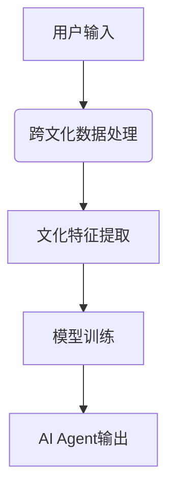

                 


# 跨文化交际AI Agent：提升LLM的文化敏感度

> 关键词：跨文化交际，AI Agent，LLM，文化敏感度，大语言模型，多模态交互

> 摘要：  
在人工智能快速发展的今天，大语言模型（LLM）在跨文化交际中的应用日益广泛。然而，文化差异可能导致LLM在不同文化背景下表现不佳。本文从理论基础、技术实现、系统设计和实战项目等多方面，深入探讨如何提升LLM的文化敏感度，确保AI Agent在跨文化交际中的高效性和准确性。

---

## 第一部分: 跨文化交际与AI Agent的概述

### 第1章: 跨文化交际与AI Agent的概述

#### 1.1 跨文化交际的基本概念

跨文化交际是指不同文化背景的人们之间的交流。由于文化差异，同一信息在不同文化中可能有不同的含义。例如，直接的表达在某些文化中可能被认为是粗鲁的，而在另一些文化中可能被视为坦率。这种差异可能导致误解。

AI Agent在跨文化交际中的角色至关重要。AI Agent需要理解用户的语言、文化背景和意图，以便提供准确的回应。例如，一个医疗咨询的AI Agent需要理解不同文化对健康的不同看法。

AI Agent的特点包括：  
1. **多语言支持**：能够理解和生成多种语言。  
2. **文化适应性**：根据用户的文化背景调整输出内容。  
3. **实时反馈**：根据用户反馈不断优化交互。  

---

### 第2章: 跨文化交际的核心理论

#### 2.1 跨文化交际的理论基础

跨文化交际的理论基础包括文化维度理论和交际能力模型。  

- **霍夫斯泰德文化维度理论**：  
  霍夫斯泰德提出了六个文化维度：权力距离、个人主义 vs. 集体主义、长期导向 vs. 短期导向、性别角色平等、情感约束和绩效导向。这些维度可以帮助AI Agent理解不同文化背景下的行为差异。  

- **跨文化交际能力模型**：  
  包括语言能力、文化知识、交际能力和情感管理能力。AI Agent需要具备这些能力，才能在跨文化交际中有效沟通。  

---

## 第二部分: 提升LLM文化敏感度的技术实现

### 第3章: LLM的基本原理

#### 3.1 大语言模型的结构

大语言模型通常基于Transformer架构，包括编码器和解码器。编码器将输入文本转化为向量表示，解码器根据向量生成输出文本。  

- **注意力机制**：  
  注意力机制帮助模型关注输入中的重要部分，例如在翻译任务中关注关键词。  

- **多层网络结构**：  
  多层网络结构使得模型能够捕捉到复杂的语言模式。  

---

### 第4章: 提升LLM文化敏感度的关键技术

#### 4.1 数据增强技术

数据增强是提升LLM文化敏感度的重要方法。  

- **文化特定数据增强**：  
  在训练数据中加入更多特定文化背景的文本，例如在训练中加入不同国家的新闻报道。  

- **多模态数据融合**：  
  将文本、图像、视频等多种数据类型结合起来，帮助模型更好地理解文化背景。  

- **文化适配优化**：  
  根据不同文化背景的用户反馈，调整模型的输出策略。  

---

### 第5章: 跨文化交际中的伦理问题

#### 5.1 文化偏见的识别与应对

文化偏见可能导致AI Agent在跨文化交际中出现错误。  

- **数据偏见的检测方法**：  
  使用统计方法检测训练数据中的偏见，例如计算不同文化背景下某些关键词的出现频率。  

- **伦理算法的设计**：  
  在模型中加入伦理约束，确保AI Agent在不同文化背景下的回应符合伦理规范。  

---

## 第三部分: 系统架构与设计

### 第6章: 系统架构与设计

#### 6.1 系统模块划分

系统架构包括以下几个模块：  

- **数据预处理模块**：  
  对输入数据进行清洗和标注，例如标注文本的文化背景。  

- **模型训练模块**：  
  使用增强的数据训练模型，调整模型参数以提升文化敏感度。  

- **用户交互模块**：  
  提供多语言支持，根据用户反馈调整输出。  

---

### 6.2 系统架构图



---

## 第四部分: 项目实战

### 第7章: 项目实战

#### 7.1 环境安装与配置

- **安装Python和相关库**：  
  安装Python 3.8以上版本，安装`transformers`、`numpy`、`torch`等库。  

- **数据准备**：  
  收集多语言文本数据，标注文化背景。  

#### 7.2 系统核心实现源代码

以下是一个简单的数据增强代码示例：

```python
import pandas as pd
from sklearn.model_selection import train_test_split
from transformers import AutoTokenizer, AutoModelForMaskedLM

# 加载预训练模型
tokenizer = AutoTokenizer.from_pretrained('bert-base-multilingual-cased')
model = AutoModelForMaskedLM.from_pretrained('bert-base-multilingual-cased')

# 数据增强
def data_augmentation(text):
    inputs = tokenizer(text, return_tensors='np')
    inputs['input_ids'] = inputs['input_ids'].numpy()
    inputs['attention_mask'] = inputs['attention_mask'].numpy()
    # 使用模型生成增强数据
    outputs = model.generate(inputs['input_ids'], attention_mask=inputs['attention_mask'])
    return outputs

# 应用数据增强
text = "Hello, how are you?"
augmented_text = data_augmentation(text)
print(augmented_text)
```

---

### 第8章: 总结与展望

#### 8.1 本书内容回顾

本文从理论到实践，全面探讨了如何提升LLM的文化敏感度。通过数据增强、多模态交互和文化适配优化等技术，AI Agent在跨文化交际中的表现得到了显著提升。

#### 8.2 未来发展方向

未来，跨文化交际AI Agent的发展方向包括：  
1. **多模态交互**：结合视觉、听觉等多模态信息，进一步提升文化理解能力。  
2. **动态文化适配**：根据用户实时反馈动态调整输出策略。  
3. **跨文化知识图谱**：构建跨文化知识图谱，帮助AI Agent更好地理解文化背景。  

---

### 总结

通过本文的探讨，我们可以看到，提升LLM的文化敏感度是一个复杂而重要的任务。它不仅需要技术上的创新，还需要对跨文化交际的深刻理解。随着技术的进步，AI Agent在跨文化交际中的应用将更加广泛和精准。

