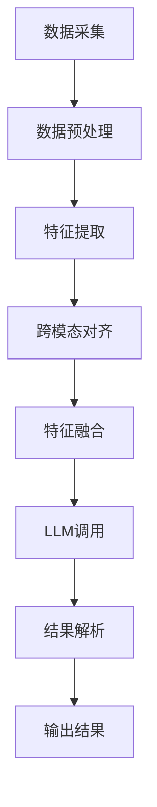

                 


# 跨模态AI Agent：LLM与多种感知输入的融合

---

## 关键词：
跨模态AI Agent, 大语言模型, 多模态数据融合, 注意力机制, 跨模态对齐

---

## 摘要：
本文深入探讨了跨模态AI Agent的原理与实现，重点分析了如何将大语言模型（LLM）与多种感知输入（如图像、音频、视频等）进行融合。文章从理论基础到实际应用，详细介绍了跨模态数据融合的核心算法、系统架构设计以及项目实战。通过具体案例分析，展示了跨模态AI Agent在实际场景中的应用价值，并提供了丰富的代码示例和系统设计图，帮助读者全面理解跨模态AI Agent的设计与实现。

---

## 第一部分: 跨模态AI Agent概述

### 第1章: 跨模态AI Agent的背景与概念

#### 1.1 跨模态AI Agent的背景

- **人工智能与大语言模型的发展**  
  大语言模型（LLM）如GPT-3、GPT-4等的崛起，为自然语言处理（NLP）带来了前所未有的能力。然而，单一的文本输入限制了其应用范围，如何结合其他模态（如视觉、听觉）信息，成为当前研究的热点。

- **跨模态技术的兴起**  
  跨模态技术是指将不同模态的数据（如文本、图像、音频等）进行融合，以提高模型的理解和生成能力。跨模态技术的兴起，源于现实场景中对多感官输入的需求，例如智能音箱需要处理语音和按钮输入，智能摄像头需要结合图像和环境声音。

- **跨模态AI Agent的核心目标**  
  跨模态AI Agent的目标是通过融合多种感知输入，构建一个能够理解并响应多模态信息的智能代理。这种代理可以更自然地与人类交互，适用于智能家居、机器人、自动驾驶等领域。

---

#### 1.2 跨模态AI Agent的核心概念

- **多模态数据的定义与分类**  
  多模态数据是指由多种感知方式获取的数据，常见的模态包括：
  - 文本（Text）
  - 图像（Image）
  - 音频（Audio）
  - 视频（Video）
  - 传感器数据（Sensor data）

  | 模态类型 | 特点 | 应用场景 |
  |----------|------|----------|
  | 文本      | 结构化，易于处理 | NLP任务 |
  | 图像      | 高维，信息丰富 | 计算机视觉 |
  | 音频      | 时间序列，非结构化 | 语音识别 |
  | 视频      | 结合图像和时间信息 | 视频分析 |
  | 传感器数据 | 物理世界的数据 | IoT设备 |

- **跨模态融合的原理与方法**  
  跨模态融合的核心在于将不同模态的数据进行对齐，并通过某种方式将它们结合在一起。常见的融合方法包括：
  1. **特征对齐**：将不同模态的数据映射到同一个特征空间。
  2. **注意力机制**：通过注意力权重，动态地调整不同模态的贡献。
  3. **多模态对齐模型**：例如，利用对比学习将不同模态的数据对齐。

- **跨模态AI Agent的应用场景**  
  跨模态AI Agent可以应用于多个领域：
  - 智能家居：结合语音指令和环境感知。
  - 智能客服：结合文本和用户情感分析。
  - 自动驾驶：结合视觉、雷达和语音指令。

---

#### 1.3 跨模态AI Agent与LLM的关系

- **大语言模型（LLM）的基本特点**  
  LLM具有强大的文本生成和理解能力，但其输入仅限于文本。为了使其能够处理多模态输入，需要将其与感知模块结合。

- **跨模态输入对LLM的增强作用**  
  通过结合其他模态的信息，LLM可以更好地理解上下文，生成更准确的响应。例如，结合图像信息的LLM可以生成更精准的图像描述或相关文本。

- **跨模态AI Agent的系统架构**  
  跨模态AI Agent的系统架构通常包括以下模块：
  - 数据采集模块：负责获取多种模态的数据。
  - 跨模态融合模块：对不同模态的数据进行融合。
  - LLM调用模块：将融合后的数据输入LLM进行处理。
  - 结果解析模块：将LLM的输出进行解析，并生成最终的响应。

---

## 第二部分: 跨模态数据融合的核心原理

### 第2章: 跨模态数据融合的核心原理

#### 2.1 跨模态数据的特征与挑战

- **跨模态数据的特征对比**  
  不同模态的数据具有不同的特征：
  - 文本：离散性高，但信息密度低。
  - 图像：信息密度高，但难以直接与文本对齐。
  - 音频：时间序列数据，具有节奏和语调信息。

- **跨模态数据融合的挑战**  
  - 数据异构性：不同模态的数据具有不同的表示形式。
  - 数据量差异：不同模态的数据量可能相差悬殊。
  - 对齐难度：不同模态的数据需要在语义上对齐。

---

#### 2.2 跨模态数据融合的方法

- **基于特征对齐的融合方法**  
  特征对齐的目标是将不同模态的数据映射到同一个特征空间。例如，可以将图像特征和文本特征对齐到同一个向量空间。

- **基于注意力机制的融合方法**  
  注意力机制可以动态地调整不同模态的权重。例如，在图像-文本融合中，可以根据图像内容调整文本生成的注意力权重。

- **深度学习中的跨模态对齐**  
  深度学习模型（如Transformer）可以通过对比学习实现跨模态对齐。例如，使用对比损失函数将图像和文本对齐到同一个嵌入空间。

---

#### 2.3 跨模态融合的数学模型

- **多模态对齐的数学表达**  
  假设我们有两个模态的数据：$X$ 和 $Y$，我们可以通过以下公式将它们对齐到同一个空间：
  $$
  f(X) = W_X X + b_X
  $$
  $$
  f(Y) = W_Y Y + b_Y
  $$
  其中，$W_X$ 和 $W_Y$ 是对齐矩阵，$b_X$ 和 $b_Y$ 是偏置项。

- **注意力机制的公式推导**  
  注意力权重的计算公式为：
  $$
  \alpha_i = \frac{\exp(s_i)}{\sum_{j} \exp(s_j)}
  $$
  其中，$s_i$ 是第$i$个模态的注意力得分。

---

## 第三部分: 跨模态AI Agent的算法实现

### 第3章: 跨模态AI Agent的算法实现

#### 3.1 跨模态融合的算法流程

- **数据预处理与特征提取**  
  对不同模态的数据进行预处理和特征提取。例如，对于图像数据，可以使用CNN提取图像特征；对于文本数据，可以使用词嵌入（如Word2Vec）提取文本特征。

- **跨模态对齐与融合**  
  将不同模态的特征进行对齐，并通过注意力机制或其他方法进行融合。

- **模型训练与优化**  
  对融合后的数据进行训练，优化模型的参数。

---

#### 3.2 基于LLM的跨模态输入处理

- **LLM的输入格式与接口设计**  
  跨模态输入需要将多种模态的数据编码为LLM可以处理的形式。例如，可以将图像特征编码为文本描述，或者将音频特征编码为时序向量。

- **跨模态输入的预处理方法**  
  预处理方法包括：
  - 图像描述生成：将图像特征转换为文本描述。
  - 音频特征提取：将音频信号转换为时序向量。

- **跨模态输入对LLM的影响**  
  跨模态输入可以显著提高LLM的生成能力和理解能力。例如，结合图像信息的LLM可以生成更精准的图像描述或相关文本。

---

#### 3.3 跨模态AI Agent的算法实现代码

- **数据预处理代码**  
  ```python
  import numpy as np
  from tensorflow.keras.layers import Dense, Input, concatenate
  from tensorflow.keras.models import Model

  # 假设输入为图像特征和文本嵌入
  image_input = Input(shape=(128,))
  text_input = Input(shape=(64,))
  
  # 全连接层
  image_dense = Dense(64, activation='relu')(image_input)
  text_dense = Dense(128, activation='relu')(text_input)
  
  # 融合特征
  combined = concatenate([image_dense, text_dense])
  output = Dense(1, activation='sigmoid')(combined)
  
  model = Model(inputs=[image_input, text_input], outputs=output)
  model.compile(optimizer='adam', loss='binary_crossentropy')
  ```

- **跨模态融合代码**  
  ```python
  import tensorflow as tf
  from tensorflow.keras.layers import Input, Dense, Concatenate
  from tensorflow.keras.models import Model

  # 定义跨模态对齐模块
  def cross_modal_alignment(image_features, text_features):
      # 使用对比损失函数进行对齐
      aligned_image = Dense(64, activation='relu')(image_features)
      aligned_text = Dense(64, activation='relu')(text_features)
      similarity = tf.keras.layers.Dot((1,1), normalize=True)([aligned_image, aligned_text])
      return similarity

  # 融合模块
  image_input = Input(shape=(128,))
  text_input = Input(shape=(64,))
  
  aligned_similarity = cross_modal_alignment(image_input, text_input)
  output = Dense(1, activation='sigmoid')(aligned_similarity)
  
  model = Model(inputs=[image_input, text_input], outputs=output)
  model.compile(optimizer='adam', loss='binary_crossentropy')
  ```

---

## 第四部分: 跨模态AI Agent的系统架构设计

### 第4章: 跨模态AI Agent的系统架构设计

#### 4.1 系统功能模块划分

- **数据采集与预处理模块**  
  负责获取多种模态的数据，并进行预处理和特征提取。

- **跨模态融合模块**  
  负责将不同模态的特征进行对齐和融合。

- **LLM调用与结果解析模块**  
  调用大语言模型处理融合后的数据，并对结果进行解析。

---

#### 4.2 系统架构设计

- **分层架构设计**  
  系统采用分层架构，包括数据层、融合层和LLM层。

- **模块间的接口设计**  
  模块间的接口设计需要考虑数据格式和通信方式。例如，数据层与融合层之间通过特征向量进行交互，融合层与LLM层之间通过处理后的数据进行交互。

- **系统的可扩展性设计**  
  系统设计应具有良好的可扩展性，便于新增模态或优化现有模块。

---

#### 4.3 系统实现的流程图



---

## 第五部分: 跨模态AI Agent的项目实战

### 第5章: 跨模态AI Agent的项目实战

#### 5.1 项目背景与目标

- **项目需求分析**  
  本项目旨在构建一个能够处理多模态输入的AI Agent，用于智能对话系统。

- **项目目标**  
  实现一个多模态对话系统，能够根据用户的声音和图像信息，生成更精准的回复。

---

#### 5.2 项目实战：多模态对话系统

- **环境安装**  
  - 安装必要的库：`tensorflow`, `numpy`, `scikit-learn`, `matplotlib`

- **核心代码实现**  
  ```python
  import numpy as np
  from tensorflow.keras.layers import Input, Dense, Concatenate
  from tensorflow.keras.models import Model

  # 定义多模态对话系统的模型
  def build_model(image_shape, text_shape):
      image_input = Input(shape=image_shape)
      text_input = Input(shape=text_shape)
      
      # 特征提取
      image_features = Dense(64, activation='relu')(image_input)
      text_features = Dense(64, activation='relu')(text_input)
      
      # 融合特征
      combined = Concatenate()([image_features, text_features])
      output = Dense(1, activation='sigmoid')(combined)
      
      model = Model(inputs=[image_input, text_input], outputs=output)
      return model

  # 训练模型
  model = build_model((128,), (64,))
  model.compile(optimizer='adam', loss='binary_crossentropy', metrics=['accuracy'])
  model.fit([image_data, text_data], labels, epochs=10, batch_size=32)
  ```

- **代码应用解读与分析**  
  该代码实现了一个简单的多模态对话系统，将图像和文本特征进行融合，并生成最终的输出。

---

## 第六部分: 总结与展望

### 6.1 总结

- 跨模态AI Agent通过融合多种感知输入，显著提升了智能代理的理解和生成能力。
- 本文详细介绍了跨模态数据融合的核心算法、系统架构设计以及项目实战，为读者提供了全面的理论和实践指导。

---

### 6.2 展望

- **未来研究方向**  
  1. 更高效的跨模态对齐方法。
  2. 更强大的多模态生成模型。
  3. 跨模态AI Agent在更多领域的应用。

---

### 6.3 注意事项与最佳实践

- **数据预处理**  
  在实际应用中，需要根据具体场景对数据进行适当的预处理和特征提取。

- **模型调优**  
  跨模态AI Agent的性能依赖于模型的调优，建议尝试不同的超参数和优化方法。

- **隐私与安全**  
  跨模态数据可能包含敏感信息，需要特别注意隐私和安全问题。

---

### 6.4 拓展阅读

- 《Attention Is All You Need》
- 《Cross-Modal Contrastive Learning》
- 《Multimodal Neural Networks》

---

通过本文的详细讲解，读者可以全面理解跨模态AI Agent的设计与实现，并能够将其应用于实际场景中。

