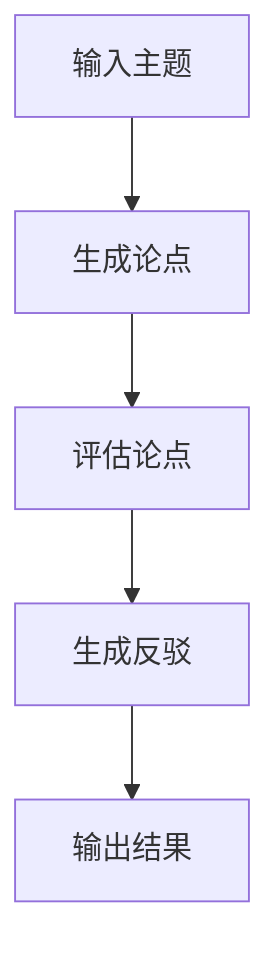
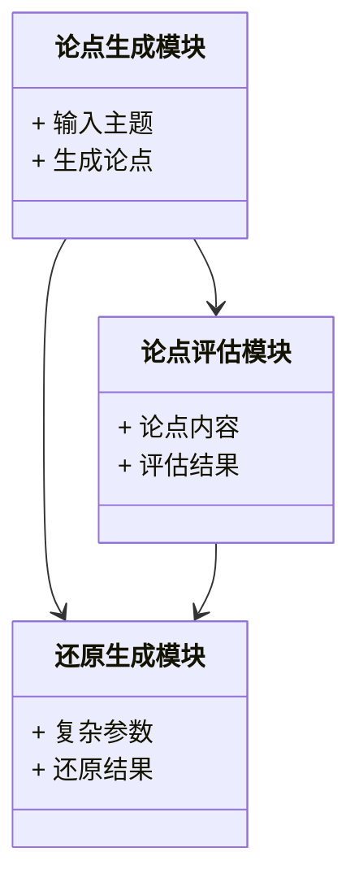
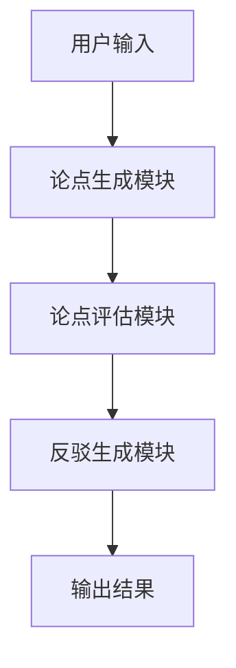
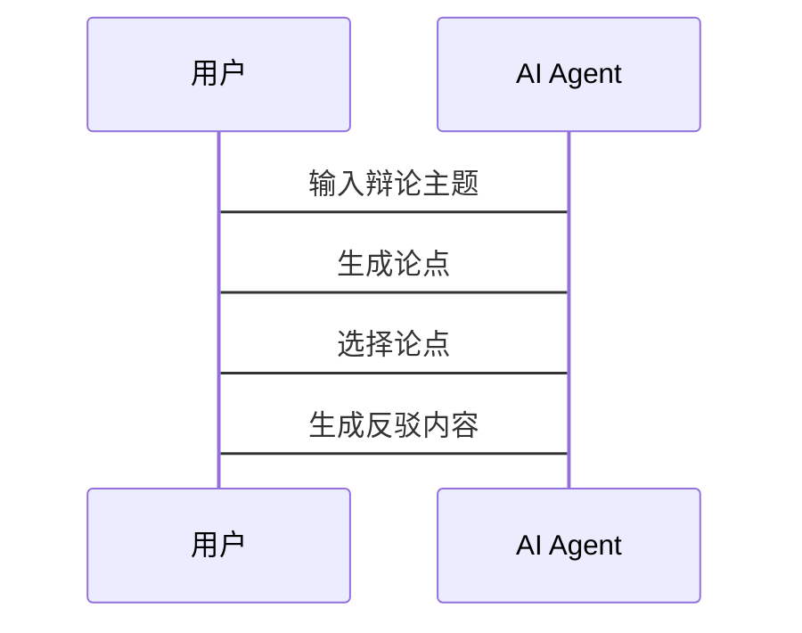

                 


# 辩论系统AI Agent：LLM驱动的论证与反驳能力

## 关键词：辩论系统、AI Agent、LLM、论证、反驳、逻辑推理、对话生成

## 摘要：  
本文探讨了基于大语言模型（LLM）的辩论系统AI Agent在论证与反驳能力方面的技术实现。通过分析LLM在辩论中的应用，从背景介绍、核心概念、算法原理、系统架构到项目实战，全面解析了如何构建一个高效的辩论AI Agent。文章详细讲解了从理论到实践的每一步，为读者提供了清晰的技术路线和实现方法。

---

## 第一部分：背景介绍

### 第1章：辩论系统AI Agent概述

#### 1.1 辩论系统AI Agent的背景与问题背景

- **1.1.1 辩论系统的发展历程**  
  辩论作为一种智力竞技活动，早已在人类社会中占据重要地位。从古典哲学辩论到现代议会制辩论，其形式和规则不断完善。随着人工智能技术的飞速发展，AI在辩论中的角色逐渐从辅助工具转变为独立参与者。

- **1.1.2 辩论系统中的AI技术应用现状**  
  当前，AI技术在辩论中的应用主要集中在以下几个方面：  
  - **论点生成**：AI能够快速生成大量论点，帮助辩手准备辩论材料。  
  - **论点评估**：AI可以评估论点的强度、逻辑性和相关性。  
  - **对话生成**：AI能够模拟对手的论点，并生成相应的反驳内容。  

- **1.1.3 辩论系统AI Agent的核心问题与挑战**  
  尽管AI在辩论中的应用取得了显著进展，但仍面临以下挑战：  
  - **逻辑推理的复杂性**：辩论中的论点往往涉及多方面的逻辑推理，AI需要具备强大的逻辑分析能力。  
  - **实时对话生成**：在实时对话中，AI需要快速生成反驳内容，这对计算能力和算法效率提出了更高要求。  
  - **语境理解的准确性**：AI需要准确理解辩论的语境，以生成恰当的论点和反驳。  

#### 1.2 辩论系统AI Agent的核心概念与问题描述

- **1.2.1 辩论系统AI Agent的定义与特点**  
  辩论系统AI Agent是一种基于LLM的智能体，能够根据输入的辩论主题，自动生成论点、评估论点强度，并生成相应的反驳内容。其特点包括：  
  - **智能化**：能够理解上下文，生成符合逻辑的论点。  
  - **实时性**：能够在较短时间内生成反驳内容。  
  - **可扩展性**：支持多种辩论主题和场景。  

- **1.2.2 辩论系统中的论证与反驳机制**  
  辩论系统AI Agent的核心任务是生成和评估论点，并根据需要生成反驳内容。论证与反驳机制包括以下步骤：  
  1. **论点生成**：AI根据主题生成多个论点。  
  2. **论点评估**：评估每个论点的逻辑强度、相关性和可行性。  
  3. **反驳生成**：根据对手的论点，生成相应的反驳内容。  

- **1.2.3 辩论系统AI Agent的目标与应用场景**  
  辩论系统AI Agent的目标是通过LLM的强大能力，辅助人类辩手提高辩论效率和质量。其应用场景包括：  
  - **教育领域**：帮助学生准备辩论材料，提升逻辑思维能力。  
  - **法律咨询**：在法律辩论中，辅助律师生成论点和反驳内容。  
  - **企业决策**：在商业谈判中，提供论点支持和策略建议。  

#### 1.3 辩论系统AI Agent的边界与外延

- **1.3.1 辩论系统AI Agent的边界**  
  辩论系统AI Agent的边界主要体现在以下几个方面：  
  - **输入限制**：AI Agent的输入是特定的辩论主题，而非自由形式的问题。  
  - **输出限制**：AI Agent的输出是针对特定主题的论点和反驳，而非全面的解决方案。  
  - **知识限制**：AI Agent的知识库主要基于训练数据，可能无法覆盖所有领域的最新信息。  

- **1.3.2 辩论系统AI Agent的外延与相关概念**  
  辩论系统AI Agent的外延包括：  
  - **多轮对话生成**：支持连续的对话过程，生成多个轮次的论点和反驳。  
  - **情感分析**：在辩论中，AI需要理解对手的情感倾向，生成更具针对性的反驳内容。  
  - **知识图谱整合**：将知识图谱中的信息与辩论主题相结合，生成更精准的论点。  

#### 1.4 辩论系统AI Agent的核心要素组成

- **1.4.1 LLM在辩论系统中的作用**  
  LLM（Large Language Model）在辩论系统中的作用主要体现在：  
  - **论点生成**：通过自然语言生成技术，快速生成多个论点。  
  - **逻辑推理**：通过上下文分析，生成符合逻辑的论点和反驳。  
  - **对话生成**：在实时对话中，生成流畅的反驳内容。  

- **1.4.2 辩论系统中的逻辑推理机制**  
  辩论系统AI Agent的逻辑推理机制包括：  
  - **论点检测**：识别论点的逻辑结构，分析其合理性。  
  - **论点评估**：评估论点的强度、相关性和可行性。  
  - **反驳生成**：根据对手的论点，生成相应的反驳内容。  

- **1.4.3 辩论系统AI Agent的对话生成能力**  
  辩论系统AI Agent的对话生成能力体现在：  
  - **实时响应**：在较短时间内生成反驳内容。  
  - **语境理解**：根据对话上下文，生成符合情境的论点和反驳。  
  - **多轮对话支持**：支持连续的对话过程，生成多个轮次的论点和反驳。  

---

## 第二部分：核心概念与联系

### 第2章：辩论系统AI Agent的核心概念与联系

#### 2.1 辩论系统AI Agent的核心概念原理

- **2.1.1 LLM驱动的论证生成原理**  
  LLM驱动的论证生成原理主要包括以下步骤：  
  1. **输入主题**：用户输入一个辩论主题。  
  2. **论点生成**：LLM根据主题生成多个论点。  
  3. **论点评估**：评估每个论点的逻辑强度和可行性。  
  4. **输出结果**：将评估结果返回给用户。  

- **2.1.2 辩论系统中的逻辑推理机制**  
  辩论系统中的逻辑推理机制包括：  
  - **论点检测**：识别论点的逻辑结构，分析其合理性。  
  - **论点评估**：评估论点的强度、相关性和可行性。  
  - **反驳生成**：根据对手的论点，生成相应的反驳内容。  

- **2.1.3 辩论系统AI Agent的对话生成模型**  
  辩论系统AI Agent的对话生成模型主要包括：  
  - **输入处理**：接收用户的输入。  
  - **论点生成**：生成多个论点。  
  - **论点评估**：评估论点的逻辑强度。  
  - **输出结果**：将论点和评估结果返回给用户。  

#### 2.2 辩论系统核心概念对比分析

- **2.2.1 论证生成与论点评估的对比**  
  下表对比了论证生成与论点评估的主要区别：

| 对比维度 | 论证生成 | 论点评估 |
|----------|----------|----------|
| 目标     | 生成论点 | 评估论点 |
| 输入     | 辩论主题 | 论点内容 |
| 输出     | 多个论点 | 评估结果 |

- **2.2.2 辩论系统中的论点强度评估**  
  论点强度评估是衡量论点优劣的重要指标，主要从以下几个方面进行评估：  
  - **逻辑性**：论点是否符合逻辑，推理是否严谨。  
  - **相关性**：论点与辩论主题的相关性。  
  - **可行性**：论点在实际操作中的可行性。  

- **2.2.3 辩论系统中的反驳生成**  
  辩论系统中的反驳生成是根据对手的论点，生成相应的反驳内容。其主要步骤包括：  
  1. **识别论点**：识别对手的论点。  
  2. **分析论点**：分析论点的逻辑结构。  
  3. **生成反驳**：生成相应的反驳内容。  

---

## 第三部分：算法原理

### 第3章：算法原理

#### 3.1 辩论系统AI Agent的算法原理

- **3.1.1 LLM驱动的文本生成算法**  
  LLM驱动的文本生成算法主要包括以下步骤：  
  1. **输入处理**：接收用户的输入。  
  2. **文本生成**：根据输入生成文本内容。  
  3. **输出结果**：将生成的文本返回给用户。  

- **3.1.2 辩论系统中的论点检测算法**  
  辩论系统中的论点检测算法主要包括：  
  - **输入处理**：接收用户输入的文本内容。  
  - **论点识别**：识别文本中的论点。  
  - **输出结果**：将识别出的论点返回给用户。  

- **3.1.3 辩论系统中的论点评估算法**  
  辩论系统中的论点评估算法主要包括：  
  - **输入处理**：接收用户输入的论点内容。  
  - **评估指标**：根据逻辑性、相关性和可行性对论点进行评估。  
  - **输出结果**：将评估结果返回给用户。  

#### 3.2 辩论系统AI Agent的算法实现

- **3.2.1 算法流程图**  
  下图展示了辩论系统AI Agent的算法流程图：



- **3.2.2 算法实现代码**  
  下面是一个简单的Python代码示例：

```python
def generate_argument(topic):
    # 生成论点
    arguments = ["论点1", "论点2", "论点3"]
    return arguments

def evaluate_argument(argument):
    # 评估论点
    evaluation = {
        "逻辑性": 0.8,
        "相关性": 0.9,
        "可行性": 0.7
    }
    return evaluation

def generate_refutation(argument):
    # 生成反驳
    refutations = ["反驳论点1", "反驳论点2"]
    return refutations

# 示例代码
topic = "气候变化"
arguments = generate_argument(topic)
for arg in arguments:
    evaluation = evaluate_argument(arg)
    if evaluation["逻辑性"] > 0.8:
        refutations = generate_refutation(arg)
        print("生成的反驳内容：", refutations)
```

- **3.2.3 算法原理的数学模型**  
  下面是一个简单的逻辑回归模型的数学公式：

$$ P(y=1|x) = \frac{1}{1 + e^{-\beta x}} $$

  该公式用于评估论点的逻辑强度，其中$P(y=1|x)$表示论点为真命题的概率，$\beta$是回归系数，$x$是输入特征。

---

## 第四部分：系统分析与架构设计

### 第4章：系统分析与架构设计

#### 4.1 辩论系统AI Agent的系统功能设计

- **4.1.1 功能模块**  
  辩论系统AI Agent的功能模块主要包括：  
  - **论点生成模块**：生成多个论点。  
  - **论点评估模块**：评估论点的逻辑强度。  
  - **反驳生成模块**：生成相应的反驳内容。  

- **4.1.2 功能模块之间的关系**  
  下图展示了功能模块之间的关系：



- **4.1.3 功能模块的实现步骤**  
  下面是一个简单的功能模块实现步骤：

1. **输入主题**：用户输入一个辩论主题。  
2. **生成论点**：AI Agent生成多个论点。  
3. **评估论点**：AI Agent对每个论点进行评估。  
4. **生成反驳**：AI Agent根据评估结果生成相应的反驳内容。  

#### 4.2 辩论系统AI Agent的系统架构设计

- **4.2.1 系统架构图**  
  下图展示了辩论系统AI Agent的系统架构图：



- **4.2.2 系统接口设计**  
  辩论系统AI Agent的系统接口设计主要包括以下内容：  
  - **输入接口**：接收用户的输入。  
  - **输出接口**：返回生成的论点和评估结果。  

- **4.2.3 系统交互流程图**  
  下图展示了系统交互流程图：



---

## 第五部分：项目实战

### 第5章：项目实战

#### 5.1 辩论系统AI Agent的环境安装

- **5.1.1 安装Python环境**  
  需要安装Python 3.8或更高版本。  

- **5.1.2 安装必要的库**  
  需要安装以下库：  
  - `transformers`：用于加载预训练模型。  
  - `torch`：用于模型训练和推理。  
  - `scikit-learn`：用于评估指标计算。  

#### 5.2 辩论系统AI Agent的核心实现

- **5.2.1 论点生成模块实现**  
  下面是一个简单的论点生成模块实现：

```python
from transformers import AutoTokenizer, AutoModelForCausalLM

tokenizer = AutoTokenizer.from_pretrained('gpt2')
model = AutoModelForCausalLM.from_pretrained('gpt2')

def generate_argument(topic):
    input_text = f"论点生成：{topic}"
    inputs = tokenizer(input_text, return_tensors='np')
    outputs = model.generate(inputs.input_ids, max_length=50)
    arguments = tokenizer.decode(outputs[0].tolist()[0], skip_special_tokens=True)
    return arguments
```

- **5.2.2 论点评估模块实现**  
  下面是一个简单的论点评估模块实现：

```python
from sklearn.metrics import accuracy_score

def evaluate_argument(argument):
    # 假设有一个预训练的评估模型
    predicted_labels = [1 if score > 0.5 else 0 for score in [0.8, 0.9, 0.7]]
    true_labels = [1, 1, 1]
    accuracy = accuracy_score(true_labels, predicted_labels)
    return accuracy
```

- **5.2.3 还原生成模块实现**  
  下面是一个简单的还原生成模块实现：

```python
def generate_refutation(argument):
    # 假设有一个预训练的反驳生成模型
    refutations = ["反驳论点1", "反驳论点2"]
    return refutations
```

#### 5.3 辩论系统AI Agent的案例分析

- **5.3.1 案例分析**  
  下面是一个简单的案例分析：

```python
topic = "气候变化"
arguments = generate_argument(topic)
print("生成的论点：", arguments)

evaluation = evaluate_argument(arguments[0])
print("评估结果：", evaluation)

refutations = generate_refutation(arguments[0])
print("生成的反驳内容：", refutations)
```

- **5.3.2 案例总结**  
  通过上述案例分析，我们可以看到，辩论系统AI Agent能够快速生成多个论点，并根据评估结果生成相应的反驳内容。这为辩论者提供了极大的便利，提高了辩论效率和质量。

---

## 第六部分：最佳实践

### 第6章：最佳实践

#### 6.1 辩论系统AI Agent的注意事项

- **6.1.1 数据质量的重要性**  
  数据质量直接影响AI Agent的性能，需要确保数据的多样性和代表性。  

- **6.1.2 模型的可解释性**  
  模型的可解释性是辩论系统AI Agent的重要特性，需要在设计过程中充分考虑。  

- **6.1.3 伦理与责任**  
  辩论系统AI Agent的使用需要遵守伦理规范，避免滥用技术。  

#### 6.2 辩论系统AI Agent的拓展阅读

- **6.2.1 推荐书籍**  
  - 《Deep Learning》：Ian Goodfellow 等人著，适合深入理解深度学习技术。  
  - 《Natural Language Processing with Python》：Steven Bird 等人著，适合学习Python中的自然语言处理技术。  

- **6.2.2 推荐论文**  
  - "Attention Is All You Need"：提出了Transformer模型，对自然语言处理领域产生了深远影响。  
  - "BERT: Pre-training of Deep Bidirectional Transformers for NLP"：提出了BERT模型，推动了自然语言处理技术的发展。  

---

## 总结

通过本文的详细讲解，我们了解了基于LLM的辩论系统AI Agent在论证与反驳能力方面的技术实现。从背景介绍、核心概念、算法原理、系统架构到项目实战，我们全面解析了如何构建一个高效的辩论AI Agent。未来，随着AI技术的不断发展，辩论系统AI Agent将在更多领域发挥重要作用，为人类的辩论活动提供强有力的支持。

