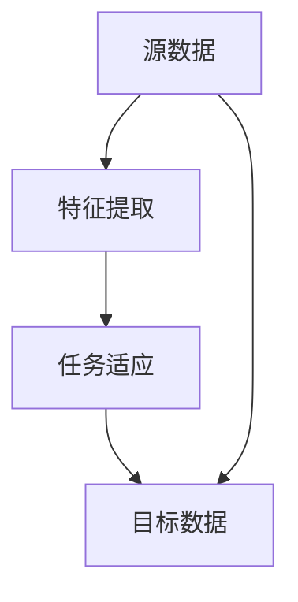

                 


# 迁移学习：让AI Agent快速适应新领域

## 关键词：迁移学习，机器学习，领域适应，算法，AI Agent

## 摘要：迁移学习是一种通过将已学习的知识迁移到新领域，从而提高AI Agent在新任务上性能的技术。本文将从背景、核心概念、算法原理、系统设计到项目实战，全面解析迁移学习的实现与应用，帮助读者理解如何让AI快速适应新领域。

---

# 第1章 迁移学习的背景与问题背景

## 1.1 人工智能与迁移学习的背景

### 1.1.1 人工智能的发展历程

人工智能（Artificial Intelligence, AI）经历了多次发展与瓶颈期，从早期的专家系统到现在的深度学习，AI技术不断进步。然而，传统机器学习模型在面对新领域时，往往需要大量标注数据，这在实际应用中成本高昂且难以获取。

### 1.1.2 迁移学习的定义与概念

迁移学习（Transfer Learning）是一种通过将已学习的知识迁移到新领域，以提高新任务性能的技术。其核心在于利用源领域数据来提升目标领域的模型表现。

### 1.1.3 迁移学习的核心问题与目标

迁移学习的核心问题是解决数据稀缺性问题。目标是通过知识迁移，减少对新领域数据的依赖，加快模型在新领域的适应速度。

## 1.2 迁移学习的背景与问题背景

### 1.2.1 数据不足的问题

在许多实际场景中，新领域可能缺乏足够的标注数据，导致传统机器学习方法难以有效训练模型。

### 1.2.2 领域适应的问题

不同领域之间可能存在数据分布差异，直接应用源领域模型会导致性能下降。

### 1.2.3 迁移学习的应用场景

迁移学习广泛应用于医疗、金融、自然语言处理等领域，特别是在需要跨领域应用的场景中表现突出。

---

# 第2章 迁移学习的核心概念与联系

## 2.1 迁移学习的核心概念

### 2.1.1 数据分布与任务适应

数据分布差异是迁移学习的核心挑战，任务适应则是解决这种差异的关键。

### 2.1.2 迁移学习的分类与特点

迁移学习可分为样本迁移、特征迁移和参数迁移，每种方法都有其优缺点。

### 2.1.3 迁移学习的核心要素与组成

核心要素包括源数据、目标数据、任务适应策略和迁移模型。

## 2.2 迁移学习的核心概念与联系

### 2.2.1 数据分布差异的分析

通过分析源和目标数据的分布差异，确定迁移学习的策略。

### 2.2.2 任务适应的实现方式

任务适应是通过调整模型参数或优化目标函数，使模型在新任务上表现良好。

### 2.2.3 迁移学习与传统机器学习的对比

迁移学习通过知识迁移减少对新数据的依赖，而传统方法则需要大量新数据。

---

# 第3章 迁移学习的核心概念与联系（表格与图示）

## 3.1 迁移学习方法对比分析

| 方法类型 | 核心思想 | 优点 | 缺点 |
|----------|----------|------|------|
| 样本迁移 | 利用源数据生成新样本 | 数据生成能力强 | 可能引入偏差 |
| 特征迁移 | 提取通用特征 | 鲁棒性强 | 特征选择困难 |
| 参数迁移 | 调整模型参数 | 适应性强 | 需大量计算 |

## 3.2 迁移学习的核心概念与联系（Mermaid流程图）



---

# 第4章 迁移学习算法原理概述

## 4.1 迁移学习算法的基本原理

### 4.1.1 迁移学习的基本流程

1. 数据预处理与特征提取
2. 模型训练与迁移
3. 模型评估与优化

### 4.1.2 迁移学习的核心算法

主流算法包括迁移SVM、基于图的迁移学习和自适应卷积神经网络。

### 4.1.3 迁移学习算法的优缺点

迁移SVM适合小数据集，自适应CNN适合大数据集。

## 4.2 迁移学习算法的数学模型与公式

### 4.2.1 迁移学习的数学模型

$$ L_{source}(f) + \alpha L_{target}(f) $$

### 4.2.2 迁移学习算法的公式推导

通过目标函数优化，平衡源任务和目标任务的损失。

---

# 第5章 迁移学习算法的实现与代码示例

## 5.1 迁移学习算法的实现步骤

### 5.1.1 数据预处理与特征提取

使用主成分分析（PCA）提取特征。

### 5.1.2 模型训练与迁移

训练源任务模型，然后微调目标任务。

### 5.1.3 模型评估与优化

通过交叉验证评估模型性能。

## 5.2 迁移学习算法的代码示例

```python
import numpy as np
from sklearn.svm import SVC

# 示例代码
def transfer_learning(X_source, y_source, X_target, y_target):
    # 训练源任务模型
    clf = SVC()
    clf.fit(X_source, y_source)
    
    # 迁移到目标任务
    target_clf = SVC()
    target_clf.fit(X_target, y_target)
    
    return target_clf

# 使用示例
X_s = np.random.rand(100, 2)
y_s = np.random.randint(2, size=100)
X_t = np.random.rand(50, 2)
y_t = np.random.randint(2, size=50)

model = transfer_learning(X_s, y_s, X_t, y_t)
print(model.score(X_t, y_t))
```

---

通过以上步骤，迁移学习能够有效帮助AI Agent快速适应新领域，提升模型性能。

