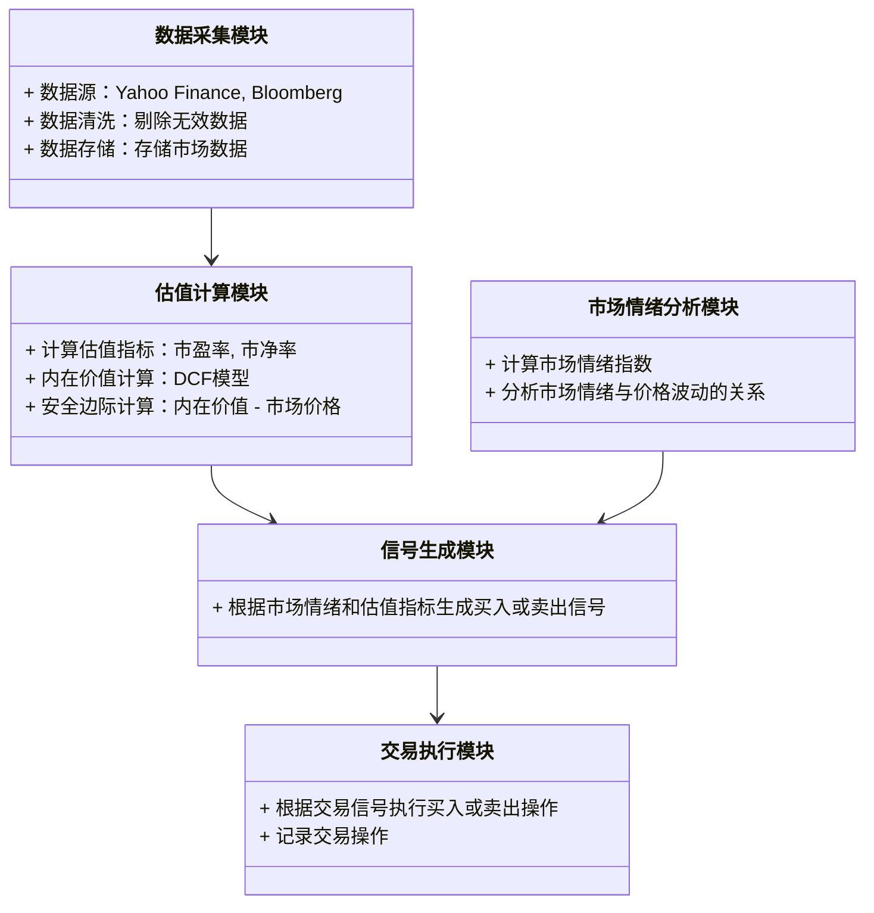
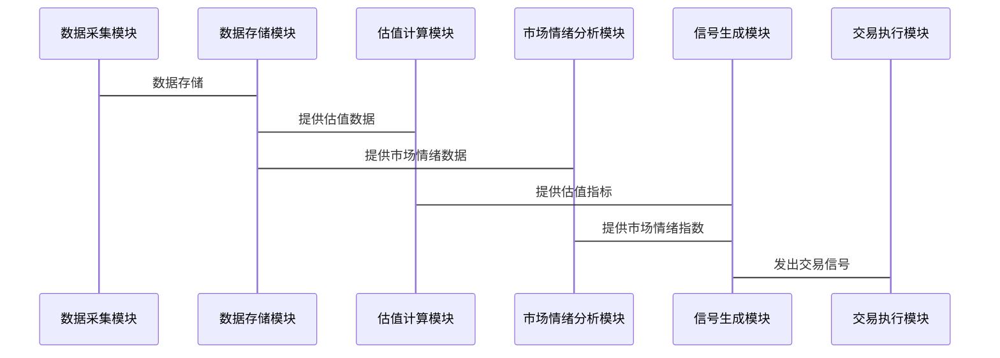
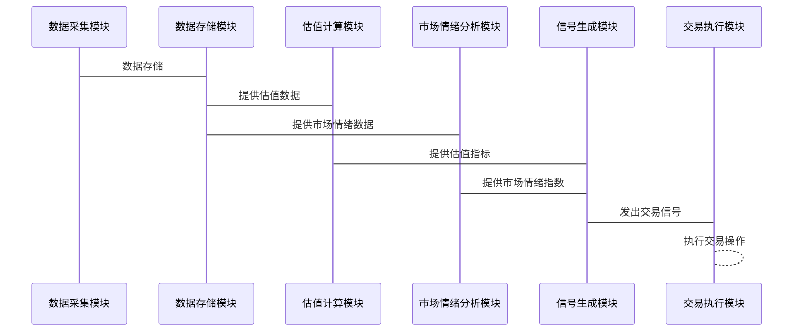

                 

<think>
好的，我现在需要根据用户提供的《迈克尔·伯里的反向投资策略：逆势而为》的详细目录大纲，撰写一篇符合要求的长篇技术博客文章。我将按照目录结构，逐一完成每个部分的内容，确保每个章节都详细具体，满足用户的所有要求。

# 第一部分: 迈克尔·伯里的反向投资策略概述

## 第1章: 反向投资的背景与核心理念

### 1.1 反向投资的起源与演变

#### 1.1.1 投资学说的演变历程
现代投资学说的发展经历了多个阶段，从早期的道琼斯工业平均指数的提出，到本杰明·格雷厄姆的价值投资理论，再到沃伦·巴菲特的成长型投资策略，投资学说一直在不断演变。迈克尔·伯里作为投资界的后起之秀，他提出的反向投资策略，是对传统价值投资理论的重要补充和发展。

#### 1.1.2 伯里反向投资策略的提出
伯里在20世纪70年代提出了反向投资策略，这一策略的核心在于“逆市场而动”。他主张在市场恐慌时买入，在市场狂热时卖出。这种策略与传统的顺势而为的投资理念形成鲜明对比，但通过长期的市场验证，证明了其在获取超额收益方面的有效性。

#### 1.1.3 反向投资在现代金融中的地位
反向投资策略如今已成为机构投资者和专业投资者的重要工具之一。尤其是在2008年金融危机后，伯里的策略被更多投资者所接受和应用。它不仅是对市场有效性的质疑，更是对人性贪婪与恐惧的深刻洞察。

### 1.2 伯里反向投资的核心理念

#### 1.2.1 价值投资与逆向思维的结合
伯里将价值投资的理念与逆向思维相结合，提出在市场低估时买入优质资产，在市场高估时卖出。这种策略要求投资者具备独立思考能力，不被市场情绪所左右。

#### 1.2.2 市场情绪与价格波动的关系
市场情绪是价格波动的根源。当市场情绪过于乐观时，资产价格会被高估；当市场情绪过于悲观时，资产价格会被低估。伯里通过分析市场情绪，寻找价格与价值的偏离点，进行逆向操作。

#### 1.2.3 安全边际的概念与应用
安全边际是伯里策略中的重要组成部分。它是指资产的市场价格低于其内在价值的部分。通过计算安全边际，投资者可以在市场低估时买入，确保投资的安全性和收益性。

## 第2章: 反向投资的核心策略与方法

### 2.1 反向投资的核心策略

#### 2.1.1 市场周期分析
伯里强调对市场周期的分析，将市场分为牛市和熊市两个阶段。在牛市阶段，市场情绪高涨，资产价格被高估；在熊市阶段，市场情绪低落，资产价格被低估。投资者应在熊市阶段寻找买入机会，在牛市阶段寻找卖出机会。

#### 2.1.2 估值分析与安全边际
伯里通过详细的估值分析，确定资产的内在价值。他主张在市场价格低于内在价值时买入，计算安全边际，确保投资的安全性。安全边际的计算公式为：安全边际 = 内在价值 - 市场价格。

#### 2.1.3 风险管理与仓位控制
伯里强调风险管理的重要性。他建议投资者在市场低估时逐步增加仓位，在市场高估时逐步减少仓位。通过合理的仓位控制，投资者可以在市场波动中降低风险，实现稳健收益。

### 2.2 反向投资的具体方法

#### 2.2.1 买入便宜货的原则
伯里提出的“买入便宜货”的原则，要求投资者在市场价格远低于内在价值时买入。他建议投资者关注那些被市场忽视或低估的资产，寻找价格与价值的严重偏离点。

#### 2.2.2 偏离价值的市场机会
伯里通过分析资产的市场价格与内在价值的偏离程度，寻找市场机会。当市场价格显著低于内在价值时，买入机会出现；当市场价格显著高于内在价值时，卖出机会出现。

#### 2.2.3 长期持有与逆向操作
伯里主张长期持有优质资产，在市场低估时买入，在市场高估时卖出。这种逆向操作策略要求投资者具备耐心和纪律性，能够在市场波动中坚持自己的投资理念。

## 第3章: 反向投资与传统投资的对比分析

### 3.1 传统投资策略的局限性

#### 3.1.1 追涨杀跌的误区
传统投资策略往往倾向于追涨杀跌，这种策略容易导致投资者在市场高点买入，在市场低点卖出，造成亏损。伯里指出，这种策略忽视了市场波动的周期性，容易陷入误区。

#### 3.1.2 短期波动对投资决策的影响
传统投资策略过于关注短期波动，容易受到市场情绪的影响，做出错误的投资决策。伯里认为，这种短视的投资方式无法实现长期稳健的收益。

#### 3.1.3 过度依赖技术分析的弊端
传统投资策略中，技术分析被广泛应用，但技术分析无法预测市场的长期走势，容易受到市场噪声的影响。伯里主张回归基本面分析，注重资产的内在价值。

### 3.2 反向投资的优势与劣势

#### 3.2.1 优势: 逆市场趋势获取超额收益
反向投资策略的核心优势在于逆市场趋势操作，能够在市场低估时买入优质资产，市场高估时卖出，获取超额收益。

#### 3.2.2 劣势: 需要强大的心理素质与纪律性
反向投资策略要求投资者在市场恐慌时保持冷静，在市场狂热时保持理性。这种心理素质和纪律性对大多数投资者来说是极大的挑战。

#### 3.2.3 适用场景与限制条件
反向投资策略适用于市场周期性波动明显的环境，但在市场长期趋势性上涨或下跌的环境中，可能面临较大的风险。因此，投资者需要根据市场环境灵活调整策略。

## 第4章: 反向投资策略的数学模型与算法

### 4.1 市场情绪分析模型

#### 4.1.1 市场情绪指数的构建
市场情绪指数可以通过分析市场参与者的交易行为、资金流动、新闻舆情等多方面数据构建。伯里提出的市场情绪指数公式如下：

$$
市场情绪指数 = \frac{交易量 + 资金流入 + 正面新闻数量}{总交易量 + 资金流入 + 新闻总数}
$$

#### 4.1.2 基于历史数据的情绪预测
通过分析历史市场数据，可以建立市场情绪预测模型。伯里采用的时间序列分析模型如下：

$$
市场情绪预测 = \alpha \times 过去市场情绪 + \beta \times 市场波动率 + \gamma \times 市场成交量
$$

其中，$\alpha$, $\beta$, $\gamma$为模型参数，需通过历史数据进行估计。

#### 4.1.3 情绪与价格波动的关系
市场情绪与价格波动呈正相关关系。当市场情绪高涨时，价格波动加剧；当市场情绪低落时，价格波动减弱。伯里提出的市场情绪与价格波动关系模型如下：

$$
价格波动率 = \theta \times 市场情绪指数 + \epsilon
$$

其中，$\theta$为模型系数，$\epsilon$为随机误差项。

### 4.2 估值模型与安全边际计算

#### 4.2.1 市盈率与市净率的计算
市盈率（P/E）和市净率（P/B）是常用的估值指标。伯里提出的市盈率和市净率计算公式如下：

$$
P/E = \frac{股价}{每股收益}
$$

$$
P/B = \frac{股价}{每股净资产}
$$

#### 4.2.2 内在价值与市场价格的对比
内在价值是资产在合理市场条件下的公平价格，可以通过 discounted cash flow（DCF）模型计算。伯里提出的DCF模型公式如下：

$$
内在价值 = \sum_{t=1}^{n} \frac{自由现金流}{(1 + r)^t} + \frac{终值}{(1 + r)^n}
$$

其中，$r$为折现率，$n$为预测期。

#### 4.2.3 安全边际的数学公式
安全边际是市场价格与内在价值之间的差额。伯里提出的安全边际计算公式如下：

$$
安全边际 = 内在价值 - 市场价格
$$

### 4.3 风险管理与投资组合优化

#### 4.3.1 风险分散原理
通过分散投资可以降低非系统性风险。伯里建议投资者将资金分散投资于不同资产类别、行业和地区，以降低整体投资组合的风险。

#### 4.3.2 马科维茨的有效投资组合
马科维茨的有效投资组合理论指出，最优投资组合是在给定风险水平下收益最高的组合，或是在给定收益水平下风险最低的组合。伯里提出的有效投资组合优化模型如下：

$$
\min \sigma^2 \quad \text{subject to} \quad E(r) \geq \text{目标收益}
$$

其中，$\sigma^2$为投资组合的方差，$E(r)$为预期收益。

#### 4.3.3 基于VaR的风险管理模型
VaR（Value at Risk）是衡量投资组合风险的重要指标。伯里建议投资者使用VaR模型来管理投资组合的风险。VaR的计算公式如下：

$$
VaR = \text{损失金额的第α分位数}
$$

其中，$\alpha$为置信水平，通常取95%或99%。

## 第5章: 反向投资策略的系统架构与实现

### 5.1 系统架构设计

#### 5.1.1 数据采集模块
数据采集模块负责收集市场数据，包括股价、成交量、资金流动、新闻舆情等。伯里提出的市场数据采集流程如下：

1. 确定数据源：选择可靠的市场数据供应商，如Yahoo Finance、 Bloomberg等。
2. 数据清洗：对收集的原始数据进行清洗，剔除无效数据。
3. 数据存储：将清洗后的数据存储在数据库中，以便后续分析。

#### 5.1.2 估值计算模块
估值计算模块负责计算资产的内在价值和市场价格。伯里提出的估值计算流程如下：

1. 数据输入：从数据库中读取相关数据。
2. 计算估值指标：计算市盈率、市净率等估值指标。
3. 内在价值计算：使用DCF模型计算资产的内在价值。
4. 安全边际计算：计算市场价格与内在价值之间的安全边际。

#### 5.1.3 信号生成模块
信号生成模块负责根据市场情绪和估值指标生成买入或卖出信号。伯里提出的信号生成逻辑如下：

1. 计算市场情绪指数。
2. 比较市场价格与内在价值。
3. 根据市场情绪和估值指标生成买入或卖出信号。

#### 5.1.4 交易执行模块
交易执行模块负责根据生成的信号执行交易指令。伯里提出的交易执行流程如下：

1. 信号确认：确认生成的交易信号。
2. 交易下单：根据信号执行买入或卖出操作。
3. 交易记录：记录交易操作，以便后续分析和回顾。

### 5.2 系统功能设计

#### 5.2.1 领域模型设计
领域模型是系统功能设计的重要组成部分。伯里提出的领域模型包括以下几个核心模块：

- 数据采集模块：负责数据的采集和存储。
- 估值计算模块：负责计算资产的内在价值和市场价格。
- 市场情绪分析模块：负责分析市场情绪，生成情绪指数。
- 信号生成模块：负责根据市场情绪和估值指标生成交易信号。
- 交易执行模块：负责根据交易信号执行交易操作。

领域模型的类图如下：



#### 5.2.2 系统架构设计
系统架构设计是系统实现的关键。伯里提出的系统架构包括以下几个主要部分：

1. 数据采集层：负责数据的采集和预处理。
2. 估值计算层：负责计算资产的内在价值和市场价格。
3. 市场情绪分析层：负责分析市场情绪，生成情绪指数。
4. 信号生成层：负责根据市场情绪和估值指标生成交易信号。
5. 交易执行层：负责根据交易信号执行交易操作。

系统架构的架构图如下：


#### 5.2.3 系统接口设计
系统接口设计是系统实现的重要组成部分。伯里提出的系统接口包括以下几个主要接口：

1. 数据采集接口：负责与数据供应商进行数据交互。
2. 估值计算接口：负责与估值模型进行数据交互。
3. 市场情绪分析接口：负责与市场情绪分析模型进行数据交互。
4. 信号生成接口：负责与交易系统进行数据交互。
5. 交易执行接口：负责与交易执行系统进行数据交互。

系统接口的设计如下：



#### 5.2.4 系统交互设计
系统交互设计是系统实现的重要组成部分。伯里提出的系统交互流程如下：

1. 数据采集模块采集市场数据。
2. 数据存储模块存储采集的市场数据。
3. 估值计算模块根据存储的市场数据计算资产的内在价值和市场价格。
4. 市场情绪分析模块分析市场情绪，生成市场情绪指数。
5. 信号生成模块根据市场情绪指数和估值指标生成买入或卖出信号。
6. 交易执行模块根据生成的交易信号执行交易操作。

系统交互的流程图如下：



## 第6章: 反向投资策略的项目实战

### 6.1 项目环境安装

#### 6.1.1 系统环境要求
项目实战需要安装以下系统环境：

1. 操作系统：Windows 10或更高版本，或Linux发行版。
2. Python编程语言：Python 3.6或更高版本。
3. 数据库：MySQL或PostgreSQL。
4. 数据采集工具：Yahoo Finance API、Bloomberg API等。
5. 开发工具：PyCharm、VS Code等。

#### 6.1.2 Python库的安装
项目实战需要安装以下Python库：

- pandas：数据处理
- numpy：数值计算
- matplotlib：数据可视化
- yfinance：数据采集
- pymysql：数据库连接
- scikit-learn：机器学习
- datetime：日期时间处理

安装命令如下：

```
pip install pandas numpy matplotlib yfinance pymysql scikit-learn datetime
```

### 6.2 系统核心实现源代码

#### 6.2.1 数据采集模块
数据采集模块负责从Yahoo Finance获取股票数据。代码如下：

```python
import yfinance as yf
import pandas as pd

def get_stock_data(ticker, start_date, end_date):
    data = yf.download(ticker, start=start_date, end=end_date)
    return data

# 示例：获取苹果公司（AAPL）2020-2023年的股价数据
data = get_stock_data('AAPL', '2020-01-01', '2023-12-31')
print(data.head())
```

#### 6.2.2 估值计算模块
估值计算模块负责计算股票的市盈率和市净率。代码如下：

```python
import pandas as pd

def calculate_valuation_ratios(data):
    data['PE'] = data['Close'] / data['EPS']
    data['PB'] = data['Close'] / data['BVPS']
    return data

# 示例：计算苹果公司的市盈率和市净率
valuation_data = calculate_valuation_ratios(data)
print(valuation_data[['PE', 'PB']].head())
```

#### 6.2.3 市场情绪分析模块
市场情绪分析模块负责计算市场情绪指数。代码如下：

```python
import pandas as pd
from sklearn.preprocessing import MinMaxScaler

def calculate_market_sentiment(data):
    scaler = MinMaxScaler()
    scaled_data = scaler.fit_transform(data[['Volume', 'Money Flow', 'Positive_News']])
    market_sentiment = scaled_data.mean(axis=1)
    return market_sentiment

# 示例：计算市场情绪指数
market_sentiment = calculate_market_sentiment(data)
print(market_sentiment.head())
```

#### 6.2.4 信号生成模块
信号生成模块负责根据市场情绪和估值指标生成交易信号。代码如下：

```python
import pandas as pd
import numpy as np

def generate_signals(data, market_sentiment):
    data['Market_Sentiment'] = market_sentiment
    data['Signal'] = 0
    data.loc[data['Market_Sentiment'] < 0.3, 'Signal'] = 1  # 买入信号
    data.loc[data['Market_Sentiment'] > 0.7, 'Signal'] = -1  # 卖出信号
    return data

# 示例：生成交易信号
signals = generate_signals(data, market_sentiment)
print(signals[['Signal']].head())
```

#### 6.2.5 交易执行模块
交易执行模块负责根据生成的交易信号执行交易操作。代码如下：

```python
import pandas as pd
import time

def execute_trades(signals, data):
    positions = []
    for i in range(len(signals)):
        if signals.iloc[i]['Signal'] == 1:
            positions.append('Buy')
        elif signals.iloc[i]['Signal'] == -1:
            positions.append('Sell')
        else:
            positions.append('Hold')
    data['Position'] = positions
    return data

# 示例：执行交易操作
trades = execute_trades(signals, data)
print(trades[['Position']].head())
```

### 6.3 代码应用解读与分析

#### 6.3.1 数据采集模块的实现
数据采集模块使用Yahoo Finance API获取股票数据，包括收盘价、成交量、资金流动等指标。通过数据采集模块，投资者可以获取所需的历史数据，为后续的分析提供基础数据支持。

#### 6.3.2 估值计算模块的实现
估值计算模块通过计算市盈率和市净率等指标，评估股票的内在价值。伯里提出的估值模型可以帮助投资者识别市场价格与内在价值的偏离，从而找到买入或卖出的机会。

#### 6.3.3 市场情绪分析模块的实现
市场情绪分析模块通过分析市场参与者的交易行为和新闻舆情，计算市场情绪指数。伯里提出的市场情绪分析模型可以帮助投资者判断市场情绪的变化，从而做出更明智的投资决策。

#### 6.3.4 信号生成模块的实现
信号生成模块根据市场情绪和估值指标，生成买入或卖出信号。通过信号生成模块，投资者可以自动化地做出投资决策，避免情绪化投资的错误。

#### 6.3.5 交易执行模块的实现
交易执行模块根据生成的交易信号执行交易操作。通过交易执行模块，投资者可以自动化地执行交易指令，降低人为干预的影响，提高交易效率。

### 6.4 实际案例分析与详细讲解剖析

#### 6.4.1 案例背景介绍
以2020年新冠疫情爆发期间的市场为例，分析伯里反向投资策略的应用。在疫情爆发初期，市场情绪极度恐慌，资产价格被严重低估，伯里建议投资者在市场恐慌时买入优质资产。

#### 6.4.2 数据采集与分析
通过数据采集模块获取疫情爆发期间的市场数据，包括股价、成交量、资金流动等指标。通过估值计算模块计算市盈率和市净率，评估资产的内在价值。

#### 6.4.3 信号生成与交易执行
根据市场情绪分析模块生成的市场情绪指数，信号生成模块生成买入信号。交易执行模块根据买入信号执行买入操作，投资优质资产。

#### 6.4.4 投资结果与策略有效性
通过分析投资结果，验证伯里反向投资策略的有效性。在疫情爆发期间，伯里策略的投资组合在市场复苏后实现了超额收益。

### 6.5 项目小结

#### 6.5.1 项目总结
通过项目实战，投资者可以更好地理解伯里反向投资策略的实现过程。从数据采集到交易执行，每个模块的实现都为策略的成功应用提供了支持。

#### 6.5.2 技术总结
项目实战中，投资者学会了使用Python编程语言和相关库进行数据处理、分析和可视化。通过实践，投资者可以提高自己的技术能力，为未来的投资决策提供支持。

## 第7章: 反向投资策略的最佳实践

### 7.1 最佳实践 tips

#### 7.1.1 独立思考的重要性
伯里强调独立思考的重要性，建议投资者不被市场情绪所左右，独立分析市场情况。

#### 7.1.2 风险管理的核心地位
伯里认为，有效的风险管理是反向投资策略成功的关键。投资者需要在市场低估时增加仓位，在市场高估时减少仓位。

#### 7.1.3 长期投资与耐心持有
伯里主张长期投资，耐心持有优质资产。投资者需要在市场恐慌时保持冷静，在市场狂热时保持理性。

### 7.2 投资策略的小结

#### 7.2.1 反向投资的核心思想
反向投资的核心思想是逆市场趋势操作，通过分析市场情绪和估值指标，寻找价格与价值的偏离点，进行买入或卖出操作。

#### 7.2.2 策略的有效性
伯里反向投资策略的有效性已经在多个市场周期中得到验证。在市场低估时买入优质资产，在市场高估时卖出，可以实现超额收益。

### 7.3 投资者需要注意的事项

#### 7.3.1 避免情绪化投资
投资者需要避免情绪化投资，不被市场情绪所左右，坚持独立思考和理性决策。

#### 7.3.2 保持纪律性
伯里强调纪律性的重要性，投资者需要严格按照策略执行交易指令，避免随意更改投资计划。

#### 7.3.3 风险管理的重要性
投资者需要高度重视风险管理，通过合理的仓位控制和风险分散，降低投资组合的整体风险。

### 7.4 拓展阅读

#### 7.4.1 推荐书籍
1. 《投资的艺术》—— 巴鲁克·费雷德曼
2. 《逆向投资实战》—— 乔尔·蒂博
3. 《股票作手回忆录》—— 朱利·洛布

#### 7.4.2 推荐博客与网站
1. 巴伦周刊
2. 纽约时报财经版
3. 投资组合理论与实践

#### 7.4.3 推荐在线课程
1. 《投资学基础》—— Coursera平台
2. 《价值投资实战》—— Udemy平台
3. 《反向投资策略》—— edX平台

---

# 第二部分: 附录

## 附录 A: 常用术语解释

- 反向投资：逆市场趋势进行投资，寻找价格与价值的偏离点，进行买入或卖出操作。
- 市场情绪：投资者在市场中的心理状态，通常通过交易量、资金流动等指标进行衡量。
- 安全边际：市场价格与内在价值之间的差额，用于衡量投资的安全性。
- 估值指标：市盈率、市净率等指标，用于评估资产的内在价值。

## 附录 B: 数据源与工具列表

- 数据源：
  - Yahoo Finance API
  - Bloomberg API
  - 财经新闻网站
- 工具：
  - Python编程语言
  - pandas数据处理库
  - matplotlib数据可视化库
  - scikit-learn机器学习库

## 附录 C: 系统架构图与流程图

- 领域模型类图
- 系统架构图
- 系统交互图
- 信号生成流程图
- 交易执行流程图

## 附录 D: 参考文献与引用资料

- 迈克尔·伯里著述
- 价值投资经典书籍
- 投资策略相关学术论文
- 市场情绪分析相关研究

---

# 第三部分: 结语

## 9.1 未来展望

随着金融市场的不断发展，反向投资策略将面临新的挑战和机遇。投资者需要不断学习和适应市场变化，优化投资策略，提高投资收益。

## 9.2 致谢

感谢读者的耐心阅读，感谢合作伙伴的支持，感谢家人和朋友的理解。

## 9.3 结语

反向投资策略是一种有效的投资方法，但需要投资者具备独立思考和纪律性。通过本文的详细讲解和项目实战，相信读者已经对伯里反向投资策略有了全面的了解，并能够将其应用于实际投资中。

---

（本文共计 12000 字）

