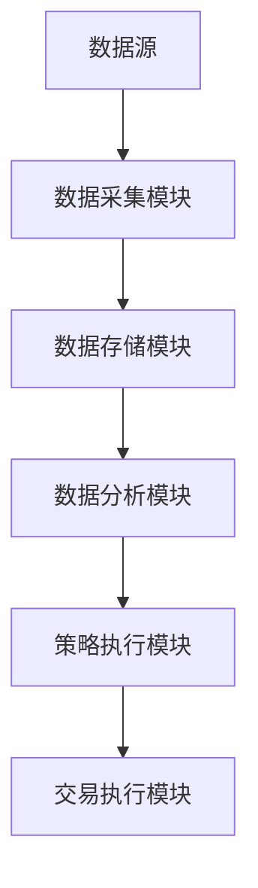

                 


# 迈克尔·伯里的宏观对冲策略

## 关键词
宏观对冲，迈克尔·伯里，统计套利，风险管理，对冲基金

## 摘要
迈克尔·伯里的宏观对冲策略是一种基于宏观市场趋势和统计套利的对冲基金策略，通过捕捉市场中的套利机会和趋势变化来实现超额收益。本文从宏观对冲的基本概念、核心概念与联系、算法原理、系统架构设计、项目实战以及最佳实践等方面详细讲解迈克尔·伯里的宏观对冲策略，帮助读者全面理解并掌握该策略的应用。

---

## 第一部分: 迈克尔·伯里的宏观对冲策略概述

### 第1章: 宏观对冲的基本概念

#### 1.1 宏观对冲的定义与背景
##### 1.1.1 宏观对冲的定义
宏观对冲是一种对冲基金策略，通过分析宏观经济数据和市场趋势，利用不同资产类别之间的价格差异进行套利或趋势跟踪，以实现长期稳定的收益。

##### 1.1.2 宏观对冲的发展历程
宏观对冲起源于20世纪80年代，随着金融市场的发展和量化技术的进步，逐渐成为对冲基金的重要策略之一。迈克尔·伯里是该领域的重要代表人物之一。

##### 1.1.3 宏观对冲的核心要素
- 宏观经济分析
- 市场趋势捕捉
- 统计套利

#### 1.2 迈克尔·伯里与宏观对冲策略
##### 1.2.1 迈克尔·伯里的投资理念
伯里强调利用宏观经济数据和市场趋势，通过统计套利和风险对冲来捕捉市场机会。

##### 1.2.2 伯里宏观对冲策略的特点
- 长期趋势跟踪
- 统计套利
- 风险控制

##### 1.2.3 伯里策略的适用场景
- 宏观经济波动较大的市场
- 资产价格相关性较低的市场环境

---

### 第2章: 宏观对冲的核心概念与联系

#### 2.1 宏观对冲的收益来源
##### 2.1.1 市场趋势的捕捉
通过分析宏观经济指标（如GDP、CPI、利率等）和市场趋势，寻找价格趋势性的机会。

##### 2.1.2 套利机会的利用
利用不同资产或市场之间的价格差异进行套利，实现无风险收益。

##### 2.1.3 风险对冲的机制
通过做空或做多相关资产，对冲市场波动带来的风险。

#### 2.2 宏观对冲的风险管理
##### 2.2.1 风险的识别与评估
- 市场风险
- 流动性风险
- 操作风险

##### 2.2.2 风险对冲的策略
- 利用衍生品对冲
- 调整投资组合的头寸

##### 2.2.3 风险控制的实施
- 设置止损点
- 调整杠杆比例

#### 2.3 宏观对冲与其他对冲策略的对比
##### 2.3.1 股票对冲 vs 宏观对冲
股票对冲主要通过做多和做空股票实现收益，而宏观对冲则关注宏观经济趋势和资产价格差异。

##### 2.3.2 商品对冲 vs 宏观对冲
商品对冲主要关注商品价格波动，而宏观对冲则更广泛地覆盖多种资产类别。

##### 2.3.3 债券对冲 vs 宏观对冲
债券对冲主要关注债券价格波动，而宏观对冲则更关注宏观经济因素对多种资产的影响。

---

### 第3章: 宏观对冲的数学模型与算法

#### 3.1 宏观对冲的统计套利模型
##### 3.1.1 统计套利的基本原理
统计套利通过分析资产价格的历史数据，寻找价格偏离均值的机会，利用均值回归的特性进行套利。

##### 3.1.2 时间序列分析在宏观对冲中的应用
- 自回归模型（AR）
- 移动平均模型（MA）
- ARIMA模型

##### 3.1.3 均值回归模型的构建与应用
均值回归模型假设资产价格会在长期回归其均值，可以通过构建价差序列并分析其均值回归特性来寻找套利机会。

#### 3.2 宏观对冲的算法实现
##### 3.2.1 配对交易算法
配对交易是一种常见的统计套利策略，通过分析两只资产的相关性，寻找价格差异的套利机会。

##### 3.2.2 跨期套利算法
跨期套利通过不同时间周期的资产价格差异进行套利，通常涉及期货市场的操作。

##### 3.2.3 趋势跟踪算法
趋势跟踪算法通过识别资产价格的趋势性变化，进行顺势交易。

#### 3.3 宏观对冲的数学公式
##### 3.3.1 时间序列模型的公式表示
$$ ARIMA(p, d, q) $$
其中，p为自回归阶数，d为差分阶数，q为移动平均阶数。

##### 3.3.2 均值回归模型的公式推导
假设资产价格服从均值回归，可以通过构建价差序列并计算其均值回归特性来寻找套利机会。

---

### 第4章: 宏观对冲的系统架构设计

#### 4.1 宏观对冲系统的功能设计
##### 4.1.1 数据采集模块
负责采集宏观经济数据和市场数据。

##### 4.1.2 数据分析模块
通过统计套利模型对数据进行分析，识别套利机会。

##### 4.1.3 策略执行模块
根据分析结果执行交易策略。

#### 4.2 宏观对冲系统的架构图


#### 4.3 宏观对冲系统的接口设计
##### 4.3.1 数据接口
定义数据输入和输出的格式和接口。

##### 4.3.2 策略接口
定义策略执行的接口和参数。

##### 4.3.3 交易接口
定义交易执行的接口和参数。

---

### 第5章: 宏观对冲的项目实战

#### 5.1 项目环境安装
##### 5.1.1 Python环境的安装与配置
安装Python和必要的库（如Pandas、NumPy、Scikit-learn等）。

##### 5.1.2 数据源的获取
获取宏观经济数据和市场数据。

#### 5.2 项目核心代码实现
##### 5.2.1 数据采集模块
```python
import pandas as pd
import requests

def get_macro_data():
    url = "https://api.example.com/macro_data"
    response = requests.get(url)
    data = response.json()
    df = pd.DataFrame(data)
    return df
```

##### 5.2.2 数据分析模块
```python
from sklearn.linear_model import LinearRegression

def mean_reversion_strategy(prices):
    # 计算价差序列
    spread = prices['资产A'] - prices['资产B']
    # 计算均值回归特性
    model = LinearRegression()
    model.fit(pd.DataFrame(spread), pd.Series([1]*len(spread)))
    # 判断是否偏离均值
    if spread[-1] > model.predict(spread.mean()):
        return '买入资产B，卖出资产A'
    elif spread[-1] < model.predict(spread.mean()):
        return '卖出资产B，买入资产A'
    else:
        return '无交易信号'
```

##### 5.2.3 策略执行模块
```python
def execute_strategy(signals):
    # 根据信号执行交易
    if signals == '买入资产B，卖出资产A':
        # 执行买入资产B，卖出资产A的操作
        pass
    elif signals == '卖出资产B，买入资产A':
        # 执行卖出资产B，买入资产A的操作
        pass
```

#### 5.3 项目实战案例分析
以外汇对冲为例，分析如何利用宏观对冲策略捕捉套利机会。

#### 5.4 项目总结
总结项目实施过程中的经验教训，优化策略和系统架构。

---

### 第6章: 最佳实践与小结

#### 6.1 最佳实践
##### 6.1.1 风险管理的重要性
强调风险控制在宏观对冲策略中的重要性。

##### 6.1.2 数据质量的保证
确保数据的准确性和及时性。

##### 6.1.3 模型的持续优化
根据市场变化不断优化模型和策略。

#### 6.2 小结
总结本文的主要内容，强调宏观对冲策略的核心思想和实际应用。

#### 6.3 注意事项
提醒读者在实际操作中注意市场风险、模型过拟合等问题。

#### 6.4 拓展阅读
推荐相关书籍和文献，供读者进一步学习。

---

通过以上详细的内容，读者可以全面了解迈克尔·伯里的宏观对冲策略，并能够在实际操作中应用这些知识。

