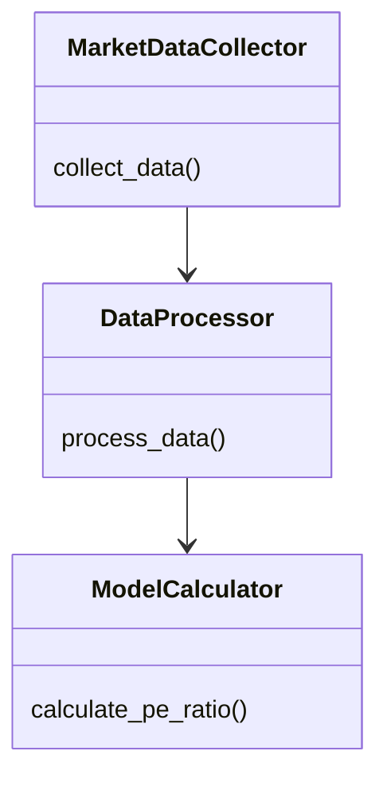
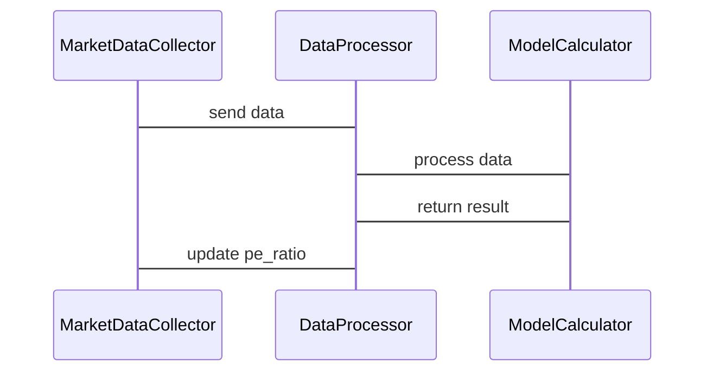

                 


# 运用AI智能体群体实现动态市盈率调整

## 关键词：AI智能体，动态市盈率调整，群体智能，算法原理，系统架构

## 摘要：本文探讨了如何利用AI智能体群体实现动态市盈率调整，分析了传统方法的局限性，详细介绍了基于群体智能的动态调整机制，包括算法原理、系统架构设计以及实际案例分析，展示了AI智能体在金融领域的创新应用。

---

# 第1章 动态市盈率调整的背景与问题描述

## 1.1 问题背景

### 1.1.1 市盈率的基本概念与作用
市盈率（P/E Ratio）是衡量股票价值的重要指标，反映了市场对公司未来盈利能力的预期。传统的市盈率计算方法假设市场环境稳定，无法适应快速变化的市场波动。

### 1.1.2 市场波动对市盈率的影响
金融市场的波动性使得市盈率需要动态调整以反映最新的市场信息和公司业绩变化。

### 1.1.3 现有市盈率调整方法的局限性
传统方法依赖人工调整，存在滞后性、主观性和效率低下等问题，无法应对高频交易和复杂市场环境。

## 1.2 问题描述

### 1.2.1 动态市盈率调整的定义
动态市盈率调整是指根据实时市场数据和公司信息，持续更新和优化市盈率的计算过程。

### 1.2.2 动态市盈率调整的目标与意义
目标是提高市盈率计算的准确性和及时性，帮助投资者做出更明智的决策。意义在于增强金融市场的流动性，优化资源配置。

### 1.2.3 传统市盈率调整方法的不足
传统方法依赖固定模型，缺乏灵活性，无法捕捉市场变化的细微动态。

## 1.3 问题解决思路

### 1.3.1 引入AI智能体的必要性
AI智能体能够实时处理海量数据，具备快速响应和自我学习能力。

### 1.3.2 智能体群体在动态调整中的优势
通过分布式计算和协同工作，智能体群体能够高效完成复杂任务。

### 1.3.3 基于智能体的动态市盈率调整框架
提出一个框架，整合数据采集、分析和调整模块，实现动态市盈率的实时更新。

## 1.4 问题的边界与外延

### 1.4.1 动态市盈率调整的适用场景
适用于高频交易、市场波动剧烈等情况。

### 1.4.2 相关概念的边界划分
明确动态市盈率与静态市盈率的区别，界定AI智能体的应用范围。

### 1.4.3 与其他调整方法的对比分析
对比传统方法，突出AI智能体的优势。

## 1.5 概念结构与核心要素组成

### 1.5.1 动态市盈率调整的核心要素
包括实时数据、AI智能体、计算模型和反馈机制。

### 1.5.2 AI智能体群体的关键属性
具备自主性、反应性、协作性和适应性。

### 1.5.3 调整过程中的相互关系
数据驱动、模型计算、反馈优化三者相互作用，形成闭环。

---

# 第2章 AI智能体群体的核心概念与原理

## 2.1 AI智能体的定义与分类

### 2.1.1 智能体的基本定义
AI智能体是具备感知环境、自主决策和执行任务的实体。

### 2.1.2 智能体的分类与特点
分为简单反射型、基于模型的反应型、目标驱动型和实用驱动型。

### 2.1.3 基于群体智能的智能体系统
群体智能通过分布式计算和协同优化，实现复杂任务。

## 2.2 动态市盈率调整的核心机制

### 2.2.1 动态调整的数学模型
使用时间序列分析和机器学习模型预测市盈率变化。

### 2.2.2 调整过程中的反馈机制
通过实时数据反馈不断优化计算模型。

### 2.2.3 基于智能体的分布式计算
AI智能体协同工作，分布处理数据，提高计算效率。

## 2.3 智能体与动态市盈率调整的关系

### 2.3.1 智能体在市盈率调整中的角色
负责数据采集、特征提取和计算优化。

### 2.3.2 智能体群体的协同作用
通过协同优化，提升市盈率调整的准确性和实时性。

### 2.3.3 智能体与传统算法的对比
智能体具备更强的适应性和实时性，传统算法在复杂环境下表现不佳。

---

# 第3章 动态市盈率调整的算法原理

## 3.1 算法原理概述

### 3.1.1 动态市盈率调整的数学模型
使用ARIMA模型预测市盈率变化。

$$ ARIMA(p, d, q) $$

### 3.1.2 算法流程
1. 数据采集：获取实时市场数据。
2. 特征提取：提取影响市盈率的关键特征。
3. 模型训练：使用机器学习算法训练预测模型。
4. 实时调整：根据模型预测结果调整市盈率。

## 3.2 基于时间序列预测的模型

### 3.2.1 ARIMA模型
用于捕捉数据的长期趋势和季节性变化。

### 3.2.2 LSTM网络
适用于捕捉复杂的时间依赖性。

$$ LSTM(t) = \sigma(g_{h}(h_{t-1}, x_t)) $$

### 3.2.3 算法实现步骤
- 数据预处理：归一化和缺失值处理。
- 模型训练：使用训练数据优化模型参数。
- 模型预测：基于最新数据预测市盈率变化。

## 3.3 算法实现代码示例

```python
import pandas as pd
from sklearn.metrics import mean_squared_error
from statsmodels.tsa.arima_model import ARIMA

# 数据预处理
data = pd.read_csv('market_data.csv')
data = data['pe_ratio'].values

# 模型训练
model = ARIMA(data, order=(5, 1, 0))
model_fit = model.fit()

# 预测未来值
forecast = model_fit.forecast(steps=10)
```

## 3.4 算法优化与改进

### 3.4.1 参数优化
通过网格搜索找到最优模型参数。

### 3.4.2 模型融合
结合多种模型结果，提升预测准确性。

### 3.4.3 实时调整机制
根据市场反馈不断优化模型。

---

# 第4章 系统分析与架构设计

## 4.1 系统功能设计

### 4.1.1 数据采集模块
负责实时采集市场数据。

### 4.1.2 数据处理模块
进行数据清洗和特征提取。

### 4.1.3 模型计算模块
执行市盈率的动态调整。

## 4.2 系统架构设计

### 4.2.1 领域模型
使用mermaid类图展示系统模块。



### 4.2.2 系统架构
使用mermaid架构图展示系统整体结构。

```mermaid
archiecture {
    component MarketDataCollector {
        collect_data()
    }
    component DataProcessor {
        process_data()
    }
    component ModelCalculator {
        calculate_pe_ratio()
    }
    MarketDataCollector -> DataProcessor
    DataProcessor -> ModelCalculator
}
```

## 4.3 系统接口设计

### 4.3.1 接口定义
定义模块之间的接口和交互流程。

### 4.3.2 交互序列图
使用mermaid序列图展示系统交互。



---

# 第5章 项目实战

## 5.1 环境安装与配置

### 5.1.1 安装Python和相关库
安装numpy、pandas、scikit-learn和statsmodels。

## 5.2 核心代码实现

### 5.2.1 数据采集模块
编写代码从API获取实时数据。

### 5.2.2 数据处理模块
对数据进行清洗和特征提取。

### 5.2.3 模型计算模块
实现动态市盈率调整的算法。

## 5.3 实际案例分析

### 5.3.1 数据准备
使用真实市场数据进行测试。

### 5.3.2 模型训练与预测
训练模型并进行预测，分析预测结果的准确性。

### 5.3.3 结果分析
对比预测结果与实际市盈率变化，评估模型性能。

## 5.4 项目小结

总结项目实施过程中的经验教训，提出改进建议。

---

# 第6章 最佳实践与总结

## 6.1 最佳实践

### 6.1.1 数据质量的重要性
确保数据的准确性和完整性。

### 6.1.2 模型选择与优化
选择适合的模型并不断优化。

### 6.1.3 系统性能调优
提升系统的运行效率和稳定性。

## 6.2 小结

总结全文，强调AI智能体在动态市盈率调整中的重要性和应用前景。

## 6.3 注意事项

提醒读者在实际应用中注意数据隐私和模型鲁棒性。

## 6.4 拓展阅读

推荐相关领域的书籍和论文，供读者深入学习。

---

# 结语

通过本文的详细讲解，读者可以全面了解如何运用AI智能体群体实现动态市盈率调整。从理论到实践，从系统设计到项目实施，本文提供了完整的解决方案。未来，随着AI技术的不断发展，动态市盈率调整将更加精准和高效，为金融市场带来更多的创新和价值。

