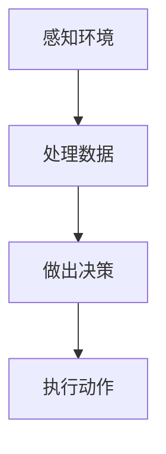
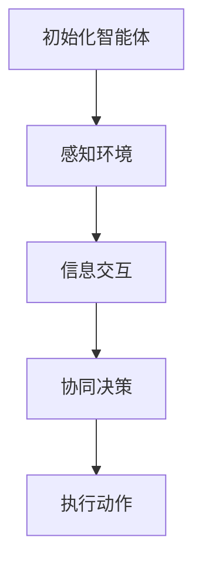
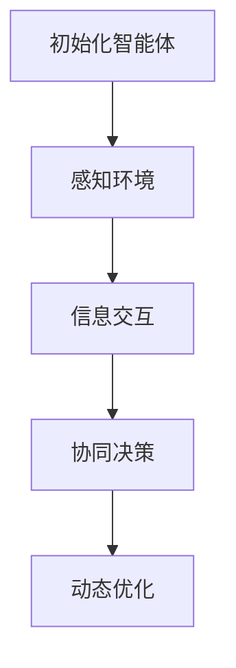

                 


# 运用AI智能体群体实现动态消费者行为分析

> 关键词：AI智能体、消费者行为分析、动态分析、群体智能、实时分析

> 摘要：本文探讨了如何运用AI智能体群体实现动态消费者行为分析，从理论基础到实际应用，详细分析了AI智能体的核心原理、动态消费者行为分析的挑战、系统架构设计以及项目实战案例。通过结合数学模型、算法实现和系统设计，本文为动态消费者行为分析提供了一种高效、实时的解决方案。

---

# 第1章 动态消费者行为分析概述

## 1.1 消费者行为分析的背景与意义

### 1.1.1 消费者行为分析的定义与核心概念

消费者行为分析是研究消费者在购物、使用产品或服务过程中表现出的行为模式和决策过程。其核心目标是帮助企业更好地理解消费者需求，优化产品设计和服务流程。

- **消费者行为的特征**：
  - 多样性：不同消费者的行为模式差异显著。
  - 动态性：消费者行为受外部环境和内部因素的影响而不断变化。
  - 隐含性：消费者的真实需求往往隐藏在表面行为背后。

### 1.1.2 动态消费者行为分析的必要性

随着市场竞争的加剧，消费者行为的动态变化对企业提出了更高的要求。企业需要实时捕捉消费者行为的变化，以便快速调整市场策略。

- **动态消费者行为分析的意义**：
  - 提高市场反应速度。
  - 优化用户体验。
  - 降低市场风险。

### 1.1.3 AI智能体在消费者行为分析中的作用

AI智能体是一种具有感知、决策和执行能力的智能实体，能够实时感知环境变化并做出响应。在消费者行为分析中，AI智能体可以通过以下方式发挥作用：

- **实时感知**：智能体能够实时采集消费者行为数据。
- **动态决策**：基于实时数据，智能体可以快速做出决策。
- **协同工作**：多个智能体可以协同工作，提高分析的准确性和效率。

## 1.2 AI智能体群体的核心概念

### 1.2.1 AI智能体的基本定义与分类

- **AI智能体的定义**：
  AI智能体是一种能够感知环境、做出决策并执行动作的智能实体。

- **AI智能体的分类**：
  - **简单智能体**：仅能执行预定义的规则。
  - **复杂智能体**：能够学习和适应环境。
  - **协作智能体**：能够与其他智能体协同工作。

### 1.2.2 智能体群体的特征与优势

- **智能体群体的特征**：
  - 分布式：智能体可以分布在不同的节点上。
  - 协作性：智能体之间可以协同工作。
  - 动态性：智能体能够根据环境变化实时调整行为。

- **智能体群体的优势**：
  - 提高计算效率。
  - 增强系统的鲁棒性。
  - 实现复杂任务的分解与协作。

### 1.2.3 智能体群体与传统数据分析方法的对比

- **传统数据分析方法**：
  - 数据分析基于静态数据。
  - 分析结果无法实时更新。
  - 数据处理依赖人工干预。

- **智能体群体的优势**：
  - 实时数据分析。
  - 自动调整分析模型。
  - 高度自动化和智能化。

## 1.3 动态消费者行为分析的挑战

### 1.3.1 数据动态变化的复杂性

- 数据的动态变化使得传统的静态分析方法难以适用。
- 数据的实时更新要求分析系统具备高效的处理能力。

### 1.3.2 消费者行为的多样性与不确定性

- 消费者行为受到多种因素的影响，具有高度的不确定性。
- 不同消费者的行为模式差异显著，增加了分析的复杂性。

### 1.3.3 AI智能体群体在实时分析中的技术难点

- 智能体之间的通信与协作需要高效的机制。
- 实时数据的处理需要强大的计算能力。
- 系统的可扩展性和稳定性需要精心设计。

## 1.4 本章小结

本章介绍了动态消费者行为分析的背景与意义，分析了AI智能体群体的核心概念与优势，并探讨了动态消费者行为分析面临的挑战。这些内容为后续章节的深入分析奠定了基础。

---

# 第2章 AI智能体群体的核心原理与数学模型

## 2.1 智能体的基本原理

### 2.1.1 智能体的感知与决策机制

- **感知机制**：
  智能体通过传感器或其他数据源获取环境信息。
  例如，智能体可以通过摄像头、传感器等设备获取消费者的行为数据。

- **决策机制**：
  智能体根据感知到的信息，结合预设的规则或学习到的模型，做出决策。
  例如，智能体可以根据消费者的行为数据，预测其下一步可能的行为。

### 2.1.2 智能体的自主学习能力

- **学习机制**：
  智能体可以通过机器学习算法（如强化学习、监督学习）进行自主学习。
  例如，智能体可以通过监督学习算法，根据标注的数据训练分类模型。

- **自适应能力**：
  智能体可以根据环境变化自适应地调整其行为策略。
  例如，智能体可以根据实时数据调整其预测模型的参数。

### 2.1.3 智能体的协作与通信机制

- **协作机制**：
  智能体之间可以通过分布式计算框架进行协作。
  例如，智能体可以通过分布式计算框架（如 MPI、MapReduce）进行任务分配和结果汇总。

- **通信机制**：
  智能体之间可以通过消息队列、 RPC（远程过程调用）等机制进行通信。
  例如，智能体可以通过 Kafka 消息队列接收其他智能体发送的消息。

### 2.1.4 智能体的数学模型

- **感知模型**：
  智能体的感知模型可以表示为：
  $$ p(x|y) $$
  其中，x 是智能体感知到的环境信息，y 是智能体的状态。

- **决策模型**：
  智能体的决策模型可以表示为：
  $$ d(y) = \arg\max_{a} \sum_{s} p(s|a) r(s) $$
  其中，a 是智能体的动作，s 是智能体的状态，r(s) 是状态 s 的奖励函数。

### 2.1.5 智能体的实现步骤

1. **感知环境**：智能体通过传感器或其他数据源获取环境信息。
2. **处理数据**：智能体对获取的数据进行预处理（如去噪、归一化）。
3. **做出决策**：智能体根据处理后的数据，结合预设的规则或学习到的模型，做出决策。
4. **执行动作**：智能体根据决策结果执行相应的动作。

### 2.1.6 智能体的实现流程图



---

## 2.2 智能体群体的协同工作原理

### 2.2.1 智能体群体的组织结构

- **分层结构**：
  智能体群体可以采用分层结构，包括：
  - **感知层**：负责数据的采集和初步处理。
  - **决策层**：负责智能体的决策和协调。
  - **执行层**：负责执行具体的动作。

- **分布式结构**：
  智能体群体可以采用分布式结构，每个智能体负责特定的任务，通过通信机制协同工作。

### 2.2.2 智能体之间的信息交互

- **信息交互机制**：
  智能体之间可以通过消息队列、 RPC 等机制进行信息交互。
  例如，智能体可以通过 Kafka 消息队列发送和接收消息。

- **信息共享机制**：
  智能体群体可以通过共享数据库或分布式文件系统共享信息。
  例如，智能体可以通过 Hadoop 分布式文件系统共享数据。

### 2.2.3 智能体群体的动态协调机制

- **动态协调机制**：
  智能体群体可以通过动态规划、博弈论等方法实现动态协调。
  例如，智能体可以通过动态规划算法优化其行为策略。

### 2.2.4 智能体群体的数学模型

- **群体行为模型**：
  智能体群体的行为可以用以下公式表示：
  $$ B = \sum_{i=1}^{n} b_i $$
  其中，B 是群体行为，n 是智能体的数量，b_i 是第 i 个智能体的行为。

- **协作模型**：
  智能体群体的协作模型可以表示为：
  $$ C = \arg\max_{a} \sum_{i=1}^{n} c_i(a) $$
  其中，c_i(a) 是第 i 个智能体在动作 a 下的协作收益。

### 2.2.5 智能体群体的实现步骤

1. **初始化智能体**：创建多个智能体实例，并配置初始参数。
2. **感知环境**：每个智能体感知其所在的环境信息。
3. **信息交互**：智能体之间通过通信机制进行信息交互。
4. **协同决策**：智能体群体通过协作机制做出集体决策。
5. **执行动作**：智能体根据决策结果执行相应的动作。

### 2.2.6 智能体群体的实现流程图



---

## 2.3 智能体群体的数学模型

### 2.3.1 智能体的个体行为模型

- **个体行为模型**：
  智能体的个体行为可以用以下公式表示：
  $$ b_i = f(x_i, y_i) $$
  其中，x_i 是智能体 i 感知到的环境信息，y_i 是智能体 i 的状态。

- **个体行为的优化**：
  智能体可以通过强化学习算法优化其个体行为。
  例如，智能体可以通过 Q-learning 算法优化其行为策略。

### 2.3.2 智能体群体的协作模型

- **协作模型**：
  智能体群体的协作模型可以用以下公式表示：
  $$ C = \arg\max_{a} \sum_{i=1}^{n} c_i(a) $$
  其中，c_i(a) 是第 i 个智能体在动作 a 下的协作收益。

- **协作收益的计算**：
  协作收益可以通过博弈论中的收益函数进行计算。
  例如，协作收益可以表示为：
  $$ c_i(a) = \sum_{j \neq i} r_{ij}(a) $$
  其中，r_{ij}(a) 是智能体 i 和 j 在动作 a 下的协作收益。

### 2.3.3 智能体群体的动态优化模型

- **动态优化模型**：
  智能体群体的动态优化模型可以用以下公式表示：
  $$ \min_{\theta} \sum_{i=1}^{n} L_i(\theta) $$
  其中，L_i(\theta) 是第 i 个智能体的损失函数，θ 是优化的目标参数。

- **动态优化的实现**：
  智能体群体可以通过分布式优化算法（如分布式梯度下降）实现动态优化。
  例如，智能体可以通过分布式 SGD（随机梯度下降）算法优化其参数。

---

## 2.4 本章小结

本章详细介绍了AI智能体的基本原理与数学模型，分析了智能体群体的协同工作原理及其数学模型。这些内容为后续章节的系统设计与实现奠定了理论基础。

---

# 第3章 动态消费者行为分析的数学模型

## 3.1 消费者行为分析的基本模型

### 3.1.1 消费者行为的分类与特征

- **消费者行为的分类**：
  - **购物行为**：消费者在购物过程中的行为。
  - **使用行为**：消费者在使用产品或服务过程中的行为。
  - **反馈行为**：消费者对产品或服务的反馈行为。

- **消费者行为的特征**：
  - 多样性：不同消费者的行为模式差异显著。
  - 动态性：消费者行为受外部环境和内部因素的影响而不断变化。
  - 隐含性：消费者的真实需求往往隐藏在表面行为背后。

### 3.1.2 消费者行为分析的指标体系

- **消费者行为分析的指标**：
  - **购买频率**：消费者在一定时间内的购买次数。
  - **购买金额**：消费者每次购买的平均金额。
  - **购买偏好**：消费者对不同产品或服务的偏好程度。

### 3.1.3 消费者行为分析的数学框架

- **消费者行为分析的框架**：
  消费者行为分析的框架可以用以下公式表示：
  $$ B = f(X, Y) $$
  其中，B 是消费者行为，X 是消费者的特征，Y 是环境因素。

## 3.2 基于AI智能体群体的动态分析模型

### 3.2.1 智能体个体的行为建模

- **个体行为建模**：
  智能体的个体行为可以用以下公式表示：
  $$ b_i = f(x_i, y_i) $$
  其中，x_i 是智能体 i 感知到的环境信息，y_i 是智能体 i 的状态。

- **个体行为的优化**：
  智能体可以通过强化学习算法优化其个体行为。
  例如，智能体可以通过 Q-learning 算法优化其行为策略。

### 3.2.2 智能体群体的协同建模

- **协同建模**：
  智能体群体的协同行为可以用以下公式表示：
  $$ C = \arg\max_{a} \sum_{i=1}^{n} c_i(a) $$
  其中，c_i(a) 是第 i 个智能体在动作 a 下的协作收益。

- **协作收益的计算**：
  协作收益可以通过博弈论中的收益函数进行计算。
  例如，协作收益可以表示为：
  $$ c_i(a) = \sum_{j \neq i} r_{ij}(a) $$
  其中，r_{ij}(a) 是智能体 i 和 j 在动作 a 下的协作收益。

### 3.2.3 动态行为的实时更新模型

- **动态行为的实时更新模型**：
  动态行为的实时更新模型可以用以下公式表示：
  $$ \min_{\theta} \sum_{i=1}^{n} L_i(\theta) $$
  其中，L_i(\theta) 是第 i 个智能体的损失函数，θ 是优化的目标参数。

- **实时更新的实现**：
  智能体群体可以通过分布式优化算法（如分布式 SGD）实现动态优化。
  例如，智能体可以通过分布式 SGD 算法优化其参数。

## 3.3 数学模型的实现与优化

### 3.3.1 模型的参数优化方法

- **参数优化方法**：
  智能体可以通过以下方法优化其参数：
  1. **随机梯度下降（SGD）**：适用于在线学习场景。
  2. **Adam 优化器**：适用于大规模数据场景。
  3. **Adagrad 优化器**：适用于稀疏数据场景。

### 3.3.2 模型的实时更新算法

- **实时更新算法**：
  智能体可以通过以下算法实现模型的实时更新：
  ```python
  def update_parameters(parameters, gradients, learning_rate):
      updated_parameters = {}
      for key, value in parameters.items():
          updated_parameters[key] = value - learning_rate * gradients[key]
      return updated_parameters
  ```

### 3.3.3 模型的性能评估指标

- **性能评估指标**：
  1. **准确率**：模型预测的准确程度。
  2. **召回率**：模型预测的召回程度。
  3. **F1 值**：模型预测的综合指标。

---

## 3.4 本章小结

本章详细介绍了动态消费者行为分析的数学模型，包括消费者行为的基本模型、基于AI智能体群体的动态分析模型以及模型的实现与优化。这些内容为后续章节的系统设计与实现提供了数学基础。

---

# 第4章 动态消费者行为分析系统的架构设计

## 4.1 系统功能需求分析

### 4.1.1 系统目标与功能模块划分

- **系统目标**：
  开发一个基于AI智能体群体的动态消费者行为分析系统，实现消费者行为的实时分析与预测。

- **功能模块划分**：
  1. **数据采集模块**：负责采集消费者行为数据。
  2. **数据处理模块**：负责对采集的数据进行预处理。
  3. **智能体分析模块**：负责基于AI智能体群体进行消费者行为分析。
  4. **结果展示模块**：负责展示分析结果。

### 4.1.2 系统的输入输出设计

- **输入设计**：
  1. **输入数据**：消费者行为数据，包括点击流数据、交易数据等。
  2. **输入参数**：智能体的配置参数，包括感知范围、决策规则等。

- **输出设计**：
  1. **输出结果**：消费者行为的分析结果，包括行为预测、行为分类等。
  2. **输出报告**：系统的运行报告，包括性能指标、错误日志等。

### 4.1.3 系统的性能需求

- **性能需求**：
  1. **实时性**：系统需要支持实时数据分析与预测。
  2. **准确性**：系统的分析结果需要具有较高的准确性。
  3. **可扩展性**：系统需要支持大规模数据的处理。

## 4.2 系统架构设计

### 4.2.1 分层架构设计

- **分层架构设计**：
  系统可以采用分层架构，包括：
  - **数据采集层**：负责数据的采集与传输。
  - **数据处理层**：负责数据的预处理与存储。
  - **智能体分析层**：负责基于AI智能体群体进行消费者行为分析。
  - **结果展示层**：负责分析结果的展示与报告。

### 4.2.2 智能体群体的分布式架构

- **分布式架构设计**：
  智能体群体可以采用分布式架构，包括：
  - **智能体节点**：负责特定任务的处理。
  - **协调节点**：负责智能体之间的协调与通信。
  - **控制节点**：负责系统的整体控制与管理。

### 4.2.3 系统的可扩展性设计

- **可扩展性设计**：
  系统可以通过增加智能体节点的方式实现扩展。
  例如，系统可以通过增加更多的智能体节点来提高处理能力。

## 4.3 系统的接口与交互设计

### 4.3.1 系统接口的设计原则

- **接口设计原则**：
  1. **简洁性**：接口设计应尽量简洁，减少不必要的复杂性。
  2. **可扩展性**：接口设计应支持未来的扩展需求。
  3. **安全性**：接口设计应考虑安全性，防止数据泄露和攻击。

### 4.3.2 系统交互的流程设计

- **交互流程设计**：
  1. **数据采集**：智能体通过传感器或其他数据源采集消费者行为数据。
  2. **数据处理**：数据处理模块对采集的数据进行预处理。
  3. **智能体分析**：智能体群体基于预处理后的数据进行分析与预测。
  4. **结果展示**：分析结果通过结果展示模块展示给用户。

### 4.3.3 系统交互的实现方式

- **实现方式**：
  系统可以通过以下方式实现交互：
  - **API 接口**：系统可以通过 RESTful API 提供接口服务。
  - **消息队列**：系统可以通过 Kafka 等消息队列实现异步通信。

---

## 4.4 本章小结

本章详细介绍了动态消费者行为分析系统的架构设计，包括系统的功能需求、架构设计以及接口与交互设计。这些内容为后续章节的系统实现提供了设计依据。

---

# 第5章 基于AI智能体群体的算法实现

## 5.1 智能体群体的算法流程

### 5.1.1 智能体的初始化与配置

- **初始化与配置**：
  1. **智能体初始化**：创建多个智能体实例，并配置初始参数。
  2. **参数配置**：配置智能体的感知范围、决策规则等参数。

### 5.1.2 智能体的感知与决策

- **感知与决策**：
  1. **感知环境**：智能体通过传感器或其他数据源感知环境信息。
  2. **处理数据**：智能体对感知到的数据进行预处理。
  3. **做出决策**：智能体根据处理后的数据，结合预设的规则或学习到的模型，做出决策。

### 5.1.3 智能体群体的协作与优化

- **协作与优化**：
  1. **信息交互**：智能体之间通过通信机制进行信息交互。
  2. **协同决策**：智能体群体通过协作机制做出集体决策。
  3. **动态优化**：智能体群体通过动态优化算法优化其行为策略。

### 5.1.4 智能体群体的实现流程图



---

## 5.2 动态消费者行为分析的算法实现

### 5.2.1 数据预处理与特征提取

- **数据预处理**：
  1. **数据清洗**：去除噪声数据。
  2. **数据归一化**：将数据归一化到统一的范围内。

- **特征提取**：
  1. **特征选择**：选择对消费者行为分析有影响的关键特征。
  2. **特征工程**：对特征进行工程化处理，如 PCA 降维。

### 5.2.2 基于AI智能体群体的算法实现

- **算法实现**：
  1. **智能体初始化**：创建多个智能体实例，并配置初始参数。
  2. **数据采集**：智能体通过传感器或其他数据源采集消费者行为数据。
  3. **数据处理**：智能体对采集的数据进行预处理。
  4. **协同决策**：智能体群体通过协作机制做出集体决策。
  5. **动态优化**：智能体群体通过动态优化算法优化其行为策略。

### 5.2.3 算法实现的代码示例

```python
class Agent:
    def __init__(self, parameters):
        self.parameters = parameters
        self.data = []
    
    def perceive(self, environment):
        self.data = environment.get_data()
    
    def process_data(self):
        # 数据预处理
        self.data = preprocess(self.data)
    
    def make_decision(self):
        # 基于预处理后的数据做出决策
        decision = decide(self.data, self.parameters)
        return decision
    
    def execute_action(self, action):
        # 执行决策结果
        execute(action)
```

---

## 5.3 本章小结

本章详细介绍了基于AI智能体群体的算法实现，包括智能体群体的算法流程和动态消费者行为分析的算法实现。这些内容为后续章节的系统实现提供了算法支持。

---

# 第6章 项目实战

## 6.1 项目环境安装与配置

### 6.1.1 开发环境的安装

- **开发环境**：
  - **操作系统**：Linux/Windows/MacOS。
  - **编程语言**：Python 3.x。
  - **框架与库**：TensorFlow、PyTorch、Kafka、Hadoop等。

### 6.1.2 项目依赖的安装

- **依赖安装**：
  1. 安装 Python 包：
     ```bash
     pip install numpy pandas scikit-learn tensorflow
     ```
  2. 安装其他工具：
     ```bash
     conda install -n your_env_name kafka hadoop
     ```

---

## 6.2 系统核心实现源代码

### 6.2.1 智能体类的实现

```python
class Agent:
    def __init__(self, agent_id, parameters):
        self.agent_id = agent_id
        self.parameters = parameters
        self.data = []
    
    def perceive(self, environment):
        self.data = environment.get_data()
    
    def process_data(self):
        # 数据预处理
        self.data = preprocess(self.data)
    
    def make_decision(self):
        # 基于预处理后的数据做出决策
        decision = decide(self.data, self.parameters)
        return decision
    
    def execute_action(self, action):
        # 执行决策结果
        execute(action)
```

### 6.2.2 环境类的实现

```python
class Environment:
    def __init__(self, data_source):
        self.data_source = data_source
        self.data = []
    
    def get_data(self):
        self.data = self.data_source.get_data()
        return self.data
```

### 6.2.3 协作机制的实现

```python
def collaborate(agents):
    # 信息交互
    for agent in agents:
        agent.perceive(environment)
    
    # 协同决策
    decision = decide(agents)
    
    # 执行动作
    execute(decision)
```

---

## 6.3 代码应用解读与分析

### 6.3.1 智能体类的解读

- **智能体类**：
  - **属性**：agent_id、parameters、data。
  - **方法**：perceive、process_data、make_decision、execute_action。

### 6.3.2 环境类的解读

- **环境类**：
  - **属性**：data_source、data。
  - **方法**：get_data。

### 6.3.3 协作机制的解读

- **协作机制**：
  - **信息交互**：智能体通过感知环境获取数据。
  - **协同决策**：智能体群体基于获取的数据做出集体决策。
  - **执行动作**：智能体群体根据决策结果执行相应的动作。

---

## 6.4 实际案例分析

### 6.4.1 案例背景

- **案例背景**：
  某电商平台希望通过动态消费者行为分析，实时预测消费者的购买行为，优化其营销策略。

### 6.4.2 数据准备

- **数据准备**：
  1. 数据来源：电商平台的点击流数据、交易数据等。
  2. 数据预处理：清洗、归一化、特征提取。

### 6.4.3 智能体群体的配置

- **智能体群体的配置**：
  1. 智能体数量：根据数据规模和计算能力配置。
  2. 参数配置：配置智能体的感知范围、决策规则等参数。

### 6.4.4 系统运行与结果展示

- **系统运行**：
  1. 初始化智能体群体。
  2. 智能体感知环境，获取消费者行为数据。
  3. 智能体处理数据，做出决策。
  4. 智能体群体协同工作，优化行为策略。
  5. 系统展示分析结果。

### 6.4.5 实验结果与分析

- **实验结果**：
  1. 消费者行为的实时分析结果。
  2. 系统的性能指标：准确率、召回率、F1 值等。

- **结果分析**：
  1. 分析结果的准确性。
  2. 系统的运行效率。
  3. 系统的可扩展性。

---

## 6.5 本章小结

本章通过实际案例展示了基于AI智能体群体的动态消费者行为分析系统的实现，包括项目的环境配置、核心代码实现、系统运行与结果展示。这些内容为读者提供了从理论到实践的完整参考。

---

# 第7章 总结与展望

## 7.1 本文总结

本文详细探讨了基于AI智能体群体的动态消费者行为分析方法，从理论基础到实际应用，系统地分析了AI智能体的核心原理、动态消费者行为分析的挑战、系统架构设计以及项目实战案例。通过结合数学模型、算法实现和系统设计，本文为动态消费者行为分析提供了一种高效、实时的解决方案。

## 7.2 未来研究方向

### 7.2.1 智能体群体的优化与扩展

- **智能体群体的优化**：
  - 提高智能体群体的协作效率。
  - 增强智能体群体的自适应能力。

- **智能体群体的扩展**：
  - 研究更大规模的智能体群体实现。
  - 探索智能体群体在其他领域的应用。

### 7.2.2 动态消费者行为分析的深度学习方法

- **深度学习方法**：
  - 研究基于深度学习的消费者行为分析方法。
  - 探索深度学习与智能体群体的结合。

### 7.2.3 系统的性能优化与扩展

- **性能优化**：
  - 提高系统的实时处理能力。
  - 优化系统的资源利用率。

- **系统的扩展**：
  - 研究系统的可扩展性设计。
  - 探索系统的分布式实现。

## 7.3 注意事项

- **数据隐私**：
  在实际应用中，需要特别注意消费者数据的隐私保护。
- **系统稳定性**：
  系统设计需要考虑系统的稳定性和容错性。
- **算法可解释性**：
  算法设计需要考虑算法的可解释性，以便更好地理解算法的行为。

## 7.4 拓展阅读

- **推荐书籍**：
  - 《群体智能》
  - 《分布式系统》
  - 《深度学习》

- **推荐论文**：
  - 基于AI智能体群体的动态分析方法研究。
  - 分布式系统中的协作与优化。

---

# 结语

通过本文的探讨，读者可以系统地了解基于AI智能体群体的动态消费者行为分析方法，掌握其核心原理与实现技术。希望本文能够为相关领域的研究与实践提供有价值的参考。

