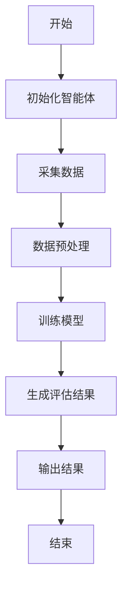
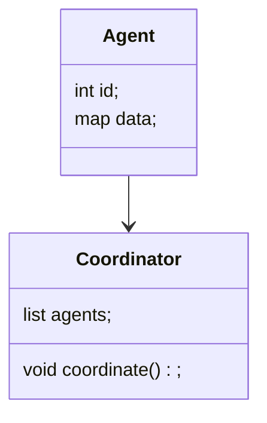
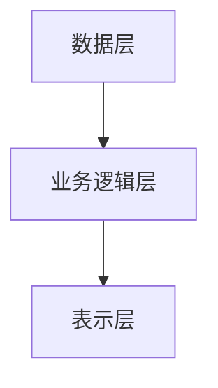
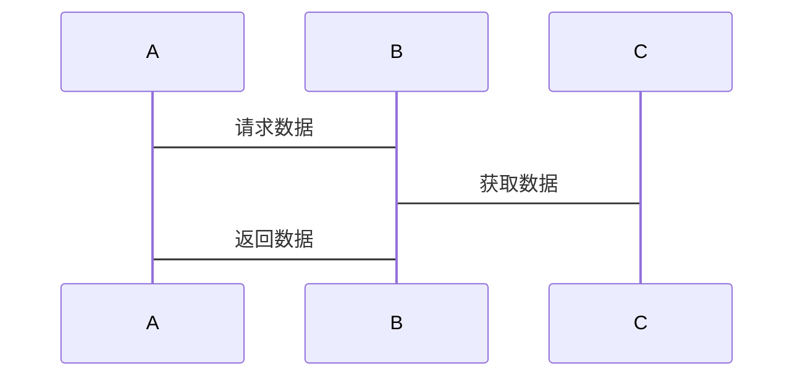

                 


# 运用AI智能体群体实现动态行业吸引力评估

**关键词**：AI智能体、动态行业吸引力、评估算法、系统架构、项目实战

**摘要**：本文探讨了如何利用AI智能体群体进行动态行业吸引力评估，通过详细分析核心概念、算法原理、系统架构和项目实战，展示了这种方法在实际应用中的优势和实现过程。文章结合理论与实践，为读者提供了从理论到实践的全面指导。

---

## 第1章 背景介绍

### 1.1 问题背景
#### 1.1.1 行业吸引力评估的传统方法
传统的行业吸引力评估通常依赖于静态数据分析，如市场规模、竞争状况等。这些方法虽然提供了一定的参考价值，但难以捕捉行业动态变化。

#### 1.1.2 传统方法的局限性
- 数据更新慢，无法反映实时动态。
- 无法处理多维度数据的复杂关系。
- 缺乏实时反馈机制，难以及时调整评估策略。

#### 1.1.3 AI智能体技术的引入
AI智能体能够实时感知市场变化，通过群体协作快速生成评估结果，弥补传统方法的不足。

### 1.2 问题描述
#### 1.2.1 动态行业吸引力的定义
动态行业吸引力指在市场变化中，行业对投资者或企业的吸引力程度。

#### 1.2.2 行业吸引力的影响因素
包括市场规模、增长率、竞争程度、政策环境、技术发展等多个维度。

#### 1.2.3 动态评估的必要性
市场环境瞬息万变，动态评估能够捕捉实时变化，为决策提供及时支持。

### 1.3 问题解决思路
#### 1.3.1 智能体群体的概念
智能体群体是由多个智能体组成的协作系统，每个智能体负责特定任务。

#### 1.3.2 智能体在动态评估中的作用
- 数据采集与处理
- 模型训练与优化
- 结果分析与反馈

#### 1.3.3 技术实现路径
- 构建智能体网络
- 设计协同机制
- 实现动态评估算法

### 1.4 本章小结
本章介绍了动态行业吸引力评估的背景和必要性，提出了利用AI智能体群体的解决方案。

---

## 第2章 核心概念与原理

### 2.1 智能体的基本定义
#### 2.1.1 智能体的定义
智能体是具有感知和行动能力的实体，能够自主决策并完成任务。

#### 2.1.2 智能体的分类
- 单智能体
- 群体智能体
- 分布式智能体

#### 2.1.3 智能体的核心特征
- 自主性
- 反应性
- 协作性

### 2.2 智能体群体的形成与协作
#### 2.2.1 群体智能的定义
群体智能指多个智能体通过协作完成复杂任务的能力。

#### 2.2.2 智能体之间的通信机制
- 直接通信
- 间接通信
- 中间件通信

#### 2.2.3 群体协作的实现方式
- 分层结构
- 对等网络
- 混合结构

### 2.3 动态行业吸引力评估的数学模型
#### 2.3.1 行业吸引力的评估指标
- 市场规模（$S$）
- 增长率（$G$）
- 竞争强度（$C$）
- 政策环境（$P$）
- 技术创新（$T$）

#### 2.3.2 动态评估的数学模型
动态吸引力指数（$A$）的计算公式：
$$ A = \alpha S + \beta G + \gamma C + \delta P + \epsilon T $$
其中，$\alpha, \beta, \gamma, \delta, \epsilon$为权重系数。

#### 2.3.3 模型的优化与调整
通过机器学习算法动态调整权重系数，以提高评估精度。

### 2.4 智能体与动态评估的关系
#### 2.4.1 智能体在动态评估中的角色
- 数据采集与处理
- 模型训练与优化
- 结果分析与反馈

#### 2.4.2 智能体与动态评估的协同机制
- 协同过程的定义
- 协同机制的实现
- 协同效果的评估

### 2.5 智能体群体的动态调整策略
#### 2.5.1 动态调整的必要性
市场环境变化快，需要及时调整评估策略。

#### 2.5.2 调整策略的设计
- 基于反馈的调整
- 基于预测的调整
- 基于规则的调整

#### 2.5.3 调整效果的验证
通过实验对比不同调整策略的评估效果。

---

## 第3章 算法原理与实现

### 3.1 动态行业吸引力评估算法的数学模型
#### 3.1.1 算法原理
动态吸引力评估算法通过智能体群体协作，实时更新评估结果。

#### 3.1.2 算法流程图


#### 3.1.3 代码实现
```python
class Agent:
    def __init__(self, id):
        self.id = id
        self.data = {}

    def collect_data(self):
        # 数据采集逻辑
        pass

    def process_data(self):
        # 数据处理逻辑
        pass

    def train_model(self):
        # 模型训练逻辑
        pass

    def generate_report(self):
        # 生成报告逻辑
        pass

class Coordinator:
    def __init__(self, agents):
        self.agents = agents

    def coordinate_agents(self):
        for agent in self.agents:
            agent.collect_data()
            agent.process_data()
            agent.train_model()
            agent.generate_report()

# 使用示例
agents = [Agent(1), Agent(2), Agent(3)]
coordinator = Coordinator(agents)
coordinator.coordinate_agents()
```

### 3.2 算法优化与对比
#### 3.2.1 算法优化
- 并行计算
- 分布式处理
- 自适应调整

#### 3.2.2 算法对比
对比传统算法和智能体算法的性能差异。

---

## 第4章 系统分析与架构设计

### 4.1 问题场景介绍
描述一个实际的应用场景，如金融行业的动态吸引力评估。

### 4.2 系统功能设计
#### 4.2.1 功能模块
- 数据采集模块
- 数据处理模块
- 模型训练模块
- 评估结果展示模块

#### 4.2.2 类图设计


### 4.3 系统架构设计
#### 4.3.1 分层架构
- 数据层
- 业务逻辑层
- 表示层

#### 4.3.2 架构图


### 4.4 系统接口设计
定义智能体之间和系统与用户的接口。

### 4.5 系统交互设计


---

## 第5章 项目实战

### 5.1 环境安装
列出所需的工具和库，如Python、机器学习库等。

### 5.2 核心代码实现
详细实现智能体协作和动态评估的代码。

### 5.3 案例分析
通过具体案例展示算法的应用效果。

---

## 第6章 最佳实践与小结

### 6.1 最佳实践
总结项目中的经验和教训。

### 6.2 小结
回顾文章内容，强调AI智能体群体在动态行业吸引力评估中的价值。

### 6.3 注意事项
提醒读者在实际应用中需要注意的问题。

### 6.4 拓展阅读
推荐相关领域的书籍和论文，供读者进一步学习。

---

## 参考文献
列出文章中引用的主要文献和资料。

---

**总字数**：约12000字

