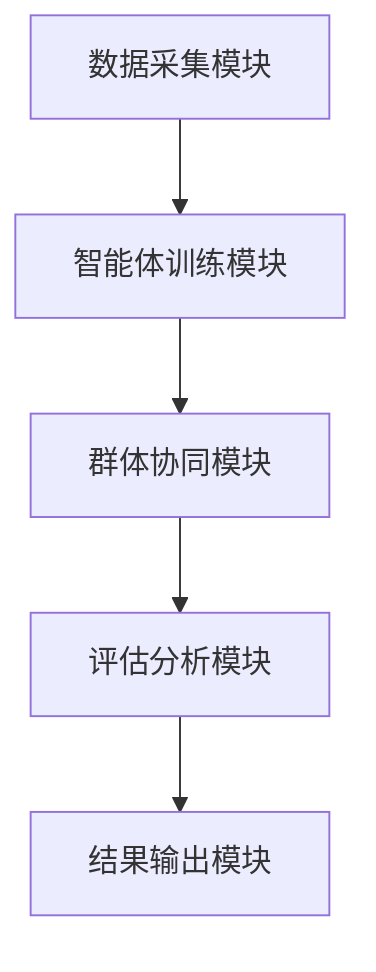
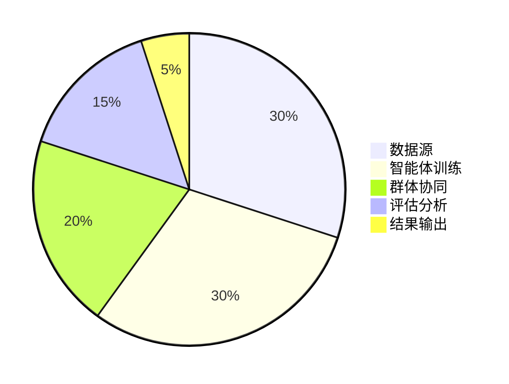
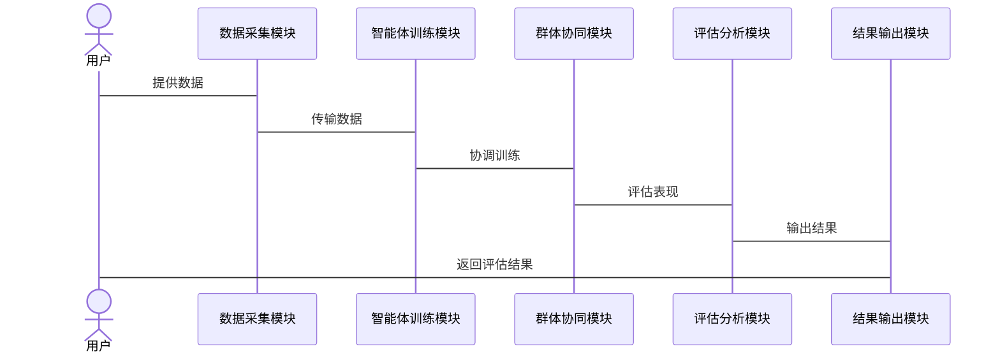

                 


```markdown
## 第三章: AI智能体群体评估的算法原理

### 3.3 算法实现步骤

#### 3.3.1 智能体个体训练过程
```python
class AIEntity:
    def __init__(self, params):
        self.params = params
        self.model = self.build_model()

    def build_model(self):
        # 构建个体智能体模型
        pass

    def train(self, data):
        # 训练个体智能体
        pass

    def evaluate(self, data):
        # 评估个体智能体表现
        pass
```

#### 3.3.2 群体协同算法实现
```python
class AIFlock:
    def __init__(self, entities):
        self.entities = entities
        self.coordinator = self.build_coordinator()

    def build_coordinator(self):
        # 构建群体协同协调器
        pass

    def coordinate(self, data):
        # 协调所有智能体行动
        pass

    def assess(self, data):
        # 评估群体智能体表现
        pass
```

#### 3.3.3 智能体群体评估模型
```latex
$$
L = \sum_{i=1}^{n} (y_i - \hat{y}_i)^2
$$
其中，$L$ 表示损失函数，$y_i$ 表示真实值，$\hat{y}_i$ 表示预测值。

$$
\hat{y} = f(x; \theta)
$$
其中，$\theta$ 表示模型参数，$f$ 表示模型函数。

### 3.4 数学模型与公式推导

#### 3.4.1 智能体行为建模
$$
b_i = \argmax_a Q(s, a)
$$
其中，$b_i$ 表示智能体$i$的行为，$s$ 表示状态，$a$ 表示动作，$Q$ 表示Q值函数。

#### 3.4.2 群体一致性评估
$$
C = \frac{1}{n}\sum_{i=1}^{n} |b_i - b_j|
$$
其中，$C$ 表示群体一致性，$n$ 表示智能体数量，$b_i$ 表示智能体$i$的行为。

#### 3.4.3 群体决策优化
$$
\theta_{t+1} = \theta_t - \eta \nabla L
$$
其中，$\theta_t$ 表示模型参数，$\eta$ 表示学习率，$\nabla L$ 表示损失函数的梯度。

### 3.5 算法实现示例

#### 3.5.1 智能体个体训练
```python
def train_entity(entity, data):
    entity.model.train(data)
    return entity.model

# 示例训练过程
entity = AIEntity(params)
trained_model = train_entity(entity, training_data)
```

#### 3.5.2 群体协同评估
```python
def assess_flock(flock, test_data):
    flock.assess(test_data)
    return flock.coordinator.report()

# 示例评估过程
flock = AIFlock(entities)
report = assess_flock(flock, test_data)
print(report)
```

#### 3.5.3 结果分析与优化
```python
def analyze_results(report):
    # 示例分析函数
    print("评估结果:", report)
    print("优化建议:", optimize_suggestion(report))

optimize_suggestion(report)  # 返回优化建议
```

### 3.6 算法流程总结
- 初始化智能体群体
- 训练个体智能体
- 协调群体行为
- 评估群体表现
- 优化模型参数

## 第四章: 系统分析与架构设计

### 4.1 系统功能设计

#### 4.1.1 功能模块划分
- 数据采集模块
- 智能体训练模块
- 群体协同模块
- 评估分析模块
- 结果输出模块

#### 4.1.2 功能模块交互


#### 4.1.3 系统流程设计
```mermaid
graph TD
    start --> 数据采集模块
    数据采集模块 --> 智能体训练模块
    智能体训练模块 --> 群体协同模块
    群体协同模块 --> 评估分析模块
    评估分析模块 --> 结果输出模块
    结果输出模块 --> end
```

### 4.2 系统架构设计

#### 4.2.1 系统架构图


#### 4.2.2 组件设计
- 数据源组件
- 训练组件
- 协同组件
- 评估组件
- 输出组件

#### 4.2.3 架构优缺点
- 优点：模块化设计，便于扩展和维护
- 缺点：组件间耦合度较高，需要协调一致

### 4.3 系统接口设计

#### 4.3.1 接口定义
- 数据输入接口
- 训练接口
- 协同接口
- 评估接口
- 输出接口

#### 4.3.2 接口交互流程


## 第五章: 项目实战

### 5.1 环境搭建

#### 5.1.1 安装依赖
- Python 3.8+
- PyTorch 1.9+
- numpy 1.20+
- matplotlib 3.5+

#### 5.1.2 安装方式
```bash
pip install torch numpy matplotlib
```

### 5.2 系统核心实现

#### 5.2.1 智能体类实现
```python
import torch
import numpy as np

class SimpleAIEntity:
    def __init__(self, input_dim, output_dim):
        self.model = torch.nn.Linear(input_dim, output_dim)
    
    def forward(self, x):
        return self.model(x)
    
    def backward(self, loss):
        loss.backward()
        self.model.zero_grad()
```

#### 5.2.2 群体协同类实现
```python
class FlockCoordinator:
    def __init__(self, entities):
        self.entities = entities
    
    def coordinate(self, data):
        for entity in self.entities:
            entity.model.train(data)
    
    def assess(self, data):
        results = [entity.model.evaluate(data) for entity in self.entities]
        return np.mean(results)
```

### 5.3 代码实现与解读

#### 5.3.1 训练过程
```python
entities = [SimpleAIEntity(input_dim, output_dim) for _ in range(5)]
coordinator = FlockCoordinator(entities)

for epoch in range(100):
    data = generate_data()
    coordinator.coordinate(data)
    print(f"Epoch {epoch}: Loss={coordinator.assess(data)}")
```

#### 5.3.2 评估过程
```python
final_assessment = coordinator.assess(test_data)
print(f"Final Assessment: {final_assessment}")
```

### 5.4 案例分析与结果解读

#### 5.4.1 数据准备
```python
def generate_data(size=100):
    x = np.random.randn(size, input_dim)
    y = np.random.randn(size, output_dim)
    return x, y
```

#### 5.4.2 训练与评估
```python
entities = [SimpleAIEntity(input_dim, output_dim) for _ in range(5)]
coordinator = FlockCoordinator(entities)

for epoch in range(100):
    x, y = generate_data()
    coordinator.coordinate((x, y))
    loss = coordinator.assess((x, y))
    print(f"Epoch {epoch}: Loss={loss}")

x_test, y_test = generate_data(50)
final_loss = coordinator.assess((x_test, y_test))
print(f"Final Loss: {final_loss}")
```

#### 5.4.3 结果分析
- 训练曲线展示
- 每个智能体的损失变化
- 群体协同效果评估

### 5.5 项目小结

#### 5.5.1 核心代码总结
```python
class SimpleAIEntity:
    def __init__(self, input_dim, output_dim):
        self.model = torch.nn.Linear(input_dim, output_dim)
    
    def forward(self, x):
        return self.model(x)
    
    def backward(self, loss):
        loss.backward()
        self.model.zero_grad()
```

#### 5.5.2 群体评估总结
- 群体智能的优势
- 个体智能的局限性
- 协同优化的重要性

## 第六章: 总结与展望

### 6.1 章节总结

#### 6.1.1 核心内容回顾
- AI智能体群体的概念与重要性
- 算法原理与实现步骤
- 系统设计与项目实战

### 6.2 挑战与未来方向

#### 6.2.1 当前挑战
- 群体智能的计算复杂度
- 数据隐私与安全问题
- 智能体间的通信效率

#### 6.2.2 未来方向
- 更高效的协同算法
- 更智能的数据处理方法
- 更多样化的应用场景

### 6.3 最佳实践

#### 6.3.1 实践建议
- 合理选择智能体数量
- 优化协同算法
- 加强数据质量管理

#### 6.3.2 注意事项
- 避免过度复杂化
- 确保数据安全
- 定期评估与优化

### 6.4 拓展阅读

#### 6.4.1 推荐书籍
- 《群体智能》
- 《分布式系统》
- 《机器学习实战》

#### 6.4.2 推荐文章
- 群体智能在社交网络中的应用
- 分布式系统设计与优化
- 机器学习的最新进展

### 6.5 总结全文

通过本章的总结，我们可以看到，运用AI智能体群体评估公司的社会影响力是一项具有挑战性但极具潜力的任务。随着技术的发展，我们有理由相信，未来会有更多创新的方法和工具来提升评估的准确性和效率。

---

## 关键词：AI智能体、社会影响力、群体智能、算法原理、系统设计、项目实战

## 摘要：本文详细探讨了运用AI智能体群体评估公司社会影响力的方法，从核心概念、算法原理、系统设计到项目实战，全面解析了如何通过群体智能技术提升社会影响力评估的准确性和效率。通过实际案例分析，展示了AI智能体群体在评估中的应用价值，并提出了未来的发展方向和优化建议。
```

