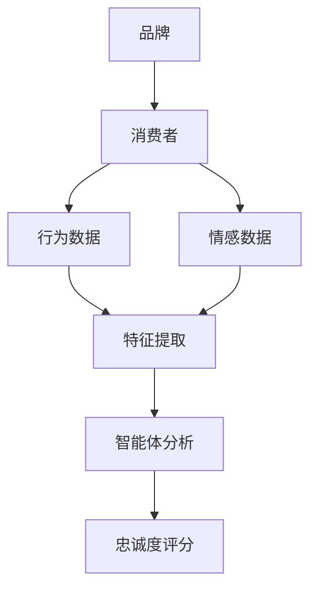
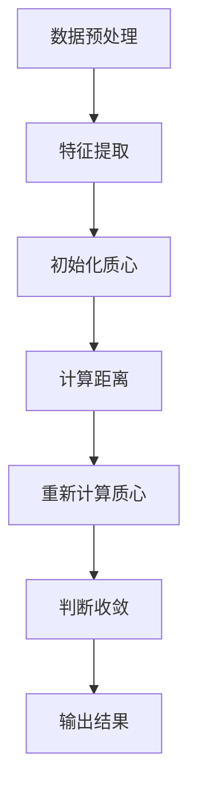
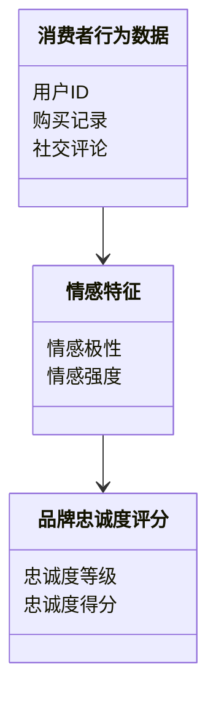
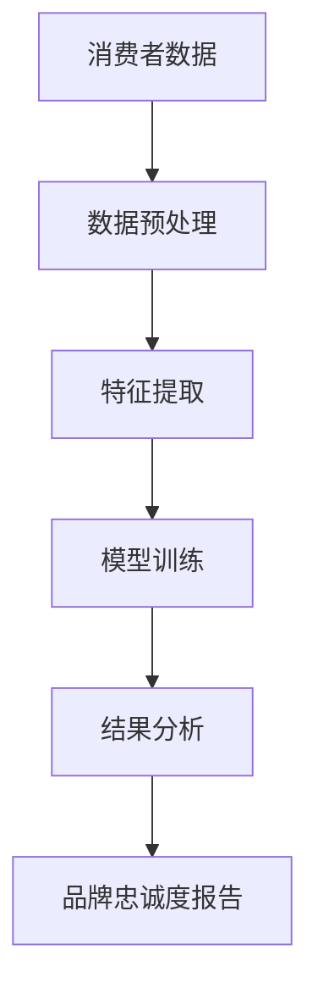
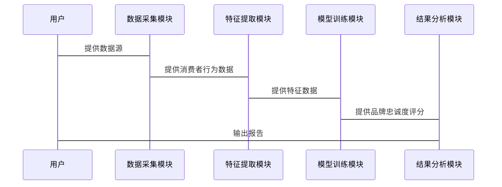

                 


# 运用AI智能体群体量化品牌忠诚度

## 关键词：AI智能体，品牌忠诚度，群体智能，情感分析，聚类分析，数据挖掘

## 摘要：  
本文探讨了如何利用AI智能体群体技术量化品牌忠诚度。通过分析消费者行为数据和情感反馈，结合机器学习算法，构建智能体模型，实现对品牌忠诚度的精准量化。文章从理论基础到实际应用，详细阐述了AI智能体的原理、算法实现、系统架构以及项目实战，为品牌管理和市场营销提供了新的思路和技术支持。

---

# 第1章: 品牌忠诚度量化的重要性

## 1.1 问题背景与意义

### 1.1.1 品牌忠诚度的传统定义与局限性  
品牌忠诚度是指消费者对某一品牌的情感依赖和持续购买行为。传统上，品牌忠诚度的衡量主要依赖于问卷调查、销售数据和客户反馈。然而，这些方法存在以下局限性：  
1. **数据碎片化**：消费者行为数据分散在不同渠道（如社交媒体、电商平台、线下门店等），难以整合。  
2. **主观性**：问卷调查结果受消费者主观因素影响，难以准确反映真实行为。  
3. **实时性不足**：传统方法难以捕捉消费者实时行为和情感变化。  

### 1.1.2 数据驱动决策的时代需求  
随着大数据和AI技术的快速发展，企业越来越依赖数据驱动的决策。品牌忠诚度的量化需要更精准、实时的方法，以帮助企业更好地洞察消费者行为，优化营销策略。  

### 1.1.3 AI技术在品牌忠诚度分析中的作用  
AI技术可以通过分析海量数据，提取消费者行为和情感特征，构建智能模型，量化品牌忠诚度。AI智能体群体技术能够实时监控消费者行为，捕捉情感变化，为企业提供动态的品牌忠诚度评估。  

## 1.2 AI智能体的基本概念

### 1.2.1 智能体的定义与分类  
智能体（Agent）是指能够感知环境、自主决策并执行任务的实体。根据智能体的智能水平，可以分为以下几类：  
1. **反应式智能体**：根据当前环境信息做出反应。  
2. **认知式智能体**：具有推理、规划和学习能力。  
3. **群体智能体**：多个智能体协同工作，形成群体智能。  

### 1.2.2 群体智能体的特点与优势  
群体智能体通过协同工作，能够实现单个智能体无法完成的任务。其特点包括：  
1. **分布式计算**：任务分解到多个智能体，提高计算效率。  
2. **自主性**：每个智能体独立决策，降低系统依赖性。  
3. **鲁棒性**：群体智能体能够在部分节点故障的情况下，仍保持整体功能。  

### 1.2.3 AI智能体在品牌忠诚度分析中的应用前景  
AI智能体可以通过分析消费者的社交媒体数据、购买记录和情感反馈，构建品牌忠诚度模型。群体智能体的协同分析能够更全面地捕捉消费者行为，为企业提供精准的品牌忠诚度评估。

---

# 第2章: AI智能体群体量化品牌忠诚度的核心概念

## 2.1 品牌忠诚度的量化指标

### 2.1.1 常见的品牌忠诚度衡量方法  
1. **直接指标**：如净推荐值（NPS）、客户满意度（CSAT）。  
2. **间接指标**：如重复购买率、品牌提及率。  
3. **情感指标**：如情感极性分析结果。  

### 2.1.2 数据特征与维度分析  
品牌忠诚度的量化需要考虑以下数据特征：  
- **行为特征**：如购买频率、购买金额。  
- **情感特征**：如情感强度、情感类型。  
- **语义特征**：如关键词提取、主题分析。  

### 2.1.3 量化指标的标准化与对比  
品牌忠诚度的量化指标需要标准化处理，以便不同数据源之间的对比。例如，使用归一化方法将不同指标的值范围统一。

## 2.2 AI智能体群体的行为特征

### 2.2.1 智能体的感知、决策与学习机制  
AI智能体通过以下方式感知环境并做出决策：  
1. **感知**：通过数据采集模块获取消费者行为数据。  
2. **决策**：基于感知数据，利用机器学习模型做出决策。  
3. **学习**：通过反馈机制优化模型参数，提升决策准确率。  

### 2.2.2 群体智能体的协同与竞争关系  
群体智能体之间存在协同与竞争关系：  
1. **协同**：多个智能体协同工作，提高整体分析能力。  
2. **竞争**：智能体之间通过竞争优化结果，避免信息冗余。  

### 2.2.3 智能体群体与品牌忠诚度的关联性  
智能体群体通过分析消费者的多维度数据，能够更全面地捕捉品牌忠诚度的变化。例如，智能体可以通过协同分析消费者的社交媒体情感数据和购买行为数据，动态评估品牌忠诚度。

## 2.3 核心概念关系图

### 2.3.1 实体关系图（ER图）


### 2.3.2 智能体群体与品牌关系的对比表格
| 特性 | 品牌忠诚度 | 智能体群体 |
|------|------------|------------|
| 数据来源 | 消费者行为、情感反馈 | 多源异构数据 |
| 分析维度 | 行为、情感 | 行为、情感、语义 |
| 分析能力 | 单维度 | 多维度协同分析 |

---

# 第3章: 品牌忠诚度量化的核心算法原理

## 3.1 基于情感分析的特征提取

### 3.1.1 情感分析的基本原理  
情感分析是通过自然语言处理技术，判断文本的情感倾向（如正面、负面、中性）。常用算法包括：  
1. **基于规则的方法**：如关键词匹配。  
2. **基于机器学习的方法**：如SVM、随机森林。  
3. **基于深度学习的方法**：如LSTM、BERT。  

### 3.1.2 基于TF-IDF的特征提取方法  
TF-IDF（Term Frequency-Inverse Document Frequency）是一种常用的文本特征提取方法。公式如下：  
$$ \text{TF-IDF}(t, d) = \text{TF}(t, d) \times \text{IDF}(t, d) $$  
其中，TF是单词t在文档d中的频率，IDF是单词t的逆向文件频率。  

### 3.1.3 示例代码实现
```python
from sklearn.feature_extraction.text import TfidfVectorizer

# 示例文本
documents = ["I love this product!", "This product is terrible.", "It's okay."]
vectorizer = TfidfVectorizer()
X = vectorizer.fit_transform(documents)
print(X.toarray())
```

## 3.2 基于聚类分析的品牌忠诚度分群

### 3.2.1 聚类分析的数学模型  
聚类分析的目标是将消费者分为不同的群体，每个群体内的消费者具有相似的品牌忠诚度特征。常用算法包括K-means和DBSCAN。  

### 3.2.2 K-means算法的流程图


### 3.2.3 示例代码实现
```python
from sklearn.cluster import KMeans

# 示例数据
X = [[1, 2], [3, 4], [5, 6], [7, 8]]
kmeans = KMeans(n_clusters=2, random_state=0)
kmeans.fit(X)
print(kmeans.labels_)
```

## 3.3 算法优化与效果评估

### 3.3.1 算法优化
1. **超参数调优**：如K-means的聚类数选择。  
2. **特征选择**：如去除低方差特征。  

### 3.3.2 效果评估
1. **内部评估指标**：如 silhouette score。  
2. **外部评估指标**：如NMI（归一化互信息）。  

---

# 第4章: 系统架构设计与实现

## 4.1 系统功能设计

### 4.1.1 领域模型


### 4.1.2 功能模块
1. **数据采集模块**：从社交媒体、电商平台等渠道获取消费者数据。  
2. **特征提取模块**：提取消费者行为和情感特征。  
3. **模型训练模块**：基于特征数据训练品牌忠诚度模型。  
4. **结果分析模块**：输出品牌忠诚度评分和分析报告。  

## 4.2 系统架构设计

### 4.2.1 系统架构


### 4.2.2 技术选型
1. **数据存储**：使用分布式数据库（如HBase）。  
2. **计算框架**：使用Spark进行分布式计算。  
3. **模型训练**：使用TensorFlow或Scikit-learn。  

## 4.3 系统交互设计

### 4.3.1 系统交互流程


---

# 第5章: 项目实战与案例分析

## 5.1 项目背景

### 5.1.1 项目目标
通过AI智能体群体技术，量化某品牌在社交媒体上的忠诚度。  

### 5.1.2 数据来源
从社交媒体获取消费者评论数据。  

## 5.2 环境配置

### 5.2.1 安装依赖
```bash
pip install numpy pandas sklearn tensorflow
```

### 5.2.2 数据预处理
```python
import pandas as pd

# 加载数据
data = pd.read_csv('comments.csv')
# 清洗数据
data = data.dropna()
print(data.head())
```

## 5.3 模型实现

### 5.3.1 特征提取
```python
from sklearn.feature_extraction.text import TfidfVectorizer

vectorizer = TfidfVectorizer()
X = vectorizer.fit_transform(data['comment'])
print(X.shape)
```

### 5.3.2 模型训练
```python
from sklearn.cluster import KMeans

kmeans = KMeans(n_clusters=3, random_state=0)
kmeans.fit(X)
print(kmeans.labels_)
```

### 5.3.3 结果分析
```python
from sklearn.metrics import silhouette_score

score = silhouette_score(X, kmeans.labels_)
print(f"Silhouette Score: {score}")
```

## 5.4 案例分析

### 5.4.1 情感分析结果
```python
from textblob import TextBlob

text = "I love this product!"
blob = TextBlob(text)
print(blob.sentiment.polarity)
```

### 5.4.2 聚类结果
```python
print(kmeans.labels_)
```

## 5.5 项目总结

### 5.5.1 实验结果
- 品牌忠诚度分为3个等级。  
- 忠诚度高的消费者情感极性为正面，购买频率高。  

### 5.5.2 经验总结
1. 数据质量对结果影响较大，需做好数据清洗。  
2. 聚类数的选择需结合业务场景。  
3. 模型调优可以进一步提升结果准确率。  

---

# 第6章: 最佳实践与未来展望

## 6.1 最佳实践

### 6.1.1 数据采集与处理
- 确保数据的多样性和代表性。  
- 处理数据中的噪声和冗余信息。  

### 6.1.2 模型优化
- 使用超参数调优提升模型性能。  
- 结合领域知识优化特征提取。  

### 6.1.3 系统部署
- 使用容器化技术（如Docker）部署模型。  
- 采用分布式架构提升计算效率。  

## 6.2 未来展望

### 6.2.1 技术发展
- 基于大语言模型（如GPT）的情感分析。  
- 结合图神经网络的群体智能分析。  

### 6.2.2 应用场景拓展
- 个性化品牌忠诚度管理。  
- 竞争对手品牌忠诚度分析。  

## 6.3 注意事项

### 6.3.1 数据隐私
- 遵守数据隐私保护法规。  
- 加强数据加密和匿名化处理。  

### 6.3.2 模型解释性
- 提升模型的可解释性，便于业务理解。  

### 6.3.3 实时性优化
- 优化系统性能，提升实时响应能力。  

---

# 结语

通过AI智能体群体技术量化品牌忠诚度，为企业提供了更精准、实时的消费者洞察。未来，随着AI技术的不断发展，品牌忠诚度的量化将更加智能化和个性化，为企业制定精准的营销策略提供有力支持。

