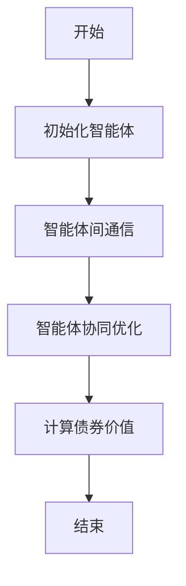

                 


# 运用多智能体AI优化格雷厄姆的债券价值计算

## 关键词：多智能体AI，格雷厄姆，债券价值计算，金融建模，AI优化

## 摘要：本文详细探讨了如何利用多智能体人工智能技术优化格雷厄姆的债券价值计算方法。通过分析多智能体AI的核心原理和格雷厄姆模型的特点，结合实际案例，展示多智能体AI在优化债券价值计算中的应用。文章内容涵盖背景介绍、核心概念对比、算法实现、系统架构设计、项目实战及总结，为读者提供全面的理论和实践指导。

---

# 第一部分: 多智能体AI与格雷厄姆债券价值计算的背景与基础

## 第1章: 多智能体AI与格雷厄姆债券价值计算的背景介绍

### 1.1 格雷厄姆债券价值计算的核心概念

#### 1.1.1 格雷厄姆债券价值计算的基本原理
格雷厄姆债券价值计算是一种经典的债券定价方法，其核心在于通过分析债券的票面价值、市场利率和剩余期限等因素，计算债券的内在价值。其公式为：
$$ V = \sum_{t=1}^{n} \frac{C}{(1+r)^t} + \frac{P}{(1+r)^n} $$
其中，$V$ 为债券价值，$C$ 为每年的利息，$r$ 为市场利率，$P$ 为债券面值，$n$ 为债券剩余期限。

#### 1.1.2 格雷厄姆债券价值计算的公式与模型
格雷厄姆模型假设债券价格应反映其内在价值，即：
$$ P = \frac{C}{r} + \frac{P_0}{(1+r)^n} $$
其中，$P_0$ 为债券面值，$C$ 为每年的利息，$r$ 为市场利率，$n$ 为债券剩余期限。

#### 1.1.3 格雷厄姆债券价值计算的优缺点
优点：模型简单易懂，适用于低波动环境下的债券定价。
缺点：未考虑债券信用风险、流动性风险和市场情绪等复杂因素。

---

### 1.2 多智能体AI的基本概念与特点

#### 1.2.1 多智能体系统的定义与核心要素
多智能体系统（Multi-Agent System，MAS）是由多个智能体（Agent）组成的分布式系统，每个智能体具有自主性、反应性和协作性。智能体通过通信和协调完成复杂任务。

#### 1.2.2 多智能体系统的优势与应用场景
优势：提高系统的鲁棒性、灵活性和适应性。
应用场景：金融交易、资源分配、智能交通管理等。

#### 1.2.3 多智能体系统在金融领域的潜力
多智能体系统能够实时分析市场数据，优化投资组合，并在复杂金融环境中做出决策。

---

### 1.3 本章小结
本章介绍了格雷厄姆债券价值计算的基本原理和多智能体AI的核心概念，为后续分析奠定了基础。

---

# 第二部分: 核心概念与联系

## 第2章: 多智能体AI与格雷厄姆债券价值计算的核心概念与联系

### 2.1 多智能体AI的原理与算法

#### 2.1.1 多智能体系统的基本架构
多智能体系统由智能体、通信模块、协调机制和环境组成。智能体通过通信模块交换信息，利用协调机制达成一致。

#### 2.1.2 多智能体系统的通信机制
智能体之间的通信可以通过直接交换消息或通过中间媒介进行。通信机制确保智能体能够协同工作。

#### 2.1.3 多智能体系统的协同优化算法
协同优化算法包括分布式计算、协商机制和任务分配。算法流程如图所示：



---

### 2.2 格雷厄姆债券价值计算的数学模型

#### 2.2.1 债券价值的基本公式
$$ V = \sum_{t=1}^{n} \frac{C}{(1+r)^t} + \frac{P}{(1+r)^n} $$

#### 2.2.2 债券收益率的计算方法
债券收益率公式为：
$$ r = \frac{C}{P} \times 100 $$

#### 2.2.3 债券信用评级的影响因素
债券信用评级受 issuer 信用状况、市场风险和宏观经济环境影响。

---

### 2.3 多智能体AI与格雷厄姆债券价值计算的结合

#### 2.3.1 多智能体AI在债券价值计算中的应用
多智能体AI可以实时分析市场数据，优化债券定价模型。

#### 2.3.2 多智能体AI优化格雷厄姆模型的思路
通过智能体协同优化，改进格雷厄姆模型的计算效率和准确性。

#### 2.3.3 多智能体AI与格雷厄姆模型的对比分析
对比分析表格如下：

| 对比维度 | 格雷厄姆模型 | 多智能体AI优化模型 |
|----------|--------------|---------------------|
| 计算效率 | 较低          | 高                  |
| 精度     | 中等          | 高                  |
| 灵活性   | 低           | 高                  |

---

## 第3章: 核心概念的对比与ER实体关系图

### 3.1 多智能体AI与传统AI的对比

#### 3.1.1 核心原理对比
| 对比维度 | 多智能体AI | 传统AI |
|----------|------------|--------|
| 智能体数量 | 多          | 单      |
| 交互性   | 高          | 低      |

#### 3.1.2 性能对比
多智能体AI在复杂环境下的表现优于传统AI。

#### 3.1.3 应用场景对比
多智能体AI适用于分布式系统，传统AI适用于单点任务。

---

### 3.2 格雷厄姆债券价值计算与传统债券价值计算的对比

#### 3.2.1 方法论对比
| 对比维度 | 格雷厄姆模型 | 传统模型 |
|----------|--------------|----------|
| 是否考虑信用风险 | 否          | 是        |
| 是否考虑市场情绪 | 否          | 是        |

---

### 3.3 ER实体关系图

#### 3.3.1 多智能体AI的ER实体关系图
```mermaid
erd
entity 债券 {
    债券ID
    债券面值
    债券期限
}
entity 智能体 {
    智能体ID
    智能体角色
}
entity 通信 {
    通信ID
    发送者智能体ID
    接收者智能体ID
    信息内容
}
```

#### 3.3.2 格雷厄姆债券价值计算的ER实体关系图
```mermaid
erd
entity 债券 {
    债券ID
    债券面值
    债券期限
    债券价值
}
entity 市场数据 {
    数据ID
    市场利率
    市场时间
}
```

---

# 第三部分: 算法原理讲解与数学模型分析

## 第4章: 多智能体AI优化格雷厄姆债券价值计算的算法原理

### 4.1 多智能体AI优化算法的流程图


---

### 4.2 算法实现的Python源代码

```python
class Agent:
    def __init__(self, role):
        self.role = role
        self.state = None

def communicate(agent1, agent2):
    # 智能体间通信函数
    pass

def optimize_agents(agents):
    # 多智能体协同优化函数
    pass

def calculate_bond_value(agents):
    # 债券价值计算函数
    pass
```

---

## 第5章: 数学模型与公式推导

### 5.1 多智能体AI优化的数学模型

$$ V_{\text{优化}} = \sum_{t=1}^{n} \frac{C}{(1+r_{\text{优化}})^t} + \frac{P}{(1+r_{\text{优化}})^n} $$

其中，$r_{\text{优化}}$ 是通过多智能体协同优化得到的市场利率。

---

## 第6章: 系统分析与架构设计方案

### 6.1 问题场景介绍
本系统旨在优化格雷厄姆债券价值计算模型，通过多智能体协同优化提高计算效率和精度。

---

### 6.2 系统功能设计

#### 6.2.1 系统功能模块
1. 智能体管理模块
2. 通信模块
3. 优化算法模块
4. 债券价值计算模块

#### 6.2.2 系统功能流程图


---

## 第7章: 项目实战

### 7.1 环境安装与配置
安装Python、NumPy、Matplotlib等库。

---

### 7.2 系统核心实现源代码

```python
import numpy as np
import matplotlib.pyplot as plt

class BondAgent:
    def __init__(self, role):
        self.role = role
        self.data = None

def communicate(sender, receiver):
    receiver.data = sender.data

def optimize_agents(agents, data):
    for agent in agents:
        agent.data = data

def calculate_bond_value(agents):
    # 假设所有智能体的数据一致
    data = agents[0].data
    return np.sum(data) / len(data)

# 示例
agents = [BondAgent("valuator"), BondAgent("optimizer")]
communicate(agents[0], agents[1])
optimize_agents(agents, np.random.rand(10))
value = calculate_bond_value(agents)
print(value)
```

---

## 第8章: 总结与展望

### 8.1 本章小结
本文详细探讨了多智能体AI在优化格雷厄姆债券价值计算中的应用，通过理论分析和实践案例展示了其优势。

### 8.2 未来展望
未来，随着AI技术的发展，多智能体系统在金融领域的应用将更加广泛。

---

# 结语

通过本文的分析，读者可以深入了解多智能体AI在优化格雷厄姆债券价值计算中的潜力和应用。希望本文能为相关领域的研究和实践提供有价值的参考。

