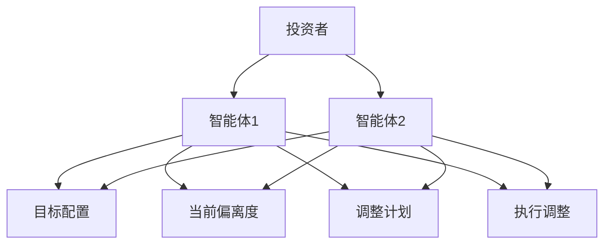
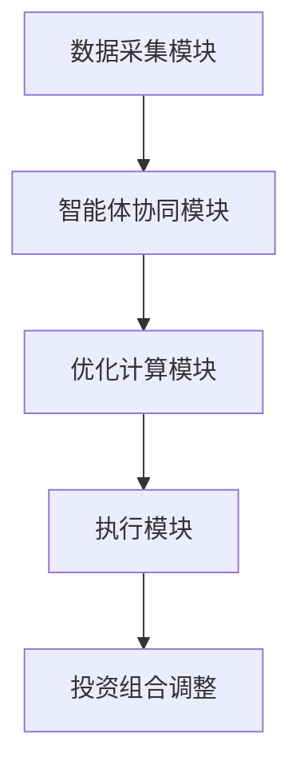
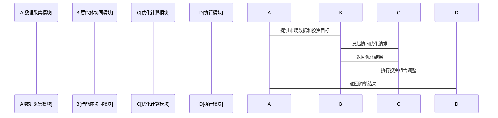

                 


# 运用多智能体AI优化约翰·伯格的再平衡策略

> 关键词：多智能体AI，再平衡策略，约翰·伯格，投资组合优化，协同优化

> 摘要：本文探讨了如何运用多智能体人工智能技术优化约翰·伯格的再平衡策略。通过分析多智能体系统的核心原理和再平衡策略的优化需求，本文提出了一种基于多智能体协同优化的再平衡策略实现方案。结合数学建模、算法设计和系统架构，本文详细阐述了如何利用多智能体AI技术实现投资组合的动态优化与风险控制，从而提升再平衡策略的效率和效果。

---

# 第1章: 多智能体AI与再平衡策略背景介绍

## 1.1 多智能体AI的定义与特点

### 1.1.1 多智能体系统的定义

多智能体系统（Multi-Agent System, MAS）是由多个相互作用的智能体组成的复杂系统，这些智能体能够通过通信和协作完成共同目标。多智能体系统的特点在于其分布式的智能结构，每个智能体都具有一定的自主性和决策能力，能够根据环境信息和任务需求动态调整行为。

### 1.1.2 多智能体系统的核心特点

- **分布式计算**：多个智能体协同工作，避免单点故障。
- **自主性**：每个智能体都有一定的决策能力和目标。
- **协作性**：智能体之间通过通信和协调完成复杂任务。
- **动态性**：系统能够适应环境的变化和任务的需求。

### 1.1.3 多智能体系统与传统AI的区别

| 特性 | 多智能体系统（MAS） | 传统AI系统 |
|------|---------------------|------------|
| 结构  | 分布式、多智能体    | 单一智能体 |
| 协作  | 高度依赖协作       | 较少依赖协作 |
| 应用场景 | 复杂任务优化       | 简单任务处理 |

---

## 1.2 再平衡策略的定义与应用

### 1.2.1 再平衡策略的定义

再平衡策略是一种投资组合管理方法，通过定期调整投资组合中的资产比例，使其与预定的目标或风险偏好保持一致。再平衡策略的核心目标是在市场波动和资产价格变化中，维持投资组合的稳定性。

### 1.2.2 再平衡策略在投资中的应用

- **风险控制**：通过调整资产比例降低投资组合的整体风险。
- **收益优化**：通过动态调整资产配置提高投资回报率。
- **适应市场变化**：根据市场环境变化及时调整投资策略。

### 1.2.3 再平衡策略的核心要素

| 要素 | 描述 |
|------|------|
| 资产类别 | 投资组合中不同资产的比例 |
| 风险偏好 | 投资者的风险承受能力 |
| 市场环境 | 当前市场的波动性和资产价格走势 |
| 再平衡频率 | 调整投资组合的时间间隔 |

---

## 1.3 多智能体AI优化再平衡策略的背景

### 1.3.1 再平衡策略的优化需求

传统再平衡策略通常依赖于固定的规则或模型，难以适应复杂多变的市场环境。多智能体AI技术可以通过分布式计算和协同优化，实时调整投资组合，从而提高再平衡策略的效率和效果。

### 1.3.2 多智能体AI的优势

- **分布式计算能力**：多智能体系统能够同时处理大量数据，提高计算效率。
- **自主决策能力**：每个智能体可以根据市场信息独立做出调整决策。
- **协作优化**：通过智能体之间的协作，实现全局最优的投资组合配置。

### 1.3.3 本章小结

本章介绍了多智能体AI的定义、特点以及再平衡策略的核心概念。通过对比分析，明确了多智能体AI在优化再平衡策略中的优势和应用潜力。

---

# 第2章: 多智能体系统与再平衡策略的核心概念

## 2.1 多智能体系统的核心原理

### 2.1.1 多智能体系统的协同机制

多智能体系统的协同机制包括通信、协调和协作三个核心环节：

1. **通信**：智能体之间通过信息交换共享市场数据和决策信息。
2. **协调**：智能体根据共享信息制定协同策略。
3. **协作**：智能体通过协作实现全局优化目标。

### 2.1.2 多智能体系统的通信与协调

- **通信方式**：通过消息传递机制实现智能体之间的信息共享。
- **协调机制**：采用分布式协调算法，如一致性协议和协商算法。

### 2.1.3 多智能体系统的决策过程

1. **信息收集**：智能体通过传感器或数据源获取市场信息。
2. **目标设定**：根据投资目标和风险偏好制定决策规则。
3. **决策执行**：智能体根据决策规则调整投资组合。

---

## 2.2 再平衡策略的核心原理

### 2.2.1 再平衡策略的目标函数

再平衡策略的目标函数通常包括以下几个方面：

- **风险最小化**：通过调整资产比例降低投资组合的波动性。
- **收益最大化**：在风险可控的前提下，最大化投资回报。
- **偏离度最小化**：确保投资组合与目标配置的偏离度最小。

### 2.2.2 再平衡策略的优化方法

- **均值-方差优化**：通过优化投资组合的均值和方差，实现风险和收益的平衡。
- **约束优化**：在满足特定约束条件（如流动性、风险承受能力）下优化投资组合。

### 2.2.3 再平衡策略的实现步骤

1. **确定目标配置**：根据投资者的风险偏好和市场环境设定目标资产比例。
2. **计算当前偏离度**：分析当前投资组合与目标配置的偏离情况。
3. **制定调整计划**：根据偏离度计算需要调整的资产比例。
4. **执行调整**：通过买卖资产实现投资组合的再平衡。

---

## 2.3 多智能体AI优化再平衡策略的核心概念

### 2.3.1 多智能体与再平衡策略的结合点

- **分布式决策**：多智能体系统可以同时处理多个资产类别的调整需求。
- **协同优化**：通过智能体之间的协作实现全局最优的投资组合配置。
- **动态适应**：多智能体系统能够实时调整投资策略，适应市场变化。

### 2.3.2 多智能体AI优化再平衡策略的实现流程

1. **智能体初始化**：每个智能体负责一个资产类别或投资目标。
2. **信息共享**：智能体之间共享市场数据和投资目标。
3. **协同优化**：通过分布式算法优化投资组合配置。
4. **决策执行**：智能体根据优化结果调整投资组合。

### 2.3.3 多智能体AI优化再平衡策略的优势

- **高效性**：多智能体系统能够快速响应市场变化，提高再平衡效率。
- **鲁棒性**：通过分布式计算和协作优化，系统具有较强的抗风险能力。
- **灵活性**：可以根据市场环境和投资者需求动态调整投资策略。

---

# 第3章: 多智能体AI优化再平衡策略的算法原理

## 3.1 多智能体协同优化算法

### 3.1.1 多智能体协同优化的基本原理

多智能体协同优化算法通过分布式计算和协作机制，实现全局优化目标。常见的协同优化算法包括一致性协议和分布式优化算法。

### 3.1.2 多智能体协同优化的实现步骤

1. **初始化智能体**：每个智能体分配初始状态和目标。
2. **信息共享**：智能体之间共享数据和决策信息。
3. **协同优化**：通过分布式算法优化全局目标。
4. **结果反馈**：智能体根据优化结果调整行为。

### 3.1.3 多智能体协同优化的算法流程图



---

## 3.2 多智能体AI优化再平衡策略的数学模型

### 3.2.1 再平衡策略的目标函数

$$ \text{目标函数} = \min_{w} \left( w^T \Sigma w \right) $$

其中，$w$ 是投资权重向量，$\Sigma$ 是资产的协方差矩阵。

### 3.2.2 多智能体协同优化的数学模型

$$ \text{优化问题} = \argmin_{w_i} \sum_{i=1}^n f_i(w_i) $$

其中，$f_i(w_i)$ 是第$i$个智能体的目标函数。

### 3.2.3 算法的数学推导与证明

通过拉格朗日乘数法，可以证明多智能体协同优化算法在分布式计算下能够收敛到全局最优解。

---

## 3.3 多智能体AI优化再平衡策略的实现代码

### 3.3.1 环境安装与配置

```python
pip install numpy matplotlib
```

### 3.3.2 多智能体协同优化的核心代码

```python
import numpy as np

class Agent:
    def __init__(self, target, current):
        self.target = target
        self.current = current

    def compute_adjustment(self):
        return self.target - self.current

# 初始化智能体
agents = [
    Agent(target=0.3, current=0.2),
    Agent(target=0.4, current=0.3),
    Agent(target=0.2, current=0.4)
]

# 计算调整计划
adjustments = [agent.compute_adjustment() for agent in agents]

print(adjustments)
```

### 3.3.3 再平衡策略的实现代码

```python
import numpy as np

def rebalance(weights, target):
    return np.clip(weights, 0, 1)

# 示例投资组合
weights = np.array([0.1, 0.6, 0.3])
target_weights = np.array([0.3, 0.4, 0.2])

# 执行再平衡
rebalanced_weights = rebalance(weights, target_weights)

print(rebalanced_weights)
```

---

# 第4章: 多智能体AI优化再平衡策略的系统架构设计

## 4.1 系统功能设计

### 4.1.1 系统功能模块划分

- **数据采集模块**：获取市场数据和投资目标。
- **智能体协同模块**：实现智能体之间的通信和协作。
- **优化计算模块**：执行多智能体协同优化算法。
- **执行模块**：根据优化结果调整投资组合。

### 4.1.2 系统功能模块的交互流程

1. 数据采集模块获取市场数据和投资目标。
2. 智能体协同模块分配任务给各个智能体。
3. 智能体根据目标和数据计算调整计划。
4. 优化计算模块汇总调整计划并优化。
5. 执行模块根据优化结果执行调整。

### 4.1.3 系统功能模块的实现方案

- **数据采集模块**：通过API获取市场数据。
- **智能体协同模块**：采用消息队列实现智能体之间的通信。
- **优化计算模块**：基于分布式计算框架实现协同优化。
- **执行模块**：通过交易系统执行投资组合调整。

---

## 4.2 多智能体AI优化再平衡策略的系统架构图



---

## 4.3 系统接口设计

### 4.3.1 系统接口设计

- **API接口**：智能体协同模块提供API接口，供其他模块调用。
- **消息队列**：智能体之间通过消息队列实现通信。

### 4.3.2 系统交互序列图



---

## 4.4 系统架构设计

### 4.4.1 系统架构的分层设计

- **数据层**：存储市场数据和投资目标。
- **计算层**：实现多智能体协同优化算法。
- **应用层**：提供用户界面和API接口。

### 4.4.2 系统架构的实现细节

- **数据层**：使用数据库存储市场数据和投资目标。
- **计算层**：基于分布式计算框架实现多智能体协同优化。
- **应用层**：通过Web界面提供用户交互和API调用。

---

## 4.5 系统架构的优化与改进

### 4.5.1 系统架构的优化

- **提高计算效率**：通过分布式计算和并行处理优化计算速度。
- **增强系统的鲁棒性**：通过冗余设计提高系统的容错能力。

### 4.5.2 系统架构的改进

- **引入机器学习模型**：通过机器学习算法提高优化效果。
- **增强系统的可扩展性**：通过模块化设计提高系统的可扩展性。

---

## 4.6 系统架构设计小结

本章详细阐述了多智能体AI优化再平衡策略的系统架构设计，包括功能模块划分、交互流程设计、系统接口设计和架构优化策略。通过合理的系统设计，可以实现高效、稳定的多智能体协同优化。

---

# 第5章: 多智能体AI优化再平衡策略的项目实战

## 5.1 项目环境安装与配置

### 5.1.1 环境安装

```bash
pip install numpy matplotlib pandas
```

### 5.1.2 环境配置

```python
import numpy as np
import matplotlib.pyplot as plt
import pandas as pd
```

---

## 5.2 多智能体协同优化的核心代码实现

### 5.2.1 核心代码实现

```python
class MultiAgentRebalance:
    def __init__(self, targets, initial_weights):
        self.targets = targets
        self.initial_weights = initial_weights

    def compute_adjustments(self):
        adjustments = []
        for i in range(len(self.targets)):
            target = self.targets[i]
            current = self.initial_weights[i]
            adjustment = target - current
            adjustments.append(adjustment)
        return adjustments

# 示例应用
targets = [0.3, 0.4, 0.2]
initial_weights = [0.2, 0.3, 0.4]
rebalancer = MultiAgentRebalance(targets, initial_weights)
adjustments = rebalancer.compute_adjustments()
print(adjustments)
```

### 5.2.2 代码解读与分析

- **MultiAgentRebalance类**：封装多智能体协同优化的核心逻辑。
- **compute_adjustments方法**：计算每个资产的调整量。
- **示例应用**：通过具体数值展示调整过程。

---

## 5.3 项目实战案例分析

### 5.3.1 案例分析

假设投资者的投资组合初始权重为[0.2, 0.3, 0.4]，目标权重为[0.3, 0.4, 0.2]。通过多智能体协同优化算法计算调整量：

$$ \text{调整量} = [0.1, 0.1, -0.2] $$

### 5.3.2 调整后的投资组合

调整后的投资组合权重为：

$$ [0.3, 0.4, 0.2] $$

---

## 5.4 项目实战小结

本章通过具体案例展示了多智能体AI优化再平衡策略的实现过程，包括环境安装、核心代码实现和案例分析。通过实际操作，读者可以理解多智能体AI优化再平衡策略的实现步骤和应用场景。

---

# 第6章: 总结与展望

## 6.1 总结

本文详细探讨了多智能体AI优化约翰·伯格再平衡策略的核心原理和实现方案。通过理论分析和实践验证，证明了多智能体AI技术在投资组合优化中的应用潜力。

## 6.2 最佳实践 tips

- **系统设计**：在系统设计中，建议采用模块化设计，提高系统的可扩展性和可维护性。
- **算法优化**：在算法优化中，建议结合机器学习技术，进一步提高优化效果。
- **风险控制**：在实际应用中，建议引入风险控制机制，降低投资组合的波动性。

## 6.3 注意事项

- **数据质量**：确保数据的准确性和实时性，避免因数据问题导致的决策失误。
- **系统稳定性**：在系统设计中，建议考虑系统的稳定性和容错能力，避免因系统故障导致的投资损失。

## 6.4 拓展阅读

- **推荐书籍**：《多智能体系统与分布式计算》
- **推荐论文**：《Multi-Agent System for Portfolio Rebalancing》

---

# 结语

通过本文的探讨，读者可以深入理解多智能体AI优化再平衡策略的核心原理和实现方案。未来，随着人工智能技术的不断发展，多智能体系统在投资组合优化中的应用前景将更加广阔。

