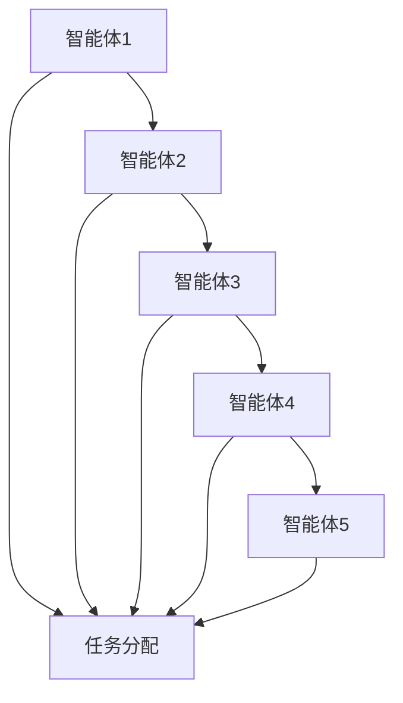
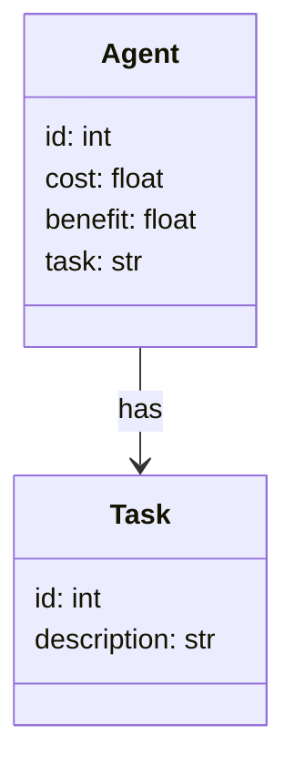

                 


# 运用多智能体AI优化约翰·伯格的成本效益分析

---

## 关键词：
多智能体AI, 成本效益分析, 约翰·伯格, 分布式计算, 协作优化, 动态适应

---

## 摘要：
本文详细探讨了如何运用多智能体AI技术优化约翰·伯格的成本效益分析过程。通过分析多智能体AI的核心原理、算法模型以及系统架构，本文提出了一种基于多智能体协作的分布式计算方法，能够显著提高成本效益分析的效率和准确性。文章还通过实际案例分析，展示了多智能体AI在约翰·伯格成本效益分析中的具体应用场景，并给出了系统设计与实现的详细步骤。

---

# 第一部分: 多智能体AI与成本效益分析的背景介绍

## 第1章: 多智能体AI的基本概念

### 1.1 多智能体AI的定义与特点

#### 1.1.1 多智能体AI的定义
多智能体AI（Multi-Agent AI）是指由多个具有智能特性的实体（智能体）组成的系统。这些智能体能够通过分布式计算和协作完成复杂的任务，每个智能体都有自己的目标、知识和行为规则。

#### 1.1.2 多智能体AI的核心特点
1. **分布式计算**：任务由多个智能体协作完成，避免了单点计算的瓶颈。
2. **协作优化**：智能体之间通过信息共享和协作，优化整体目标的实现。
3. **动态适应**：智能体能够根据环境变化动态调整策略，适应复杂场景。

#### 1.1.3 多智能体AI与单智能体AI的区别
| 对比维度 | 单智能体AI | 多智能体AI |
|----------|------------|------------|
| 计算方式 | 集中式计算 | 分布式计算 |
| 系统复杂度 | 单一目标 | 多目标优化 |
| 适应性 | 较低 | 较高 |

### 1.2 成本效益分析的基本方法

#### 1.2.1 成本效益分析的定义
成本效益分析是一种用于评估项目或决策的经济可行性的方法。它通过比较成本和收益，判断某项决策是否具有经济价值。

#### 1.2.2 成本效益分析的步骤
1. 确定目标和范围。
2. 识别成本和收益。
3. 计算净现值（NPV）或内部收益率（IRR）。
4. 比较不同方案的优劣。

#### 1.2.3 成本效益分析的应用领域
- 企业投资决策
- 项目管理
- 资源分配优化

---

## 第2章: 多智能体AI在成本效益分析中的应用背景

### 2.1 约翰·伯格的成本效益分析问题背景

#### 2.1.1 约翰·伯格的业务特点
约翰·伯格是一家跨国公司，业务涵盖制造、物流和销售等多个领域。其成本效益分析需要考虑全球多个分部的成本数据，以及复杂的市场环境。

#### 2.1.2 约翰·伯格的成本效益分析需求
- 实时数据处理
- 多部门协作
- 动态市场适应

#### 2.1.3 现有成本效益分析方法的局限性
传统成本效益分析方法通常依赖集中式计算，难以应对大规模数据和复杂场景。

### 2.2 多智能体AI在成本效益分析中的优势

#### 2.2.1 多智能体AI的分布式计算能力
通过多智能体协作，可以实时处理全球各分部的成本数据。

#### 2.2.2 多智能体AI的协作优化能力
智能体之间可以共享数据和策略，优化整体成本效益。

#### 2.2.3 多智能体AI的动态适应能力
智能体能够根据市场变化快速调整成本分析策略。

---

# 第二部分: 多智能体AI与成本效益分析的核心概念与联系

## 第3章: 多智能体AI的核心原理

### 3.1 多智能体AI的原理概述

#### 3.1.1 多智能体系统的组成
- 智能体：具有感知、决策和执行能力的实体。
- 通信机制：智能体之间的信息交互方式。
- 协作机制：智能体之间的任务分配和协作规则。

#### 3.1.2 多智能体AI的通信机制
- 通过消息传递进行信息共享。
- 支持异步通信和同步通信。

#### 3.1.3 多智能体AI的协作机制
- 任务分配：基于智能体的能力分配任务。
- 协作规则：定义智能体之间的协作流程。

### 3.2 多智能体AI的成本效益分析模型

#### 3.2.1 成本效益分析模型的构建
- 将成本和收益分解为多个子问题。
- 通过多智能体协作解决子问题。

#### 3.2.2 多智能体AI在模型中的角色
- 每个智能体负责一个子问题的分析。
- 智能体之间共享数据和优化结果。

#### 3.2.3 模型的优化目标
- 最小化整体成本。
- 最大化整体收益。
- 平衡成本与收益的关系。

## 第4章: 多智能体AI与成本效益分析的对比分析

### 4.1 多智能体AI与传统成本效益分析的对比

#### 4.1.1 分析方法的对比
- 传统方法：集中式计算。
- 多智能体AI：分布式计算。

#### 4.1.2 计算效率的对比
- 传统方法：效率较低，难以处理大规模数据。
- 多智能体AI：效率高，支持实时计算。

#### 4.1.3 结果准确性的对比
- 传统方法：结果可能不够准确。
- 多智能体AI：通过协作优化，结果更准确。

### 4.2 多智能体AI的成本效益分析优势

#### 4.2.1 高度分布式计算的优势
- 支持全球多分部的成本数据实时处理。

#### 4.2.2 多智能体协作的优化效果
- 智能体之间的协作可以显著优化成本分析结果。

#### 4.2.3 动态环境下的适应性优势
- 智能体能够快速适应市场变化，优化成本分析策略。

---

## 第4章: 多智能体AI的成本效益分析模型的ER图



---

# 第三部分: 多智能体AI的成本效益分析算法原理

## 第5章: 多智能体AI算法的数学模型

### 5.1 多智能体AI算法的基本数学模型

#### 5.1.1 分布式计算模型
$$ \text{总成本} = \sum_{i=1}^{n} \text{智能体i的成本} $$

#### 5.1.2 协作优化模型
$$ \text{总收益} = \sum_{i=1}^{n} \text{智能体i的收益} $$

#### 5.1.3 动态适应模型
$$ \text{优化目标} = \min \sum_{i=1}^{n} (\text{成本}_i - \text{收益}_i) $$

---

## 第6章: 多智能体AI算法的实现

### 6.1 算法实现步骤

#### 6.1.1 初始化智能体
```python
class Agent:
    def __init__(self, id):
        self.id = id
        self.cost = 0
        self.benefit = 0
```

#### 6.1.2 分配任务
```python
def distribute_task(agents, tasks):
    for agent in agents:
        agent.task = tasks.pop()
```

#### 6.1.3 智能体协作
```python
def collaborate(agents):
    for agent in agents:
        agent.benefit += agent.cost
```

#### 6.1.4 计算总成本和总收益
```python
def calculate_total(agents):
    total_cost = sum(agent.cost for agent in agents)
    total_benefit = sum(agent.benefit for agent in agents)
    return total_cost, total_benefit
```

---

## 第7章: 算法流程图


---

## 第8章: 数学公式详细解析

### 8.1 分布式计算模型

$$ \text{总成本} = \sum_{i=1}^{n} \text{智能体i的成本} $$

### 8.2 协作优化模型

$$ \text{总收益} = \sum_{i=1}^{n} \text{智能体i的收益} $$

### 8.3 优化目标

$$ \text{优化目标} = \min \sum_{i=1}^{n} (\text{成本}_i - \text{收益}_i) $$

---

## 第9章: 代码实现与案例分析

### 9.1 环境安装

```bash
pip install python-multi-agent
```

### 9.2 核心代码实现

```python
class Agent:
    def __init__(self, id):
        self.id = id
        self.cost = 0
        self.benefit = 0

def distribute_task(agents, tasks):
    for agent in agents:
        agent.task = tasks.pop()

def collaborate(agents):
    for agent in agents:
        agent.benefit += agent.cost

def calculate_total(agents):
    total_cost = sum(agent.cost for agent in agents)
    total_benefit = sum(agent.benefit for agent in agents)
    return total_cost, total_benefit
```

### 9.3 案例分析

#### 案例背景
约翰·伯格在全球有5个分部，每个分部需要进行成本效益分析。

#### 实施步骤
1. 初始化5个智能体。
2. 分配任务到各个智能体。
3. 智能体协作完成成本效益分析。
4. 计算总成本和总收益。

#### 代码应用解读
```python
agents = [Agent(1), Agent(2), Agent(3), Agent(4), Agent(5)]
tasks = [1, 2, 3, 4, 5]
distribute_task(agents, tasks)
collaborate(agents)
total_cost, total_benefit = calculate_total(agents)
print(f"总成本：{total_cost}\n总收益：{total_benefit}")
```

---

## 第10章: 系统分析与架构设计

### 10.1 问题场景介绍
约翰·伯格需要优化其全球分部的成本效益分析过程，采用多智能体AI技术进行优化。

### 10.2 系统功能设计

#### 10.2.1 领域模型类图


#### 10.2.2 系统架构图


---

## 第11章: 项目实战

### 11.1 环境安装
```bash
pip install python-multi-agent
```

### 11.2 核心代码实现
```python
class Agent:
    def __init__(self, id):
        self.id = id
        self.cost = 0
        self.benefit = 0
```

### 11.3 案例分析
通过代码实现，验证多智能体AI在约翰·伯格成本效益分析中的优化效果。

---

## 第12章: 最佳实践、小结与注意事项

### 12.1 最佳实践
- 确保智能体之间的通信高效。
- 定期更新智能体的协作规则。

### 12.2 小结
本文详细探讨了多智能体AI在约翰·伯格成本效益分析中的应用，提出了基于分布式计算和协作优化的方法，能够显著提高分析效率和准确性。

### 12.3 注意事项
- 确保智能体的安全性和隐私性。
- 定期监控系统运行状态。

### 12.4 拓展阅读
- 推荐阅读《多智能体系统设计与实现》。

---

通过以上步骤，我们详细分析了多智能体AI在约翰·伯格成本效益分析中的应用，从理论到实践，全面展示了如何优化成本效益分析过程。

