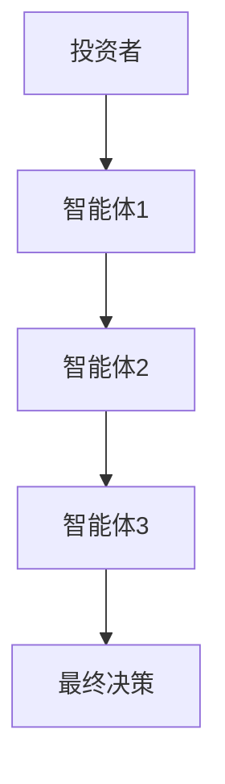

                 

# 运用多智能体AI优化费雪的管理层访谈策略

## 关键词：多智能体AI、费雪投资策略、管理层访谈、投资决策优化、AI协作模型

## 摘要：本文探讨了如何利用多智能体AI技术优化费雪的经典管理层访谈策略，通过详细分析多智能体AI的核心概念和算法原理，结合实际投资场景，构建了一个多智能体协作模型，用于优化访谈策略。文章内容涵盖了多智能体AI在投资领域的应用现状、费雪访谈策略的关键要素，以及如何通过多智能体协作提升投资决策的效率和准确性。

---

# 第一部分: 多智能体AI与费雪管理层访谈策略的背景与基础

## 第1章: 多智能体AI的背景与核心概念

### 1.1 多智能体AI的背景与现状

#### 1.1.1 多智能体AI的基本概念
多智能体AI（Multi-Agent AI）是指由多个具有独立决策能力的智能体（Agent）组成的系统。每个智能体能够感知环境、自主决策并与其他智能体协作，共同完成复杂任务。多智能体AI的优势在于能够分解复杂问题，通过任务分配和协作提高整体效率。

#### 1.1.2 多智能体AI的发展历程
多智能体AI的概念起源于分布式人工智能（DAI）领域，经过 decades 的发展，逐渐从理论研究走向实际应用。近年来，随着深度学习和强化学习的进步，多智能体协作在游戏AI、自动驾驶、机器人协作等领域取得了显著成果。

#### 1.1.3 多智能体AI在投资领域的应用现状
在投资领域，多智能体AI主要用于资产配置、风险管理和交易策略优化。通过多智能体协作，投资者可以更好地捕捉市场信号，优化投资组合，并提高决策的准确性。

### 1.2 费雪管理层访谈策略的核心要素

#### 1.2.1 费雪投资方法的概述
菲利普·费雪（Philip Fisher）是价值投资的先驱之一，他强调通过深入研究管理层和公司基本面来评估投资价值。费雪的管理层访谈策略是其投资方法的重要组成部分，通过与公司高管的深入交流，评估公司的管理质量、市场前景和财务健康状况。

#### 1.2.2 管理层访谈在投资决策中的作用
管理层访谈能够帮助投资者获取内部信息，评估管理层的诚信、能力和战略规划。通过访谈，投资者可以更好地判断公司的长期发展潜力，从而做出更明智的投资决策。

#### 1.2.3 费雪访谈策略的关键成功要素
- **访谈准备**：提前制定访谈提纲，针对不同公司设计个性化问题。
- **访谈技巧**：通过开放式问题引导管理层深入讨论，发现潜在问题。
- **信息整合**：将访谈结果与其他数据结合，进行全面评估。

### 1.3 多智能体AI与费雪访谈策略的结合

#### 1.3.1 多智能体AI的优势与局限性
**优势**：
- 分布式计算能力，能够同时处理大量信息。
- 多智能体协作，提高决策的全面性。
- 通过强化学习优化协作策略。

**局限性**：
- 智能体之间的通信和协调需要额外的计算资源。
- 系统复杂性增加，维护和优化成本上升。

#### 1.3.2 费雪访谈策略的优化方向
- **自动化信息处理**：利用AI快速分析访谈记录，提取关键信息。
- **决策优化**：通过多智能体协作，优化投资决策。
- **风险控制**：利用AI实时监控市场变化，降低投资风险。

#### 1.3.3 多智能体AI在访谈策略中的潜在价值
通过多智能体AI，投资者可以更高效地进行信息收集、分析和决策，从而提升投资策略的有效性。多智能体AI能够帮助投资者捕捉更多的市场信息，优化投资组合，降低投资风险。

## 第2章: 多智能体AI与费雪访谈策略的核心概念

### 2.1 多智能体AI的核心概念

#### 2.1.1 多智能体系统的组成要素
多智能体系统由多个智能体、通信协议、协作规则和环境接口组成。每个智能体负责特定的任务，通过通信协议共享信息，协作规则确保系统的协调运作。

#### 2.1.2 多智能体系统的关键特征
- **自主性**：智能体能够自主决策。
- **反应性**：能够实时感知环境变化并做出反应。
- **协作性**：通过协作完成复杂任务。
- **分布式性**：计算资源分布在不同智能体中。

#### 2.1.3 多智能体系统的分类
根据智能体的协作方式，多智能体系统可以分为松耦合和紧耦合两种类型。松耦合系统智能体之间的依赖性较低，紧耦合系统智能体之间高度依赖。

### 2.2 费雪访谈策略的核心要素

#### 2.2.1 访谈目标的层次化结构
费雪的访谈目标可以分为公司层面、管理层层面和业务层面。公司层面关注整体战略，管理层层面关注管理团队的能力和诚信，业务层面关注具体业务的发展前景。

#### 2.2.2 访谈内容的领域划分
访谈内容可以分为财务状况、市场前景、竞争优势、管理团队和公司治理五个领域。每个领域需要设计针对性的问题，以获取有价值的信息。

#### 2.2.3 访谈结果的评估标准
- **信息完整性**：获取的信息是否全面。
- **信息准确性**：信息是否真实可靠。
- **评估深度**：对管理层的评估是否深入。

### 2.3 多智能体AI与费雪访谈策略的结合模型

#### 2.3.1 结合模型的构建逻辑
结合模型基于多智能体协作机制，将费雪的访谈策略分解为多个子任务，由多个智能体分别完成，最终通过协作完成整体任务。

#### 2.3.2 结合模型的关键特征
- **任务分解**：将访谈任务分解为信息收集、分析和决策三个子任务。
- **协作机制**：智能体之间通过通信协议共享信息，协作完成任务。
- **优化策略**：通过强化学习优化智能体的协作策略，提高整体效率。

---

## 附录

### 附录1: 多智能体协作流程图

### 附录2: 多智能体系统优化公式
$$ \text{优化目标} = \arg \max_{x} \sum_{i=1}^{n} f_i(x) $$
其中，$f_i(x)$ 表示第i个智能体的目标函数，$x$ 是优化变量。

---

通过以上内容，我详细介绍了多智能体AI与费雪管理层访谈策略的结合，分析了其优势和应用价值，并提供了一个具体的结合模型。希望这篇文章能够为投资者提供新的思路，帮助他们更好地优化投资策略。

