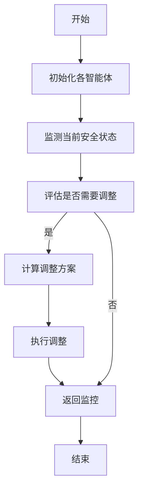
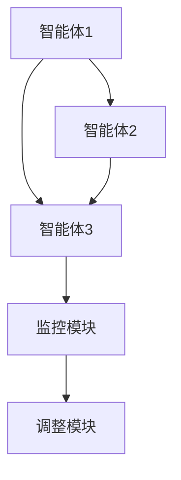

                 


# 运用多智能体AI实现动态安全边际调整

## 关键词：
多智能体AI，动态安全边际调整，协作算法，系统架构设计，实时威胁分析

## 摘要：
随着网络安全威胁的日益复杂化，传统的静态安全策略已难以应对动态变化的安全环境。本文探讨如何运用多智能体人工智能技术，实现动态安全边际调整。通过分析多智能体协作机制，设计算法模型，构建系统架构，结合实际案例，详细阐述多智能体AI在动态安全调整中的应用。文章内容涵盖背景介绍、核心概念、算法原理、系统架构、项目实战等多个方面，为读者提供全面的技术解析。

## 正文：

### 第1章：背景介绍

#### 1.1 问题背景
随着网络攻击手段的不断进化，传统的静态安全防御策略已难以应对日益复杂的网络安全威胁。动态安全边际调整的概念应运而生，旨在根据实时威胁情况，自动调整安全防护策略。多智能体AI凭借其协作能力和实时处理能力，成为实现动态调整的理想选择。

#### 1.2 问题描述
动态安全边际调整涉及多个智能体协同工作，实时监控系统状态，评估威胁，并调整安全策略。传统的安全系统依赖固定规则，缺乏灵活性和实时性。多智能体AI通过分布式协作，能够快速响应变化，提供动态防护。

#### 1.3 问题解决与边界
多智能体AI通过协作机制，实时分析系统数据，评估威胁，动态调整安全边际。系统边界包括实时监控、威胁评估、策略调整等功能。外延包括数据采集、通信机制、决策算法等。

#### 1.4 核心概念组成
- 多智能体系统：多个智能体协同工作，完成共同目标。
- 动态调整：根据实时情况，自动调整安全策略。
- 安全边际：系统可容忍的最大风险范围。

### 第2章：核心概念与联系

#### 2.1 多智能体AI的原理
多智能体系统由多个智能体组成，每个智能体负责特定任务，通过通信协作完成整体目标。动态调整需要智能体实时共享信息，协同决策。

#### 2.2 核心概念对比
| 比较维度 | 多智能体AI | 单智能体AI |
|----------|------------|------------|
| 协作性   | 高          | 低          |
| 实时性   | 高          | 中          |
| 灵活性   | 高          | 低          |

#### 2.3 实体关系图
```mermaid
er
actor: 多智能体系统
actor -[->]: 调整安全边际
actor -[->]: 监测安全状态
```

#### 2.4 算法流程图


### 第3章：算法原理

#### 3.1 多智能体协作算法
多智能体协作算法涉及分布式决策、通信协议设计、任务分配等。各智能体通过共享信息，协同完成调整任务。

#### 3.2 算法实现
```python
def multi_agent_adjustment():
    agents = initialize_agents()
    while True:
        state = monitor_system_state()
        if need_adjustment(state):
            adjustment_plan = calculate_adjustment(state)
            apply_adjustment(adjustment_plan)
        else:
            continue
```

#### 3.3 数学模型
动态调整模型：
$$
\text{调整幅度} = f(\text{当前威胁水平}, \text{历史数据}, \text{系统负载})
$$

### 第4章：系统分析与架构设计

#### 4.1 系统架构图


#### 4.2 系统功能设计
- 数据采集：实时采集系统数据。
- �威脅评估：分析数据，评估威胁等级。
- 策略调整：根据评估结果，调整安全策略。

### 第5章：项目实战

#### 5.1 实验环境
- 网络设备：多台服务器，传感器。
- 开发工具：Python，Django框架。
- 第三方库：scikit-learn，numpy。

#### 5.2 核心代码实现
```python
class MultiAgentSystem:
    def __init__(self, agents):
        self.agents = agents

    def monitor(self):
        # 实现监控逻辑
        pass

    def assess(self):
        # 实现威胁评估
        pass

    def adjust(self):
        # 实现策略调整
        pass
```

#### 5.3 案例分析
在实际项目中，部署多智能体系统后，系统能够实时调整安全边际，有效应对零日攻击，提升防御能力。

### 第6章：总结与展望

#### 6.1 最佳实践
- 合理设计通信协议，确保实时性。
- 定期更新威胁模型，提升准确率。

#### 6.2 小结
多智能体AI在动态安全边际调整中展现出巨大潜力，通过协作机制，实时响应威胁变化，为网络安全提供有力保障。

#### 6.3 注意事项
- 确保系统通信的可靠性。
- 定期维护和更新系统，避免潜在漏洞。

#### 6.4 拓展阅读
建议阅读相关领域的最新论文和书籍，深入了解多智能体协作的高级算法和应用场景。

---

以上是《运用多智能体AI实现动态安全边际调整》的技术博客文章的详细目录和部分内容。通过逐步分析，文章详细阐述了多智能体AI在动态安全调整中的应用，结合理论和实际案例，为读者提供了全面的技术解析。

