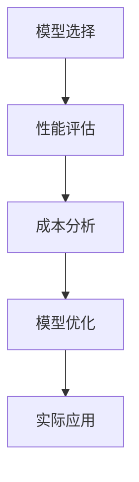

                 


# 选择合适的LLM模型：性能与成本的平衡

## 关键词：LLM模型、性能、成本、平衡、选择策略、优化方法

## 摘要：  
在大语言模型（LLM）的应用中，选择合适的模型需要在性能和成本之间找到平衡。本文通过分析不同LLM模型的特点、性能指标和成本因素，提供选择策略和优化建议，帮助读者做出明智的决策。

---

# 第1章：背景介绍

## 1.1 LLM模型的背景介绍  
### 1.1.1 大语言模型的定义与核心概念  
大语言模型（Large Language Model, LLM）是基于深度学习的自然语言处理模型，能够理解和生成人类语言。其核心概念包括：  
- **序列建模**：通过处理序列数据（如文本）进行预测和生成。  
- **参数量**：模型参数越多，复杂任务的处理能力越强。  
- **训练数据**：模型性能高度依赖于训练数据的规模和多样性。  

### 1.1.2 LLM模型在AI技术中的地位  
LLM是自然语言处理（NLP）领域的核心技术，广泛应用于聊天机器人、文本生成、机器翻译等领域。  

### 1.1.3 企业级应用中的LLM模型需求  
在企业级应用中，LLM模型需要满足高准确性、高效率和可扩展性，同时要控制成本。  

## 1.2 问题背景与问题描述  
### 1.2.1 LLM模型选择的核心挑战  
选择合适的LLM模型需要在性能（如准确性、推理速度）和成本（如计算资源、时间）之间找到平衡。  

### 1.2.2 性能与成本平衡的必要性  
在企业级应用中，模型性能过低会导致用户体验差，而模型成本过高则会增加运营负担。  

### 1.2.3 问题解决的思路与方法  
通过分析模型的性能指标和成本因素，建立评估框架，选择最优模型或进行模型优化。  

## 1.3 边界与外延  
### 1.3.1 LLM模型选择的边界条件  
- 模型规模：参数量的上限和下限。  
- 任务类型：文本生成、问答系统等。  
- 预算限制：计算资源和时间预算。  

### 1.3.2 相关概念的外延与区别  
- **模型压缩**：减少模型参数以降低计算成本。  
- **模型调优**：优化模型参数以提高性能。  
- **模型蒸馏**：通过小模型学习大模型的知识。  

### 1.3.3 核心要素的组成与关系  
模型性能、模型成本、任务需求三者相互关联，共同决定模型选择。  

---

# 第2章：核心概念与联系

## 2.1 核心概念原理  
### 2.1.1 大语言模型的训练原理  
模型通过大量数据训练，学习语言的统计规律。训练过程包括编码、解码和损失函数优化。  

### 2.1.2 模型参数与性能的关系  
参数越多，模型复杂度越高，性能越好，但计算成本也越高。  

### 2.1.3 模型推理过程的详细分析  
模型推理是将输入文本转化为输出文本的过程，涉及编码器和解码器的协作。  

## 2.2 模型属性特征对比  
### 2.2.1 模型参数数量对比  
- 小模型：参数量在10M以下。  
- 中型模型：参数量在10M到100M之间。  
- 大模型：参数量在100M以上。  

### 2.2.2 训练数据量与模型性能  
数据量越大，模型性能越好，但数据预处理成本也越高。  

### 2.2.3 推理速度与资源消耗对比  
推理速度与模型参数和计算资源直接相关。  

## 2.3 ER实体关系图  


---

# 第3章：算法原理讲解

## 3.1 算法原理  
### 3.1.1 大语言模型的训练流程  
```mermaid
graph TD
    I[输入数据] --> T[预处理]
    T --> M[模型训练]
    M --> O[优化器调
```

