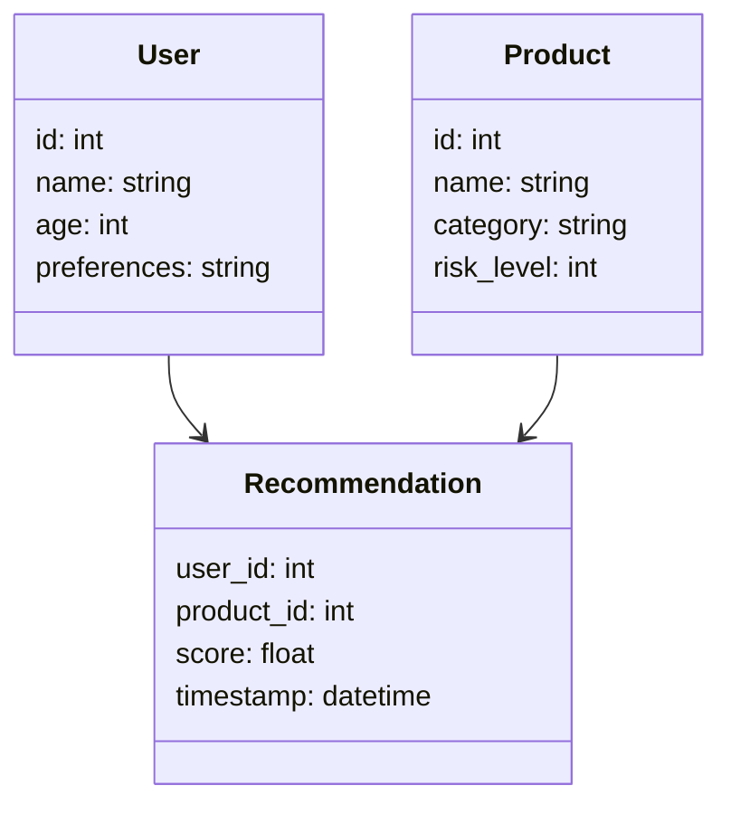

                 


# 《金融产品个性化推荐引擎》

> 关键词：金融推荐引擎，个性化推荐，协同过滤，机器学习，用户画像，产品特征，推荐系统

> 摘要：本文详细介绍了金融产品个性化推荐引擎的设计与实现，涵盖从背景介绍到项目实战的各个方面。通过分析用户需求和产品特征，结合协同过滤算法，构建了高效的推荐系统。文章详细讲解了推荐引擎的核心概念、算法原理、系统架构设计以及实际案例分析，为读者提供了全面的技术指导。

---

## 第1章：金融产品推荐引擎的背景与挑战

### 1.1 问题背景与描述

随着金融行业的数字化转型，传统的产品推荐方式已无法满足用户日益增长的个性化需求。传统推荐方法通常基于简单的规则或历史交易数据，难以捕捉用户的深层需求和市场变化。个性化推荐引擎的出现，为金融机构提供了精准匹配用户需求的解决方案。

#### 1.1.1 传统金融产品推荐的局限性
- **数据稀疏性**：用户对金融产品的评价较少，导致推荐结果不稳定。
- **需求多样性**：用户可能同时关注不同风险级别的产品，推荐系统需要兼顾多个维度。
- **市场波动性**：金融市场的波动对推荐结果的影响较大，推荐系统需要具备动态调整能力。

#### 1.1.2 个性化推荐的需求与痛点
- **用户需求多样化**：不同用户的风险承受能力和投资目标不同。
- **产品复杂性**：金融产品种类繁多，特征多样，推荐系统需要处理复杂的特征组合。
- **实时性要求**：推荐系统需要实时响应用户请求，保证推荐的时效性。

#### 1.1.3 金融行业的数字化转型趋势
- 数据驱动的决策成为主流。
- 人工智能技术在金融领域的广泛应用。
- 用户体验成为金融机构的核心竞争力。

### 1.2 个性化推荐的核心问题

个性化推荐的核心在于如何将用户需求与产品特征进行精准匹配。推荐引擎需要解决以下关键问题：

#### 1.2.1 用户需求分析与建模
- **用户画像**：通过收集用户的年龄、收入、投资偏好等信息，构建用户画像。
- **用户行为分析**：分析用户的点击、浏览、购买等行为，挖掘潜在需求。

#### 1.2.2 产品特征提取与匹配
- **产品分类**：将金融产品按风险级别、收益类型等进行分类。
- **特征表示**：将产品特征转化为可计算的向量形式，便于算法处理。

#### 1.2.3 数据稀疏性与冷启动问题
- **数据稀疏性**：用户对产品的评价较少，导致推荐结果不稳定。
- **冷启动问题**：新用户或新产品缺乏足够的数据支持推荐。

### 1.3 问题解决与边界定义

#### 1.3.1 个性化推荐引擎的目标与边界
- **目标**：为用户提供个性化、实时的金融产品推荐。
- **边界**：仅考虑用户的历史行为和产品特征，不涉及实时市场数据。

#### 1.3.2 核心功能与非功能性需求
- **核心功能**：
  - 用户画像构建
  - 产品特征提取
  - 推荐算法实现
  - 推荐结果展示
- **非功能性需求**：
  - 系统性能：响应时间小于1秒
  - 系统稳定性：99.9%的可用性

#### 1.3.3 系统架构与性能指标
- **系统架构**：采用分布式架构，支持高并发请求。
- **性能指标**：
  - 推荐响应时间：≤1秒
  - 最大并发用户数：10000+


### 1.4 核心概念与组成要素

个性化推荐引擎由以下几个核心要素组成：

#### 1.4.1 用户画像与行为分析
- **用户画像**：通过收集用户的基本信息和投资偏好，构建用户画像。
- **用户行为分析**：分析用户的点击、浏览、购买等行为，挖掘潜在需求。

#### 1.4.2 产品特征提取与标签化
- **产品分类**：将金融产品按风险级别、收益类型等进行分类。
- **特征表示**：将产品特征转化为可计算的向量形式，便于算法处理。

#### 1.4.3 推荐算法与模型构建
- **推荐算法**：选择合适的推荐算法，如协同过滤、基于内容的推荐等。
- **模型构建**：根据用户和产品特征，构建推荐模型。

---

## 第2章：推荐引擎的核心概念与联系

### 2.1 核心概念原理

个性化推荐引擎的核心在于用户和产品之间的关系。通过分析用户的行为和产品特征，构建推荐模型，从而实现精准推荐。

#### 2.1.1 用户画像的构建与更新
- **用户画像构建**：
  1. 收集用户的基本信息（年龄、收入、职业等）。
  2. 收集用户的投资偏好（风险承受能力、投资目标等）。
  3. 构建用户画像，表示用户的特征向量。

- **用户画像更新**：
  1. 根据用户的最新行为（如点击、购买）更新用户画像。
  2. 使用机器学习模型预测用户的潜在需求。

#### 2.1.2 产品特征的提取与表示
- **产品特征提取**：
  1. 收集金融产品的基本特征（如产品类型、风险级别、收益类型等）。
  2. 对产品特征进行编码，生成特征向量。

- **产品特征表示**：
  1. 使用自然语言处理（NLP）技术提取产品描述的关键词。
  2. 将关键词转换为向量表示，如词袋模型或词嵌入模型。

#### 2.1.3 推荐算法的分类与选择
- **协同过滤**：
  - **基于用户的协同过滤**：寻找与当前用户相似的用户群体，推荐他们喜欢的产品。
  - **基于产品的协同过滤**：根据产品的相似性，推荐与当前产品相关的其他产品。
- **基于内容的推荐**：根据产品的内容特征，推荐与当前产品相似的产品。
- **混合推荐**：结合协同过滤和基于内容的推荐，提高推荐的准确性和多样性。

---

### 2.2 核心概念对比与ER图

为了更好地理解推荐引擎的核心概念，我们通过ER图来展示用户、产品和推荐之间的关系。

```mermaid
er
    User {
        id: int
        name: string
        age: int
        preferences: string
    }
    Product {
        id: int
        name: string
        category: string
        risk_level: int
    }
    Recommendation {
        user_id: int
        product_id: int
        score: float
        timestamp: datetime
    }
    User --> Recommendation
    Product --> Recommendation
```

---

## 第3章：基于协同过滤的推荐算法

### 3.1 协同过滤算法原理

协同过滤是一种经典的推荐算法，通过寻找用户或产品之间的相似性，进行推荐。

#### 3.1.1 基于用户的协同过滤
- **相似度计算**：计算当前用户与其他用户之间的相似度，选择相似度较高的用户群体。
- **推荐生成**：根据相似用户的评分，加权平均生成推荐结果。

#### 3.1.2 基于产品的协同过滤
- **相似度计算**：计算当前产品与其他产品之间的相似度，选择相似度较高的产品。
- **推荐生成**：根据相似产品的评分，加权平均生成推荐结果。

#### 3.1.3 混合推荐的优缺点
- **优点**：
  - 能够捕捉到用户和产品之间的复杂关系。
  - 推荐结果具有较高的准确性和多样性。
- **缺点**：
  - 计算复杂度较高，可能影响推荐的实时性。
  - 需要大量的历史数据支持，冷启动问题较为明显。

### 3.2 协同过滤的数学模型

协同过滤的核心在于相似度计算，常用的方法包括余弦相似度和皮尔逊相关系数。

#### 3.2.1 相似度计算公式
- **余弦相似度**：
  $$sim(i,j) = \frac{\sum_{k} r_{i,k} \cdot r_{j,k}}{\sqrt{\sum_{k} r_{i,k}^2} \cdot \sqrt{\sum_{k} r_{j,k}^2}}$$

- **皮尔逊相关系数**：
  $$sim(i,j) = \frac{\sum_{k} (r_{i,k} - \bar{r_i})(r_{j,k} - \bar{r_j})}{\sqrt{\sum_{k} (r_{i,k} - \bar{r_i})^2} \cdot \sqrt{\sum_{k} (r_{j,k} - \bar{r_j})^2}}$$

---

## 第4章：系统分析与架构设计方案

### 4.1 问题场景介绍

推荐引擎需要处理大量的用户数据和产品数据，实时响应用户的推荐请求。

#### 4.1.1 系统功能设计
- **用户画像**：构建和更新用户画像。
- **产品特征提取**：提取和表示产品特征。
- **推荐算法**：基于协同过滤实现推荐。
- **推荐结果展示**：将推荐结果展示给用户。

#### 4.1.2 系统架构设计
- **前端**：用户交互界面，接收用户的请求。
- **后端**：处理用户的请求，调用推荐算法生成推荐结果。
- **数据库**：存储用户数据和产品数据。

---

### 4.2 系统功能设计（领域模型）



---

## 第5章：项目实战

### 5.1 环境安装

#### 5.1.1 安装Python环境
- 安装Python 3.8及以上版本。
- 安装必要的库：
  ```bash
  pip install numpy pandas scikit-learn
  ```

### 5.2 核心代码实现

#### 5.2.1 协同过滤算法实现
```python
from sklearn.metrics.pairwise import cosine_similarity

# 示例数据：用户-产品评分矩阵
ratings = {
    'user1': {'product1': 4, 'product2': 3, 'product3': 5},
    'user2': {'product1': 2, 'product2': 5, 'product3': 3},
    'user3': {'product1': 5, 'product2': 4, 'product3': 2}
}

# 计算相似度矩阵
user_ids = ['user1', 'user2', 'user3']
product_ids = ['product1', 'product2', 'product3']

# 构建评分矩阵
rating_matrix = []
for user in user_ids:
    row = []
    for product in product_ids:
        row.append(ratings[user].get(product, 0))
    rating_matrix.append(row)

# 计算余弦相似度
similarity_matrix = cosine_similarity(rating_matrix)
```

#### 5.2.2 推荐结果生成
```python
def generate_recommendations(user_id, similarity_matrix, ratings, product_ids):
    # 获取当前用户的索引
    user_index = user_ids.index(user_id)
    
    # 计算每个用户的相似度得分
    scores = similarity_matrix[user_index]
    
    # 根据得分降序排序
    sorted_indices = sorted(range(len(scores)), key=lambda i: scores[i], reverse=True)
    
    # 排除当前用户本身
    sorted_indices = [i for i in sorted_indices if i != user_index]
    
    # 生成推荐结果
    recommendations = []
    for i in sorted_indices:
        product_id = product_ids[i]
        score = similarity_matrix[user_index, i]
        recommendations.append((product_id, score))
    
    return recommendations

# 示例推荐
user_id = 'user1'
recommendations = generate_recommendations(user_id, similarity_matrix, ratings, product_ids)
print(f"推荐结果：{recommendations}")
```

---

## 第6章：总结与展望

### 6.1 最佳实践 tips
- **数据预处理**：对数据进行清洗和特征工程，提高推荐的准确性。
- **模型优化**：结合多种推荐算法，提高推荐的多样性和准确性。
- **实时性优化**：采用分布式架构和缓存技术，提高推荐的响应速度。

### 6.2 小结
本文详细介绍了金融产品个性化推荐引擎的设计与实现，从背景介绍到项目实战，全面阐述了推荐引擎的核心概念、算法原理和系统架构设计。通过实际案例分析，展示了推荐引擎的应用效果。

### 6.3 注意事项
- **数据隐私**：在处理用户数据时，需要注意数据隐私和安全。
- **模型解释性**：推荐结果需要具备一定的解释性，方便用户理解和信任。

### 6.4 拓展阅读
- **深度学习推荐模型**：探索基于深度学习的推荐算法，如协同过滤的深度学习变体。
- **实时推荐系统**：研究如何构建实时推荐系统，满足用户的实时需求。

---

以上是《金融产品个性化推荐引擎》的完整目录大纲和部分详细内容。如果需要进一步的扩展或细节补充，请随时告知！

