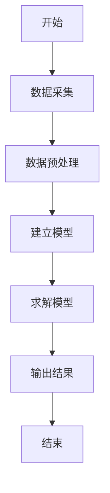
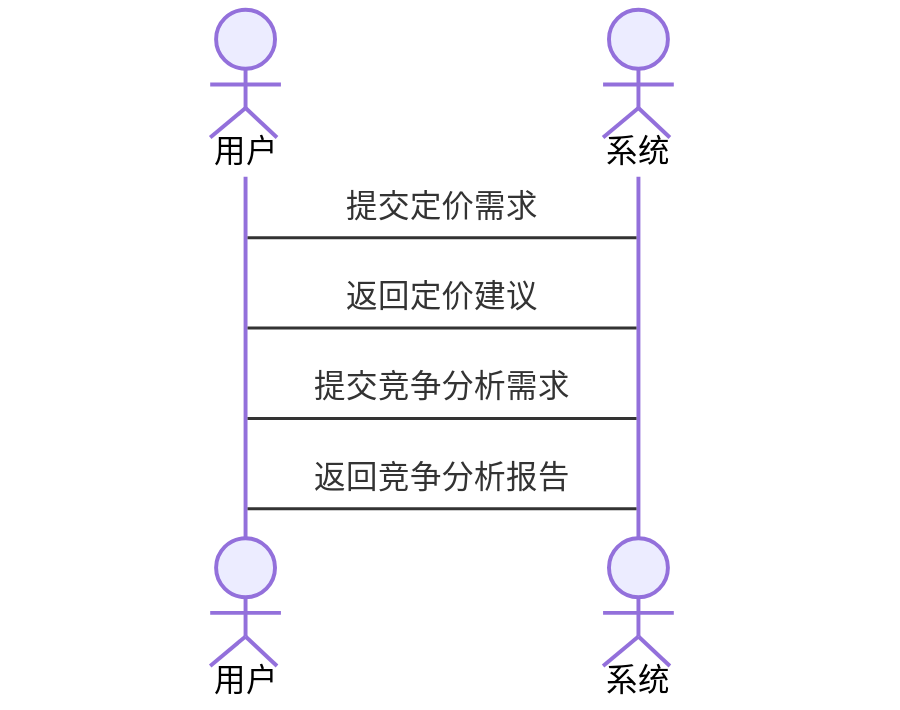

                 


# 《金融产品定价策略优化与竞争分析系统》

> 关键词：金融产品定价，策略优化，竞争分析，系统架构，数据驱动

> 摘要：本文将深入探讨金融产品定价策略优化与竞争分析系统的核心原理和实际应用。通过系统化的分析和建模，结合实际案例，展示如何利用数据驱动的方法优化定价策略，并通过竞争分析系统提升市场竞争力。本文旨在为金融行业提供一种高效、科学的定价和竞争分析解决方案。

---

## 第一部分：背景介绍

### 第1章：金融产品定价策略优化与竞争分析系统概述

#### 1.1 问题背景
##### 1.1.1 金融产品定价的现状与挑战
- 传统定价方法的局限性：基于经验判断，缺乏数据支持。
- 市场竞争加剧：金融产品的同质化竞争使得定价策略需更具灵活性。
- 数据驱动的重要性：利用大数据技术优化定价模型。

##### 1.1.2 问题描述
- 定价策略的优化目标：最大化收益、提高市场占有率、降低风险。
- 竞争分析的核心问题：识别竞争对手的定价策略、分析市场供需关系、评估自身产品的竞争优势。

##### 1.1.3 问题解决
- 系统化定价策略优化方法：基于数学模型的定价算法。
- 数据驱动的竞争分析策略：利用大数据技术进行市场分析。
- 综合定价与竞争分析的系统架构：构建一个完整的定价与竞争分析系统。

#### 1.2 边界与外延
##### 1.2.1 系统的边界条件
- 数据输入范围：市场数据、竞争对手数据、产品特征数据。
- 输出范围：定价建议、竞争分析报告、市场趋势预测。

##### 1.2.2 竞争分析的适用范围
- 适用于金融产品市场，包括银行、保险、证券等领域。
- 可扩展到其他行业，如电子产品、日用品等。

##### 1.2.3 定价策略优化的限制因素
- 数据质量：数据的准确性和完整性。
- 模型复杂度：模型的可解释性和计算效率。
- 市场动态：市场环境的变化对定价策略的影响。

---

## 第二部分：核心概念与联系

### 第2章：核心概念与联系

#### 2.1 定价策略优化的核心概念
##### 2.1.1 定价模型的基本原理
- 需求函数：价格与需求量的关系。
- 成本函数：产品的生产成本与价格的关系。
- 利润函数：价格、成本和需求之间的关系。

##### 2.1.2 数据驱动的定价策略
- 数据采集与处理：收集市场数据、竞争对手数据、用户行为数据。
- 数据分析与建模：利用统计分析和机器学习算法进行定价模型优化。

##### 2.1.3 竞争对手定价行为分析
- 竞争对手定价策略的识别：通过数据分析识别竞争对手的定价模式。
- 市场供需关系建模：分析市场供需变化对价格的影响。

#### 2.2 竞争分析系统的原理
##### 2.2.1 竞争对手定价行为分析
- 竞争对手定价策略的识别：通过数据分析识别竞争对手的定价模式。
- 市场供需关系建模：分析市场供需变化对价格的影响。

##### 2.2.2 市场供需关系建模
- 需求弹性分析：价格变化对需求量的影响。
- 供给弹性分析：价格变化对供给量的影响。

##### 2.2.3 竞争优势的识别与评估
- 产品差异化分析：识别产品在市场中的差异化优势。
- 市场定位分析：评估产品在市场中的定位。

#### 2.3 核心概念的属性对比
##### 2.3.1 定价策略与竞争分析的对比分析
- 定价策略：目标是制定最优价格。
- 竞争分析：目标是了解市场环境和竞争对手。

##### 2.3.2 不同定价模型的优缺点
- 消除差异定价模型：简单易行，但缺乏灵活性。
- 差异化定价模型：灵活性高，但需要大量数据支持。
- 动态定价模型：实时调整价格，但计算复杂。

##### 2.3.3 竞争分析系统的功能模块
- 数据采集模块：收集市场数据、竞争对手数据。
- 数据分析模块：分析数据，生成竞争分析报告。
- 竞争策略模块：制定竞争策略，优化定价策略。

#### 2.4 ER实体关系图
```mermaid
erDiagram
    actor 用户
    actor 竞争对手
    actor 市场数据
    actor 定价模型
    actor 竞争分析系统
    用户 --> 定价模型: 提供定价需求
    竞争对手 --> 定价模型: 提供竞争数据
    市场数据 --> 定价模型: 提供市场信息
    定价模型 --> 竞争分析系统: 生成定价建议
    竞争分析系统 --> 用户: 提供竞争分析报告
```

---

## 第三部分：算法原理

### 第3章：定价策略优化算法

#### 3.1 算法原理
##### 3.1.1 定价模型的数学公式
$$ \text{利润} = \text{价格} \times \text{销量} - \text{成本} $$

##### 3.1.2 需求预测模型
$$ Q = a - bP $$
其中，Q为需求量，P为价格，a和b为参数。

##### 3.1.3 优化目标
最大化利润：
$$ \max \pi = (P - C) \times Q $$

##### 3.1.4 求解过程
- 确定需求函数。
- 确定成本函数。
- 建立利润函数。
- 使用优化算法求解最优价格。

#### 3.2 竞争分析算法
##### 3.2.1 竞争对手定价行为分析
- 数据采集：收集竞争对手的定价数据。
- 数据分析：分析竞争对手的定价模式。
- 模型建立：建立竞争对手定价模型。

##### 3.2.2 市场供需关系建模
- 需求弹性分析：计算需求弹性系数。
- 供给弹性分析：计算供给弹性系数。

##### 3.2.3 竞争优势识别
- 产品差异化分析：识别产品在市场中的差异化优势。
- 市场定位分析：评估产品在市场中的定位。

#### 3.3 算法实现
##### 3.3.1 算法流程图


##### 3.3.2 核心代码实现
```python
import numpy as np
from scipy.optimize import minimize

# 定价模型
def pricing_model(price, cost, demand):
    return (price - cost) * demand

# 竞争分析模型
def competitor_analysis(price, competitors):
    return min(price, max(competitors))

# 优化函数
def optimize_price(price, cost, demand, competitors):
    result = minimize(lambda p: -(pricing_model(p, cost, demand) - competitor_analysis(p, competitors)), price, bounds=((0, None),))
    return result.x[0]

# 示例
cost = 50
demand = 1000 - 10 * price
competitors = [60, 70, 80]
optimal_price = optimize_price(70, cost, demand, competitors)
print("最优价格为：", optimal_price)
```

---

## 第四部分：系统架构设计

### 第4章：系统架构设计

#### 4.1 问题场景介绍
##### 4.1.1 系统目标
- 实现金融产品定价策略优化。
- 提供竞争分析功能。

##### 4.1.2 系统功能
- 数据采集与处理。
- 定价策略优化。
- 竞争分析报告生成。

#### 4.2 系统功能设计
##### 4.2.1 数据采集模块
- 数据来源：市场数据、竞争对手数据、用户行为数据。
- 数据处理：数据清洗、特征提取。

##### 4.2.2 定价模型模块
- 模型选择：线性回归、机器学习模型。
- 模型优化：参数调整、模型验证。

##### 4.2.3 竞争分析模块
- 竞争对手分析：定价行为分析、市场定位分析。
- 竞争策略生成：差异化策略、价格战策略。

#### 4.3 系统架构图


#### 4.4 系统接口设计
##### 4.4.1 数据接口
- 输入接口：市场数据接口、竞争对手数据接口。
- 输出接口：定价建议接口、竞争分析报告接口。

##### 4.4.2 交互接口
- 用户界面：定价策略优化界面、竞争分析界面。
- 系统管理界面：系统设置、数据管理。

#### 4.5 系统交互图


---

## 第五部分：项目实战

### 第5章：定价策略优化系统实现

#### 5.1 环境安装
- 安装Python和相关库：numpy、pandas、scipy、mermaid。
- 安装Jupyter Notebook用于开发和测试。

#### 5.2 核心代码实现
##### 5.2.1 数据采集与处理
```python
import pandas as pd
import requests

# 数据采集
url = "https://example.com/market_data.csv"
data = pd.read_csv(url)
print(data.head())
```

##### 5.2.2 定价模型实现
```python
from sklearn.linear_model import LinearRegression

# 数据处理
X = data[['cost', 'demand']]
y = data['price']
model = LinearRegression()
model.fit(X, y)
print("定价模型系数：", model.coef_)
```

##### 5.2.3 案例分析
```python
# 示例数据
cost = 50
demand = 1000 - 10 * 60
print("预测价格为：", model.predict([[cost, demand]]))
```

#### 5.3 项目小结
- 通过Python和机器学习算法实现定价策略优化。
- 系统化的数据处理和模型优化流程。
- 通过实际案例展示系统的应用价值。

### 第6章：竞争分析系统实现

#### 6.1 环境安装
- 安装Python和相关库：numpy、pandas、scipy、mermaid。
- 安装Jupyter Notebook用于开发和测试。

#### 6.2 核心代码实现
##### 6.2.1 数据采集与处理
```python
import pandas as pd
import requests

# 数据采集
url = "https://example.com/competitor_data.csv"
data = pd.read_csv(url)
print(data.head())
```

##### 6.2.2 竞争分析实现
```python
from sklearn.cluster import KMeans

# 数据处理
X = data[['price', 'market_share']]
model = KMeans(n_clusters=3)
model.fit(X)
print("竞争分析结果：", model.labels_)
```

##### 6.2.3 案例分析
```python
# 示例数据
price = 70
market_share = 20
print("竞争分析结果为：", model.predict([[price, market_share]]))
```

#### 6.3 项目小结
- 通过Python和机器学习算法实现竞争分析系统。
- 系统化的数据处理和模型优化流程。
- 通过实际案例展示系统的应用价值。

---

## 第六部分：最佳实践

### 第7章：最佳实践

#### 7.1 小结
- 系统化的定价策略优化方法。
- 数据驱动的竞争分析策略。
- 综合定价与竞争分析的系统架构。

#### 7.2 注意事项
- 数据的准确性和完整性。
- 模型的可解释性和计算效率。
- 市场环境的变化对定价策略的影响。

#### 7.3 拓展阅读
- 推荐书籍：《金融工程》、《定价策略》、《竞争分析》。
- 推荐工具：Python、机器学习框架（如TensorFlow、PyTorch）。

---

## 结束语

通过本文的详细讲解，读者可以深入了解金融产品定价策略优化与竞争分析系统的原理和实际应用。从数据采集到模型建立，从系统设计到项目实现，本文为读者提供了一套完整的解决方案。希望本文能为金融行业的定价策略优化和竞争分析提供有价值的参考。

--- 

以上是《金融产品定价策略优化与竞争分析系统》的完整目录结构，涵盖了从理论到实践的各个方面，结合了技术原理和实际应用，适合技术人员和金融从业者阅读。

