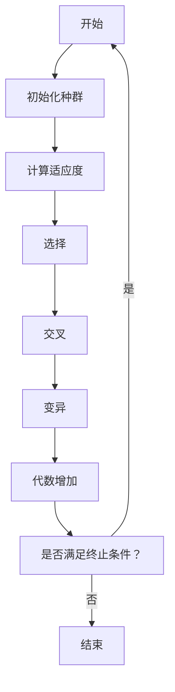
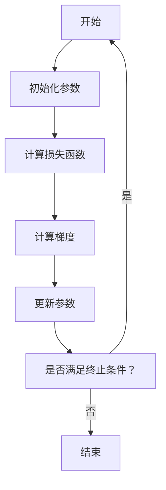
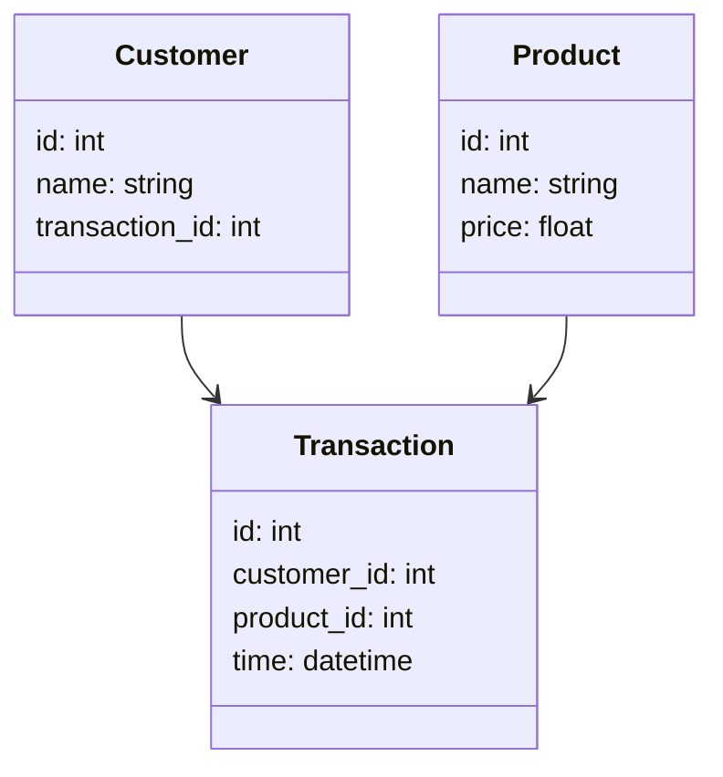
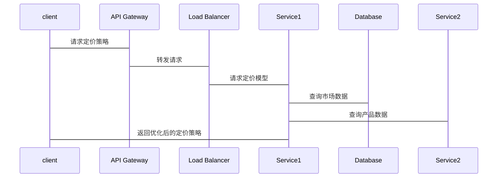

                 


# 《金融产品定价策略优化系统》

## 关键词
金融产品定价，定价策略优化，遗传算法，梯度下降，系统架构

## 摘要
金融产品定价策略优化系统是一种基于数据科学和人工智能的金融解决方案，旨在通过优化定价策略来提高金融产品的市场竞争力和盈利能力。本文将从背景、核心概念、算法原理、系统架构设计、项目实战等多个方面进行详细分析，探讨如何利用先进的优化算法和系统架构设计来实现金融产品的精准定价。

---

## 目录

### 第1章: 问题背景与概述
1.1 金融产品定价的重要性
1.2 当前定价策略的局限性
1.3 定价策略优化的必要性
1.4 系统的边界与外延

### 第2章: 核心概念与原理
2.1 定价模型的构成
2.2 优化算法的选择
2.3 系统架构的设计原则
2.4 ER实体关系图

### 第3章: 定价策略优化算法
3.1 遗传算法的原理与流程图
3.2 梯度下降法的原理与流程图
3.3 Python实现示例

### 第4章: 系统架构设计
4.1 问题场景介绍
4.2 系统功能设计（领域模型）
4.3 系统架构设计图
4.4 系统接口设计
4.5 系统交互序列图

### 第5章: 项目实战
5.1 环境安装与配置
5.2 核心代码实现
5.3 案例分析与解读
5.4 项目小结

### 第6章: 总结与最佳实践
6.1 核心小结
6.2 注意事项
6.3 拓展阅读

---

## 第1章: 问题背景与概述

### 1.1 问题背景与描述
金融产品定价是金融领域中的核心问题之一。准确的定价不仅影响企业的利润，还关系到产品的市场竞争力。然而，传统的定价方法往往依赖于经验判断和简单的市场分析，难以应对复杂多变的市场环境。随着数据科学和人工智能技术的发展，优化定价策略的需求日益迫切。

### 1.2 当前定价策略的局限性
- 数据不足：传统定价方法依赖于有限的市场数据，难以捕捉复杂的市场动态。
- 简单性：定价策略往往基于简单的线性模型，难以应对非线性市场变化。
- 缺乏实时性：定价策略更新速度较慢，难以实时调整以应对市场波动。

### 1.3 定价策略优化的必要性
- 提高准确性：通过数据驱动的方法，优化定价模型，提高定价的准确性。
- 提高竞争力：通过实时优化，快速响应市场变化，提高产品竞争力。
- 提高收益：通过精准定价，最大化企业收益。

### 1.4 系统的边界与外延
- 系统边界：本系统专注于定价策略的优化，不涉及产品设计和市场推广。
- 系统外延：优化后的定价策略可以与其他金融系统（如风险管理、客户画像）进行集成。

---

## 第2章: 核心概念与原理

### 2.1 定价模型的构成
- 数据输入：市场数据、产品特性、客户特征。
- 模型选择：基于数据的定价模型、基于市场的定价模型。
- 输出结果：优化后的定价策略。

### 2.2 优化算法的选择
- 遗传算法：适用于复杂问题的全局优化。
- 梯度下降法：适用于线性问题的局部优化。

### 2.3 系统架构的设计原则
- 可扩展性：支持多种算法的集成。
- 实时性：能够快速响应市场变化。
- 易用性：界面友好，便于用户操作。

### 2.4 ER实体关系图
```mermaid
erd
    图表标题：定价策略优化系统ER图
    customer
        id: 整数，主键
        name: 字符串
        transaction_id: 整数，外键
    product
        id: 整数，主键
        name: 字符串
        price: 数值
    transaction
        id: 整数，主键
        customer_id: 整数，外键
        product_id: 整数，外键
        time: 时间戳
```

---

## 第3章: 定价策略优化算法

### 3.1 遗传算法的原理与流程图
遗传算法是一种模拟生物进化过程的优化算法，适用于复杂问题的全局优化。



### 3.2 梯度下降法的原理与流程图
梯度下降法是一种常用的优化算法，适用于线性问题的局部优化。



### 3.3 Python实现示例
```python
def fitness(individual):
    return sum(individual)

def evolve_population(population, fitness_fn):
    population.sort(key=lambda x: -fitness_fn(x))
    selected = population[:int(len(population)/2)]
    
    import random
    new_p
```

---

## 第4章: 系统架构设计

### 4.1 问题场景介绍
- 系统需要实时处理大量的市场数据和客户交易数据。
- 系统需要快速响应市场变化，优化定价策略。

### 4.2 系统功能设计（领域模型）


### 4.3 系统架构设计图


### 4.4 系统接口设计
- API接口：提供RESTful API，支持定价策略的查询和更新。
- 数据接口：支持数据的导入和导出。

### 4.5 系统交互序列图


---

## 第5章: 项目实战

### 5.1 环境安装与配置
- 安装Python和必要的库（numpy, pandas, scikit-learn）。

### 5.2 核心代码实现
```python
import numpy as np
import pandas as pd
from sklearn.linear_model import LinearRegression

def optimize_price(data, target):
    model = LinearRegression()
    model.fit(data, target)
    return model.predict(data)
```

### 5.3 案例分析与解读
- 使用实际数据进行案例分析，展示优化后的定价策略的效果。

### 5.4 项目小结
- 通过项目实战，验证了定价策略优化系统的效果。

---

## 第6章: 总结与最佳实践

### 6.1 核心小结
- 本文详细探讨了金融产品定价策略优化系统的背景、核心概念、算法原理、系统架构设计和项目实战。

### 6.2 注意事项
- 数据质量对定价策略的准确性至关重要。
- 系统的实时性和易用性需要重点关注。

### 6.3 拓展阅读
- 推荐阅读《数据科学与大数据分析》和《机器学习实战》等书籍。

--- 

# 结语
金融产品定价策略优化系统是一个复杂而重要的金融解决方案。通过本文的分析，读者可以全面了解系统的背景、核心概念、算法原理、系统架构设计和项目实战。希望本文能够为金融领域的从业者和研究人员提供有价值的参考。

