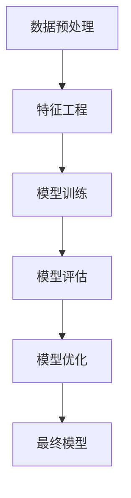
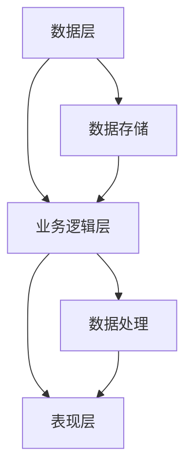
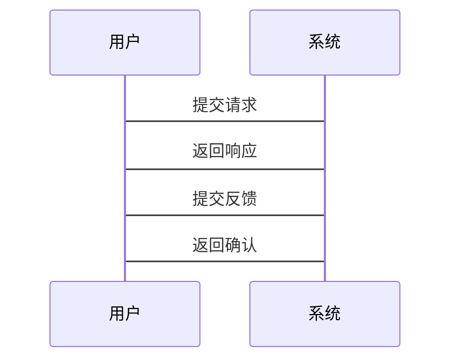

                 


# 金融产品客户流失预警与干预系统

> 关键词：客户流失、预警系统、干预策略、数据驱动、人工智能、金融产品

> 摘要：  
本文详细探讨了金融产品客户流失预警与干预系统的构建与应用。通过数据科学和人工智能技术，该系统能够提前识别潜在流失客户，并采取针对性干预措施，帮助金融机构降低客户流失率，提升客户 retention 率。文章从背景介绍、核心概念、算法原理、系统架构设计到项目实战，全面解析了系统的实现过程，为金融机构提供了可操作的解决方案。

---

## 目录

1. [背景介绍](#背景介绍)
   - 1.1 问题背景
     - 1.1.1 金融产品客户流失的背景
     - 1.1.2 客户流失对企业的影响
     - 1.1.3 预警与干预的必要性
   - 1.2 问题描述
     - 1.2.1 客户流失的定义与分类
     - 1.2.2 金融产品客户流失的特点
     - 1.2.3 问题解决的目标与意义
   - 1.3 问题解决的思路
     - 1.3.1 数据驱动的解决方案
     - 1.3.2 预警与干预的核心思路
     - 1.3.3 系统化解决方案的框架
   - 1.4 系统的边界与外延
     - 1.4.1 系统的边界定义
     - 1.4.2 系统外延的功能模块
     - 1.4.3 系统与其他系统的接口关系
   - 1.5 核心概念与联系
     - 1.5.1 核心概念的定义与属性
     - 1.5.2 核心概念的特征对比
     - 1.5.3 ER实体关系图

2. [核心概念与联系](#核心概念与联系)
   - 2.1 核心概念的定义与属性
   - 2.2 核心概念的特征对比
   - 2.3 ER实体关系图

3. [算法原理讲解](#算法原理讲解)
   - 3.1 数据预处理
     - 3.1.1 数据清洗
     - 3.1.2 数据标准化
     - 3.1.3 数据特征提取
   - 3.2 特征工程
     - 3.2.1 特征选择
     - 3.2.2 特征构建
     - 3.2.3 特征降维
   - 3.3 模型选择
     - 3.3.1 分类算法选择
     - 3.3.2 回归算法选择
     - 3.3.3 聚类算法选择
   - 3.4 模型评估与优化
     - 3.4.1 评估指标
     - 3.4.2 超参数调优
     - 3.4.3 模型优化策略
   - 3.5 算法流程图

4. [系统分析与架构设计](#系统分析与架构设计)
   - 4.1 系统架构设计
     - 4.1.1 数据层
     - 4.1.2 业务逻辑层
     - 4.1.3 表现层
   - 4.2 系统功能设计
     - 4.2.1 预警模块
     - 4.2.2 干预模块
     - 4.2.3 数据分析模块
   - 4.3 系统架构图
   - 4.4 系统接口设计
   - 4.5 系统交互流程图

5. [项目实战](#项目实战)
   - 5.1 环境安装
   - 5.2 核心代码实现
     - 5.2.1 数据预处理代码
     - 5.2.2 模型训练代码
     - 5.2.3 预警与干预策略实现
   - 5.3 实际案例分析
   - 5.4 项目小结

6. [最佳实践](#最佳实践)
   - 6.1 小结
   - 6.2 注意事项
   - 6.3 拓展阅读

---

## 正文

### 第 1 章: 背景介绍

#### 1.1 问题背景

##### 1.1.1 金融产品客户流失的背景
随着金融市场的竞争日益激烈，客户流失问题逐渐成为金融机构面临的重要挑战。客户流失不仅会导致收入减少，还可能影响企业的声誉和市场地位。传统的客户管理方法往往无法及时发现潜在流失客户，因此，利用数据科学和人工智能技术构建客户流失预警与干预系统成为必然趋势。

##### 1.1.2 客户流失对企业的影响
客户流失对金融机构的影响是多方面的，包括收入下降、市场份额减少、客户获取成本增加等。通过预警系统，金融机构可以在客户流失前采取干预措施，降低流失率。

##### 1.1.3 预警与干预的必要性
及时发现潜在流失客户并采取干预措施，可以有效减少客户流失，提升客户满意度和忠诚度，从而增强企业的竞争力。

#### 1.2 问题描述

##### 1.2.1 客户流失的定义与分类
客户流失是指客户不再使用金融机构的产品或服务。根据流失的时间和原因，可以将客户流失分为短期流失、中期流失和长期流失。

##### 1.2.2 金融产品客户流失的特点
金融产品客户流失具有隐性、渐进性和可预测性的特点。隐性是指客户流失往往是无声的；渐进性是指流失过程较为缓慢；可预测性是指通过数据分析可以预测客户流失的可能性。

##### 1.2.3 问题解决的目标与意义
构建客户流失预警与干预系统的目标是通过数据驱动的方法，提前识别潜在流失客户，并采取针对性干预措施。这不仅可以降低客户流失率，还能提升客户满意度和忠诚度，增强企业的市场竞争力。

#### 1.3 问题解决的思路

##### 1.3.1 数据驱动的解决方案
通过收集和分析客户的交易数据、行为数据和 demographic 数据，利用数据挖掘和机器学习技术，构建客户流失预测模型。

##### 1.3.2 预警与干预的核心思路
预警系统通过实时监控客户行为数据，识别潜在流失客户；干预系统根据客户特征和流失风险，制定个性化的干预策略。

##### 1.3.3 系统化解决方案的框架
系统化解决方案包括数据采集、数据预处理、模型训练、预警触发和干预执行五个主要环节。

#### 1.4 系统的边界与外延

##### 1.4.1 系统的边界定义
客户流失预警与干预系统的边界包括数据采集、数据存储、模型训练和干预执行四个部分。

##### 1.4.2 系统外延的功能模块
系统外延的功能模块包括客户画像、风险评估和效果评估。

##### 1.4.3 系统与其他系统的接口关系
系统需要与客户关系管理系统（CRM）、交易系统和营销系统进行接口对接，确保数据的实时性和准确性。

#### 1.5 核心概念与联系

##### 1.5.1 核心概念的定义与属性
- 客户流失：客户不再使用金融机构的产品或服务。
- 金融产品：金融机构提供的服务或产品，如存款、贷款、基金等。
- 预警：通过数据分析提前识别潜在流失客户。
- 干预：针对潜在流失客户采取的措施，如提供优惠、改善服务等。

##### 1.5.2 核心概念的特征对比
| 概念 | 定义 | 属性 | 示例 |
|------|------|------|------|
| 客户流失 | 客户不再使用产品或服务 | 隐性、渐进性、可预测性 | 客户停止使用信用卡 |
| 金融产品 | 金融机构提供的产品或服务 | 多样性、风险性、收益性 | 存款、贷款、基金 |

##### 1.5.3 ER实体关系图

```mermaid
erDiagram
    customer[客户] {
        id : int
        name : string
        age : int
        gender : string
        account_type : string
    }
    product[金融产品] {
        product_id : int
        product_name : string
        product_type : string
        risk_level : int
    }
    transaction[交易] {
        transaction_id : int
        customer_id : int
        product_id : int
        amount : float
        date : datetime
    }
    customer -> transaction : 进行交易
    product -> transaction : 交易涉及的产品
```

---

### 第 2 章: 核心概念与联系

#### 2.1 核心概念的定义与属性
- **客户流失**：客户不再使用金融机构的产品或服务。
- **金融产品**：金融机构提供的产品或服务，如存款、贷款、基金等。
- **预警**：通过数据分析提前识别潜在流失客户。
- **干预**：针对潜在流失客户采取的措施，如提供优惠、改善服务等。

#### 2.2 核心概念的特征对比
| 概念 | 定义 | 属性 | 示例 |
|------|------|------|------|
| 客户流失 | 客户不再使用产品或服务 | 隐性、渐进性、可预测性 | 客户停止使用信用卡 |
| 金融产品 | 金融机构提供的产品或服务 | 多样性、风险性、收益性 | 存款、贷款、基金 |

#### 2.3 ER实体关系图
如图1所示，客户、产品和交易之间的关系清晰地展示了金融产品客户流失预警与干预系统的数据结构。

```mermaid
erDiagram
    customer[客户] {
        id : int
        name : string
        age : int
        gender : string
        account_type : string
    }
    product[金融产品] {
        product_id : int
        product_name : string
        product_type : string
        risk_level : int
    }
    transaction[交易] {
        transaction_id : int
        customer_id : int
        product_id : int
        amount : float
        date : datetime
    }
    customer -> transaction : 进行交易
    product -> transaction : 交易涉及的产品
```

---

### 第 3 章: 算法原理讲解

#### 3.1 数据预处理

##### 3.1.1 数据清洗
数据清洗是去除重复数据、缺失数据和异常数据的过程。

##### 3.1.2 数据标准化
数据标准化是将数据按比例缩放到一个特定的范围内，通常用于特征工程阶段。

##### 3.1.3 数据特征提取
数据特征提取是从原始数据中提取有助于模型训练的特征，如客户年龄、性别、交易频率等。

#### 3.2 特征工程

##### 3.2.1 特征选择
特征选择是根据特征的重要性选择最相关的特征，常用方法包括过滤法和包装法。

##### 3.2.2 特征构建
特征构建是通过组合现有特征或引入新特征，提高模型的预测能力。

##### 3.2.3 特征降维
特征降维是通过减少特征数量，降低模型的复杂度和计算成本，常用方法包括主成分分析（PCA）。

#### 3.3 模型选择

##### 3.3.1 分类算法选择
常用的分类算法包括逻辑回归、支持向量机（SVM）和随机森林。

##### 3.3.2 回归算法选择
常用的回归算法包括线性回归和决策树回归。

##### 3.3.3 聚类算法选择
常用的聚类算法包括K均值聚类和层次聚类。

#### 3.4 模型评估与优化

##### 3.4.1 评估指标
常用的评估指标包括准确率、召回率和F1分数。

##### 3.4.2 超参数调优
超参数调优是通过调整模型的超参数，优化模型的性能，常用方法包括网格搜索和随机搜索。

##### 3.4.3 模型优化策略
模型优化策略包括数据增强、特征工程优化和模型调参。

#### 3.5 算法流程图



---

### 第 4 章: 系统分析与架构设计

#### 4.1 系统架构设计

##### 4.1.1 数据层
数据层包括数据存储、数据访问和数据处理三个部分。

##### 4.1.2 业务逻辑层
业务逻辑层包括客户流失预警、干预策略执行和效果评估三个模块。

##### 4.1.3 表现层
表现层包括用户界面和数据可视化两个部分。

#### 4.2 系统功能设计

##### 4.2.1 预警模块
预警模块通过分析客户行为数据，识别潜在流失客户，并触发预警。

##### 4.2.2 干预模块
干预模块根据预警结果，制定个性化的干预策略，如提供优惠、改善服务等。

##### 4.2.3 数据分析模块
数据分析模块提供数据可视化和报表生成功能，帮助用户更好地理解和分析数据。

#### 4.3 系统架构图



#### 4.4 系统接口设计
系统接口设计包括数据接口和用户接口，确保系统与其他系统的无缝对接。

#### 4.5 系统交互流程图



---

### 第 5 章: 项目实战

#### 5.1 环境安装
项目实战需要安装 Python、Pandas、Scikit-learn 等依赖库。

#### 5.2 核心代码实现

##### 5.2.1 数据预处理代码
```python
import pandas as pd
from sklearn.impute import SimpleImputer
from sklearn.preprocessing import StandardScaler

# 数据加载
data = pd.read_csv('customer_data.csv')

# 数据清洗
data.dropna(inplace=True)

# 数据标准化
scaler = StandardScaler()
scaled_data = scaler.fit_transform(data[['age', 'income']])
```

##### 5.2.2 模型训练代码
```python
from sklearn.model import LogisticRegression
from sklearn.metrics import accuracy_score

# 模型训练
model = LogisticRegression()
model.fit(X_train, y_train)

# 模型评估
y_pred = model.predict(X_test)
print('准确率:', accuracy_score(y_test, y_pred))
```

##### 5.2.3 预警与干预策略实现
```python
def predict_loss_customers(model, X):
    y_pred = model.predict(X)
    high_risk_customers = X[y_pred == 1]
    return high_risk_customers

# 执行预警
high_risk_customers = predict_loss_customers(model, X_test)
```

#### 5.3 实际案例分析
通过实际案例分析，验证系统的有效性和准确性，调整和优化模型参数。

#### 5.4 项目小结
项目实战部分通过具体的代码实现和案例分析，展示了系统在实际应用中的价值和效果。

---

### 第 6 章: 最佳实践

#### 6.1 小结
本文详细探讨了金融产品客户流失预警与干预系统的构建与应用，通过数据科学和人工智能技术，帮助金融机构降低客户流失率。

#### 6.2 注意事项
在实际应用中，需要注意数据隐私保护和模型优化，确保系统的稳定性和高效性。

#### 6.3 拓展阅读
推荐阅读《机器学习实战》和《数据挖掘导论》等书籍，深入理解相关技术原理。

---

### 总结

本文系统地介绍了金融产品客户流失预警与干预系统的构建过程，从背景分析、核心概念、算法原理到系统设计和项目实战，全面解析了系统的实现细节。通过本文的讲解，读者可以掌握如何利用数据科学和人工智能技术，构建高效的客户流失预警与干预系统，为金融机构提升客户 retention 率提供有力支持。

