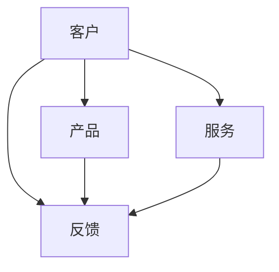
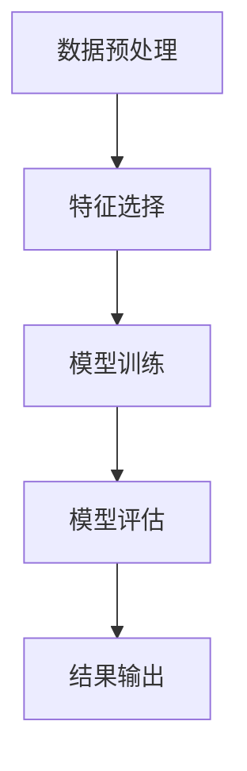
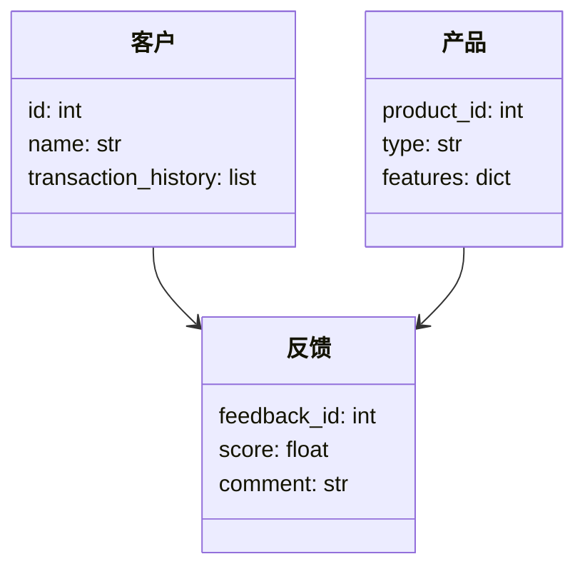

                 


# 《金融产品客户满意度预测系统》

## 关键词

- 金融产品
- 客户满意度
- 预测系统
- 机器学习
- 数据挖掘
- 系统架构

## 摘要

本文探讨了基于机器学习的金融产品客户满意度预测系统，通过数据挖掘和分析，构建预测模型，帮助金融机构提升客户满意度和产品竞争力。文章从背景、概念、算法、架构到实战，详细讲解了系统构建的各个方面，为读者提供理论和实践指导。

## 目录大纲

---

## 第一部分：背景介绍

### 第1章：问题背景与描述

#### 1.1 问题背景
- 1.1.1 金融行业客户满意度的重要性
- 1.1.2 客户流失对企业的影响
- 1.1.3 数据驱动决策的必要性

#### 1.2 问题描述
- 1.2.1 客户满意度的多维度定义
- 1.2.2 金融产品预测的复杂性
- 1.2.3 现有方法的局限性

#### 1.3 问题解决思路
- 1.3.1 数据收集与预处理
- 1.3.2 机器学习模型的选择与训练
- 1.3.3 系统化预测模型的构建

#### 1.4 边界与外延
- 1.4.1 系统适用的金融产品类型
- 1.4.2 数据范围的限定
- 1.4.3 预测结果的应用场景

---

## 第二部分：核心概念与联系

### 第2章：客户满意度预测的核心概念

#### 2.1 核心概念原理
- 2.1.1 客户满意度预测的定义
- 2.1.2 金融产品的核心属性
- 2.1.3 客户行为与反馈的关联性

#### 2.2 核心概念属性对比
- 2.2.1 客户行为数据特征
- 2.2.2 产品属性数据特征
- 2.2.3 服务与体验数据特征

#### 2.3 ER实体关系图


---

## 第三部分：算法原理讲解

### 第3章：机器学习算法原理

#### 3.1 算法选择与原理
- 3.1.1 线性回归与逻辑回归的原理
- 3.1.2 支持向量机（SVM）的分类方法
- 3.1.3 随机森林与XGBoost的比较

#### 3.2 算法流程图


#### 3.3 算法实现代码
```python
from sklearn.ensemble import RandomForestClassifier
from sklearn.metrics import accuracy_score

# 数据预处理
X = df.drop('target', axis=1)
y = df['target']

# 特征选择
selector = SelectKBest(k=10).fit_transform(X, y)

# 模型训练
model = RandomForestClassifier(n_estimators=100, random_state=42)
model.fit(selector, y)

# 模型评估
y_pred = model.predict(selector)
print("准确率:", accuracy_score(y, y_pred))
```

#### 3.4 数学模型与公式
- 随机森林的分类原理：
  $$ \text{概率} = \frac{\sum_{i=1}^{n} h_i}{n} $$
  其中，\( h_i \) 是第i棵树的预测结果。

- XGBoost的优化目标：
  $$ \text{目标函数} = \text{损失函数} + \lambda \times \text{正则化项} $$

---

## 第四部分：系统分析与架构设计

### 第4章：系统分析与架构设计

#### 4.1 问题场景介绍
- 4.1.1 以银行为例的客户满意度预测场景
- 4.1.2 系统的目标与功能需求

#### 4.2 系统功能设计
- 4.2.1 数据采集模块
- 4.2.2 特征工程模块
- 4.2.3 模型训练模块
- 4.2.4 结果展示模块

#### 4.3 领域模型类图


#### 4.4 系统架构设计


#### 4.5 接口与交互设计
- 4.5.1 HTTP接口定义
- 4.5.2 RESTful API交互流程

---

## 第五部分：项目实战

### 第5章：项目实战

#### 5.1 环境搭建与数据获取
- 5.1.1 安装Python和相关库
- 5.1.2 数据集的获取与预处理

#### 5.2 系统核心代码实现
```python
import pandas as pd
from sklearn.model_selection import train_test_split

# 数据加载
data = pd.read_csv('customer_satisfaction.csv')

# 数据分割
X_train, X_test, y_train, y_test = train_test_split(data.drop('satisfaction', axis=1), data['satisfaction'], test_size=0.2)
```

#### 5.3 代码解读与分析
- 5.3.1 数据预处理的详细步骤
- 5.3.2 特征选择的评估方法
- 5.3.3 模型调优与评估

#### 5.4 实际案例分析
- 5.4.1 某银行客户数据的处理与分析
- 5.4.2 模型预测结果的解读与优化

#### 5.5 项目小结
- 5.5.1 项目总结
- 5.5.2 经验与教训
- 5.5.3 改进建议

---

## 第六部分：最佳实践与扩展

### 第6章：最佳实践与小结

#### 6.1 系统设计的注意事项
- 数据隐私保护的重要性
- 模型可解释性的提升
- 系统的实时性与响应速度

#### 6.2 实施中的小贴士
- 数据预处理的技巧
- 模型调优的策略
- 结果可视化的建议

#### 6.3 注意事项
- 避免过拟合的常见方法
- 数据质量问题的处理
- 系统维护与更新的周期

#### 6.4 扩展阅读与学习
- 推荐书籍与在线课程
- 其他相关技术与方法

---

## 第七部分：总结与展望

### 第7章：总结与展望

#### 7.1 全文总结
- 金融产品客户满意度预测系统的总体框架
- 各模块的功能与实现
- 系统的价值与意义

#### 7.2 展望
- 深度学习技术的引入
- 实时反馈机制的应用
- 多模型集成预测的可能性

---

## 结束语

通过以上目录大纲，我们可以看到，构建一个金融产品客户满意度预测系统需要从数据收集、算法选择、系统设计到实际应用的全方位考虑。希望这篇文章能够为读者提供有价值的参考与指导。

