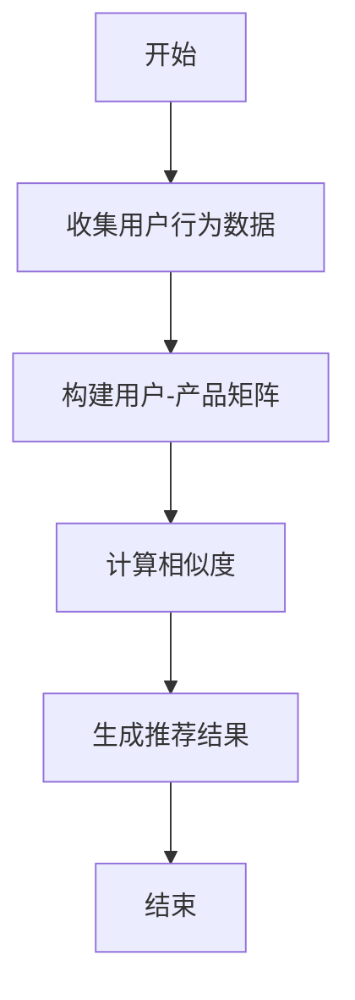
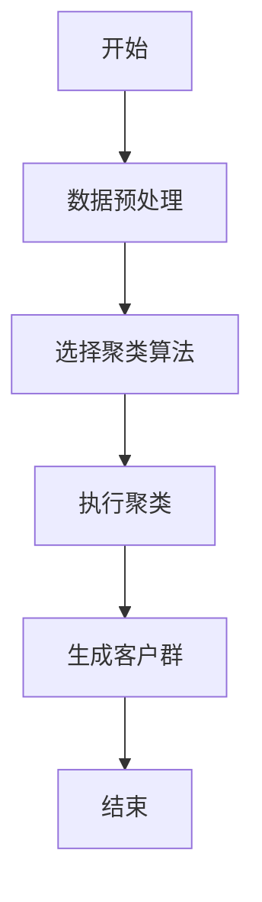
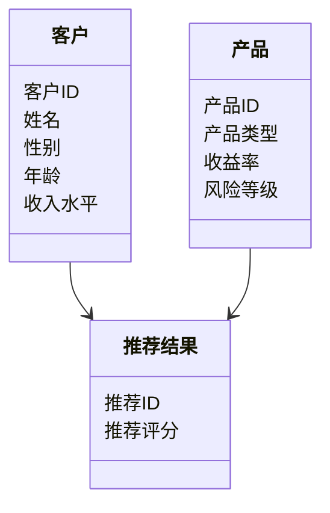
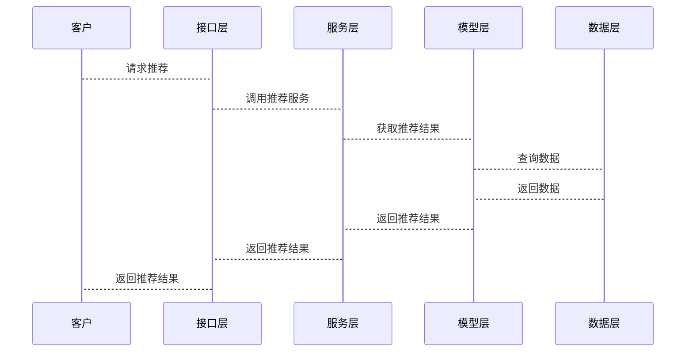

                 


# 金融产品客户精准营销推荐引擎

> **关键词**: 金融产品，精准营销，推荐引擎，协同过滤，机器学习，客户画像，数据挖掘

> **摘要**: 本文深入探讨了金融产品客户精准营销推荐引擎的设计与实现。从背景介绍到核心概念，从算法原理到系统架构，再到项目实战，系统性地分析了构建推荐引擎的关键环节。通过实际案例分析和详细的技术实现，展示了如何利用协同过滤、聚类分析等算法，结合客户画像和行为数据，实现高效的金融产品推荐。本文还总结了推荐引擎的优势与不足，并展望了未来的发展方向。

---

## 第1章: 背景介绍

### 1.1 问题背景

#### 1.1.1 传统金融营销的局限性
传统的金融营销方式存在以下问题：
- **信息不对称**：金融机构难以全面了解客户需求，导致推荐的产品与客户实际需求不匹配。
- **营销效率低**：通过传统渠道（如电话、邮件）进行营销，客户触达率低，转化率低。
- **客户体验差**：客户接收到大量无关的产品推荐，导致用户体验下降，甚至产生抵触情绪。

#### 1.1.2 精准营销的需求与痛点
- **需求**：金融机构希望通过分析客户数据，精准识别客户需求，提供个性化的产品推荐。
- **痛点**：如何高效地收集、分析和利用客户数据，构建一个智能化的推荐系统。

#### 1.1.3 金融产品营销的核心问题
金融产品的复杂性和多样性使得精准营销更具挑战性：
- **产品多样性**：银行、保险、基金等金融产品种类繁多，不同客户的需求差异大。
- **风险控制**：推荐错误的产品可能导致客户经济损失，甚至引发信任危机。
- **合规性要求**：金融产品的推荐必须符合相关法律法规，确保合规性。

### 1.2 问题描述

#### 1.2.1 客户需求的多样性
客户的需求受到多种因素的影响，包括收入水平、风险偏好、投资目标等。例如，高净值客户可能更关注高端理财产品，而年轻客户可能对消费信贷更感兴趣。

#### 1.2.2 产品与客户的匹配问题
如何将复杂的金融产品与客户的财务状况、风险偏好和投资目标相匹配，是精准营销的核心挑战。

#### 1.2.3 营销效率的提升需求
通过自动化推荐系统，金融机构可以大幅提高营销效率，减少人工干预，降低营销成本。

### 1.3 问题解决

#### 1.3.1 精准营销的定义与目标
- **定义**：精准营销是指通过分析客户数据，利用技术手段，为客户提供个性化的产品推荐。
- **目标**：
  - 提高客户转化率。
  - 提升客户满意度。
  - 降低营销成本。

#### 1.3.2 推荐引擎的核心作用
推荐引擎是实现精准营销的关键技术，它通过分析客户行为数据和产品特征，生成个性化推荐结果。

#### 1.3.3 金融产品的独特性与挑战
金融产品具有高度的专业性和复杂性，推荐引擎需要考虑产品风险、收益、流动性等多个维度。

### 1.4 概念结构与核心要素

#### 1.4.1 推荐引擎的系统架构
推荐引擎通常包括以下组件：
- **数据采集**：收集客户行为数据、产品数据。
- **数据处理**：清洗、整合数据，构建客户画像和产品画像。
- **推荐算法**：基于协同过滤、聚类分析等算法生成推荐结果。
- **推荐结果输出**：通过API或界面将推荐结果返回给前端系统。

#### 1.4.2 核心要素的定义与关系
- **客户画像**：基于客户的 demographic（人口统计）和 behavioral（行为）数据构建的客户特征。
- **产品画像**：基于产品的属性（如收益率、风险等级）构建的产品特征。
- **推荐规则**：根据客户和产品的特征，制定推荐策略。

#### 1.4.3 边界与外延的界定
推荐引擎的边界包括数据输入、算法处理和结果输出。外延则涉及前端展示和后端数据存储。

### 1.5 本章小结
本章介绍了金融产品精准营销的背景、问题和解决方案，为后续的技术实现奠定了基础。

---

## 第2章: 核心概念与联系

### 2.1 推荐引擎的核心概念

#### 2.1.1 推荐引擎的定义与分类
- **定义**：推荐引擎是一种基于数据挖掘和机器学习技术，为用户推荐相关内容或产品的系统。
- **分类**：
  - **基于规则的推荐**：根据预定义的规则生成推荐结果。
  - **基于协同过滤的推荐**：基于用户行为数据，找到相似的用户或产品进行推荐。
  - **基于机器学习的推荐**：利用机器学习算法（如协同过滤、聚类、分类）生成推荐结果。

#### 2.1.2 精准营销的核心要素
- **客户特征**：年龄、性别、收入、资产规模、风险偏好等。
- **产品特征**：产品类型、收益率、风险等级、流动性等。
- **行为特征**：客户的浏览、点击、购买行为。

#### 2.1.3 金融产品的推荐逻辑
金融产品的推荐需要考虑客户的风险承受能力和投资目标，推荐的产品应与客户的财务状况和需求相匹配。

### 2.2 核心概念的属性特征对比

#### 2.2.1 不同推荐算法的对比分析
| 算法类型       | 优缺点                               | 适用场景                     |
|----------------|------------------------------------|------------------------------|
| 基于规则       | 易实现，但灵活性低                   | 简单场景                     |
| 协同过滤       | 高精度，但计算复杂                 | 用户行为数据丰富的场景       |
| 机器学习       | 高精度，但需要大量数据             | 复杂场景                     |

#### 2.2.2 精准营销与传统营销的对比
| 对比维度       | 精准营销                             | 传统营销                     |
|----------------|------------------------------------|------------------------------|
| 数据驱动       | 是                                   | 否                           |
| 个性化         | 是                                   | 否                           |
| 营销效率       | 高                                   | 低                           |

#### 2.2.3 金融产品推荐的核心特征
- **客户画像**：精准识别客户的需求和风险偏好。
- **产品匹配**：将客户与最合适的产品匹配。
- **实时性**：推荐结果需要实时更新。

### 2.3 ER实体关系图

```mermaid
er
    entity 客户 {
        key 客户ID
        attribute 姓名, 性别, 年龄, 收入水平, 资产规模, 风险偏好
    }
    entity 产品 {
        key 产品ID
        attribute 产品类型, 收益率, 风险等级, 产品期限
    }
    entity 推荐关系 {
        key 推荐ID
        attribute 推荐评分
        --> 关联 客户
        --> 关联 产品
    }
```

### 2.4 本章小结
本章详细介绍了推荐引擎的核心概念和相关实体关系，为后续的算法实现奠定了基础。

---

## 第3章: 算法原理讲解

### 3.1 协同过滤算法

#### 3.1.1 算法概述
协同过滤是一种基于用户行为数据的推荐算法，分为基于用户的协同过滤和基于产品的协同过滤。

#### 3.1.2 算法步骤


#### 3.1.3 数学模型
基于余弦相似度的协同过滤算法：
$$
\text{相似度}(u_1, u_2) = \frac{\sum_{i} (u_1(i) \times u_2(i))}{\sqrt{\sum_{i} u_1(i)^2} \times \sqrt{\sum_{i} u_2(i)^2}}
$$

#### 3.1.4 代码实现
```python
import numpy as np

def cosine_similarity(user1, user2):
    dot_product = np.dot(user1, user2)
    norm1 = np.linalg.norm(user1)
    norm2 = np.linalg.norm(user2)
    return dot_product / (norm1 * norm2)

# 示例用户数据
user1 = np.array([4, 3, 0, 1])
user2 = np.array([5, 2, 0, 1])
similarity = cosine_similarity(user1, user2)
print("相似度:", similarity)
```

### 3.2 聚类分析算法

#### 3.2.1 算法概述
聚类分析是一种无监督学习算法，用于将客户分成不同的群体，便于推荐。

#### 3.2.2 算法步骤


#### 3.2.3 数学模型
K-means聚类算法：
$$
\text{目标函数} = \sum_{i=1}^{k} \sum_{j=1}^{n_i} ||x_j - c_i||^2
$$

#### 3.2.4 代码实现
```python
from sklearn.cluster import KMeans

# 示例客户数据
X = np.array([[1, 2], [5, 8], [1, 1], [10, 5]])
kmeans = KMeans(n_clusters=2)
kmeans.fit(X)
print("聚类中心:", kmeans.cluster_centers_)
```

### 3.3 本章小结
本章详细讲解了协同过滤和聚类分析的算法原理，并通过代码示例展示了如何实现这些算法。

---

## 第4章: 系统分析与架构设计

### 4.1 问题场景介绍
金融产品推荐系统需要处理大量客户和产品数据，确保推荐结果的准确性和实时性。

### 4.2 系统功能设计

#### 4.2.1 领域模型


#### 4.2.2 系统架构设计


#### 4.2.3 系统接口设计
- **输入接口**：接收客户数据和产品数据。
- **输出接口**：返回推荐结果。

#### 4.2.4 交互序列图


### 4.3 本章小结
本章详细分析了推荐系统的架构设计，包括领域模型、系统架构和接口设计。

---

## 第5章: 项目实战

### 5.1 环境安装
- **Python**：安装Python 3.x。
- **依赖库**：安装numpy、pandas、scikit-learn。

### 5.2 核心代码实现

#### 5.2.1 数据预处理
```python
import pandas as pd

# 加载数据
data = pd.read_csv('customer_data.csv')
```

#### 5.2.2 构建推荐模型
```python
from sklearn.metrics.pairwise import cosine_similarity

# 计算余弦相似度
similarity_matrix = cosine_similarity(data)
```

#### 5.2.3 生成推荐结果
```python
def generate_recommendations(customer_id, similarity_matrix, top_n=5):
    recommendations = []
    for i in range(len(similarity_matrix[customer_id])):
        if i != customer_id:
            recommendations.append((i, similarity_matrix[customer_id][i]))
    recommendations.sort(key=lambda x: x[1], reverse=True)
    return recommendations[:top_n]

# 示例输出
print(generate_recommendations(0, similarity_matrix))
```

### 5.3 案例分析与解读

#### 5.3.1 案例分析
假设我们有一个客户数据集，包含客户的基本信息和产品偏好，我们可以通过协同过滤算法生成推荐结果。

#### 5.3.2 推荐结果解读
推荐系统可以根据客户的资产规模和风险偏好，推荐适合的理财产品。

### 5.4 本章小结
本章通过实际案例展示了推荐引擎的实现过程，从数据预处理到模型构建，再到结果生成。

---

## 第6章: 总结与展望

### 6.1 总结
本文详细介绍了金融产品客户精准营销推荐引擎的设计与实现，涵盖背景、算法、架构和项目实战。

### 6.2 优势与不足

#### 6.2.1 优势
- **提高营销效率**：通过自动化推荐减少人工干预。
- **提升客户满意度**：提供个性化的产品推荐。

#### 6.2.2 不足
- **数据依赖性**：推荐结果依赖于数据质量和数量。
- **计算复杂性**：大规模数据计算可能需要高性能计算资源。

### 6.3 最佳实践 tips

#### 6.3.1 数据质量管理
- 确保数据的准确性和完整性。
- 处理缺失值和异常值。

#### 6.3.2 模型优化
- 使用多种算法进行对比，选择最优模型。
- 定期更新模型以适应市场变化。

#### 6.3.3 客户隐私保护
- 确保客户数据的安全性和隐私性。
- 遵守相关法律法规。

### 6.4 未来展望
随着人工智能和大数据技术的发展，推荐引擎将更加智能化和个性化。未来的推荐系统可能结合自然语言处理和深度学习技术，提供更精准的推荐。

### 6.5 本章小结
本文总结了推荐引擎的优势与不足，并提出了未来的发展方向。

---

## 附录

### 附录1: 数据集
- 示例客户数据集：`customer_data.csv`

### 附录2: 源代码
- 协同过滤算法实现：`collaborative_filtering.py`
- 聚类分析算法实现：`clustering.py`

### 附录3: 参考文献
- [1] 刘洋, 《数据挖掘与机器学习》, 清华大学出版社, 2020。
- [2] 李明, 《推荐系统实践》, 人民邮电出版社, 2021。

---

通过以上目录大纲和内容，您可以根据需要进一步扩展每一章的具体内容，确保文章的完整性和深度。

