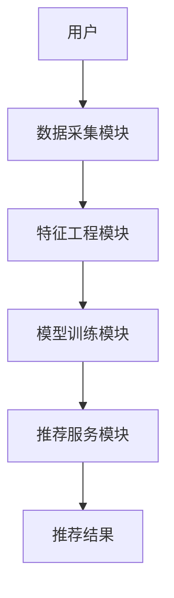
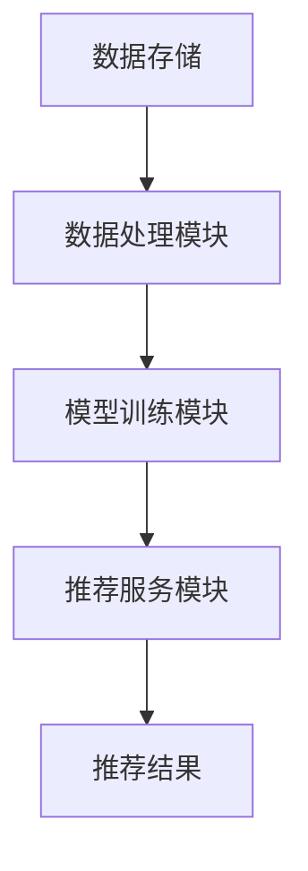
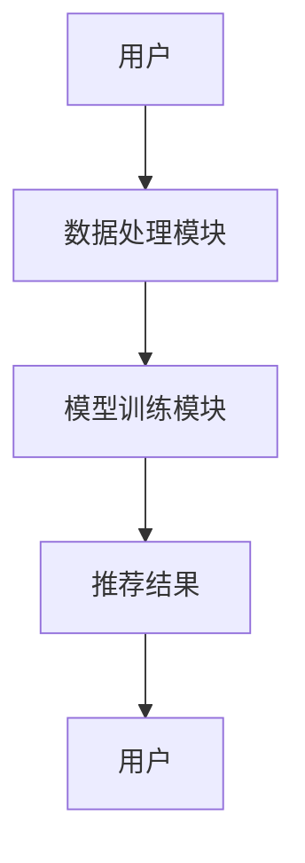

                 


# 《金融产品推荐系统》

## 关键词：金融推荐系统，机器学习，协同过滤，矩阵分解，深度学习，金融产品

## 摘要：金融产品推荐系统是一种结合金融产品特性和用户需求的智能推荐系统，利用机器学习算法和大数据分析技术，为用户提供个性化、精准的金融产品推荐。本文将从推荐系统的原理、机器学习在金融推荐中的应用、系统架构设计、项目实战等方面详细讲解金融产品推荐系统的构建与实现。

---

# 第1章: 金融产品推荐系统概述

## 1.1 什么是金融产品推荐系统

### 1.1.1 金融产品的定义与分类

金融产品是金融机构提供给客户的各类服务或工具，旨在满足客户的投资、融资、风险管理等需求。常见的金融产品包括：

- **存款**：活期存款、定期存款等。
- **贷款**：个人贷款、企业贷款、住房贷款等。
- **证券**：股票、债券、基金等。
- **保险**：人寿保险、财产保险等。
- **理财产品**：银行理财、信托产品、私募基金等。

### 1.1.2 推荐系统的定义与特点

推荐系统是一种基于用户行为和偏好，通过算法计算出用户可能感兴趣的产品或服务的系统。其特点包括：

- **个性化**：根据用户的特征和行为，提供定制化的推荐。
- **实时性**：能够快速响应用户需求，实时更新推荐结果。
- **数据驱动**：依赖于大量数据的收集和分析，确保推荐的准确性。

### 1.1.3 金融产品推荐系统的独特性

金融产品推荐系统与传统推荐系统相比，具有以下独特性：

- **高风险性**：金融产品的选择可能直接影响用户的财务状况，推荐系统需要考虑风险因素。
- **合规性**：金融行业受到严格监管，推荐系统需要符合相关法律法规。
- **多样性**：金融产品种类繁多，推荐系统需要能够处理复杂的金融产品特性。

## 1.2 金融产品推荐系统的应用场景

### 1.2.1 银行、证券、保险等行业的推荐需求

金融产品推荐系统在不同金融行业中的应用场景有所不同：

- **银行**：推荐存款、贷款、信用卡等产品。
- **证券**：推荐股票、基金、债券等投资产品。
- **保险**：推荐人寿保险、财产保险等产品。

### 1.2.2 用户行为分析与推荐目标

金融产品的推荐目标通常包括：

- **用户画像**：通过分析用户的年龄、职业、收入、资产规模等信息，构建用户画像。
- **行为分析**：通过分析用户的交易记录、点击行为、搜索记录等，了解用户的偏好和需求。
- **风险评估**：通过评估用户的风险承受能力，推荐适合其风险偏好的产品。

### 1.2.3 金融产品推荐的业务价值

金融产品推荐系统的业务价值主要体现在：

- **提升用户体验**：通过个性化推荐，提高用户满意度和忠诚度。
- **提高销售效率**：通过精准推荐，提高金融产品的销售效率。
- **降低风险**：通过推荐适合用户风险偏好的产品，降低用户的投资风险。

## 1.3 金融产品推荐系统的挑战与机遇

### 1.3.1 数据稀疏性与数据质量

金融产品推荐系统面临数据稀疏性问题，即用户数据量较少，导致推荐系统的准确性下降。

### 1.3.2 用户风险偏好与投资能力

用户的财务状况和风险承受能力不同，推荐系统需要能够准确评估用户的这些特征，以提供适合的推荐。

### 1.3.3 监管合规与隐私保护

金融行业受到严格监管，推荐系统需要确保数据的合规性和用户隐私的保护。

## 1.4 本章小结

本章介绍了金融产品推荐系统的定义、应用场景和挑战，为后续章节的深入分析奠定了基础。

---

# 第2章: 金融产品推荐系统的原理

## 2.1 推荐系统的分类

### 2.1.1 基于协同过滤的推荐

协同过滤是一种基于用户行为相似性的推荐方法，分为基于用户的协同过滤和基于物品的协同过滤。

#### 基于用户的协同过滤

基于用户的协同过滤通过计算用户之间的相似性，将相似用户的偏好用于推荐。

**公式：**

$$ sim(u_i, u_j) = \frac{\sum_{k} (r_{u_i,k} - \bar{r_{u_i}})(r_{u_j,k} - \bar{r_{u_j}})}{\sqrt{\sum_{k} (r_{u_i,k} - \bar{r_{u_i}})^2} \sqrt{\sum_{k} (r_{u_j,k} - \bar{r_{u_j}})^2}}} $$

其中，$sim(u_i, u_j)$ 表示用户 $u_i$ 和 $u_j$ 之间的相似性，$r_{u_i,k}$ 表示用户 $u_i$ 对物品 $k$ 的评分，$\bar{r_{u_i}}$ 表示用户 $u_i$ 的平均评分。

#### 基于物品的协同过滤

基于物品的协同过滤通过计算物品之间的相似性，将相似物品推荐给用户。

**公式：**

$$ sim(i_j, i_k) = \frac{\sum_{u} (r_{u,i_j} - \bar{r_{i_j}})(r_{u,i_k} - \bar{r_{i_k}})}{\sqrt{\sum_{u} (r_{u,i_j} - \bar{r_{i_j}})^2} \sqrt{\sum_{u} (r_{u,i_k} - \bar{r_{i_k}})^2}}} $$

其中，$sim(i_j, i_k)$ 表示物品 $i_j$ 和 $i_k$ 之间的相似性，$r_{u,i_j}$ 表示用户 $u$ 对物品 $i_j$ 的评分，$\bar{r_{i_j}}$ 表示物品 $i_j$ 的平均评分。

### 2.1.2 基于内容的推荐

基于内容的推荐通过分析产品本身的特征，找到与用户需求匹配的产品。

**步骤：**

1. **提取产品特征**：将产品转化为特征向量。
2. **计算相似度**：计算用户需求与产品特征之间的相似度。
3. **推荐产品**：根据相似度排序，推荐最相似的产品。

### 2.1.3 混合推荐方法

混合推荐方法结合了基于协同过滤和基于内容的推荐方法，利用两种方法的优点，提高推荐的准确性和多样性。

---

## 2.2 协同过滤的原理与实现

### 2.2.1 协同过滤的实现步骤

1. **数据预处理**：收集和整理用户对产品的评分数据。
2. **计算相似度**：使用协同过滤算法计算用户或产品之间的相似度。
3. **生成推荐**：基于相似度计算，生成推荐结果。

### 2.2.2 协同过滤的优缺点

- **优点**：简单易实现，能够发现用户之间的相似性。
- **缺点**：数据稀疏性问题，计算复杂度高。

---

## 2.3 基于机器学习的推荐

### 2.3.1 基于矩阵分解的推荐

矩阵分解是一种常用的方法，将用户-产品评分矩阵分解为两个低维矩阵，分别表示用户和产品的潜在特征。

**公式：**

$$ R = P \times Q^T $$

其中，$R$ 是用户-产品评分矩阵，$P$ 是用户潜在特征矩阵，$Q$ 是产品潜在特征矩阵。

### 2.3.2 基于深度学习的推荐

深度学习通过构建神经网络模型，学习用户和产品之间的复杂关系，提高推荐的准确性。

**模型结构：**

1. **输入层**：用户和产品的特征向量。
2. **隐层**：多个隐层，用于提取特征。
3. **输出层**：预测用户对产品的评分。

### 2.3.3 机器学习在推荐中的优势

- **非线性关系**：能够捕捉用户和产品之间的非线性关系。
- **高维数据**：能够处理高维数据，提取深层次特征。

---

## 2.4 本章小结

本章详细介绍了推荐系统的分类和协同过滤的原理与实现，以及基于机器学习的推荐方法。

---

# 第3章: 机器学习在金融产品推荐中的应用

## 3.1 机器学习基础与金融应用

### 3.1.1 机器学习的基本概念

机器学习是一种人工智能技术，通过数据训练模型，实现对未知数据的预测和分类。

### 3.1.2 金融场景中的机器学习应用

- **风险评估**：通过机器学习模型评估用户的信用风险。
- **投资组合优化**：通过机器学习模型优化投资组合，提高收益。

### 3.1.3 金融推荐中的机器学习优势

- **数据驱动**：能够处理大量金融数据，提高推荐的准确性。
- **动态调整**：能够根据市场变化动态调整推荐策略。

---

## 3.2 机器学习算法在金融推荐中的应用

### 3.2.1 线性回归与逻辑回归

- **线性回归**：用于预测连续型变量，如股票价格。
- **逻辑回归**：用于分类问题，如客户信用评估。

### 3.2.2 支持向量机（SVM）

支持向量机通过构建超平面，实现数据的分类。

**公式：**

$$ \text{目标函数} = \sum_{i=1}^n \xi_i + \frac{1}{2} \sum_{i=1}^n \alpha_i^2 $$

其中，$\xi_i$ 是松弛变量，$\alpha_i$ 是拉格朗日乘子。

### 3.2.3 随机森林与梯度提升树

- **随机森林**：通过构建多个决策树，提高模型的泛化能力。
- **梯度提升树**：通过逐步优化模型，提高预测精度。

### 3.2.4 神经网络与深度学习

- **神经网络**：通过构建多层神经网络，学习数据的深层特征。
- **深度学习**：通过卷积神经网络（CNN）和循环神经网络（RNN）等深度模型，实现复杂的特征提取。

---

## 3.3 机器学习在金融推荐中的特征工程

### 3.3.1 特征提取与特征选择

- **特征提取**：将数据转换为特征向量。
- **特征选择**：选择对目标变量影响较大的特征。

### 3.3.2 特征工程的金融场景应用

- **文本特征**：将新闻、报告等文本数据转化为特征向量。
- **数值特征**：处理金融数据中的数值型特征。

### 3.3.3 特征的数值化与标准化

- **数值化**：将文本特征转换为数值型特征。
- **标准化**：对特征进行归一化处理，使不同特征具有可比性。

---

## 3.4 本章小结

本章介绍了机器学习在金融推荐中的应用，包括常用算法和特征工程的方法。

---

# 第4章: 金融产品推荐系统的算法实现

## 4.1 基于矩阵分解的推荐算法

### 4.1.1 矩阵分解的基本原理

矩阵分解通过将用户-产品评分矩阵分解为两个低维矩阵，分别表示用户和产品的潜在特征。

**公式：**

$$ R = P \times Q^T $$

其中，$R$ 是用户-产品评分矩阵，$P$ 是用户潜在特征矩阵，$Q$ 是产品潜在特征矩阵。

### 4.1.2 矩阵分解的实现步骤

1. **初始化**：随机初始化用户和产品的潜在特征。
2. **迭代优化**：通过梯度下降等优化方法，更新用户和产品的潜在特征。
3. **预测评分**：根据更新后的潜在特征，预测用户对产品的评分。

### 4.1.3 矩阵分解的优缺点

- **优点**：能够处理稀疏数据，计算效率较高。
- **缺点**：模型的可解释性较差，难以捕捉复杂的用户偏好。

---

## 4.2 基于深度学习的推荐算法

### 4.2.1 深度学习的基本原理

深度学习通过构建多层神经网络，学习数据的深层特征。

### 4.2.2 深度学习在金融推荐中的应用

- **神经网络结构**：构建多层神经网络，学习用户和产品之间的复杂关系。
- **注意力机制**：通过注意力机制，捕捉用户行为中的重要特征。

### 4.2.3 深度学习的实现步骤

1. **数据预处理**：将用户和产品特征输入神经网络。
2. **模型训练**：通过反向传播算法，训练神经网络模型。
3. **模型预测**：根据训练好的模型，预测用户对产品的评分。

---

## 4.3 本章小结

本章详细介绍了矩阵分解和深度学习在金融推荐中的应用，分析了不同算法的优缺点。

---

# 第5章: 金融产品推荐系统的系统架构设计

## 5.1 系统架构设计

### 5.1.1 系统整体架构

金融产品推荐系统的整体架构包括以下几个部分：

1. **数据采集模块**：收集用户行为数据和产品数据。
2. **特征工程模块**：对数据进行特征提取和特征选择。
3. **模型训练模块**：训练推荐模型，生成推荐结果。
4. **推荐服务模块**：将推荐结果返回给用户。

**Mermaid图：**



### 5.1.2 系统功能设计

- **用户画像**：基于用户信息和行为数据，构建用户画像。
- **产品特征提取**：提取产品的主要特征，如风险等级、收益类型等。
- **推荐算法实现**：实现协同过滤、矩阵分解等推荐算法。
- **推荐结果展示**：将推荐结果以可视化的方式展示给用户。

---

## 5.2 系统架构设计

### 5.2.1 系统架构的组成部分

1. **数据存储**：存储用户行为数据和产品数据。
2. **数据处理**：对数据进行清洗和转换。
3. **模型训练**：训练推荐模型，生成推荐结果。
4. **推荐服务**：将推荐结果返回给用户。

**Mermaid图：**



### 5.2.2 系统交互设计

- **用户请求**：用户向系统发送推荐请求。
- **数据处理**：系统处理用户请求，获取用户信息和产品信息。
- **模型训练**：系统训练推荐模型，生成推荐结果。
- **结果返回**：系统将推荐结果返回给用户。

**Mermaid图：**



---

## 5.3 本章小结

本章详细介绍了金融产品推荐系统的系统架构设计，包括数据存储、数据处理、模型训练和推荐服务等部分。

---

# 第6章: 金融产品推荐系统的项目实战

## 6.1 环境搭建

### 6.1.1 安装Python

需要安装Python 3.6或更高版本。

### 6.1.2 安装依赖库

需要安装以下依赖库：

- `numpy`：用于数值计算。
- `pandas`：用于数据处理。
- `scikit-learn`：用于机器学习算法。
- `keras`：用于深度学习模型。

### 6.1.3 安装步骤

1. 安装Python：
   ```bash
   apt-get install python3
   ```
2. 安装依赖库：
   ```bash
   pip install numpy pandas scikit-learn keras
   ```

---

## 6.2 系统核心实现源代码

### 6.2.1 数据预处理

```python
import pandas as pd
import numpy as np

# 读取数据
data = pd.read_csv('financial_products.csv')

# 查看数据结构
print(data.head())
```

### 6.2.2 特征工程

```python
from sklearn.preprocessing import StandardScaler

# 标准化处理
scaler = StandardScaler()
data_scaled = scaler.fit_transform(data)
```

### 6.2.3 模型训练

```python
from sklearn.decomposition import PCA

# PCA降维
pca = PCA(n_components=2)
principal_components = pca.fit_transform(data_scaled)
```

### 6.2.4 模型预测

```python
from sklearn.metrics.pairwise import cosine_similarity

# 计算余弦相似度
similarity_matrix = cosine_similarity(principal_components)
```

### 6.2.5 推荐结果展示

```python
# 找出最相似的前5个产品
def get_recommendations(product_id):
    similar_products = np.argsort(similarity_matrix[product_id])[-5:]
    return similar_products

# 获取推荐结果
recommendations = get_recommendations(product_id)
```

---

## 6.3 项目小结

本章通过具体的代码实现，展示了金融产品推荐系统的构建过程，包括数据预处理、特征工程、模型训练和推荐结果展示。

---

# 第7章: 总结与展望

## 7.1 总结

金融产品推荐系统是一种结合金融产品特性和用户需求的智能推荐系统，利用机器学习算法和大数据分析技术，为用户提供个性化、精准的金融产品推荐。本文详细介绍了金融产品推荐系统的原理、算法实现和系统架构设计。

## 7.2 未来展望

未来，金融产品推荐系统将朝着以下几个方向发展：

- **深度学习**：通过深度学习模型，进一步提高推荐的准确性和多样性。
- **实时推荐**：通过实时数据处理，实现实时推荐。
- **多模态推荐**：结合文本、图像等多种数据源，提供更加个性化的推荐。

---

## 7.3 最佳实践 Tips

- **数据质量**：确保数据的完整性和准确性。
- **模型优化**：通过交叉验证和超参数调优，提高模型性能。
- **用户体验**：注重推荐结果的可解释性和用户体验。

---

## 7.4 本章小结

本章总结了金融产品推荐系统的构建过程，并展望了未来的发展方向。

---

# 结语

金融产品推荐系统是一种复杂而重要的系统，通过结合机器学习和金融知识，能够为用户提供更加精准和个性化的推荐。希望本文能够为读者提供有价值的参考，帮助读者更好地理解和实现金融产品推荐系统。

---

