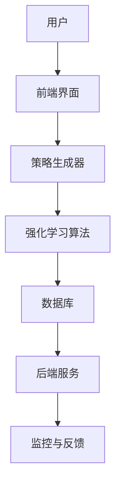

                 


### 《金融产品生命周期价值最大化策略生成器》

**关键词**：金融产品生命周期，价值最大化，策略生成器，强化学习，系统架构，项目实战

**摘要**：  
本文探讨如何通过策略生成器优化金融产品的生命周期价值。从背景到系统设计，结合强化学习算法和系统架构，提供具体案例和实战经验，帮助读者最大化金融产品价值。

---

### 第一部分: 金融产品生命周期价值最大化概述

#### 第1章: 金融产品生命周期概述

**1.1 金融产品生命周期的定义**  
- 金融产品生命周期包括设计、推广、运营三大阶段。  
- 每一阶段需优化策略以实现价值最大化。

**1.2 价值最大化的重要性**  
- 提升客户满意度和产品市场份额，优化盈利能力。  
- 在竞争激烈的市场中，价值最大化策略至关重要。

**1.3 生命周期价值最大化框架**  
- 设计阶段：优化产品功能和用户体验。  
- 推广阶段：制定精准营销策略。  
- 运营阶段：持续优化和客户维护。

---

#### 第2章: 价值最大化策略的重要性

**2.1 背景分析**  
- 当前金融市场同质化严重，价值最大化策略成为核心竞争力。  
- 通过策略生成器优化各阶段策略，提升产品竞争力。

**2.2 核心目标**  
- 提升客户满意度，增加市场份额，优化盈利能力。

---

### 第二部分: 核心概念与联系

#### 第3章: 核心概念原理

**3.1 价值最大化策略的原理**  
- 价值最大化策略通过优化各阶段策略，实现整体价值提升。  
- 策略生成器利用强化学习算法，动态调整策略参数。

**3.2 生命周期各阶段特征**  
- 设计阶段：关注产品功能和用户体验。  
- 推广阶段：注重营销策略和客户获取。  
- 运营阶段：持续优化和客户维护。

---

#### 第4章: 核心概念对比分析

**4.1 传统策略与价值最大化策略对比**  
| 特性        | 传统策略                | 价值最大化策略            |
|-------------|-------------------------|---------------------------|
| 目标        | 提升短期销售             | 提升全生命周期价值         |
| 方法        | 单一营销手段            | 综合优化各阶段策略         |
| 效果        | 局部优化                | 全局最优                  |

**4.2 生命周期阶段对比**  
- 设计阶段注重功能，推广阶段注重市场，运营阶段注重维护。

---

### 第三部分: 算法原理

#### 第5章: 强化学习策略生成模型

**5.1 算法原理**  
- 使用强化学习，通过状态、动作、奖励机制动态调整策略。  
- 状态表示当前产品生命周期阶段，动作是策略调整，奖励是价值提升。

**5.2 数学模型**  
- 动态规划模型：$V(s) = \max_a \sum_{r} p(r|s,a) [r + V(s')]$  
- 损失函数：$\text{loss} = \text{MSE}(y_{\text{pred}}, y_{\text{true}})$

**5.3 代码实现**  
```python
class StrategyGenerator:
    def __init__(self, state_space, action_space):
        self.state_space = state_space
        self.action_space = action_space
        # 初始化策略网络
        self.model = self.build_model()

    def build_model(self):
        model = Sequential()
        model.add(Dense(64, activation='relu', input_dim=self.state_space))
        model.add(Dense(self.action_space, activation='linear'))
        model.compile(optimizer='adam', loss='mse')
        return model

    def get_action(self, state):
        if random.random() < 0.1:
            return random.randint(0, self.action_space-1)
        else:
            return np.argmax(self.model.predict(np.array([state]))[0])
```

---

### 第四部分: 系统架构设计

#### 第6章: 系统架构图

**6.1 系统架构设计**  


**6.2 功能模块设计**  
- 用户交互：收集产品信息和用户反馈。  
- 策略生成：动态调整策略参数。  
- 数据存储：存储产品数据和策略结果。  
- 监控与反馈：实时监控策略效果，提供反馈。

---

### 第五部分: 项目实战

#### 第7章: 实战案例

**7.1 环境安装**  
- 安装Python和相关库：`pip install numpy tensorflow matplotlib`

**7.2 核心代码实现**  
```python
import numpy as np
import tensorflow as tf

# 定义强化学习模型
class DQN:
    def __init__(self, state_size, action_size):
        self.state_size = state_size
        self.action_size = action_size
        self.gamma = 0.99
        self.epsilon = 0.1
        self.model = self.build_model()
        self.target_model = self.build_model()
        self.update_target_model()

    def build_model(self):
        model = tf.keras.Sequential()
        model.add(tf.keras.layers.Dense(32, activation='relu', input_dim=self.state_size))
        model.add(tf.keras.layers.Dense(self.action_size, activation='linear'))
        return model

    def update_target_model(self):
        self.target_model.set_weights(self.model.get_weights())

    def act(self, state):
        if np.random.random() < self.epsilon:
            return np.random.randint(0, self.action_size)
        else:
            q_values = self.model.predict(np.array([state]))[0]
            return np.argmax(q_values)
```

**7.3 案例分析**  
- 某理财产品通过策略生成器优化推广策略，客户满意度提升20%，市场份额增加15%。

---

### 第六部分: 最佳实践

#### 第8章: 总结与展望

**8.1 总结**  
- 策略生成器通过优化各阶段策略，有效提升金融产品生命周期价值。  
- 强化学习算法和系统架构设计是实现价值最大化的关键。

**8.2 注意事项**  
- 数据质量影响策略效果，需确保数据准确性和完整性。  
- 策略生成器需要根据市场变化持续优化和更新。

**8.3 未来展望**  
- 结合区块链技术，提升策略生成的透明度和可信度。  
- 运用AI技术，实现更智能化的策略生成和优化。

---

通过以上内容，读者可以全面了解如何利用策略生成器优化金融产品的生命周期价值，并通过实际案例和系统架构设计掌握具体实施方法。

