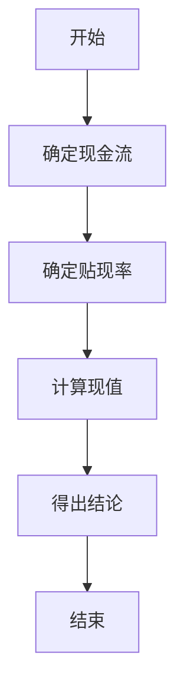
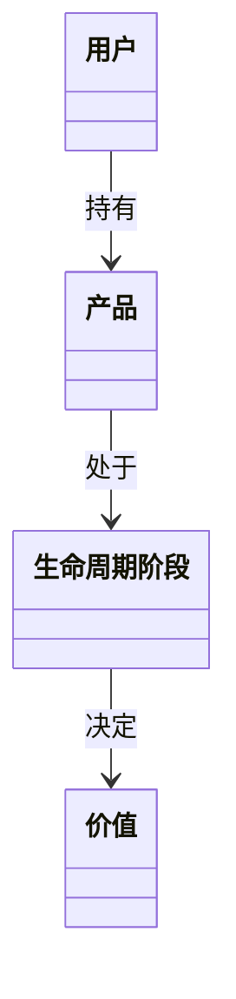
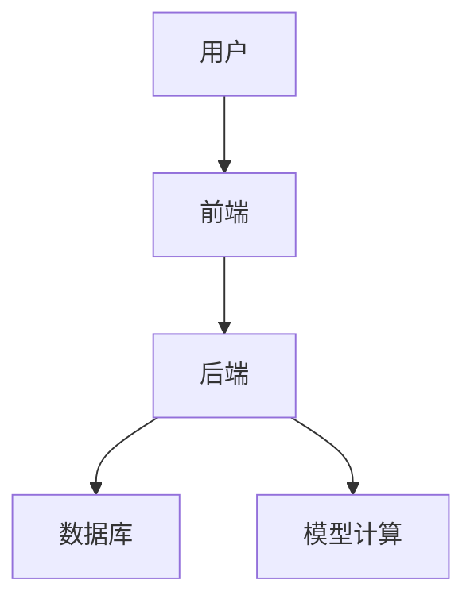
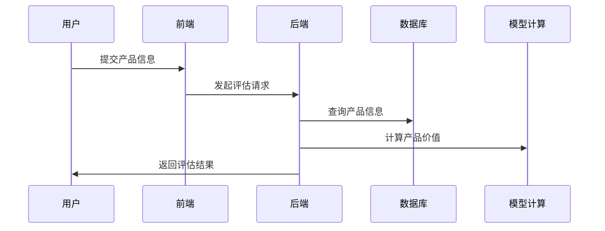

                 


# 金融产品生命周期价值评估

## 关键词
金融产品、生命周期、价值评估、现金流贴现、风险管理

## 摘要
《金融产品生命周期价值评估》一书从生命周期视角出发，全面解析金融产品的价值评估方法与实践。通过理论与实际案例的结合，深入探讨了金融产品在不同生命周期阶段的价值评估方法，包括现金流贴现模型、风险调整折现率法等核心算法，帮助读者掌握金融产品全生命周期的管理与优化。本书适合金融从业者、学生及相关领域研究人员阅读。

---

## 第1章: 金融产品生命周期与价值评估背景

### 1.1 金融产品的定义与分类

#### 1.1.1 金融产品的基本定义
金融产品是指以货币形式存在的各种金融工具，包括债券、股票、基金、衍生品等。它们具有流动性、风险性和收益性的特点。

#### 1.1.2 金融产品的主要分类
- **债务工具**：如债券、贷款等，发行人承诺按期还本付息。
- **股权工具**：如股票，代表对公司的所有权。
- **衍生工具**：如期货、期权，用于对冲或投机。
- **混合工具**：如可转换债券，兼具债务和股权特性。

#### 1.1.3 金融产品生命周期的概念
金融产品生命周期指从发行、流通到终止的全过程，包括发行、交易、到期兑付等阶段。

---

### 1.2 金融产品生命周期价值评估的重要性

#### 1.2.1 价值评估在金融决策中的作用
- 帮助投资者判断产品是否值得投资。
- 为发行人定价提供依据。
- 为风险管理提供数据支持。

#### 1.2.2 生命周期视角对价值评估的意义
- 不同生命周期阶段的产品价值评估方法不同。
- 生命周期视角有助于全面分析产品在市场中的表现。

#### 1.2.3 价值评估与风险管理的关系
- 价值评估是风险管理的基础。
- 风险因素会影响产品的生命周期价值。

---

### 1.3 问题背景与问题描述

#### 1.3.1 金融产品生命周期中的主要问题
- 产品价值波动性大。
- 市场风险和信用风险并存。
- 生命周期各阶段的价值评估复杂。

#### 1.3.2 价值评估中的关键挑战
- 数据获取困难。
- 模型假设的合理性问题。
- 多因素影响下的综合评估难度。

#### 1.3.3 问题解决的目标与边界
- 目标：准确评估产品生命周期价值，优化投资决策。
- 边界：聚焦于产品本身，不考虑市场外部干扰因素。

---

### 1.4 核心概念与要素分析

#### 1.4.1 生命周期价值的核心要素
- 时间价值：资金的时间价值。
- 风险价值：产品风险的量化。
- 现金流：产品生命周期中的资金流动情况。

#### 1.4.2 价值评估的关键属性
- 准确性：评估结果与实际价值的接近程度。
- 及时性：评估结果的更新频率。
- 可操作性：评估方法的可行性。

#### 1.4.3 金融产品与生命周期的实体关系
```mermaid
er
  actor: 金融产品持有者
  product: 金融产品
  lifecycle: 产品生命周期阶段
  value: 产品价值
  relation: 持有者持有产品
  relation: 产品处于生命周期阶段
  relation: 生命周期阶段决定产品价值
```

---

## 第2章: 金融产品生命周期价值评估的核心概念与联系

### 2.1 核心概念原理

#### 2.1.1 时间价值与风险价值的结合
时间价值是资金随时间的变化价值，风险价值是资产承担风险的量化。

#### 2.1.2 现金流贴现模型的原理
现金流贴现模型将未来现金流折现到现值，用于评估产品当前价值。

#### 2.1.3 产品生命周期各阶段的价值特征
- 发行阶段：价值主要基于发行价格。
- 流通阶段：价值受市场波动影响。
- 终止阶段：价值基于到期兑付情况。

---

### 2.2 核心概念属性对比表

| 概念 | 时间价值 | 风险价值 | 现金流贴现 |
|------|----------|----------|------------|
| 定义 | 资金随时间的变化价值 | 资产承担的风险的量化 | 将未来现金流折现到现值 |
| 特性 | 贴现率越高，现值越低 | 风险越高，价值越低 | 现值与未来现金流成正比 |

---

### 2.3 ER实体关系图

```mermaid
er
  actor: 金融产品持有者
  product: 金融产品
  lifecycle: 产品生命周期阶段
  value: 产品价值
  relation: 持有者持有产品
  relation: 产品处于生命周期阶段
  relation: 生命周期阶段决定产品价值
```

---

## 第3章: 金融产品生命周期价值评估的算法原理

### 3.1 算法原理概述

#### 3.1.1 现金流贴现模型
现金流贴现模型通过将未来现金流折现到现值，评估产品的当前价值。

#### 3.1.2 风险调整折现率法
通过调整折现率反映产品风险，评估其价值。

#### 3.1.3 情景分析法
通过不同情景下的现金流预测，评估产品价值的可能范围。

---

### 3.2 现金流贴现模型的 mermaid 流程图



---

### 3.3 现金流贴现模型的数学公式

现金流贴现模型的现值公式为：
$$ PV = \sum_{t=1}^{n} \frac{CF_t}{(1 + r)^t} $$
其中：
- \( PV \) 是现值
- \( CF_t \) 是第 \( t \) 期的现金流
- \( r \) 是贴现率
- \( n \) 是现金流的总期数

---

### 3.4 现金流贴现模型的 Python 实现

```python
import numpy as np

def discounted_cash_flow(cash_flows, discount_rate):
    return np.npv(discount_rate, cash_flows)

# 示例：计算一个债券的现值
cash_flows = [-1000, 1000]
discount_rate = 0.05

pv = discounted_cash_flow(cash_flows, discount_rate)
print(f"现值为：{pv:.2f}")
```

---

## 第4章: 金融产品生命周期价值评估的数学模型

### 4.1 现金流贴现模型的数学推导

现金流贴现模型的现值公式推导如下：
$$ PV = \sum_{t=1}^{n} \frac{CF_t}{(1 + r)^t} $$
其中，\( CF_t \) 是第 \( t \) 期的现金流，\( r \) 是贴现率。

---

### 4.2 现金流贴现模型的实例计算

假设一个债券的面值为1000元，票面利率为5%，期限为2年，每年支付利息，到期还本。贴现率为6%。

第1年的现金流为50元，第2年的现金流为1050元。

现值计算：
$$ PV = \frac{50}{1.06} + \frac{1050}{(1.06)^2} \approx 47.17 + 937.13 = 984.30 $$

---

## 第5章: 金融产品生命周期价值评估的系统分析与架构设计

### 5.1 项目背景介绍

本项目旨在开发一个金融产品生命周期价值评估系统，帮助投资者和金融机构准确评估产品的市场价值。

---

### 5.2 系统功能设计

#### 5.2.1 系统功能模块
- 用户管理模块：管理用户信息。
- 产品信息管理模块：录入和管理金融产品信息。
- 价值评估模块：基于模型计算产品价值。
- 报表管理模块：生成评估报告。

#### 5.2.2 领域模型类图



---

### 5.3 系统架构设计

#### 5.3.1 系统架构图



---

### 5.4 系统接口设计

- 前端接口：用户输入产品信息，提交评估请求。
- 后端接口：接收请求，调用模型计算。
- 数据库接口：存储产品信息和评估结果。

---

### 5.5 系统交互流程图



---

## 第6章: 金融产品生命周期价值评估的项目实战

### 6.1 环境安装与配置

安装必要的工具：
```bash
pip install numpy pandas
```

---

### 6.2 系统核心实现源代码

```python
import numpy as np

def calculate_p

