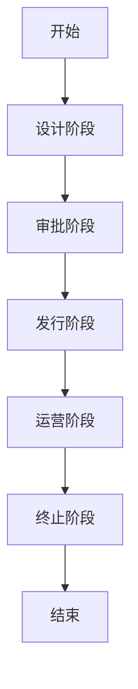
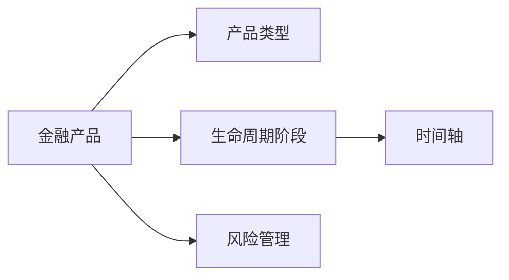
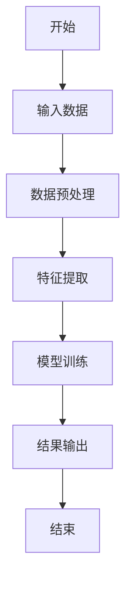
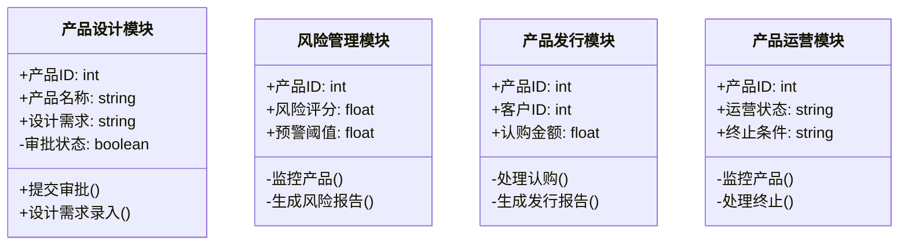

                 


# 金融产品生命周期管理平台

## 关键词：金融产品生命周期，管理平台，系统架构，算法原理，数学模型

## 摘要：  
金融产品生命周期管理平台是一种基于数字化技术，对金融产品的全生命周期进行系统化管理的平台。本文从背景、核心概念、算法原理、数学模型、系统架构、项目实战等多维度对平台进行详细分析，旨在为读者提供全面的技术解读和实践指导。

---

# 第一部分：金融产品生命周期管理平台概述

## 第1章：金融产品生命周期管理平台的背景与意义

### 1.1 金融产品生命周期管理的必要性

#### 1.1.1 金融产品的定义与分类

金融产品是指金融机构向市场提供的各种金融工具和服务，主要包括以下几类：
- **债务工具**：如债券、贷款等。
- **股权工具**：如股票、基金份额等。
- **衍生工具**：如期货、期权等。
- **其他金融工具**：如保险产品、信托产品等。

#### 1.1.2 金融产品生命周期的基本概念

金融产品生命周期是指从产品设计、审批、发行、运营到终止的整个过程。其核心阶段包括：
1. **设计阶段**：确定产品目标、风险收益特征。
2. **审批阶段**：通过内部和监管审批。
3. **发行阶段**：向市场销售产品。
4. **运营阶段**：监控产品运行，进行风险管理。
5. **终止阶段**：产品到期或提前终止。

#### 1.1.3 金融产品生命周期管理的重要性

- **合规性**：确保产品符合监管要求。
- **效率提升**：优化产品设计和运营流程。
- **风险管理**：及时发现并处理潜在风险。
- **成本控制**：降低运营成本，提高收益。

### 1.2 金融产品生命周期管理平台的现状与挑战

#### 1.2.1 当前金融行业面临的管理痛点

- **信息孤岛**：不同部门之间数据分散，难以协同管理。
- **人工依赖**：手工操作较多，效率低下，易出错。
- **监管合规**：日益严格的监管要求增加了管理复杂性。
- **风险不确定性**：市场波动和客户需求变化对产品管理提出更高要求。

#### 1.2.2 传统管理模式的局限性

- **效率低下**：依赖人工操作，处理复杂流程耗时长。
- **数据不一致**：不同系统之间的数据难以统一，影响决策。
- **缺乏灵活性**：难以快速响应市场变化和客户需求。

#### 1.2.3 数字化管理平台的迫切需求

- **自动化处理**：通过技术手段实现流程自动化，提高效率。
- **数据统一**：构建统一的数据平台，确保数据准确性和一致性。
- **智能化决策**：利用人工智能和大数据分析，辅助决策。

---

## 第2章：金融产品生命周期管理平台的核心概念

### 2.1 金融产品生命周期模型

#### 2.1.1 生命周期的阶段划分

1. **设计阶段**：
   - 确定产品目标、风险收益特征。
   - 制定产品说明书和相关文档。

2. **审批阶段**：
   - 内部审批：产品方案提交至相关部门审核。
   - 监管审批：向监管机构提交申请，获得批准。

3. **发行阶段**：
   - 产品上线：通过销售平台向客户销售。
   - 客户认购：客户购买产品，完成认购流程。

4. **运营阶段**：
   - 监控产品运行：实时监控产品表现，确保合规性。
   - 风险管理：定期评估风险，采取应对措施。

5. **终止阶段**：
   - 产品到期：按照合同约定，分配收益，赎回资金。
   - 提前终止：在特定条件下提前终止产品。

#### 2.1.2 各阶段的核心特征

- **设计阶段**：注重产品创新和合规性。
- **审批阶段**：强调合规性和风险控制。
- **发行阶段**：关注市场响应和客户体验。
- **运营阶段**：重视实时监控和风险管理。
- **终止阶段**：确保合规性和客户资金安全。

#### 2.1.3 生命周期模型的可视化

以下是一个简化的生命周期模型图：



---

### 2.2 核心概念与联系

#### 2.2.1 实体关系图（ER图）

以下是一个简化的ER图，展示了金融产品生命周期管理平台中的核心实体及其关系：



---

## 第3章：金融产品生命周期管理平台的算法原理

### 3.1 算法概述

#### 3.1.1 算法的核心目标

- **风险管理**：通过算法预测和识别潜在风险。
- **产品推荐**：基于客户需求推荐合适的产品。
- **流程优化**：通过算法优化产品设计和运营流程。

#### 3.1.2 算法的输入与输出

- **输入**：产品信息、市场数据、客户行为数据。
- **输出**：风险评估结果、产品推荐方案、流程优化建议。

#### 3.1.3 算法的实现流程

以下是一个简化的算法实现流程图：



### 3.2 算法实现

#### 3.2.1 数据预处理代码

```python
import pandas as pd

# 加载数据
data = pd.read_csv('financial_products.csv')

# 数据清洗
data.dropna(inplace=True)
```

#### 3.2.2 特征提取代码

```python
from sklearn.feature_extraction import DictVectorizer

vectorizer = DictVectorizer()
features = vectorizer.fit_transform(data[['product_type', 'stage']].to_dict('records'))
```

### 3.3 算法实现代码

#### 3.3.1 风险评估模型

以下是一个简化的风险评估模型：

$$
\text{风险评分} = \alpha \times \text{信用评分} + \beta \times \text{市场波动率}
$$

其中，$\alpha$ 和 $\beta$ 是模型的参数，可以通过训练数据确定。

---

## 第4章：金融产品生命周期管理平台的数学模型

### 4.1 数学模型概述

#### 4.1.1 风险管理模型

以下是一个简化的风险管理模型：

$$
\text{风险价值} = \sigma \times z \times \sqrt{t}
$$

其中：
- $\sigma$ 是标准差。
- $z$ 是标准正态分布的分位数。
- $t$ 是时间窗口。

#### 4.1.2 产品推荐模型

以下是一个简化的推荐模型：

$$
\text{推荐概率} = \frac{\sum_{i=1}^{n} w_i \times x_i}{\sum_{i=1}^{n} w_i}
$$

其中：
- $w_i$ 是第$i$个特征的权重。
- $x_i$ 是第$i$个特征的值。

---

## 第5章：金融产品生命周期管理平台的系统分析与架构设计

### 5.1 系统功能设计

#### 5.1.1 功能模块划分

1. **产品设计模块**：
   - 支持产品设计需求的录入和审批。
2. **风险管理模块**：
   - 实时监控产品风险，提供预警和报告。
3. **产品发行模块**：
   - 支持产品上线和客户认购。
4. **产品运营模块**：
   - 监控产品运行，管理产品终止。

#### 5.1.2 功能模块的类图



### 5.2 系统架构设计

#### 5.2.1 系统架构图


---

## 第6章：金融产品生命周期管理平台的项目实战

### 6.1 环境安装

#### 6.1.1 安装Python和相关库

```bash
pip install numpy pandas matplotlib scikit-learn
```

### 6.2 系统核心实现源代码

#### 6.2.1 数据预处理代码

```python
import pandas as pd

# 加载数据
data = pd.read_csv('financial_products.csv')

# 数据清洗
data.dropna(inplace=True)

# 数据转换
data['date'] = pd.to_datetime(data['date'])
```

#### 6.2.2 算法实现代码

```python
from sklearn.model_selection import train_test_split
from sklearn.ensemble import RandomForestClassifier
from sklearn.metrics import accuracy_score

# 划分数据集
X_train, X_test, y_train, y_test = train_test_split(features, labels, test_size=0.2)

# 训练模型
model = RandomForestClassifier()
model.fit(X_train, y_train)

# 预测结果
y_pred = model.predict(X_test)

# 计算准确率
print('Accuracy:', accuracy_score(y_test, y_pred))
```

---

## 第7章：总结与展望

### 7.1 最佳实践 tips

- **数据质量管理**：确保数据的准确性和完整性。
- **算法优化**：根据实际需求不断优化算法模型。
- **系统维护**：定期更新系统，修复潜在问题。

### 7.2 小结

本文详细介绍了金融产品生命周期管理平台的核心概念、算法原理、系统架构和项目实战，为读者提供了一个全面的技术解读。

### 7.3 注意事项

- **合规性**：确保平台符合相关监管要求。
- **安全性**：保护客户数据和交易安全。
- **可扩展性**：设计灵活的架构，适应未来业务发展。

### 7.4 拓展阅读

- **金融风险管理**：深入学习风险管理的理论和方法。
- **人工智能在金融中的应用**：探索人工智能在金融产品管理中的更多应用场景。

---

以上是《金融产品生命周期管理平台》的技术博客文章的完整大纲和内容。

