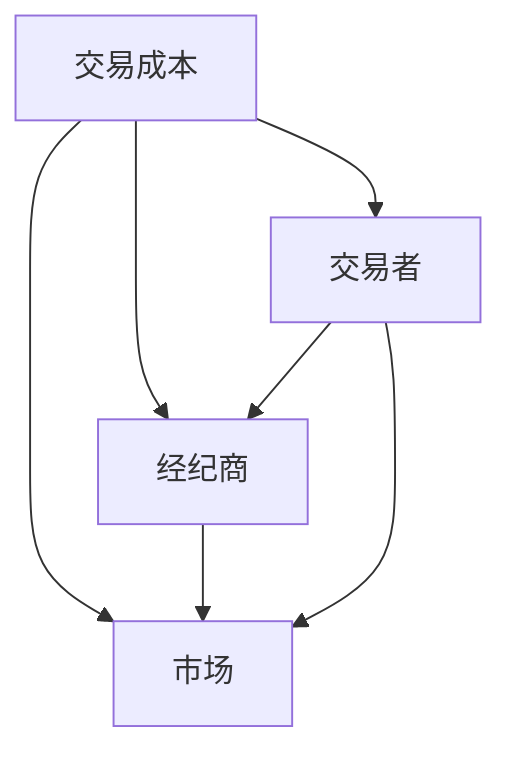
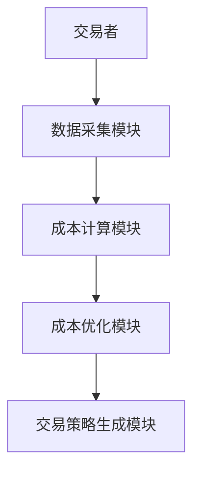
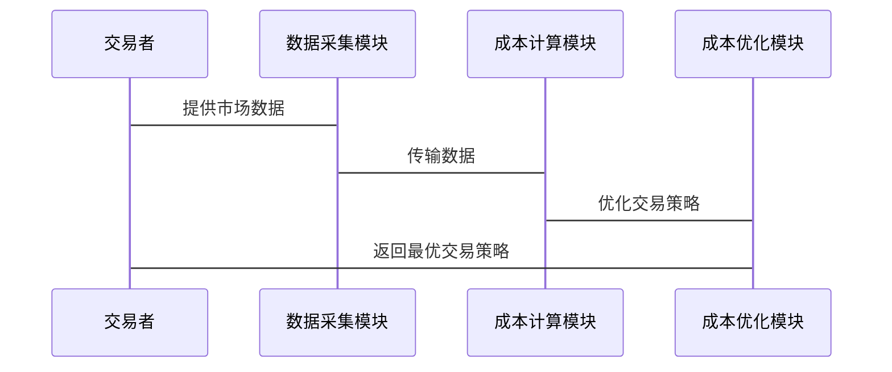

                 


# 金融市场交易成本分析与优化

> 关键词：交易成本分析、金融市场优化、算法优化、系统架构设计、高频交易

> 摘要：本文深入探讨了金融市场交易成本的构成、分析方法及优化策略，结合实际案例，从系统架构、算法优化、交易策略等多维度进行分析，帮助读者掌握降低交易成本的关键技术与方法。

---

# 第一部分: 金融市场交易成本分析与优化基础

## 第1章: 金融市场交易成本概述

### 1.1 交易成本的定义与构成

#### 1.1.1 交易成本的定义

交易成本是指在金融市场上进行交易时所产生的所有费用和损失的总和。这些成本不仅仅包括直接支付的佣金，还包括由于市场滑动价差、税费、保证金要求等间接成本。交易成本的计算需要综合考虑市场结构、交易规模、时间等因素。

#### 1.1.2 交易成本的主要构成要素

- **佣金（Commissions）**：交易者支付给经纪商的费用，通常按交易金额的一定比例收取。
- **滑动价差（Slippage）**：实际成交价格与理想价格之间的差异，主要由市场深度和订单簿情况决定。
- **税费（Taxes）**：政府对证券交易征收的税费，如资本利得税、印花税等。
- **隐含成本（Implicit Costs）**：包括机会成本、资金占用成本等。

#### 1.1.3 交易成本的分类与特征

交易成本可以分为显性成本和隐性成本。显性成本是直接可量化的费用，如佣金和税费；隐性成本是难以直接量化的，如滑动价差和市场冲击。

### 1.2 交易成本的影响因素

#### 1.2.1 市场结构与交易成本的关系

不同市场的市场结构（如订单驱动市场、拍卖市场）会影响交易成本。订单驱动市场中，深度和流动性直接影响滑动价差。

#### 1.2.2 交易规模与成本的关系

大规模交易可能导致更大的市场冲击，从而增加滑动价差。相反，小规模交易通常更容易以理想价格成交。

#### 1.2.3 时间因素对交易成本的影响

在不同的时间段，市场的流动性和订单深度不同，交易成本也会有所变化。例如，高频交易通常在市场流动性较高的时段进行，以降低滑动价差。

### 1.3 交易成本与交易效率的关系

#### 1.3.1 交易效率的定义

交易效率指的是以最小的成本快速完成交易的能力。高效率意味着在相同成本下能更快完成交易，或以更低的成本完成相同规模的交易。

#### 1.3.2 交易成本对交易效率的影响

高交易成本会降低交易效率，增加交易成本会减少可执行的交易量，影响整体收益。

#### 1.3.3 优化交易成本以提高效率的必要性

通过优化交易成本，可以在相同时间内完成更多交易，或在相同交易量下实现更高的收益。

## 第2章: 交易成本分析的核心概念与联系

### 2.1 核心概念原理

交易成本分析需要考虑交易者、经纪商、市场等多个主体之间的关系。经纪商收取佣金，而交易者在不同市场条件下面临不同的滑动价差。

### 2.2 核心概念属性特征对比表格

| 成本类型 | 定义 | 影响因素 | 计算公式 |
|----------|------|----------|----------|
| 佣金     | 交易者支付给经纪商的费用 | 交易金额、经纪商收费标准 | $$\text{佣金} = \text{交易金额} \times \text{佣金率}$$ |
| 滑动价差  | 交易执行价格与理想价格的差异 | 市场深度、订单簿情况 | $$\text{滑动价差} = \text{执行价格} - \text{理想价格}$$ |
| 税费     | 政府对证券交易征收的税费 | 税率、交易金额 | $$\text{税费} = \text{交易金额} \times \text{税率}$$ |

### 2.3 ER实体关系图（Mermaid）



---

## 第3章: 交易成本分析的算法原理

### 3.1 算法原理概述

交易成本分析的算法通常包括滑动价差预测、最优订单执行、高频交易策略等。这些算法需要结合市场数据和交易成本模型进行优化。

### 3.2 交易成本分析的数学模型

#### 3.2.1 滑动价差预测模型

滑动价差的预测可以通过统计模型或机器学习模型实现。例如，使用线性回归模型预测滑动价差：

$$ \text{预测滑动价差} = \beta_0 + \beta_1 \times \text{市场深度} + \epsilon $$

其中，$\beta_0$ 和 $\beta_1$ 是回归系数，$\epsilon$ 是误差项。

#### 3.2.2 最优订单执行模型

最优订单执行问题可以通过优化算法解决。目标是最小化总交易成本，确定最优的订单拆分策略。数学模型如下：

$$ \min \sum_{i=1}^{n} c_i \times q_i $$
$$ \text{约束条件}：\sum_{i=1}^{n} q_i = Q $$

其中，$c_i$ 是第 $i$ 笔订单的单位成本，$q_i$ 是第 $i$ 笔订单的数量，$Q$ 是总交易量。

---

## 第4章: 系统分析与架构设计方案

### 4.1 项目介绍

本项目旨在开发一个交易成本分析与优化系统，帮助交易者降低交易成本，提高交易效率。

### 4.2 系统功能设计

- 数据采集模块：采集市场数据和交易数据。
- 成本计算模块：计算交易成本，包括佣金、滑动价差和税费。
- 成本优化模块：基于算法优化交易成本，生成最优交易策略。

### 4.3 系统架构设计（Mermaid）



### 4.4 系统交互设计（Mermaid）



---

## 第5章: 项目实战

### 5.1 环境配置

- 数据源：使用高频交易数据，如股票、期货等。
- 工具：Python、Pandas、NumPy、Scikit-learn。

### 5.2 核心代码实现

```python
import pandas as pd
import numpy as np
from sklearn.linear_model import LinearRegression

# 数据预处理
data = pd.read_csv('market_data.csv')
X = data[['市场深度', '订单簿情况']]
y = data['滑动价差']

# 滑动价差预测模型
model = LinearRegression()
model.fit(X, y)

# 预测滑动价差
new_data = pd.DataFrame({'市场深度': [1000], '订单簿情况': [200]})
predicted_slippage = model.predict(new_data)
print(predicted_slippage)
```

### 5.3 代码解读与分析

上述代码使用线性回归模型预测滑动价差。通过输入市场深度和订单簿情况，模型可以预测出滑动价差，从而帮助交易者优化订单执行策略。

---

## 第6章: 总结与展望

### 6.1 本章小结

本文详细探讨了金融市场交易成本的构成、分析方法和优化策略，结合实际案例，从系统架构、算法优化、交易策略等多维度进行了分析。

### 6.2 未来展望

随着人工智能和大数据技术的发展，交易成本分析与优化将更加智能化和精准化。未来的研究可以进一步结合实时数据和更复杂的预测模型，以实现更高效的交易成本优化。

### 6.3 最佳实践 Tips

- 数据质量是交易成本分析的基础，确保数据的准确性和及时性。
- 在优化交易成本时，需综合考虑显性和隐性成本。
- 频繁调整交易策略可能导致额外成本，需权衡利弊。

---

通过本文的分析，读者可以系统地了解金融市场交易成本的分析与优化方法，掌握相关的技术工具和策略，提升在金融交易中的效率和收益。

