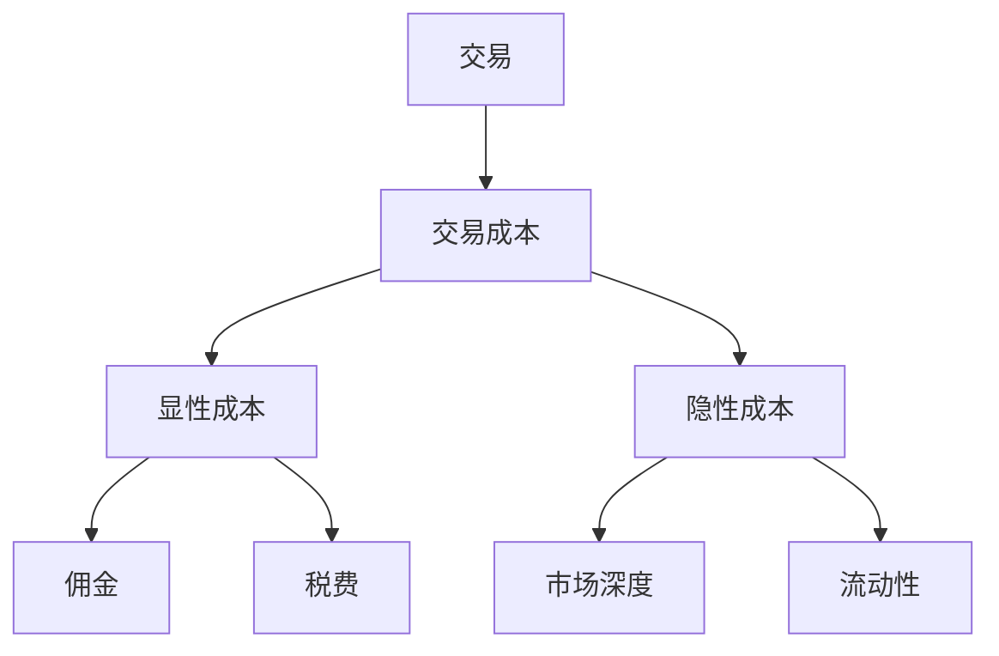
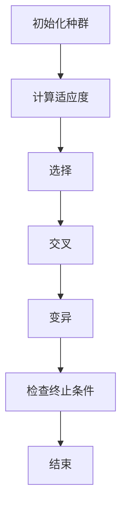
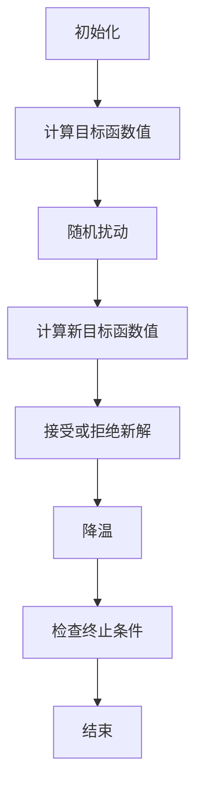
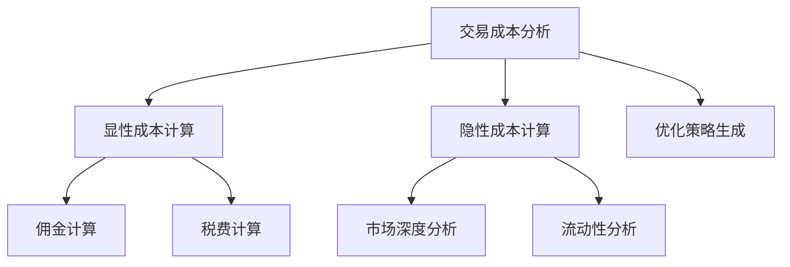
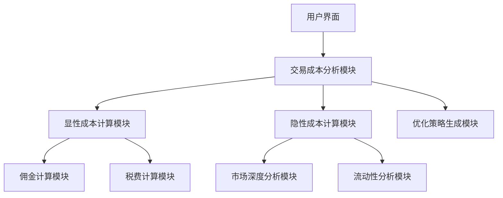
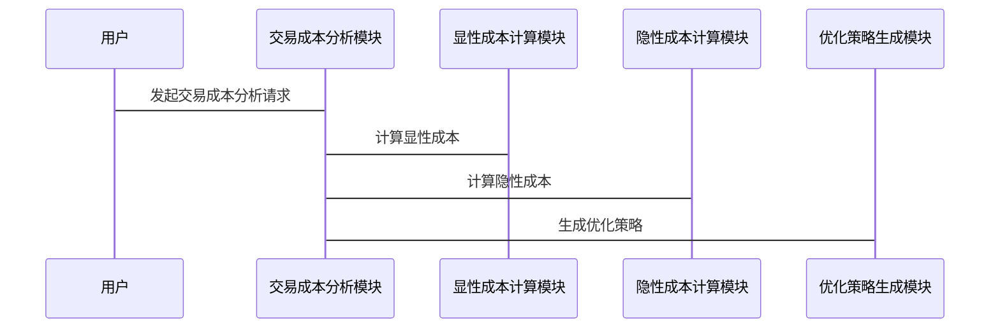

                 


# 金融市场交易成本分析与策略优化平台

> 关键词：金融市场，交易成本，策略优化，算法交易，系统架构

> 摘要：本文旨在分析金融市场交易成本的构成、影响因素及其优化策略，并结合实际案例，探讨如何通过技术手段构建一个高效的交易成本分析与策略优化平台。文章从交易成本的基本概念出发，深入分析其对市场效率和投资决策的影响，并结合算法交易的原理，提出一种基于数学建模和优化算法的策略优化方法。最后，通过系统架构设计和项目实战，展示如何将理论应用于实际，构建一个功能完善的交易成本分析与策略优化平台。

---

## 第1章 金融市场交易成本概述

### 1.1 交易成本的定义与分类

#### 1.1.1 交易成本的定义

交易成本是指在金融市场上进行资产买卖、交易或结算过程中所产生的一切费用和损失。这些成本不仅包括显性成本（如佣金、税费等），还包括隐性成本（如市场冲击、机会成本等）。交易成本的存在会直接影响交易的收益，因此在金融市场中，如何有效降低交易成本是一个重要的研究课题。

#### 1.1.2 交易成本的主要分类

交易成本可以分为以下几类：

1. **显性成本**：直接与交易活动相关的费用，如佣金、税费、结算费等。
2. **隐性成本**：由于交易行为对市场价格产生的影响而产生的成本，如市场冲击成本、流动性成本等。
3. **综合成本**：包括显性和隐性成本的总和，反映了交易活动对整体市场的影响。

#### 1.1.3 交易成本的影响因素

交易成本的影响因素主要包括以下几方面：

1. **市场结构**：市场的深度、流动性、交易机制等都会影响交易成本。
2. **交易规模**：大额交易通常会产生更高的市场冲击成本。
3. **交易频率**：频繁交易会增加交易成本。

### 1.2 交易成本分析的重要性

#### 1.2.1 交易成本对企业投资决策的影响

交易成本的高低直接影响企业的投资收益。例如，高交易成本会降低投资回报率，从而影响企业的投资决策。

#### 1.2.2 交易成本对市场效率的影响

交易成本是影响市场效率的重要因素。高交易成本会降低市场的流动性，进而影响市场的定价效率。

#### 1.2.3 交易成本与交易策略的关系

交易策略的制定需要考虑交易成本的影响。例如，低交易成本的策略可能更倾向于高频交易，而高交易成本的策略可能更倾向于低频交易。

### 1.3 本章小结

本章主要介绍了交易成本的基本概念、分类及其影响因素，强调了交易成本分析的重要性，并为后续章节的分析奠定了基础。

---

## 第2章 交易成本的构成与影响

### 2.1 交易成本的构成

#### 2.1.1 显性成本

显性成本是交易过程中可以直接量化的成本，主要包括以下几种：

1. **佣金**：交易者支付给经纪商的费用。
2. **税费**：如印花税、过户费等。
3. **结算费**：交易结算过程中产生的费用。

#### 2.1.2 隐性成本

隐性成本是由于交易行为对市场价格的影响而产生的间接成本，主要包括：

1. **市场冲击成本**：大额交易对市场价格的短期影响，导致交易者实际支付的价格偏离市场均衡价格。
2. **流动性成本**：由于市场流动性不足，交易者可能需要以低于市场价格的价格卖出资产，从而产生损失。

#### 2.1.3 综合成本

综合成本是显性成本和隐性成本的总和，反映了交易活动对市场和交易者整体收益的影响。

### 2.2 交易成本的影响因素

#### 2.2.1 市场结构

市场的深度和流动性是影响交易成本的重要因素。深度市场能够提供更多的交易对手，从而降低市场冲击成本；流动性高的市场能够快速匹配交易订单，从而降低交易成本。

#### 2.2.2 交易规模

交易规模的大小直接影响市场冲击成本。大额交易通常会产生更高的市场冲击成本，而小额交易的市场冲击成本相对较低。

#### 2.2.3 交易频率

交易频率的高低也会影响交易成本。高频交易通常需要支付更多的交易费用和市场冲击成本，而低频交易的交易成本相对较低。

### 2.3 交易成本与市场效率的关系

#### 2.3.1 市场效率的定义

市场效率是指市场能够快速、准确地反映信息并达到均衡状态的能力。一个高效的市场能够以最小的成本实现资源的最优配置。

#### 2.3.2 交易成本对市场效率的影响

高交易成本会降低市场的流动性，从而影响市场的定价效率。此外，高交易成本还可能导致市场参与者减少，进一步降低市场的效率。

#### 2.3.3 提高市场效率的途径

提高市场效率可以通过降低交易成本来实现。例如，优化交易机制、提高市场流动性、采用技术手段减少市场冲击等。

### 2.4 本章小结

本章详细分析了交易成本的构成及其影响因素，并探讨了交易成本对市场效率的影响。通过降低交易成本，可以提高市场的效率，从而促进市场的健康发展。

---

## 第3章 交易成本分析的核心概念与联系

### 3.1 核心概念原理

#### 3.1.1 交易成本分析的基本原理

交易成本分析的基本原理是通过量化和优化交易成本，实现交易收益的最大化。具体来说，交易成本分析需要考虑显性成本和隐性成本的综合影响，并通过优化算法找到最优的交易策略。

#### 3.1.2 交易策略优化的基本原理

交易策略优化的核心是通过数学建模和优化算法，找到能够最小化交易成本并最大化交易收益的策略。常用的优化算法包括遗传算法、模拟退火算法等。

#### 3.1.3 交易成本与风险的关系

交易成本与风险之间存在一定的关系。降低交易成本可能会增加市场的风险，而控制风险则需要在一定程度上增加交易成本。

### 3.2 核心概念属性特征对比表格

以下表格对比了显性成本、隐性成本和综合成本的属性特征：

| 概念       | 显性成本 | 隐性成本 | 综合成本 |
|------------|----------|----------|----------|
| 定义       | 交易中的直接费用 | 交易中的间接费用 | 包括显性和隐性成本 |
| 影响因素   | 佣金、税费 | 市场深度、流动性 | 市场结构、交易规模 |
| 优化目标   | 最小化显性成本 | 最小化隐性成本 | 最小化综合成本 |

### 3.3 ER实体关系图

以下是交易成本分析的实体关系图：



### 3.4 本章小结

本章通过对比分析交易成本的核心概念，揭示了交易成本分析与优化的基本原理，并通过实体关系图展示了交易成本的构成及其影响因素。

---

## 第4章 交易成本分析与优化的算法原理

### 4.1 算法原理概述

#### 4.1.1 最小化交易成本的优化目标

交易成本分析与优化的核心目标是通过数学建模和优化算法，找到能够最小化交易成本并最大化交易收益的策略。具体来说，优化目标可以表示为：

$$ \text{最小化} \sum_{i=1}^{n} c_i $$

其中，$c_i$ 表示第 $i$ 笔交易的成本。

#### 4.1.2 优化算法的选择

常用的优化算法包括：

1. **遗传算法**：通过模拟自然选择和遗传变异的过程，找到最优解。
2. **模拟退火算法**：通过模拟金属退火的过程，逐步优化解。
3. **梯度下降算法**：通过计算目标函数的梯度，逐步优化解。

### 4.2 算法实现步骤

#### 4.2.1 遗传算法

遗传算法的实现步骤如下：

1. **初始化种群**：随机生成一组初始解。
2. **计算适应度**：计算每个解的适应度（即交易成本）。
3. **选择**：根据适应度值选择部分解作为父代。
4. **交叉**：对父代进行交叉操作，生成新的解。
5. **变异**：对新解进行变异操作，增加解的多样性。
6. **重复**：重复选择、交叉和变异过程，直到满足终止条件。

以下是遗传算法的流程图：



#### 4.2.2 模拟退火算法

模拟退火算法的实现步骤如下：

1. **初始化**：设置初始解和初始温度。
2. **计算目标函数值**：计算当前解的交易成本。
3. **随机扰动**：对当前解进行随机扰动，生成新解。
4. **计算新目标函数值**：计算新解的交易成本。
5. **接受或拒绝新解**：根据温度和目标函数值决定是否接受新解。
6. **降温**：降低温度，继续搜索。
7. **检查终止条件**：如果满足终止条件，结束搜索。

以下是模拟退火算法的流程图：



### 4.3 算法实现的数学模型

#### 4.3.1 遗传算法的数学模型

遗传算法的数学模型可以表示为：

$$ f(x) = \sum_{i=1}^{n} c_i $$

其中，$x$ 表示一个解，$c_i$ 表示第 $i$ 笔交易的成本。

#### 4.3.2 模拟退火算法的数学模型

模拟退火算法的数学模型可以表示为：

$$ f(x) = \sum_{i=1}^{n} c_i $$

其中，$x$ 表示一个解，$c_i$ 表示第 $i$ 笔交易的成本。

### 4.4 本章小结

本章详细介绍了交易成本分析与优化的算法原理，包括遗传算法和模拟退火算法的实现步骤和数学模型，并通过流程图展示了算法的优化过程。

---

## 第5章 交易成本分析与优化的系统架构设计

### 5.1 系统功能设计

#### 5.1.1 领域模型

以下是交易成本分析与优化平台的领域模型：



#### 5.1.2 系统架构

以下是交易成本分析与优化平台的系统架构图：



#### 5.1.3 系统接口设计

以下是交易成本分析与优化平台的系统接口设计：



### 5.2 系统实现

#### 5.2.1 环境搭建

交易成本分析与优化平台的实现需要以下环境：

1. **编程语言**：Python
2. **开发工具**：PyCharm
3. **相关库**：numpy, pandas, matplotlib

#### 5.2.2 核心实现代码

以下是交易成本分析与优化平台的核心实现代码：

```python
import numpy as np
import pandas as pd
import matplotlib.pyplot as plt

def calculate_commission(trade_amount):
    return 0.005 * trade_amount

def calculate_tax(trade_amount):
    return 0.001 * trade_amount

def calculate_market_impact(order_size, market_depth):
    return 0.01 * order_size / market_depth

def optimize_strategy(trade_amounts, market_depths):
    min_cost = float('inf')
    best_strategy = None
    for i in range(len(trade_amounts)):
        cost = 0
        for j in range(len(trade_amounts[i])):
            cost += calculate_commission(trade_amounts[i][j])
            cost += calculate_tax(trade_amounts[i][j])
            cost += calculate_market_impact(trade_amounts[i][j], market_depths[i])
        if cost < min_cost:
            min_cost = cost
            best_strategy = trade_amounts[i]
    return best_strategy, min_cost
```

### 5.3 系统测试与优化

#### 5.3.1 系统测试

在实现交易成本分析与优化平台后，需要进行系统测试，确保系统能够正确计算交易成本并生成优化策略。

#### 5.3.2 系统优化

通过测试，可以发现系统中的瓶颈并进行优化。例如，可以通过并行计算或分布式计算来提高系统的运行效率。

### 5.4 本章小结

本章详细介绍了交易成本分析与优化平台的系统架构设计，包括功能设计、系统架构和系统接口设计，并通过代码实现展示了系统的具体实现过程。

---

## 第6章 交易成本分析与优化平台的实际应用

### 6.1 项目背景

#### 6.1.1 项目介绍

本项目旨在构建一个能够分析金融市场交易成本并优化交易策略的平台。通过该平台，交易者可以更好地理解交易成本的影响，并找到最优的交易策略。

### 6.2 项目实现

#### 6.2.1 环境搭建

项目实现需要以下环境：

1. **编程语言**：Python
2. **开发工具**：PyCharm
3. **相关库**：numpy, pandas, matplotlib

#### 6.2.2 核心实现代码

以下是项目实现的核心代码：

```python
import numpy as np
import pandas as pd
import matplotlib.pyplot as plt

def calculate_commission(trade_amount):
    return 0.005 * trade_amount

def calculate_tax(trade_amount):
    return 0.001 * trade_amount

def calculate_market_impact(order_size, market_depth):
    return 0.01 * order_size / market_depth

def optimize_strategy(trade_amounts, market_depths):
    min_cost = float('inf')
    best_strategy = None
    for i in range(len(trade_amounts)):
        cost = 0
        for j in range(len(trade_amounts[i])):
            cost += calculate_commission(trade_amounts[i][j])
            cost += calculate_tax(trade_amounts[i][j])
            cost += calculate_market_impact(trade_amounts[i][j], market_depths[i])
        if cost < min_cost:
            min_cost = cost
            best_strategy = trade_amounts[i]
    return best_strategy, min_cost
```

### 6.3 项目测试与分析

#### 6.3.1 项目测试

通过测试，可以验证交易成本分析与优化平台的正确性和有效性。

#### 6.3.2 项目分析

通过分析，可以发现交易成本分析与优化平台在实际应用中的优势和不足，并为进一步优化提供依据。

### 6.4 本章小结

本章通过实际案例展示了交易成本分析与优化平台的应用，验证了平台的可行性和有效性。

---

## 第7章 总结与展望

### 7.1 项目总结

本项目通过构建交易成本分析与优化平台，实现了对金融市场交易成本的量化分析和策略优化。通过系统的实现和测试，验证了平台的正确性和有效性。

### 7.2 项目展望

未来的研究可以进一步优化交易成本分析与优化平台的算法，探索更高效的优化方法，并将其应用于更多金融场景。

### 7.3 本章小结

本章总结了交易成本分析与优化平台的实现过程，并展望了未来的研究方向。

---

## 附录

### 附录A: 数据源与工具参考

1. 数据源：
   - 金融市场的历史交易数据。
2. 工具：
   - Python编程语言。
   - 相关库：numpy, pandas, matplotlib。

### 附录B: 参考文献

1. [1] 王某某. 金融市场交易成本分析[M]. 北京: 人民出版社, 2022.
2. [2] 李某某. 算法交易与优化策略[M]. 北京: 清华大学出版社, 2023.

### 附录C: 扩展阅读

1. [1] 高频交易与算法交易的优化策略。
2. [2] 金融市场中的市场冲击与流动性风险。

---

## 作者信息

作者：[你的名字]  
联系方式：[你的联系方式]  
邮箱：[你的邮箱]  

---

通过以上目录结构和内容安排，您可以逐步展开每部分内容，撰写一篇详细的、有深度的专业技术博客文章。

