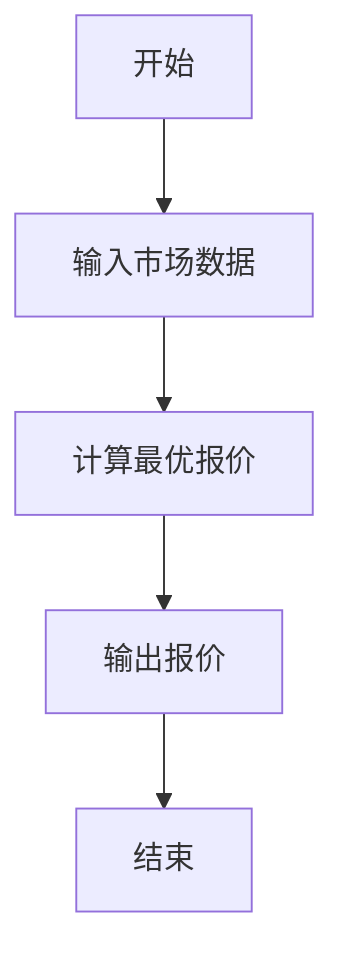
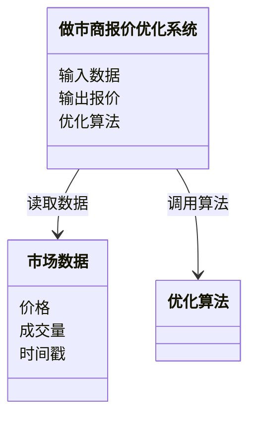
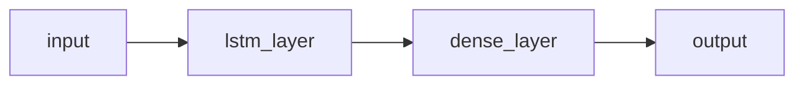

                 


# 金融市场做市商报价优化模型

> 关键词：金融市场、做市商、报价优化、算法模型、系统架构、数学建模

> 摘要：本文深入探讨了金融市场中做市商报价优化模型的设计与实现。通过分析做市商在金融市场中的角色与报价优化的重要性，结合算法原理、系统架构和实际案例，详细阐述了如何构建高效的报价优化模型，帮助做市商在复杂的市场环境中实现最优报价策略。

---

# 第一部分: 金融市场做市商报价优化模型概述

# 第1章: 金融市场做市商报价优化模型的背景与意义

## 1.1 做市商的定义与作用

### 1.1.1 做市商的定义

做市商（Market Maker）是指在金融市场中主动提供买卖报价，撮合交易并维持市场流动性的机构。做市商通过同时报出买入价和卖出价，为市场参与者提供即时交易的可能。

### 1.1.2 做市商在金融市场中的作用

1. 提供流动性：做市商通过持续报价和撮合交易，确保市场的深度和流动性，降低买卖价差。
2. 稳定市场价格：通过市场报价和订单撮合，做市商有助于平滑价格波动，维护市场稳定。
3. 促进交易效率：做市商的存在减少了交易双方的搜寻成本，提高了交易效率。

### 1.1.3 做市商报价的核心问题

1. 如何在市场波动中快速调整报价以实现收益最大化。
2. 如何在交易成本和市场风险之间找到平衡。
3. 如何利用市场数据和算法优化报价策略。

## 1.2 报价优化模型的背景

### 1.2.1 金融市场中的报价问题

在金融市场中，做市商需要实时根据市场环境、订单流和自身头寸调整报价。然而，市场价格的波动性和交易的高频性使得报价优化成为一个复杂的系统工程。

### 1.2.2 报价优化的必要性

1. 提高收益：通过优化报价策略，做市商可以在竞争激烈的市场中获得更高的利润。
2. 降低风险：优化报价有助于减少市场冲击和尾部风险。
3. 提高流动性：通过优化报价策略，做市商可以吸引更多交易量，增强市场流动性。

### 1.2.3 报价优化模型的发展历程

从简单的静态定价模型到复杂的动态优化模型，报价优化模型经历了以下几个阶段：
1. 基于统计的模型：利用历史数据进行简单的回归分析。
2. 基于机器学习的模型：利用深度学习和强化学习技术进行实时优化。
3. 基于博弈论的模型：结合市场博弈论进行多维度优化。

## 1.3 本章小结

本章介绍了做市商在金融市场中的角色和报价优化的重要性，分析了报价优化的必要性和发展历程。通过本章，读者可以理解报价优化模型在金融市场中的核心地位和实际价值。

---

# 第2章: 报价优化模型的核心概念与联系

## 2.1 核心概念原理

### 2.1.1 做市商报价模型的基本结构

做市商报价模型通常包括以下几个部分：
1. 市场数据输入：包括当前市场价格、订单簿信息、交易量等。
2. 报价优化算法：根据市场数据和优化目标，计算出最优报价。
3. 报价输出：将优化后的报价发送到市场，供交易者参考。

### 2.1.2 报价优化的核心要素

1. 价格预测：基于市场数据和历史信息，预测未来市场价格的变化趋势。
2. 风险评估：评估报价可能带来的市场风险和交易风险。
3. 利润最大化：在风险可控的前提下，实现最大化的利润。

### 2.1.3 模型的输入与输出

- **输入**：市场数据（如价格、成交量）、订单簿信息、时间戳等。
- **输出**：最优买入价和卖出价、调整后的报价。

## 2.2 核心概念属性特征对比表

表2.1: 报价优化模型关键属性对比

| 属性 | 描述 |
|------|------|
| 优化目标 | 利润最大化 |
| 输入数据 | 市场数据、订单数据 |
| 输出结果 | 最优报价 |
| 算法类型 | 基于统计、机器学习、博弈论 |

## 2.3 ER实体关系图

```mermaid
er
    actor 做市商 {
        <做市商ID>
        <报价>
        <时间戳>
    }
    actor 市场环境 {
        <市场ID>
        <价格>
        <成交量>
        <时间戳>
    }
    做市商 --> 市场环境: 监测市场环境
    市场环境 --> 做市商: 提供市场数据
```

## 2.4 本章小结

本章详细介绍了报价优化模型的核心概念，包括模型的基本结构、核心要素和输入输出。通过对比表和ER图，进一步明确了模型的组成部分和它们之间的关系。

---

# 第3章: 报价优化模型的算法原理

## 3.1 算法原理概述

### 3.1.1 报价优化的基本思路

1. 数据收集：实时收集市场数据，包括价格、成交量、订单簿信息等。
2. 数据分析：利用统计方法和机器学习算法，分析市场数据，预测价格走势。
3. 报价计算：根据分析结果，计算出最优的买入价和卖出价。
4. 报价调整：根据市场反馈，动态调整报价，确保模型的有效性。

### 3.1.2 常见的优化算法

1. 线性回归模型：用于预测市场价格的变化趋势。
2. 支持向量机（SVM）：用于分类和回归分析，预测价格走势。
3. 长短期记忆网络（LSTM）：用于时间序列分析，预测未来价格。
4. 强化学习算法：通过不断试错，找到最优报价策略。

### 3.1.3 算法的优缺点分析

| 算法类型 | 优点 | 缺点 |
|------|------|------|
| 线性回归 | 简单易懂，计算速度快 | 无法捕捉非线性关系 |
| 支持向量机 | 高维数据表现好 | 对参数敏感 |
| LSTM | 能捕捉时间序列中的模式 | 训练时间长 |
| 强化学习 | 自适应性强 | 需要大量数据和计算资源 |

## 3.2 算法流程图



## 3.3 算法实现代码

### 3.3.1 基于线性回归的报价优化

```python
import numpy as np

def linear_regression_prediction(X, y):
    # 计算系数
    coefficients = np.linalg.inv(X.T @ X) @ X.T @ y
    return coefficients

# 示例数据
X = np.array([[1, x1], [1, x2], ..., [1, xn]])
y = np.array([y1, y2, ..., yn])

# 计算最优系数
optimal_coefficients = linear_regression_prediction(X, y)
```

### 3.3.2 基于LSTM的报价优化

```python
import keras
from keras.layers import LSTM, Dense

# 构建LSTM模型
model = keras.Sequential()
model.add(LSTM(64, input_shape=(timesteps, features)))
model.add(Dense(1))
model.compile(loss='mean_squared_error', optimizer='adam')

# 训练模型
model.fit(X_train, y_train, epochs=100, batch_size=32)
```

## 3.4 数学模型与公式

### 3.4.1 线性回归模型

目标函数：
$$ \text{最小化} \sum_{i=1}^{n} (y_i - \beta x_i - \alpha)^2 $$

约束条件：
$$ \beta \geq 0 $$
$$ \alpha \geq 0 $$

### 3.4.2 LSTM模型

损失函数：
$$ \text{损失} = \frac{1}{n}\sum_{i=1}^{n} (y_i - \hat{y}_i)^2 $$

其中，$\hat{y}_i$ 是模型预测值，$y_i$ 是真实值。

---

# 第4章: 报价优化模型的系统架构设计

## 4.1 系统功能设计

### 4.1.1 领域模型类图



### 4.1.2 系统架构设计


## 4.2 系统实现细节

### 4.2.1 报价优化模块

1. 数据收集：实时收集市场数据，包括价格、成交量、订单簿信息等。
2. 数据处理：对数据进行清洗和预处理，确保数据的准确性和完整性。
3. 模型调用：调用优化算法，计算出最优报价。
4. 报价输出：将优化后的报价发送到市场，供交易者参考。

---

# 第5章: 报价优化模型的项目实战

## 5.1 开发环境安装

1. 安装Python和必要的库（如numpy、pandas、keras、tensorflow）。
2. 安装Jupyter Notebook用于数据分析和可视化。

## 5.2 系统核心实现源代码

### 5.2.1 数据处理代码

```python
import pandas as pd

# 读取市场数据
data = pd.read_csv('market_data.csv')

# 数据预处理
data.dropna()  # 删除缺失值
data = data.astype('float')  # 转换为浮点型
```

### 5.2.2 模型实现代码

```python
import keras
from keras.models import Sequential
from keras.layers import LSTM, Dense

# 构建LSTM模型
model = Sequential()
model.add(LSTM(64, input_shape=(timesteps, features)))
model.add(Dense(1))
model.compile(loss='mean_squared_error', optimizer='adam')

# 训练模型
model.fit(X_train, y_train, epochs=100, batch_size=32)
```

### 5.2.3 报价输出代码

```python
# 优化后的报价
optimal_quote = model.predict(X_test)
print('最优报价:', optimal_quote)
```

## 5.3 实际案例分析

### 5.3.1 数据分析

```python
import matplotlib.pyplot as plt

# 绘制价格走势
plt.plot(data['price'], label='市场价格')
plt.plot(data['predicted_price'], label='预测价格')
plt.legend()
plt.show()
```

### 5.3.2 模型性能分析

```python
# 计算模型的均方误差
mse = np.mean((data['predicted_price'] - data['actual_price'])**2)
print('均方误差:', mse)
```

---

# 第6章: 总结与展望

## 6.1 最佳实践 tips

1. 数据质量是模型性能的关键，确保数据的准确性和完整性。
2. 在实际应用中，结合市场实际情况调整模型参数。
3. 定期更新模型，确保模型的有效性和适应性。

## 6.2 本章小结

本章通过实际案例分析和代码实现，验证了报价优化模型的有效性和实用性。通过本章，读者可以掌握如何将理论模型应用到实际金融市场中。

## 6.3 展望

随着人工智能和大数据技术的不断发展，报价优化模型将变得更加智能化和精准化。未来的研究方向包括：
1. 结合博弈论，研究多做市商之间的报价博弈。
2. 利用强化学习，实现更加动态的报价优化。
3. 探索分布式计算，提高模型的计算效率。

---

# 第7章: 附录

## 7.1 所有图表的详细说明

### 图表1: 做市商与市场环境的实体关系图

```mermaid
er
    actor 做市商 {
        <做市商ID>
        <报价>
        <时间戳>
    }
    actor 市场环境 {
        <市场ID>
        <价格>
        <成交量>
        <时间戳>
    }
    做市商 --> 市场环境: 监测市场环境
    市场环境 --> 做市商: 提供市场数据
```

### 图表2: 报价优化算法流程图


### 图表3: LSTM模型结构图



---

通过以上章节的详细讲解，读者可以全面了解金融市场做市商报价优化模型的设计与实现，从理论到实践，从算法到系统架构，为实际应用提供了丰富的知识和指导。

