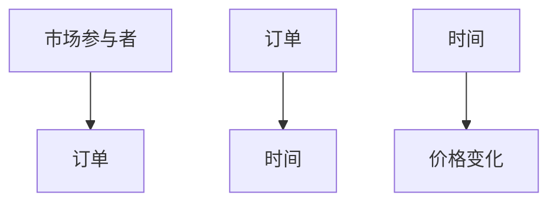
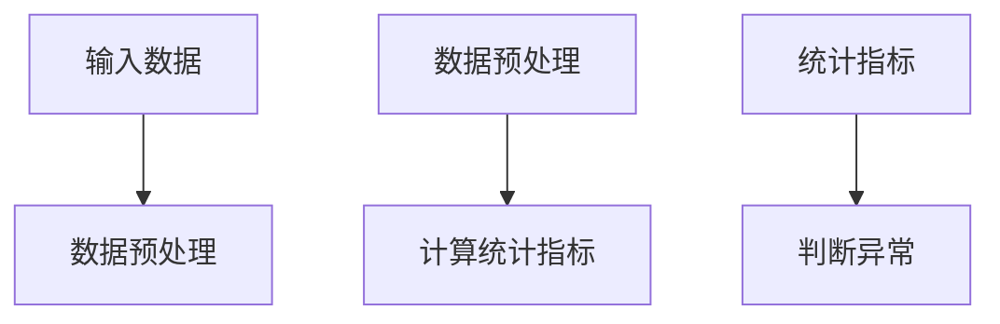
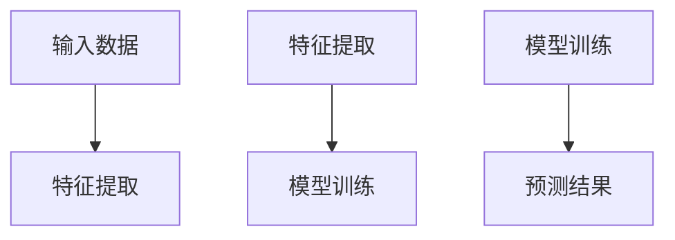
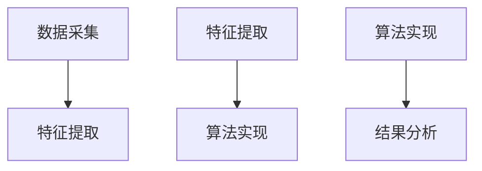

                 


# 金融市场微观结构变化检测

> 关键词：金融市场微观结构，变化检测，订单簿分析，统计套利，机器学习

> 摘要：金融市场微观结构变化检测是通过分析市场数据中的细微变化，识别异常交易行为和市场操纵，从而维护市场公平性和稳定性的重要手段。本文从背景、概念、算法、系统架构到实战项目，详细探讨这一领域的核心内容。

---

## 第一部分：金融市场微观结构变化检测概述

### 第1章：金融市场微观结构变化检测的背景与重要性

#### 1.1 问题背景
金融市场微观结构研究市场的基本组成部分，包括订单簿、参与者行为和交易机制。变化检测旨在识别这些结构中的异常，帮助交易员和监管机构及时应对潜在风险。

#### 1.2 问题描述
变化检测涉及识别价格波动、订单量变化等异常，可能预示着操纵、套利或市场冲击。与宏观分析不同，它关注微观层面的实时变化。

#### 1.3 问题解决方法
- **统计分析**：通过均值、标准差等指标检测异常。
- **机器学习**：使用分类和聚类算法识别异常模式。
- **深度学习**：利用神经网络捕捉复杂模式。

### 第2章：市场微观结构的核心概念与联系

#### 2.1 核心概念原理
- **订单簿分析**：研究买卖订单的行为差异，识别异常订单流。
- **市场微观结构模型**：包括限价订单、市价订单等，构建市场行为模型。
- **参与者行为分析**：分析不同参与者的交易模式，识别潜在操纵行为。

#### 2.2 核心概念属性特征对比表
| 概念 | 特性 | 描述 |
|------|------|------|
| 订单簿 | 深度 | 买方和卖方的订单数量 |
| 市场参与者 | 类型 | 机构投资者、散户等 |
| 价格变化 | 波动性 | 价格波动的标准差 |

#### 2.3 ER实体关系图


---

## 第二部分：算法原理

### 第3章：统计套利算法

#### 3.1 算法原理
统计套利利用均值回归策略，寻找短期价格偏差。通过计算z分数，判断价格是否偏离均值。

#### 3.2 算法流程图


#### 3.3 代码示例
```python
import pandas as pd

def z_score(data, window=20):
    mean = data.rolling(window).mean()
    std = data.rolling(window).std()
    z = (data - mean) / std
    return z.apply(lambda x: x.abs().values[-1] > 2)

# 示例数据
data = pd.Series([10, 20, 30, 25, 15])
result = z_score(data)
print(result)
```

### 第4章：机器学习算法

#### 4.1 算法原理
使用随机森林进行分类，特征包括订单量、价格波动等，训练模型识别异常交易。

#### 4.2 算法流程图


#### 4.3 代码示例
```python
from sklearn.ensemble import RandomForestClassifier

# 特征提取
features = data[['order_volume', 'price_change', 'volatility']]
labels = data['is_anomaly']

# 模型训练
model = RandomForestClassifier()
model.fit(features, labels)

# 预测
new_features = new_data[['order_volume', 'price_change', 'volatility']]
prediction = model.predict(new_features)
```

---

## 第三部分：系统架构与设计

### 第5章：系统分析与架构设计方案

#### 5.1 系统功能设计
- **数据采集模块**：实时获取市场数据。
- **特征提取模块**：计算订单量、价格波动等特征。
- **算法实现模块**：运行统计套利和机器学习算法。
- **结果分析模块**：输出检测结果并生成报告。

#### 5.2 系统架构设计


---

## 第四部分：项目实战

### 第6章：项目实战与分析

#### 6.1 实战环境
安装必要的库：`pip install pandas numpy scikit-learn`

#### 6.2 核心代码实现
```python
import pandas as pd
from sklearn.ensemble import RandomForestClassifier

# 数据加载
data = pd.read_csv('market_data.csv')

# 特征工程
features = data[['order_volume', 'price_change', 'volatility']]
labels = data['is_anomaly']

# 模型训练
model = RandomForestClassifier()
model.fit(features, labels)

# 预测
new_data = pd.read_csv('new_data.csv')
new_features = new_data[['order_volume', 'price_change', 'volatility']]
predictions = model.predict(new_features)
```

#### 6.3 结果分析
- **案例分析**：检测某时段订单簿异常，识别潜在操纵行为。
- **结果解读**：预测结果为异常的交易，需进一步审查。

---

## 第五部分：总结与展望

### 第7章：总结与展望

#### 7.1 总结
本文详细探讨了金融市场微观结构变化检测的背景、概念、算法、系统架构和项目实战。通过统计套利和机器学习方法，实现对市场微观结构的实时监控。

#### 7.2 展望
未来，随着技术进步，深度学习和强化学习可能在这一领域发挥更大作用，提供更精准的异常检测。

---

### Tips:
- **数据源选择**：确保数据质量和实时性。
- **模型优化**：通过网格搜索优化机器学习模型。
- **实时性考虑**：采用流数据处理技术，确保低延迟。

通过系统学习和实践，读者可以掌握金融市场微观结构变化检测的核心技术，应用于实际场景中。

