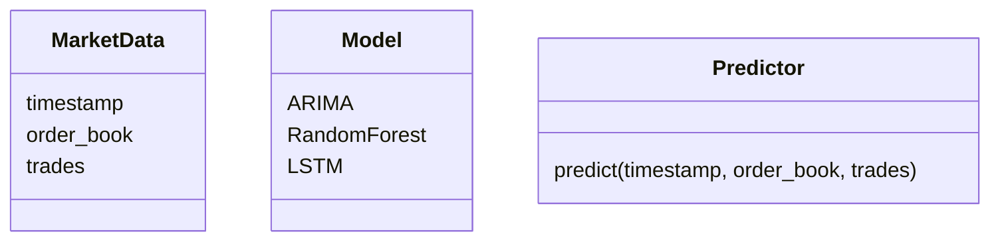
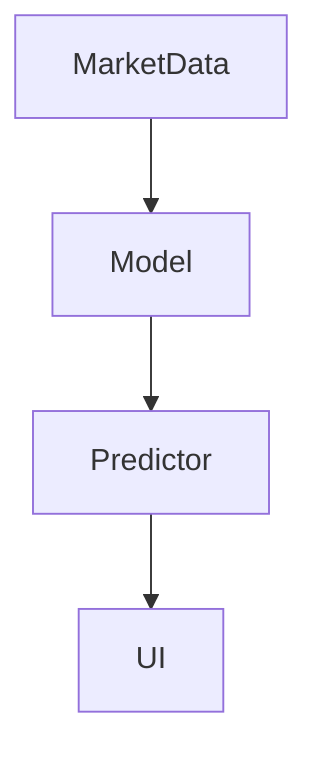
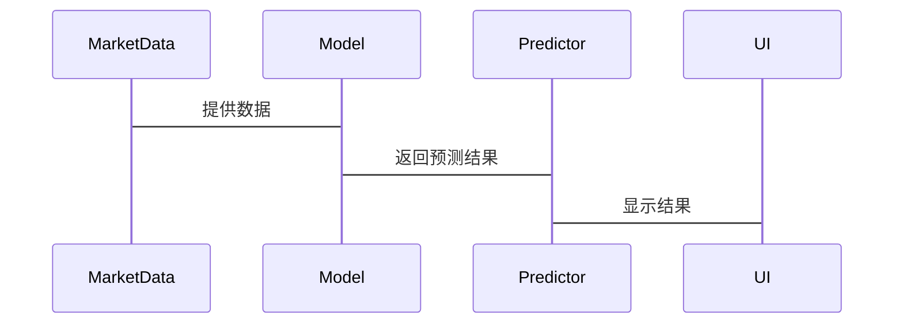

                 


# 金融市场微观结构变化预测模型

> 关键词：金融市场，微观结构，预测模型，时间序列，机器学习，深度学习

> 摘要：金融市场微观结构的变化对市场参与者的行为和市场走势有着重要影响。本文将详细探讨如何构建一个基于机器学习和深度学习的预测模型，分析金融市场微观结构的变化，包括订单簿、交易量、价格波动等关键指标。通过系统化的分析和建模，本文旨在为投资者和研究者提供一个高效、准确的预测工具。

---

# 第一部分: 金融市场微观结构概述

## 第1章: 金融市场微观结构概述

### 1.1 金融市场微观结构的定义与特点

#### 1.1.1 金融市场的基本概念
金融市场是一个买卖金融资产的场所，参与者包括投资者、机构、交易员等。金融资产可以是股票、债券、期货、期权等。

#### 1.1.2 微观结构的核心要素
- **订单簿**：记录当前市场上所有未成交的订单，包括买价、卖价和数量。
- **交易量**：一定时间内成交的资产数量，反映市场活跃度。
- **价格波动**：资产价格的短期变化，受市场供需和参与者情绪影响。

#### 1.1.3 微观结构与宏观市场的关系
微观结构的变化直接影响市场的流动性和价格形成机制，进而影响宏观市场的波动。

---

### 1.2 金融市场微观结构变化的背景与意义

#### 1.2.1 传统金融市场分析的局限性
传统分析方法依赖于宏观指标，如GDP、利率等，难以捕捉市场的微观动态。

#### 1.2.2 微观结构变化对市场的影响
- 影响市场流动性：订单簿的深度和报价范围决定了市场的深度。
- 影响价格发现：交易量和订单簿的变化反映了市场的供需变化。
- 影响市场风险：价格波动和交易量变化是市场风险的重要指标。

#### 1.2.3 预测微观结构变化的重要性
准确预测微观结构变化可以帮助投资者做出更及时的决策，降低交易成本，提高收益。

---

### 1.3 本书的核心问题与目标

#### 1.3.1 问题背景与问题描述
金融市场微观结构的变化是一个复杂的动态过程，涉及多个因素的相互作用。如何通过数据和技术手段，准确预测这些变化，是当前研究的热点。

#### 1.3.2 问题解决的思路与方法
- 数据驱动：利用历史交易数据，提取特征，建立预测模型。
- 深度学习：通过神经网络捕捉数据中的复杂模式。
- 组合模型：结合时间序列分析和机器学习方法，提高预测精度。

#### 1.3.3 目标与边界
目标：构建一个能够准确预测金融市场微观结构变化的模型。  
边界：聚焦于微观层面，不涉及宏观经济变量的分析。

---

## 第2章: 微观结构变化预测的核心概念与联系

### 2.1 微观结构变化的核心概念

#### 2.1.1 订单簿与交易数据
订单簿记录了市场上所有未成交的订单，包括买价和卖价。交易数据包括成交时间、价格和数量。

#### 2.1.2 市场微观结构的关键指标
- **订单深度**：买价和卖价的深度反映了市场的买卖力量。
- **订单 imbalance**：买价和卖价的不平衡反映了市场的供需失衡。
- **交易量**：成交量反映了市场的活跃程度。

#### 2.1.3 变化预测的数学模型
数学模型是预测微观结构变化的基础，包括时间序列模型和回归模型。

---

### 2.2 核心概念的属性特征对比

#### 2.2.1 数据特征对比表格

| 特征 | 订单深度 | 订单 imbalance | 交易量 |
|------|----------|---------------|--------|
| 类型 | 数值型   | 数值型        | 数值型 |
| 范围 | 0-无穷   | -无穷-0       | 0-无穷 |
| 用途 | 衡量买/卖力量 | 衡量供需失衡 | 衡量活跃度 |

#### 2.2.2 实体关系图（ER图）

```mermaid
erd
    market_structure {
        id
        timestamp
        order_depth
        order_imbalance
        volume
    }
```

---

## 第3章: 微观结构变化预测的算法原理

### 3.1 特征工程与数据预处理

#### 3.1.1 数据特征提取方法
从订单簿和交易数据中提取特征，如订单深度、订单 imbalance 和交易量。

#### 3.1.2 数据清洗与标准化
- 数据清洗：处理缺失值和异常值。
- 数据标准化：将数据归一化，便于模型训练。

#### 3.1.3 时间序列特征提取
提取时间序列的特征，如均值、方差、自相关系数等。

---

### 3.2 模型算法选择与实现

#### 3.2.1 时间序列模型（ARIMA）
ARIMA模型适用于预测时间序列数据，通过自回归和移动平均部分捕捉数据的特性。

#### 3.2.2 机器学习模型（随机森林、XGBoost）
随机森林和XGBoost适用于分类和回归问题，能够捕捉非线性关系。

#### 3.2.3 深度学习模型（LSTM）
LSTM网络适用于捕捉时间序列中的长-term依赖关系，适合处理复杂的金融市场数据。

---

## 第4章: 算法原理的数学模型与公式

### 4.1 时间序列模型的数学推导

#### 4.1.1 ARIMA模型的公式与推导
ARIMA(p, d, q)模型的公式为：
$$
(1 - B)^d (1 - \phi_1 B - \dots - \phi_p B^p) (1 - \theta_1 B - \dots - \theta_q B^q) X_t = \epsilon_t
$$

#### 4.1.2 模型参数的估计方法
使用最大似然估计法（MLE）估计ARIMA模型的参数。

---

### 4.2 机器学习模型的数学基础

#### 4.2.1 随机森林的决策树原理
随机森林通过构建多棵决策树，并行投票法进行预测。

#### 4.2.2 XGBoost的提升树算法
XGBoost通过梯度提升树模型，优化损失函数，提高预测精度。

---

### 4.3 深度学习模型的数学实现

#### 4.3.1 LSTM的结构与公式
LSTM单元的输入门、遗忘门和输出门公式：
$$
i_t = \sigma(W_i x_t + U_i h_{t-1} + b_i)
$$
$$
f_t = \sigma(W_f x_t + U_f h_{t-1} + b_f)
$$
$$
o_t = \sigma(W_o x_t + U_o h_{t-1} + b_o)
$$
$$
h_t = i_t \cdot \tanh(W_c x_t + U_c h_{t-1} + b_c) + f_t \cdot h_{t-1}
$$

---

## 第5章: 系统分析与架构设计方案

### 5.1 问题场景介绍

#### 5.1.1 金融市场数据的获取与处理
从交易所或数据供应商获取订单簿和交易数据，清洗并预处理数据。

#### 5.1.2 模型训练与预测的场景分析
根据历史数据训练模型，预测未来一段时间内的微观结构变化。

---

### 5.2 系统功能设计

#### 5.2.1 数据采集模块
从数据源获取实时订单簿和交易数据。

#### 5.2.2 数据处理模块
清洗、标准化和特征提取。

#### 5.2.3 模型训练模块
使用训练数据训练模型，优化参数。

#### 5.2.4 预测与结果展示模块
根据模型预测结果，生成可视化报告。

---

### 5.3 系统架构设计

#### 5.3.1 类图


#### 5.3.2 架构图


#### 5.3.3 序列图


---

## 第6章: 项目实战

### 6.1 环境安装

#### 6.1.1 安装Python和相关库
安装Python 3.8及以上版本，安装Pandas、NumPy、Scikit-learn、XGBoost、Keras和TensorFlow。

### 6.2 系统核心实现源代码

#### 6.2.1 数据预处理代码
```python
import pandas as pd
import numpy as np

def preprocess_data(data):
    # 假设data是包含订单簿和交易数据的DataFrame
    # 提取订单深度、订单imbalance和交易量特征
    features = data[['order_depth', 'order_imbalance', 'volume']]
    # 标准化数据
    from sklearn.preprocessing import StandardScaler
    scaler = StandardScaler()
    features_scaled = scaler.fit_transform(features)
    return features_scaled
```

#### 6.2.2 ARIMA模型实现
```python
from statsmodels.tsa.arima_model import ARIMA

def arima_model(train_data, order):
    model = ARIMA(train_data, order=order)
    model_fit = model.fit()
    return model_fit
```

#### 6.2.3 LSTM模型实现
```python
from keras.models import Sequential
from keras.layers import LSTM, Dense

def lstm_model(input_shape):
    model = Sequential()
    model.add(LSTM(units=50, return_sequences=True, input_shape=input_shape))
    model.add(LSTM(units=50, return_sequences=False))
    model.add(Dense(1))
    model.compile(loss='mean_squared_error', optimizer='adam')
    return model
```

---

### 6.3 案例分析

#### 6.3.1 数据获取与处理
从某股票的订单簿数据中提取订单深度、订单imbalance和交易量。

#### 6.3.2 模型训练与预测
使用ARIMA和LSTM模型分别训练，预测未来一段时间的订单深度变化。

#### 6.3.3 结果分析
比较两种模型的预测结果，分析其准确性和适用性。

---

### 6.4 项目小结

通过实战项目，我们验证了模型的可行性和有效性，为后续研究提供了参考。

---

## 第7章: 最佳实践与小结

### 7.1 最佳实践 tips

- 数据预处理是关键，需仔细清洗和特征提取。
- 模型选择需结合实际问题和数据特性。
- 及时监控模型性能，定期更新模型。

### 7.2 小结

本文详细探讨了金融市场微观结构变化预测模型的构建过程，从数据预处理到模型选择，再到系统实现，为读者提供了全面的指导。

### 7.3 注意事项

- 数据隐私和合规性需注意。
- 模型需定期更新，避免过时。
- 风险提示：模型预测仅供参考，投资需谨慎。

### 7.4 拓展阅读

- 《金融数据分析与机器学习》
- 《深度学习在金融中的应用》
- 《时间序列分析的理论与方法》

---

通过以上步骤，我们构建了一个完整的金融市场微观结构变化预测模型，为投资者和研究者提供了实用的工具和方法。

