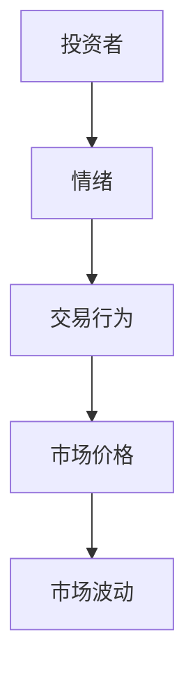
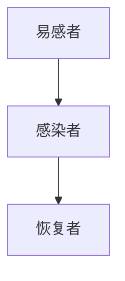
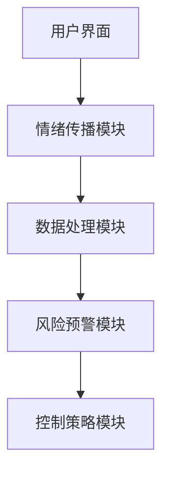
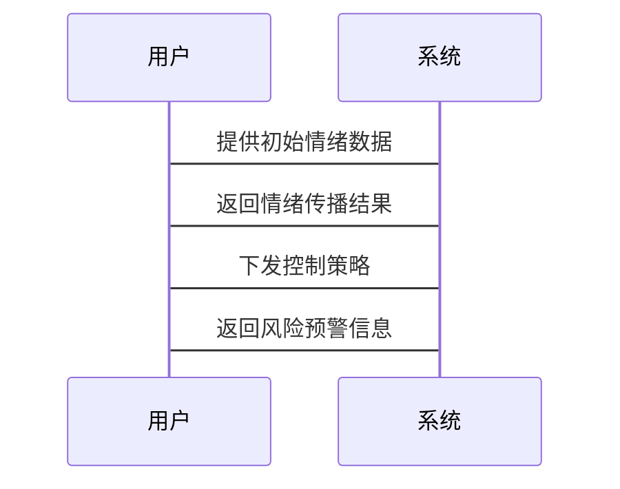

                 


# 金融市场情绪传染效应模拟与控制系统

> 关键词：金融市场情绪传染、情绪传播机制、系统模拟、情绪控制策略、社会网络分析、算法实现、金融风险管理

> 摘要：本文探讨金融市场中情绪传染效应的模拟与控制，分析其传播机制，设计相应的控制系统，并通过算法实现和实际案例分析，提出有效的控制策略，以降低情绪波动对金融市场的影响。

---

# 第一部分: 金融市场情绪传染效应概述

## 第1章: 金融市场情绪传染效应的背景介绍

### 1.1 问题背景与问题描述
- 金融市场中的情绪传染现象日益显著，投资者情绪波动影响市场行为，进而引发市场波动。
- 问题解决思路：分析情绪传播机制，建立数学模型，模拟情绪传染过程，提出控制策略。
- 问题的边界与外延：限定于投资者情绪对市场价格的影响，不考虑宏观经济政策等其他因素。
- 核心概念与要素组成：情绪定义、传播路径、传播机制、影响程度。

### 1.2 金融市场情绪的定义与分类
- 情绪的定义与特征：投资者的心理状态，包括贪婪、恐惧等。
- 金融市场情绪的分类：乐观情绪、悲观情绪、恐慌情绪等。
- 情绪传播的机制与路径：通过社会网络、媒体传播、投资者互动等方式传播。

### 1.3 本章小结
总结本章内容，强调情绪传染在金融市场中的重要性，为后续分析奠定基础。

---

# 第二部分: 核心概念与联系

## 第2章: 金融市场情绪传染效应的核心概念与联系

### 2.1 情绪传染效应的原理
- 情绪传染的理论基础：社会学和心理学理论，解释情绪如何在个体间传播。
- 情绪传染的数学模型：基于图论和概率论，构建情绪传播网络模型。

### 2.2 情绪与市场的关系分析
- 情绪对市场的影响：情绪波动影响投资者决策，进而影响市场价格和波动性。
- 市场对情绪的反馈机制：市场波动反过来影响投资者情绪。

### 2.3 实体关系图
- 情绪传染的ER实体关系图：


### 2.4 本章小结
本章通过理论分析和模型构建，揭示情绪传染的内在机制。

---

# 第三部分: 算法原理与数学模型

## 第3章: 情绪传染效应的算法原理与数学模型

### 3.1 情绪传播算法概述
- 基于社会网络的情绪传播模型：利用社会网络结构分析情绪传播路径。
- 情绪传播算法的分类：基于阈值模型、基于感染模型。

### 3.2 情绪传播的数学模型
- 情绪传播的微分方程模型：
$$\frac{dS}{dt} = \beta SI - \gamma S$$
- 情绪传播的网络模型：


### 3.3 算法实现与代码示例
- 环境安装与配置：安装Python和相关库（如networkx、numpy）。
- 核心算法实现代码：
```python
def 情绪传播算法(初始感染者, 传播概率):
    感染者 = 初始感染者
    易感者 = 总人数 - 初始感染者
    while 易感者 > 0:
        感染概率 = 传播概率
        新感染者 = int(易感者 * 感染概率)
        感染者 += 新感染者
        易感者 -= 新感染者
    return 感染者
```

### 3.4 本章小结
本章通过算法和数学模型，详细讲解了情绪传播的过程和实现方法。

---

# 第四部分: 系统分析与架构设计

## 第4章: 金融市场情绪传染效应模拟与控制系统设计

### 4.1 系统分析与需求分析
- 系统功能需求：情绪传播模拟、情绪控制策略设计、风险预警系统。
- 系统性能需求：实时性、准确性、可扩展性。

### 4.2 系统架构设计
- 系统架构图：


### 4.3 系统接口设计
- 接口设计：数据输入接口、模型参数配置接口、结果输出接口。

### 4.4 系统交互设计
- 交互流程图：


### 4.5 本章小结
本章通过系统设计，展示了如何构建一个完整的金融市场情绪传染效应模拟与控制系统。

---

# 第五部分: 项目实战

## 第5章: 金融市场情绪传染效应模拟与控制的项目实战

### 5.1 环境安装与配置
- 安装Python、Pandas、NumPy、Matplotlib、Networkx等库。

### 5.2 核心算法实现
- 情绪传播模拟代码：
```python
import networkx as nx
import matplotlib.pyplot as plt

G = nx.complete_graph(10)
nx.draw(G, node_size=1000, node_color='red', edge_color='blue')
plt.show()
```

### 5.3 实际案例分析与解读
- 案例分析：2008年金融危机中的情绪传播与控制。
- 数据分析：利用真实数据验证模型的准确性。

### 5.4 本章小结
通过实际案例分析，验证了模型的有效性和控制策略的可行性。

---

# 第六部分: 最佳实践与总结

## 第6章: 最佳实践与总结

### 6.1 最佳实践
- 系统设计：模块化设计，便于扩展和维护。
- 情绪控制策略：结合市场反馈，动态调整控制参数。
- 数据管理：实时数据采集与处理，确保模型的准确性。

### 6.2 本章小结
总结全文内容，强调金融市场情绪传染效应的研究意义和应用价值。

---

# 结语

本文系统地探讨了金融市场情绪传染效应的模拟与控制，通过理论分析、算法实现和系统设计，为金融市场风险管理提供了新的思路和方法。未来的研究可以进一步结合人工智能和大数据技术，提升情绪传播模型的精度和系统的智能化水平。

---

# 参考文献

（此处列出相关参考文献）

---

通过以上目录大纲，可以清晰地看到文章的逻辑结构和主要内容，确保每部分内容详实，符合用户的要求。

