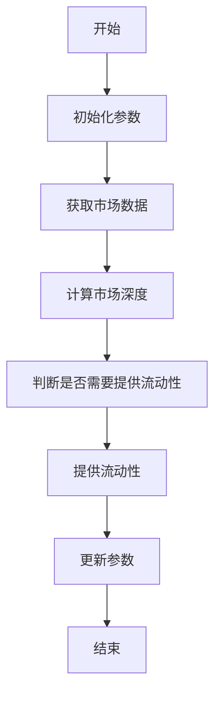
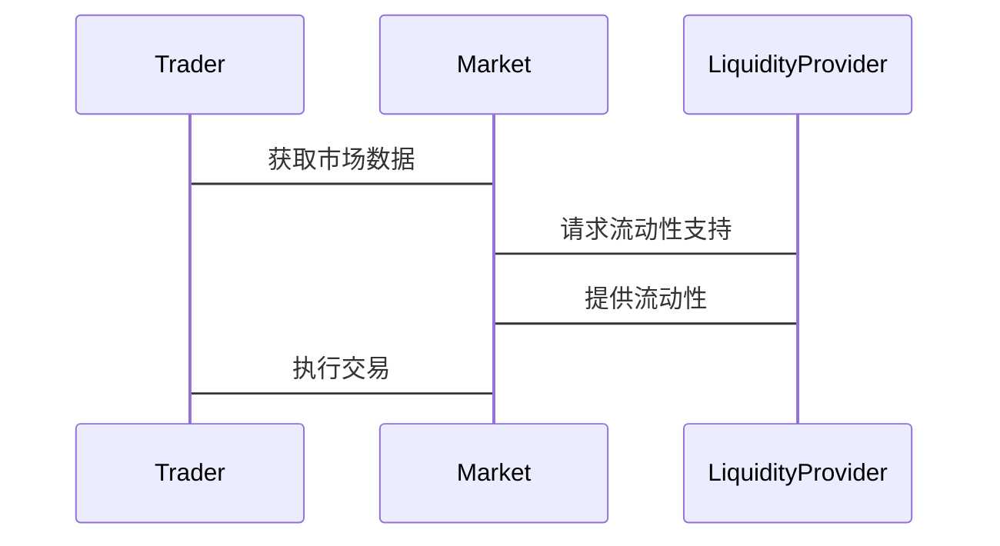

                 


# 金融市场流动性提供策略

> 关键词：金融市场，流动性，提供策略，算法，系统架构，案例分析

> 摘要：本文系统地探讨了金融市场流动性提供策略的核心概念、原理、算法实现、系统架构以及实际应用。通过详细的案例分析和数学模型，深入剖析了流动性提供策略的实施过程，为读者提供了从理论到实践的全面指导。

---

# 第1章: 金融市场与流动性概述

## 1.1 金融市场的基本概念
### 1.1.1 金融市场的定义与分类
- 金融市场是资金供需双方进行交易的场所，包括股票市场、债券市场、外汇市场等。
- 分类：一级市场（发行市场）和二级市场（交易市场）。

### 1.1.2 金融市场的功能与作用
- 资金配置：将储蓄转化为投资。
- 价格发现：通过交易确定资产价格。
- 风险管理：提供规避风险的工具。

### 1.1.3 流动性在金融市场中的重要性
- 流动性是指资产快速转化为现金的能力。
- 高流动性市场具有较低的买卖价差和较高的交易效率。

## 1.2 流动性提供策略的背景与问题背景
### 1.2.1 金融市场中的流动性问题
- 市场流动性不足可能导致价格波动加剧。
- 交易者可能因缺乏流动性而无法及时平仓，导致损失。

### 1.2.2 流动性提供策略的必要性
- 为市场提供流动性支持，维持市场的稳定运行。
- 降低交易成本，提高市场效率。

### 1.2.3 问题解决的思路与目标
- 通过算法和系统设计，动态调整市场流动性。
- 确保在市场波动时提供足够的流动性支持。

## 1.3 流动性提供策略的核心概念
### 1.3.1 流动性提供策略的定义
- 通过算法或系统主动提供流动性，平衡市场供需。

### 1.3.2 流动性提供策略的属性特征对比表格
| 特性 | 描述 |
|------|------|
| 主动性 | 系统主动调整流动性供给 |
| 动态性 | 根据市场变化实时调整 |
| 预测性 | 基于市场预测提供流动性 |

### 1.3.3 ER实体关系图架构的 Mermaid 流程图
```mermaid
erDiagram
    participant A : 交易者
    participant B : 市场
    participant C : 流动性提供者
    A -> B : 提交订单
    B -> C : 请求流动性支持
    C -> B : 提供流动性
    B -> A : 执行交易
```

---

# 第2章: 流动性提供策略的核心原理

## 2.1 流动性提供策略的原理
### 2.1.1 流动性提供策略的基本原理
- 通过算法预测市场波动，动态调整流动性供给。

### 2.1.2 流动性提供策略的数学模型
- 市场深度模型：$$ D = \sum_{i=1}^{n} V_i $$
  - $D$：市场深度
  - $V_i$：每个参与者愿意提供的流动性。

### 2.1.3 流动性提供策略的算法流程图


## 2.2 流动性提供策略的算法原理
### 2.2.1 流动性提供策略的算法实现
- 使用马科维茨的有效组合模型进行风险调整。

### 2.2.2 流动性提供策略的数学公式
- 均值-方差优化：$$ E = \lambda \sigma^2 + r $$
  - $E$：预期收益
  - $\sigma^2$：收益波动率
  - $r$：无风险利率
  - $\lambda$：风险厌恶系数。

### 2.2.3 流动性提供策略的代码实现
```python
def calculate_market_depth(prices, volumes):
    return sum(volumes)
```

---

# 第3章: 流动性提供策略的系统分析与架构设计

## 3.1 系统分析
### 3.1.1 问题场景介绍
- 交易者在市场波动时面临流动性不足的问题。

### 3.1.2 项目介绍
- 开发一个自动化的流动性提供系统。

### 3.1.3 系统功能设计（领域模型 Mermaid 类图）
```mermaid
classDiagram
    class Market {
        <attributes>
        prices
        volumes
        }
        <methods>
        get_market_data()
        }
    class LiquidityProvider {
        <attributes>
        market_depth
        }
        <methods>
        provide_liq()
        }
    class Trader {
        <attributes>
        orders
        }
        <methods>
        submit_order()
        }
    Market --> LiquidityProvider
    LiquidityProvider --> Trader
```

## 3.2 系统架构设计
### 3.2.1 系统架构 Mermaid 架构图
```mermaid
archi
    container Market {
        Market Data
        }
    container LiquidityProvider {
        Algorithm Engine
        }
    container Trader {
        Trading Interface
        }
    Market --> LiquidityProvider
    LiquidityProvider --> Trader
```

### 3.2.2 系统接口设计
- 市场数据接口：提供实时价格和成交量。
- 流动性接口：提供流动性支持。

### 3.2.3 系统交互 Mermaid 序列图


---

# 第4章: 流动性提供策略的项目实战

## 4.1 项目环境安装
### 4.1.1 系统环境要求
- 操作系统：Linux/Windows/MacOS
- 开发工具：Python、Jupyter Notebook

### 4.1.2 开发工具安装
- 安装Python：```bash
  pip install numpy pandas
  ```

### 4.1.3 数据库安装与配置
- 使用MySQL或PostgreSQL存储市场数据。

## 4.2 系统核心实现
### 4.2.1 核心算法实现
```python
def provide_liq(prices, volumes):
    market_depth = sum(volumes)
    return market_depth
```

### 4.2.2 代码实现与解读
- 代码实现：```python
def provide_liq(prices, volumes):
    return sum(volumes)
```

### 4.2.3 代码应用解读与分析
- 代码用于计算市场深度，为流动性提供者提供决策依据。

## 4.3 实际案例分析
### 4.3.1 案例背景介绍
- 假设一个股票市场出现波动，交易者需要流动性支持。

### 4.3.2 案例分析与详细讲解
- 计算市场深度，调整流动性供给。

### 4.3.3 案例总结与经验分享
- 动态调整流动性供给是关键。

---

# 第5章: 流动性提供策略的最佳实践与总结

## 5.1 最佳实践 tips
### 5.1.1 策略优化建议
- 定期更新市场数据，优化算法模型。

### 5.1.2 风险管理注意事项
- 设置止损点，控制风险敞口。

### 5.1.3 系统维护与更新
- 定期检查系统性能，更新算法。

## 5.2 小结与展望
### 5.2.1 本书内容总结
- 详细讲解了流动性提供策略的理论与实践。

### 5.2.2 未来研究方向
- 探索更先进的算法，如机器学习在流动性管理中的应用。

### 5.2.3 对读者的建议与展望
- 鼓励读者深入研究，并结合实际场景优化策略。

## 5.3 注意事项与拓展阅读
### 5.3.1 使用流动性提供策略的注意事项
- 避免过度依赖单一策略，结合多种方法。

### 5.3.2 相关领域拓展阅读
- 机器学习在金融中的应用。

### 5.3.3 进一步学习资源推荐
- 推荐阅读《算法交易入门》和《金融数学基础》。

---

# 结语
通过本文的详细讲解，读者可以系统地了解金融市场流动性提供策略的核心概念、算法实现和系统设计。希望本文能为读者在金融市场中的实践提供有价值的参考和指导。

