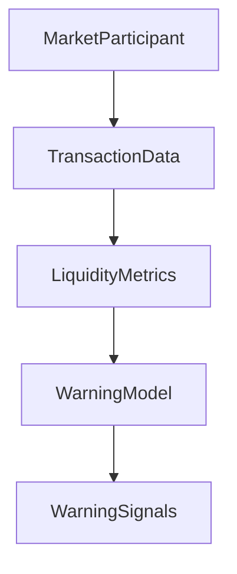
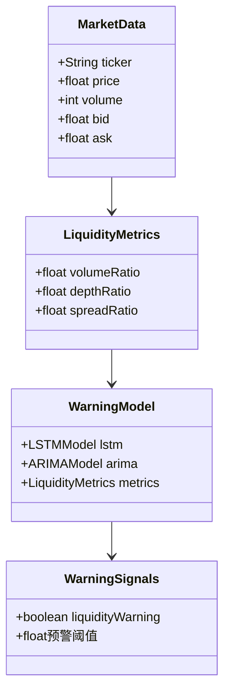

                 


# 金融市场流动性枯竭预警模型

> 关键词：金融市场、流动性、预警模型、时间序列分析、机器学习、系统架构

> 摘要：本文介绍了一种基于时间序列分析和机器学习的金融市场流动性枯竭预警模型。通过对市场数据的分析和建模，该模型能够提前识别潜在的流动性风险，帮助投资者和监管机构采取预防措施，避免或减少因流动性枯竭引发的市场危机。

---

## 第一部分: 金融市场流动性枯竭预警模型概述

### 第1章: 问题背景与核心概念

#### 1.1 问题背景

金融市场是一个高度动态和复杂的系统，流动性是其正常运作的核心要素。然而，流动性枯竭往往会导致市场恐慌、资产价格暴跌以及系统性风险的爆发。近年来，全球金融危机频发，许多事件的根源都可以追溯到流动性问题。因此，建立一个有效的流动性枯竭预警模型，对于维护金融市场稳定具有重要意义。

#### 1.2 核心概念与联系

流动性枯竭预警模型的核心在于监测市场的流动性状况，并在潜在危机发生前发出预警信号。以下是与流动性相关的核心概念及其联系：

##### 表1-1: 核心概念对比表

| 概念                  | 描述                                                                 |
|-----------------------|----------------------------------------------------------------------|
| 成交量               | 市场参与者在一定时间段内的交易量，反映市场活跃程度。                   |
| 市场深度             | 市场上买方和卖方的订单总量，反映市场的流动性状况。                     |
| 买卖价差             | 最新买入价和卖出价之间的差额，价差扩大通常意味着流动性下降。           |
| 市场波动率           | 资产价格的短期剧烈波动，可能反映市场参与者的恐慌情绪。                 |
| 市场参与者角色       | 包括机构投资者、散户、做市商等，不同参与者的行为会影响市场流动性。       |

##### 图1-1: ER实体关系图

```

```

---

### 第2章: 流动性监测指标与数据源

#### 2.1 主要流动性指标

流动性监测指标是模型的基础，以下是常用的几个指标：

- **成交量（Volume）**：反映市场的活跃程度，成交量骤减可能是流动性枯竭的信号。
- **市场深度（Market Depth）**：买卖订单的总量，深度减少意味着市场流动性下降。
- **买卖价差（Bid-Ask Spread）**：价差扩大通常表明市场流动性不足。
- **市场波动率（Volatility）**：高波动率可能反映市场恐慌，进而影响流动性。

#### 2.2 数据源与数据预处理

数据是模型的核心，选择合适的数据源并进行预处理是关键。

##### 表2-1: 数据预处理步骤

| 步骤               | 描述                                                                 |
|--------------------|----------------------------------------------------------------------|
| 数据获取           | 从交易所或数据供应商获取实时或历史数据。                                 |
| 数据清洗           | 去除异常值、填补缺失值、标准化数据格式。                                   |
| 特征提取           | 提取有用的特征，如移动平均、标准差、波动率等。                             |

---

## 第二部分: 流动性枯竭预警模型的核心算法

### 第3章: 时间序列分析

时间序列分析是预警模型的重要组成部分，常用的算法包括ARIMA和LSTM。

#### 3.1 ARIMA模型

ARIMA（自回归积分滑动平均模型）是一种经典的统计模型，适用于线性时间序列数据。

##### 图3-1: ARIMA模型流程图

```

```

##### 公式3-1: ARIMA模型公式

$$ARIMA(p, d, q) = y_t = \phi_1 y_{t-1} + \dots + \phi_p y_{t-p} + \theta_1 \epsilon_{t-1} + \dots + \theta_q \epsilon_{t-q} + \epsilon_t$$

#### 3.2 LSTM网络

长短期记忆网络（LSTM）是一种深度学习模型，能够捕捉时间序列中的长期依赖关系。

##### 图3-2: LSTM结构图

```

```

##### 公式3-2: LSTM基本公式

$$
f_t = \sigma(W_f \cdot [h_{t-1}, x_t] + b_f)
$$

$$
i_t = \sigma(W_i \cdot [h_{t-1}, x_t] + b_i)
$$

$$
o_t = \sigma(W_o \cdot [h_{t-1}, x_t] + b_o)
$$

$$
h_t = f_t \cdot c_{t-1} + i_t \cdot tanh(W_c \cdot [h_{t-1}, x_t] + b_c)
$$

---

## 第三部分: 系统分析与架构设计

### 第4章: 系统架构设计

#### 4.1 领域模型设计

##### 图4-1: 领域模型类图

```

```

#### 4.2 系统架构设计

##### 图4-2: 系统架构图

```
```mermaid
graph TD
    UI --> API Gateway
    API Gateway --> DataCollector
    DataCollector --> Database
    Database --> LiquidityAnalyzer
    LiquidityAnalyzer --> WarningEngine
    WarningEngine --> UI
```
```

---

## 第四部分: 项目实战

### 第5章: 环境搭建与核心代码实现

#### 5.1 环境安装

安装必要的Python库：

```bash
pip install numpy pandas scikit-learn keras tensorflow
```

#### 5.2 核心代码实现

##### 代码5-1: 数据预处理

```python
import pandas as pd
import numpy as np

def preprocess_data(data):
    data['moving_avg'] = data['price'].rolling(10).mean()
    data['std_dev'] = data['price'].rolling(10).std()
    return data
```

##### 代码5-2: LSTM模型实现

```python
from tensorflow.keras.models import Sequential
from tensorflow.keras.layers import LSTM, Dense, Dropout

model = Sequential()
model.add(LSTM(64, input_shape=(1, 10)))
model.add(Dense(1))
model.compile(loss='mean_squared_error', optimizer='adam')
```

---

## 第五部分: 总结与展望

### 第6章: 小结与最佳实践

#### 6.1 小结

本文详细介绍了金融市场流动性枯竭预警模型的构建过程，从背景分析到算法实现，再到系统设计，为读者提供了一套完整的解决方案。

#### 6.2 最佳实践

- 定期更新模型参数，以适应市场变化。
- 结合多模型结果，提高预警准确性。
- 建立多层次监控体系，及时应对潜在风险。

---

### 附录

#### 附录A: 常见问题解答

- **问题1**：如何选择模型参数？
  - 答案：可以通过网格搜索或交叉验证来选择最优参数。

- **问题2**：模型的实时性如何？
  - 答案：通过优化数据处理和模型推理速度，可以实现实时预警。

#### 附录B: 参考文献

- [1] Hyndman, R. J., & Athanasopoulos, G. (2018). Forecasting: principles and practice.
- [2] Hochreiter, S., & Schmidhuber, J. (1997). Long short-term memory.

---

以上是《金融市场流动性枯竭预警模型》的技术博客文章，内容涵盖了从理论到实践的各个方面，旨在为读者提供一个全面的指导。

