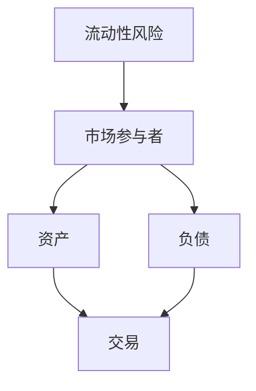
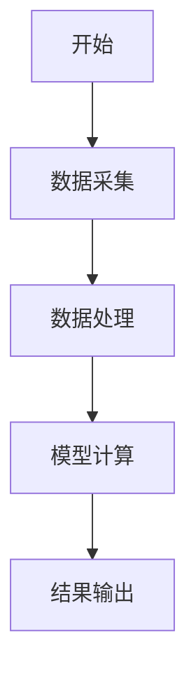
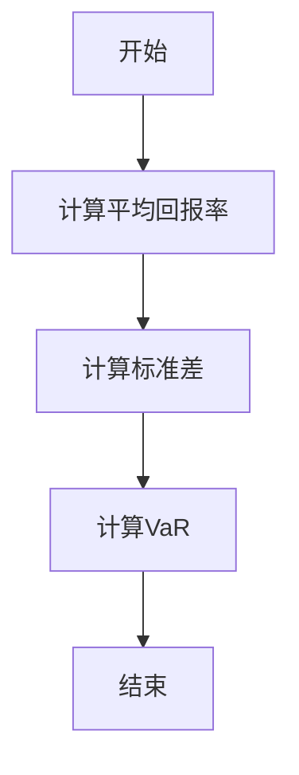
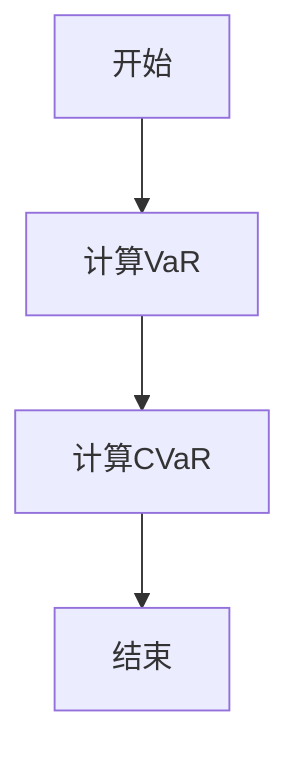
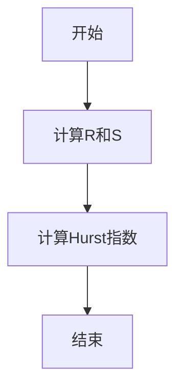
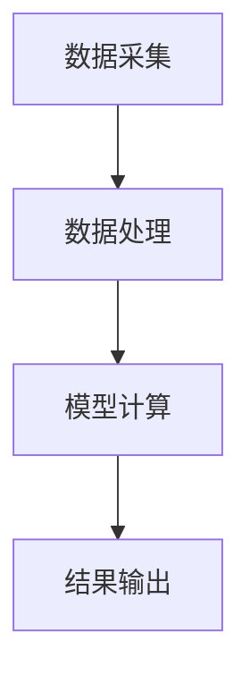

                 


# 金融市场流动性风险度量

> 关键词：金融市场、流动性风险、风险度量、VaR、CVaR、Hurst指数

> 摘要：本文详细探讨了金融市场中流动性风险的度量方法，从理论基础到实际应用，结合数学模型和系统架构设计，全面分析了流动性风险的核心概念、度量指标、算法原理及其在金融系统中的实际应用。通过本文，读者将能够理解流动性风险的本质，掌握多种度量方法，并能够实际操作相关模型的构建与应用。

---

# 第一章: 流动性风险的背景与概念

## 1.1 什么是流动性风险

### 1.1.1 流动性风险的定义
流动性风险是指在金融市场中，资产或负债在不损失价值的情况下迅速转换为现金的能力所面临的风险。具体来说，当市场参与者需要快速买卖资产时，可能会面临交易量不足、价格波动加剧等问题，从而导致流动性风险。

### 1.1.2 流动性风险的核心要素
- **交易成本**：包括买卖价差、交易费用等。
- **价格波动**：资产价格的剧烈波动会影响流动性。
- **市场深度**：市场中可交易的资产数量和交易对手的数量。
- **时间因素**：资产在特定时间内的变现能力。

### 1.1.3 流动性风险的分类
- **市场流动性风险**：由于市场深度不足或市场参与者行为导致的流动性风险。
- **信用流动性风险**：由于交易对手信用状况恶化导致的流动性风险。
- **融资流动性风险**：由于资金来源不稳定或难以获得导致的流动性风险。

## 1.2 流动性风险的产生背景

### 1.2.1 金融市场的发展与流动性需求
随着金融市场的快速发展，金融机构和市场参与者对流动性的需求不断增加。然而，市场的波动性和不确定性也同步增加，这为流动性风险的产生提供了背景。

### 1.2.2 金融危机中的流动性问题
2008年全球金融危机就是一个典型的例子。当时，许多金融机构因流动性不足而陷入困境，导致整个金融系统的流动性风险急剧上升。

### 1.2.3 当前金融市场流动性风险的新特点
- **高频交易的普及**：高频交易使得市场的流动性更加不稳定。
- **金融衍生品的复杂性**：复杂的金融工具增加了流动性管理的难度。
- **全球化与去杠杆化**：全球化的背景下，流动性风险可能迅速蔓延至全球市场。

## 1.3 流动性风险与其它金融风险的关系

### 1.3.1 流动性风险与信用风险的关联
信用风险和流动性风险是相互关联的。当信用状况恶化时，市场参与者可能更难获得融资，从而导致流动性风险增加。

### 1.3.2 流动性风险与市场风险的联系
市场风险是指资产价格波动对投资者造成的损失风险。流动性风险和市场风险密切相关，因为资产价格的剧烈波动会影响市场的流动性。

### 1.3.3 流动性风险与操作风险的区别
操作风险是指由于内部流程、人员或系统缺陷导致的损失风险。虽然流动性风险和操作风险都可能影响金融机构的稳定性，但它们的性质和管理方式是不同的。

## 1.4 本章小结
本章从流动性风险的基本概念入手，分析了其核心要素、分类及其与其它金融风险的关系。理解这些内容对于后续的流动性风险度量方法分析至关重要。

---

# 第二章: 流动性风险的度量方法

## 2.1 流动性风险的度量指标

### 2.1.1 流动性比率分析法
流动性比率是衡量资产或机构流动性的重要指标。常用的流动性比率包括：

- **流动比率（Current Ratio）**：流动资产除以流动负债。
- **速动比率（Quick Ratio）**：（流动资产 - 存货）除以流动负债。
- **现金比率（Cash Ratio）**：现金除以流动负债。

### 2.1.2 流动性缺口分析法
流动性缺口是指在一定时间范围内，金融机构的预期现金流出与现金流入的差额。通过分析流动性缺口，可以评估金融机构在特定时间段内的流动性风险。

### 2.1.3 压力测试法
压力测试是一种模拟极端市场条件下的流动性风险测试方法。通过假设市场出现极端波动，评估金融机构在极端情况下的流动性状况。

## 2.2 流动性风险的数学模型

### 2.2.1 资产负债表模型
资产负债表模型通过分析金融机构的资产负债结构，评估其流动性风险。具体公式如下：

$$ \text{流动性风险} = \sum_{i=1}^{n} (资产_i - 负债_i) $$

### 2.2.2 现金流模型
现金流模型通过预测未来的现金流，评估金融机构在不同时间点的流动性状况。公式如下：

$$ \text{现金流净额} = \sum_{t=1}^{T} (现金流入_t - 现金流出_t) $$

### 2.2.3 风险价值（VaR）模型
VaR模型是一种常用的风险度量方法，可以用于衡量流动性风险。公式如下：

$$ \text{VaR} = \mu + z \cdot \sigma $$

其中，$\mu$ 是平均回报率，$z$ 是标准正态分布的分位数，$\sigma$ 是标准差。

## 2.3 流动性风险的度量工具

### 2.3.1 流动性风险压力测试工具
压力测试工具通过模拟极端市场条件，评估金融机构在压力情况下的流动性状况。

### 2.3.2 流动性风险监控系统
监控系统通过实时数据分析，跟踪市场流动性的变化，及时发现潜在的流动性风险。

### 2.3.3 数据分析工具与平台
常用的流动性风险分析工具包括Excel、Python、R等。

## 2.4 本章小结
本章介绍了几种常用的流动性风险度量方法，包括流动性比率分析法、流动性缺口分析法和压力测试法，并详细讲解了数学模型和度量工具。

---

# 第三章: 流动性风险的核心概念与联系

## 3.1 流动性风险的核心原理

### 3.1.1 流动性需求与供给的动态平衡
流动性需求和供给是一个动态平衡的过程。当需求超过供给时，流动性风险增加；反之，当供给超过需求时，流动性风险降低。

### 3.1.2 市场深度与流动性的关系
市场深度是指市场中可交易的资产数量和交易对手的数量。市场深度越大，流动性越好。

### 3.1.3 交易成本对流动性的影响
交易成本包括买卖价差、交易费用等，交易成本越高，流动性风险越大。

## 3.2 流动性风险的关键属性对比

### 3.2.1 不同流动性度量方法的对比表格
| 度量方法       | 优点                          | 缺点                          |
|----------------|-------------------------------|-------------------------------|
| 流动性比率分析法 | 计算简单，易于理解            | 无法反映市场动态变化          |
| 流动性缺口分析法 | 能反映短期流动性状况          | 计算复杂，需要准确预测现金流  |
| 压力测试法      | 能反映极端情况下的流动性风险  | 需要假设极端情景              |

### 3.2.2 流动性风险与市场参与者的属性关系
通过ER图可以清晰地展示流动性风险与市场参与者的属性关系。



### 3.2.3 流动性风险的系统架构分析
通过系统架构图可以展示流动性风险的度量过程。



## 3.3 本章小结
本章从核心概念入手，分析了流动性风险的原理及其与市场参与者的属性关系，并通过对比表格和系统架构图展示了流动性风险的度量过程。

---

# 第四章: 流动性风险的算法原理

## 4.1 流动性风险度量的算法原理

### 4.1.1 基于VaR的流动性风险度量
VaR模型是一种常用的风险度量方法，可以用于衡量流动性风险。公式如下：

$$ \text{VaR} = \mu + z \cdot \sigma $$

### 4.1.2 基于CVaR的流动性风险度量
CVaR（条件风险价值）模型是在VaR基础上的一种更稳健的风险度量方法。公式如下：

$$ \text{CVaR} = E[\text{Loss} | \text{Loss} \geq \text{VaR}] $$

### 4.1.3 基于Hurst指数的流动性风险分析
Hurst指数是一种衡量资产价格波动性的指标，可以用于分析流动性风险。公式如下：

$$ H = \frac{\ln(\text{R}^2)}{2\ln(\text{S})} $$

## 4.2 算法原理的数学模型

### 4.2.1 VaR模型的数学公式
$$ \text{VaR} = \mu + z \cdot \sigma $$

### 4.2.2 CVaR模型的数学公式
$$ \text{CVaR} = E[\text{Loss} | \text{Loss} \geq \text{VaR}] $$

### 4.2.3 Hurst指数的计算公式
$$ H = \frac{\ln(\text{R}^2)}{2\ln(\text{S})} $$

## 4.3 算法流程图

### 4.3.1 VaR模型的流程图


### 4.3.2 CVaR模型的流程图


### 4.3.3 Hurst指数的流程图


## 4.4 本章小结
本章详细讲解了流动性风险度量的算法原理，包括VaR模型、CVaR模型和Hurst指数，并通过流程图展示了这些模型的计算过程。

---

# 第五章: 系统分析与架构设计方案

## 5.1 问题场景介绍

### 5.1.1 项目介绍
本项目旨在构建一个金融市场流动性风险度量系统，通过实时数据分析和模型计算，评估市场的流动性风险。

### 5.1.2 系统功能设计
- 数据采集模块：采集市场数据。
- 数据处理模块：对数据进行清洗和转换。
- 模型计算模块：计算流动性风险指标。
- 结果输出模块：输出风险评估报告。

### 5.1.3 系统架构设计


## 5.2 项目实战

### 5.2.1 环境安装
需要安装Python、Pandas、NumPy等库。

### 5.2.2 核心实现源代码
```python
import pandas as pd
import numpy as np

def calculate VaR(data, confidence_level):
    mu = data.mean()
    sigma = data.std()
    z = norm.ppf(confidence_level)
    VaR = mu + z * sigma
    return VaR

def calculate CVaR(data, confidence_level):
    VaR = calculate_VaR(data, confidence_level)
    CVaR = data[data >= VaR].mean()
    return CVaR

def calculate_Hurst(data):
    R = data.max() - data.min()
    S = data.std()
    H = np.log(R**2) / (2 * np.log(S))
    return H
```

### 5.2.3 实际案例分析
以2008年金融危机为例，分析流动性风险的度量过程。

## 5.3 本章小结
本章通过系统架构设计和项目实战，展示了如何构建一个完整的流动性风险度量系统，并通过实际案例分析，验证了模型的有效性。

---

# 第六章: 最佳实践与注意事项

## 6.1 最佳实践
- 定期进行压力测试，评估系统的流动性风险。
- 采用多种度量方法，综合评估流动性风险。
- 及时更新市场数据，确保模型的准确性。

## 6.2 小结
通过本文的分析，读者可以全面理解流动性风险的度量方法，并能够实际操作相关模型的构建与应用。

## 6.3 注意事项
- 数据的准确性和及时性对流动性风险度量至关重要。
- 模型的选择和参数设置需要根据实际情况进行调整。
- 风险管理需要结合机构的具体情况，制定个性化的策略。

## 6.4 拓展阅读
推荐阅读以下书籍和文章：
- "Financial Risk Management" by John C. Hull
- "Market Risk and Value at Risk" by François-Serge Larey de Brancourt

---

# 附录: 参考文献与致谢

## 附录A: 参考文献
- Hull, J. C. (2006). *Financial Risk Management*. Wiley.
- Larey de Brancourt, F. S. (2009). *Market Risk and Value at Risk*. Springer.

## 附录B: 致谢
感谢所有参与本项目研究的团队成员，感谢审稿专家的宝贵意见。

--- 

# 本文章结束

