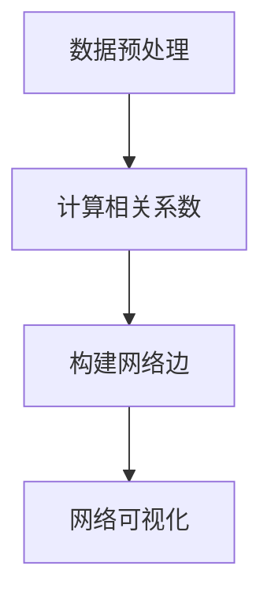
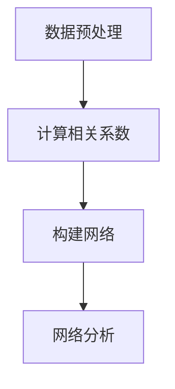
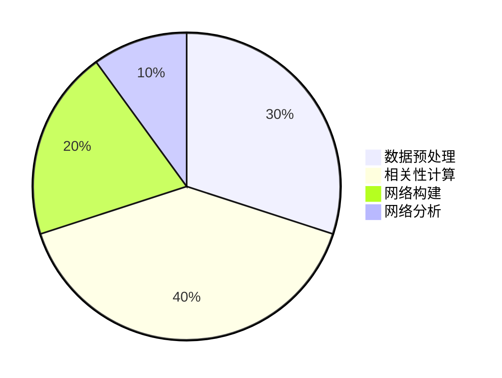
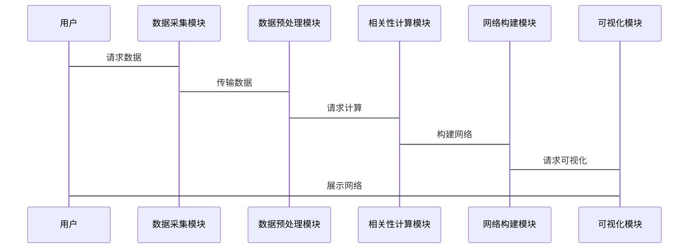

                 


# 金融市场跨资产相关性网络分析

**关键词**：金融市场，跨资产相关性，网络分析，复杂网络，系统性风险

**摘要**：本文探讨了金融市场中跨资产相关性网络分析的方法与应用。通过构建相关性网络，分析资产之间的相互作用，识别系统性风险，并优化投资组合。文章从背景介绍、核心概念、算法原理、系统架构到项目实战，全面解析相关性网络分析的理论与实践。

---

# 第1章 金融市场概述

## 1.1 金融市场的基本概念

### 1.1.1 金融市场的定义与分类

金融市场是资金流动和资产交易的场所，按交易对象分为货币市场、资本市场、外汇市场等。各类市场相互关联，构成复杂的金融生态系统。

### 1.1.2 资产类别与金融工具

资产类别包括股票、债券、商品、外汇和衍生品。金融工具如期权、期货等，为投资者提供了多样化的选择。

### 1.1.3 金融市场的参与者与交易机制

参与者包括投资者、机构、监管层等，交易机制涵盖现货、远期和衍生品交易。

## 1.2 跨资产相关性的概念

### 1.2.1 相关性的定义与度量方法

相关性衡量资产价格变动的关联性，常用皮尔逊相关系数或 spearman 相关系数衡量。

### 1.2.2 跨资产相关性的意义

了解资产相关性有助于风险管理和投资组合优化，识别系统性风险。

### 1.2.3 跨资产相关性在网络分析中的应用

网络分析用于发现资产间的相互影响，构建相关性网络，识别关键节点和风险传导路径。

## 1.3 网络分析的基本原理

### 1.3.1 网络分析的定义

网络分析研究网络结构及其属性，应用于复杂系统的建模与分析。

### 1.3.2 网络分析在金融领域的应用

用于市场风险评估、资产配置、异常交易检测等。

### 1.3.3 跨资产相关性网络分析的目标与价值

目标是通过网络分析，识别资产间的关系，优化投资决策，降低风险。

## 1.4 本章小结

本章介绍了金融市场和资产相关性的基本概念，强调网络分析在金融中的重要性，为后续分析打下基础。

---

# 第2章 跨资产相关性网络的构建原理

## 2.1 相关性网络的构建步骤

### 2.1.1 数据收集与预处理

收集股票、债券等资产的历史价格数据，清洗异常值，处理缺失值。

### 2.1.2 相关性计算

使用皮尔逊相关系数或 spearman 相关系数计算资产对的相关性。

### 2.1.3 网络构建与可视化

将相关系数转化为网络边，可视化资产网络，识别关键节点和模块。

## 2.2 网络结构的特征分析

### 2.2.1 网络密度与节点度分布

网络密度反映市场的连通性，节点度分布显示资产的影响力。

### 2.2.2 网络聚类与模块化

聚类分析识别资产群体，模块化显示市场结构的稳定性。

### 2.2.3 网络中心性与影响力

中心性指标显示资产在网络中的影响力，识别关键资产。

## 2.3 跨资产相关性网络的动态特性

### 2.3.1 时间序列相关性的动态变化

分析相关性随时间的变化，捕捉市场波动。

### 2.3.2 市场波动对网络结构的影响

市场波动加剧相关性网络的动态变化，影响风险传导。

### 2.3.3 网络鲁棒性与脆弱性分析

评估网络对冲击的抵抗力，识别脆弱性资产。

## 2.4 核心概念对比表格

| 概念       | 定义与特征 | 应用 |
|------------|------------|------|
| 网络密度   | 网络边数与节点数的比率 | 衡量市场的连通性 |
| 节点度     | 节点连接的边数 | 识别关键资产 |
| 网络聚类   | 节点的聚集程度 | 识别资产群体 |

## 2.5 相关性网络构建的Mermaid流程图



---

# 第3章 相关性网络分析的算法原理

## 3.1 数据预处理

### 3.1.1 数据清洗

去除缺失值和异常值，确保数据质量。

### 3.1.2 标准化与归一化

对数据进行标准化处理，消除量纲影响。

## 3.2 相关性计算

### 3.2.1 皮尔逊相关系数

衡量线性相关性，公式：

$$ r_{xy} = \frac{\sum (x_i - \bar{x})(y_i - \bar{y})}{\sqrt{\sum (x_i - \bar{x})^2 \sum (y_i - \bar{y})^2}} $$

### 3.2.2 Spearman相关系数

衡量非线性相关性，基于数据的秩计算。

## 3.3 网络构建

### 3.3.1 网络构建步骤

1. 计算相关系数矩阵。
2. 根据阈值筛选边。
3. 可视化网络结构。

## 3.4 网络分析算法

### 3.4.1 网络聚类算法

使用社区检测算法，如Louvain算法，识别资产群体。

### 3.4.2 网络中心性算法

计算度中心性、接近中心性和特征中心性，识别关键节点。

## 3.5 算法流程图



---

# 第4章 系统分析与架构设计

## 4.1 系统架构设计

### 4.1.1 系统功能模块

- 数据采集模块：获取资产数据。
- 数据处理模块：清洗和标准化。
- 网络构建模块：计算相关性，构建网络。
- 网络分析模块：识别关键节点和社区。
- 可视化模块：展示网络结构。

### 4.1.2 系统架构图



## 4.2 系统接口设计

### 4.2.1 数据接口

- 输入：资产价格数据。
- 输出：相关性矩阵。

### 4.2.2 网络接口

- 输入：相关性矩阵。
- 输出：网络边列表。

## 4.3 系统交互序列图



---

# 第5章 项目实战

## 5.1 环境安装

### 5.1.1 安装必要的库

安装网络分析库如NetworkX、Matplotlib和数据处理库如Pandas、NumPy。

## 5.2 核心代码实现

### 5.2.1 数据预处理

```python
import pandas as pd
import numpy as np

# 示例数据
data = np.random.rand(100, 10)
df = pd.DataFrame(data, columns=['Asset1', 'Asset2', 'Asset3', 'Asset4', 'Asset5', 'Asset6', 'Asset7', 'Asset8', 'Asset9', 'Asset10'])
```

### 5.2.2 计算相关系数

```python
import numpy as np
from scipy.stats import pearsonr

def compute_correlation_matrix(df):
    n = df.shape[1]
    correlation_matrix = np.zeros((n, n))
    for i in range(n):
        for j in range(n):
            if i != j:
                correlation_matrix[i, j] = pearsonr(df.iloc[:, i], df.iloc[:, j])[0]
    return correlation_matrix

correlation_matrix = compute_correlation_matrix(df)
```

### 5.2.3 网络构建

```python
import networkx as nx

def build_correlation_network(correlation_matrix, threshold=0.3):
    G = nx.Graph()
    n = correlation_matrix.shape[0]
    for i in range(n):
        for j in range(n):
            if i != j and correlation_matrix[i, j] > threshold:
                G.add_edge(i, j, weight=correlation_matrix[i, j])
    return G

network = build_correlation_network(correlation_matrix)
```

### 5.2.4 网络可视化

```python
import matplotlib.pyplot as plt

def visualize_network(network):
    pos = nx.spring_layout(network)
    plt.figure(figsize=(10, 10))
    nx.draw(network, pos, node_size=500, edge_color='gray', width=1)
    plt.title('Correlation Network')
    plt.show()

visualize_network(network)
```

## 5.3 实际案例分析

以股票数据为例，分析相关性网络，识别高相关资产群体，评估系统性风险。

## 5.4 项目小结

项目展示了如何利用相关性网络分析优化投资组合，降低风险。

---

# 第6章 总结与展望

## 6.1 总结

本文系统介绍了金融市场跨资产相关性网络分析的方法与应用，展示了如何利用网络分析优化投资决策。

## 6.2 展望

未来研究可结合深度学习，探索更复杂的相关性模式，提升网络分析的准确性和实时性。

---

# 参考文献

[1] 网络科学导论
[2] 金融市场分析基础
[3] 相关性网络分析方法

---

通过以上目录大纲，文章内容将逐步展开，确保逻辑清晰，内容详实，为读者提供全面的金融市场跨资产相关性网络分析的理论与实践知识。

