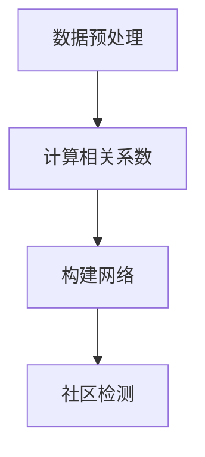
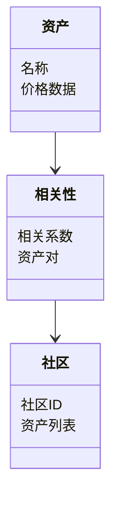
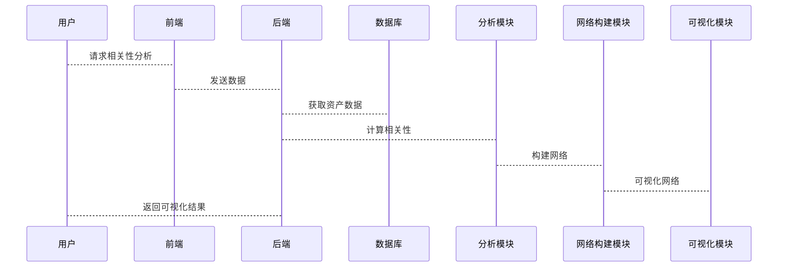

                 


# 《金融市场跨资产相关性网络分析与应用》

## 关键词：
金融市场、资产相关性、复杂网络、社区检测、金融建模

## 摘要：
本文深入探讨金融市场中跨资产相关性网络分析的应用，从基础理论到实际应用，详细阐述了相关性计算、网络构建、社区检测等关键步骤。通过系统架构设计和项目实战，展示了如何利用复杂网络分析技术，帮助投资者和机构识别风险、优化投资组合，提升决策效率。

---

# 第1章: 金融市场与资产相关性概述

## 1.1 金融市场与资产的基本概念

### 1.1.1 金融市场的定义与分类
金融市场是资金交易的场所，分为一级市场和二级市场。一级市场涉及新证券的发行，二级市场则是已发行证券的交易场所。金融市场在全球经济中扮演着关键角色，影响着企业和个人的财务状况。

### 1.1.2 资产的定义与类型
资产是具有价值的资源，包括金融资产和实物资产。金融资产如股票、债券、基金等，实物资产如房地产、黄金等。在金融市场中，金融资产是最主要的交易对象。

### 1.1.3 资产相关性的基本概念
资产相关性是指不同资产价格变动之间的关联性。正相关意味着资产价格同向变动，负相关则相反。了解资产相关性有助于优化投资组合，降低风险。

## 1.2 跨资产相关性的定义与重要性

### 1.2.1 跨资产相关性的定义
跨资产相关性指不同类别资产之间的相关性，如股票与债券、黄金与美元等。这种相关性反映了市场中的风险传染和投资机会。

### 1.2.2 跨资产相关性的重要性
在投资组合管理中，跨资产相关性帮助投资者分散风险，避免过度集中。此外，在风险管理中，识别高度相关的资产有助于预测市场波动。

### 1.2.3 跨资产相关性在网络分析中的应用
通过构建相关性网络，投资者可以可视化资产之间的关系，识别关键节点（高影响力的资产）和网络结构，从而做出更明智的投资决策。

## 1.3 复雜網絡分析的基本原理

### 1.3.1 复雜網絡的定义与特征
复杂网络由节点和边组成，节点代表资产，边代表相关性。复杂网络具有小世界特性、无标度特性等，这些特性有助于理解市场的复杂性。

### 1.3.2 复雜網絡分析的基本方法
包括度分布分析、社区检测、网络流分析等方法。这些方法帮助识别网络中的关键节点和结构。

### 1.3.3 跨资产相关性网络的构建原理
基于相关性矩阵构建网络，相关性越高，边的权重越大。通过算法检测社区，识别具有相似价格波动的资产组。

---

# 第2章: 跨资产相关性网络分析的核心概念

## 2.1 跨资产相关性网络的构建步骤

### 2.1.1 数据获取与预处理
数据来源包括股票价格、债券收益率等。预处理包括数据清洗、标准化等，确保数据质量。

### 2.1.2 相关性计算方法
使用Pearson相关系数计算资产相关性，绝对值越大，相关性越强。相关性矩阵展示所有资产对之间的相关性。

### 2.1.3 网络构建与可视化
将相关性矩阵转换为网络，使用边长表示相关性强度。可视化工具如NetworkX帮助展示网络结构。

## 2.2 跨资产相关性网络的属性特征

### 2.2.1 网络密度与聚类系数
网络密度衡量网络的紧密程度，聚类系数反映节点间连接的紧密程度。高密度和高聚类系数表明网络中有大量相互关联的资产。

### 2.2.2 网络的度分布与中心性
度分布显示节点的连接数量，中心性指标如度中心性识别网络中的关键节点。这些节点可能具有较高的影响力。

### 2.2.3 网络的模块化与社区检测
模块化衡量网络的结构清晰度，社区检测算法（如Louvain算法）识别具有相似特性的资产组，帮助理解市场结构。

## 2.3 跨资产相关性网络的ER实体关系图

### 2.3.1 实体关系图的定义
ER图展示实体及其关系，节点代表资产，边代表相关性。通过ER图，可以清晰地看到资产之间的关系和连接方式。

### 2.3.2 实体关系图的构建方法
基于相关性矩阵构建ER图，使用工具如Graphviz进行可视化。边的权重可以颜色或粗细表示。

### 2.3.3 实体关系图在网络分析中的应用
用于风险管理和投资组合优化，识别相关性高的资产组，预测市场波动。

---

# 第3章: 跨资产相关性网络分析的算法原理

## 3.1 相關性計算算法

### 3.1.1 Pearson相关系数
Pearson相关系数衡量线性相关性，公式为：
$$ r = \frac{\sum (x_i - \bar{x})(y_i - \bar{y})}{\sqrt{\sum (x_i - \bar{x})^2 \sum (y_i - \bar{y})^2}} $$

### 3.1.2 Spearman相关系数
Spearman相关系数基于数据的秩，适用于非线性关系，计算公式为：
$$ r_s = 1 - \frac{\sum d_i^2}{n(n^2 - 1)} $$

## 3.2 网络构建与社区检测

### 3.2.1 网络构建算法
使用相关性矩阵构建加权网络，边权重为相关系数。步骤包括数据预处理、计算相关性、构建网络结构。

### 3.2.2 社区检测算法
采用Louvain算法进行社区检测，步骤包括计算相似性矩阵、构建邻接矩阵、进行社区划分。

## 3.3 算法实现与代码示例

### 3.3.1 Python代码实现
```python
import numpy as np
import networkx as nx

# 计算Pearson相关系数
def pearson_correlation(x, y):
    n = len(x)
    mean_x = np.mean(x)
    mean_y = np.mean(y)
    numerator = np.sum((x - mean_x) * (y - mean_y))
    denominator = np.sqrt(np.sum((x - mean_x)**2) * np.sum((y - mean_y)**2))
    return numerator / denominator

# 示例数据
assets = ['A', 'B', 'C', 'D']
data = {
    'A': [1, 2, 3, 4],
    'B': [2, 3, 4, 5],
    'C': [3, 4, 5, 6],
    'D': [4, 5, 6, 7]
}

# 计算相关性矩阵
correlation_matrix = {}
for i in range(len(assets)):
    for j in range(i+1, len(assets)):
        correlation = pearson_correlation(data[assets[i]], data[assets[j]])
        correlation_matrix[(assets[i], assets[j])] = correlation

# 构建网络
G = nx.Graph()
for edge, correlation in correlation_matrix.items():
    G.add_edge(edge[0], edge[1], weight=correlation)

# 可视化网络
nx.draw(G, with_labels=True)
plt.show()
```

### 3.3.2 算法流程图


## 3.4 数学模型与公式

### 3.4.1 Pearson相关系数公式
$$ r_{xy} = \frac{\sum (x_i - \bar{x})(y_i - \bar{y})}{\sigma_x \sigma_y} $$

### 3.4.2 Spearman相关系数公式
$$ r_s = \frac{cov(r_x, r_y)}{\sqrt{cov(r_x, r_x)} \sqrt{cov(r_y, r_y)}} } $$

### 3.4.3 模块化公式
$$ Q = \sum_{i} [frac{count_i}{count_i} - frac{count_i^2}{count} ] $$

---

# 第4章: 系统分析与架构设计

## 4.1 项目背景与目标
项目旨在构建跨资产相关性网络，帮助投资者识别风险和机会。目标包括数据采集、网络构建、风险评估和可视化。

## 4.2 系统功能设计

### 4.2.1 领域模型


### 4.2.2 系统架构


## 4.3 接口设计与交互流程

### 4.3.1 API接口
```http
GET /api/assets
POST /api/calculate
GET /api/network
```

### 4.3.2 交互流程


---

# 第5章: 项目实战

## 5.1 环境安装与配置

### 5.1.1 安装Python环境
安装Python 3.x，安装pip，安装所需库：networkx、numpy、pandas、matplotlib。

### 5.1.2 数据获取
使用Yahoo Finance API获取股票数据，如AAPL、GOOGL等。

## 5.2 核心代码实现

### 5.2.1 数据预处理
```python
import pandas as pd
import numpy as np

# 下载数据
start_date = '2020-01-01'
end_date = '2020-12-31'
tickers = ['AAPL', 'GOOGL', 'MSFT', 'AMZN']

data = pd.DataFrame()
for ticker in tickers:
    df = web.DataReader(ticker, 'yahoo', start_date, end_date)
    data[ticker] = df['Adj Close']
```

### 5.2.2 计算相关性矩阵
```python
# 计算相关性矩阵
correlation_matrix = data.corr()

# 构建网络
G = nx.Graph()
for i in range(len(correlation_matrix)):
    for j in range(i+1, len(correlation_matrix)):
        correlation = correlation_matrix.iloc[i, j]
        if correlation > 0.3:
            G.add_edge(data.columns[i], data.columns[j], weight=correlation)
```

### 5.2.3 可视化网络
```python
nx.draw(G, with_labels=True, edge_weight='weight', edge_color='weight')
plt.show()
```

## 5.3 案例分析与解读

### 5.3.1 案例分析
假设分析四个科技股的相关性网络，发现AAPL和GOOGL相关性较高，说明它们的价格波动具有较高的关联性。

### 5.3.2 小结
项目成功构建了相关性网络，帮助识别资产之间的关系，为投资决策提供了支持。

---

# 第6章: 最佳实践与总结

## 6.1 最佳实践

### 6.1.1 数据质量的重要性
确保数据的完整性和准确性，避免偏差影响分析结果。

### 6.1.2 网络可视化工具的选择
使用合适的工具如Gephi或Tableau进行可视化，提升可读性。

### 6.1.3 模型的可解释性
确保模型结果易于理解，避免过于复杂的结构影响实际应用。

## 6.2 小结

通过跨资产相关性网络分析，投资者能够更好地理解市场结构，优化投资策略，降低风险。本文提供了从理论到实践的详细指导，为后续研究提供了基础。

## 6.3 注意事项

### 6.3.1 数据更新频率
定期更新数据，确保分析结果反映最新的市场状况。

### 6.3.2 模型的局限性
相关性分析无法预测因果关系，需结合其他方法进行综合判断。

### 6.3.3 风险管理
在实际应用中，需考虑市场波动、数据质量等多方面因素，避免单一模型的局限性。

## 6.4 拓展阅读

### 6.4.1 推荐书籍
- 《网络科学导论》
- 《金融数据分析与建模》

### 6.4.2 推荐文章
- "复杂网络在金融风险管理中的应用"
- "基于深度学习的金融市场预测"

---

通过以上章节的详细讲解，读者可以系统地了解金融市场跨资产相关性网络分析的各个方面，从理论到实践，掌握相关工具和方法，为实际应用提供有力支持。

