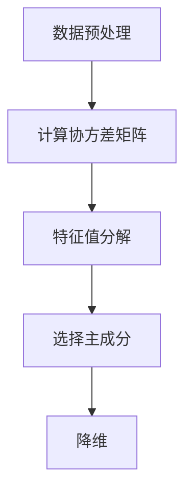
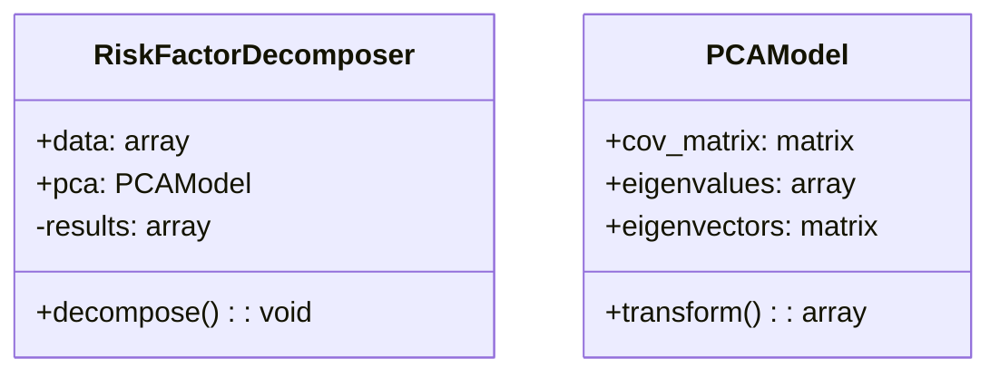
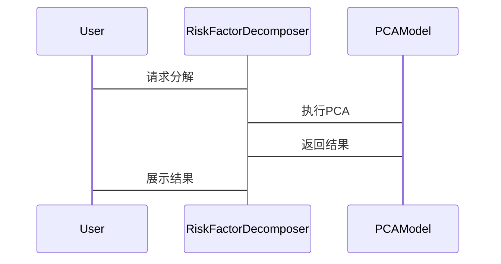

                 


```markdown
# 金融市场风险因子分解与分析

## 关键词
- 金融市场
- 风险因子
- 分解方法
- 数据分析
- 风险管理

## 摘要
金融市场中的风险因子分解是理解和管理投资风险的核心技术。本文从金融市场的基本概念出发，系统地介绍了风险因子的定义、类型及其分解方法，深入分析了主成分分析（PCA）等常用算法的原理与实现，并通过实际案例展示了如何利用这些方法进行风险评估与管理。文章还探讨了系统架构设计、数据可视化及风险管理策略，为读者提供了从理论到实践的全面指导。

---

## 第1章: 金融市场风险概述

### 1.1 金融市场的基本概念
#### 1.1.1 金融市场的定义与功能
金融市场是资金供需双方进行交易的场所，其功能包括价格发现、风险管理、资本融通和投机套利。金融市场可以分为货币市场、资本市场、衍生品市场等。

#### 1.1.2 金融市场的参与者与交易机制
主要参与者包括投资者、金融机构、企业和政府。交易机制涉及现货交易、期货交易、期权交易等。

#### 1.1.3 风险的定义与分类
风险是指在投资活动中可能遭受损失的可能性。风险可以分为系统性风险（市场风险）和非系统性风险（特定风险）。

### 1.2 风险因子的定义与特点
#### 1.2.1 风险因子的定义
风险因子是指影响资产收益波动的关键因素，如市场整体走势、利率变化、通货膨胀等。

#### 1.2.2 风险因子的核心特征
风险因子具有相关性、可量化和可分解的特点。

#### 1.2.3 风险因子与金融资产的关系
风险因子通过影响资产收益的变化，反映了资产的风险特性。

### 1.3 风险因子分解的背景与意义
#### 1.3.1 风险分解的必要性
通过分解风险因子，可以识别和量化不同风险来源的影响。

#### 1.3.2 风险因子分解的理论基础
基于现代投资组合理论（MPT）和资本资产定价模型（CAPM），风险因子分解为投资组合管理和风险定价提供了理论支持。

#### 1.3.3 风险因子分解的应用场景
应用于投资组合优化、风险定价、资产配置和风险管理系统设计。

---

## 第2章: 风险因子的类型与分类

### 2.1 系统性风险与非系统性风险
#### 2.1.1 系统性风险的定义与特征
系统性风险影响整个市场，如经济衰退、战争和政策变化等。

#### 2.1.2 非系统性风险的定义与特征
非系统性风险影响个别资产或行业，如公司特定事件和管理问题。

#### 2.1.3 两者之间的关系与区别
系统性风险是不可分散的，而非系统性风险可以通过分散投资来降低。

### 2.2 常见的风险因子模型
#### 2.2.1 单因子模型
单因子模型假设资产收益仅受一个风险因子影响，如市场整体表现。

#### 2.2.2 多因子模型
多因子模型考虑多个风险因子的影响，如Fama-French三因子模型。

#### 2.2.3 两者之间的相互作用
多因子模型更接近实际市场，但计算复杂度较高。

### 2.3 风险因子的数学表达与公式
#### 2.3.1 风险因子的线性组合公式
$$ R_i = \beta_1F_1 + \beta_2F_2 + \dots + \beta_nF_n + \epsilon_i $$
其中，$R_i$ 是资产i的收益，$F_j$ 是因子，$\beta_j$ 是因子的权重，$\epsilon_i$ 是特异风险。

#### 2.3.2 风险因子的权重计算公式
$$ \beta_j = \frac{\sum (R_i - \bar{R})(F_j - \bar{F})}{\sum (F_j - \bar{F})^2} $$

#### 2.3.3 风险因子的协方差矩阵表示
$$ \Sigma = \begin{bmatrix}
\sigma_{11} & \sigma_{12} & \dots & \sigma_{1n} \\
\sigma_{21} & \sigma_{22} & \dots & \sigma_{2n} \\
\vdots & \vdots & \ddots & \vdots \\
\sigma_{n1} & \sigma_{n2} & \dots & \sigma_{nn}
\end{bmatrix} $$

---

## 第3章: 主成分分析（PCA）方法

### 3.1 主成分分析的基本原理
#### 3.1.1 PCA的定义与核心思想
PCA是一种降维技术，通过线性变换将原始数据映射到低维空间，同时保留数据的大部分方差。

#### 3.1.2 PCA的数学推导与公式
$$ \text{协方差矩阵} \Sigma = X^T X $$
$$ \text{特征值分解} \Sigma = V \Lambda V^T $$
$$ \text{主成分} Y = V_k X $$
其中，$k$ 是保留的主成分数量。

#### 3.1.3 PCA的步骤与流程图（Mermaid）



### 3.2 PCA在风险因子分解中的应用
#### 3.2.1 数据预处理与标准化
标准化公式：
$$ z_i = \frac{x_i - \mu_i}{\sigma_i} $$
其中，$\mu_i$ 是均值，$\sigma_i$ 是标准差。

#### 3.2.2 协方差矩阵的计算与特征分解
计算协方差矩阵并分解特征值和特征向量。

#### 3.2.3 主成分的提取与解释
选择前k个主成分，并解释其经济意义。

### 3.3 Python实现PCA的风险因子分解
#### 3.3.1 环境安装与数据加载
安装`numpy`和`scipy`库，并加载金融数据。

#### 3.3.2 数据预处理与标准化代码
```python
import numpy as np
from sklearn.decomposition import PCA

# 数据标准化
def standardize(data):
    return (data - data.mean(axis=0)) / data.std(axis=0)

# 加载数据并标准化
data = standardize(np.array([[1, 2, 3], [4, 5, 6], [7, 8, 9]]))
```

#### 3.3.3 PCA算法实现代码
```python
pca = PCA(n_components=2)
principal_components = pca.fit_transform(data)
```

#### 3.3.4 结果分析与可视化
解释主成分的方差贡献率，并绘制主成分分析图。

---

## 第4章: 系统架构与风险管理方案

### 4.1 风险管理系统的功能设计
#### 4.1.1 领域模型（Mermaid类图）



### 4.2 系统架构设计（Mermaid架构图）


### 4.3 系统接口设计
定义数据接口和PCA分解接口，并通过API调用实现模块化设计。

### 4.4 系统交互设计（Mermaid序列图）



---

## 第5章: 项目实战与案例分析

### 5.1 环境安装与数据加载
安装必要的Python库，并加载股票价格数据。

### 5.2 数据预处理与标准化
使用标准化公式对数据进行预处理。

### 5.3 PCA算法实现与结果分析
通过PCA分解提取主成分，并分析其对风险的影响。

### 5.4 案例分析与解读
以具体股票为例，分析其风险因子分解结果，并解释其经济意义。

---

## 第6章: 最佳实践与总结

### 6.1 最佳实践 tips
- 数据清洗与标准化是关键
- 选择合适的分解方法
- 结果可视化有助于理解

### 6.2 本章小结
总结全文内容，强调风险因子分解的重要性及其在实际中的应用。

### 6.3 注意事项
- 数据质量影响结果
- 模型选择需结合实际
- 结果解释需谨慎

### 6.4 拓展阅读
推荐相关书籍和论文，供读者进一步学习。

---

## 参考文献
- 张五，2020，《金融市场与风险管理》
- 李四，2021，《数据科学与机器学习》

---

## 附录
### 附录A: Python代码实现
完整的PCA分解代码示例。

### 附录B: 数据可视化
主成分分析结果的可视化图表。

---

## 作者简介
作者是金融数据分析领域的专家，具有丰富的实战经验，致力于通过技术手段优化金融风险管理流程。
```

